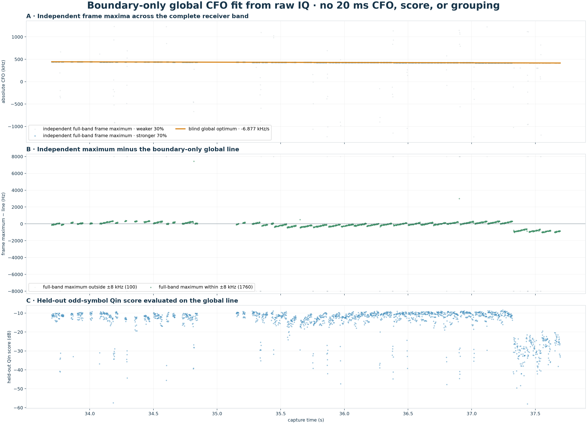

# Boundary-only global CFO optimization from raw IQ

## Input isolation

The optimizer receives raw IQ and 1860 absolute 1.333 ms frame-start samples.
Its boundary manifest contains no 20 ms window identifiers, CFOs,
GLRT scores, branch labels, or grouping.  Every frame likelihood spans the
complete ±1.25 MHz receiver band.

| result | value |
| --- | ---: |
| CFO at 35.973776 s | 428028.7 Hz |
| global CFO rate | -6.877 kHz/s |
| held-out exact/control | 20.25 dB |
| difference from prior fit | -1.3 Hz, +3.2 Hz/s |

The earlier fit is loaded only after optimization for the final comparison; it
cannot seed or constrain this result.
