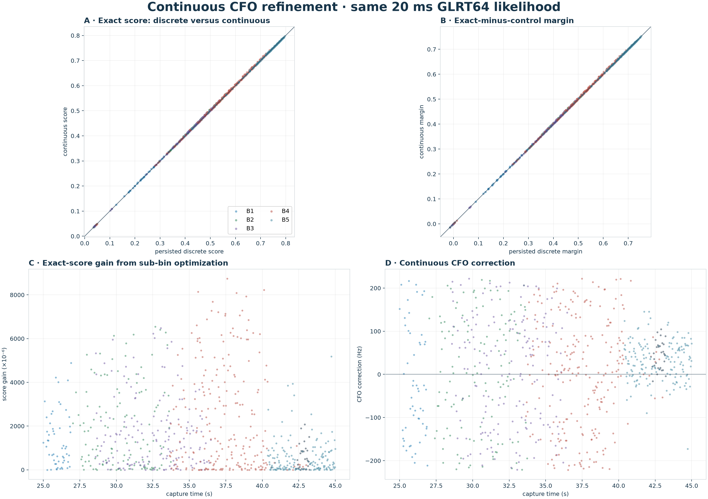
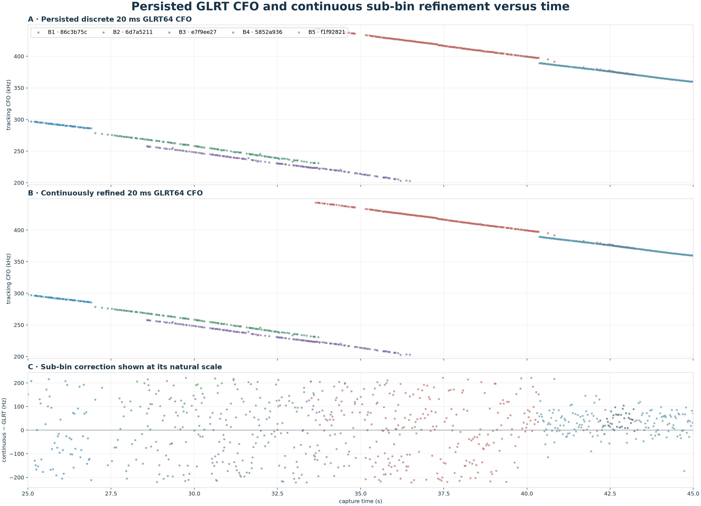
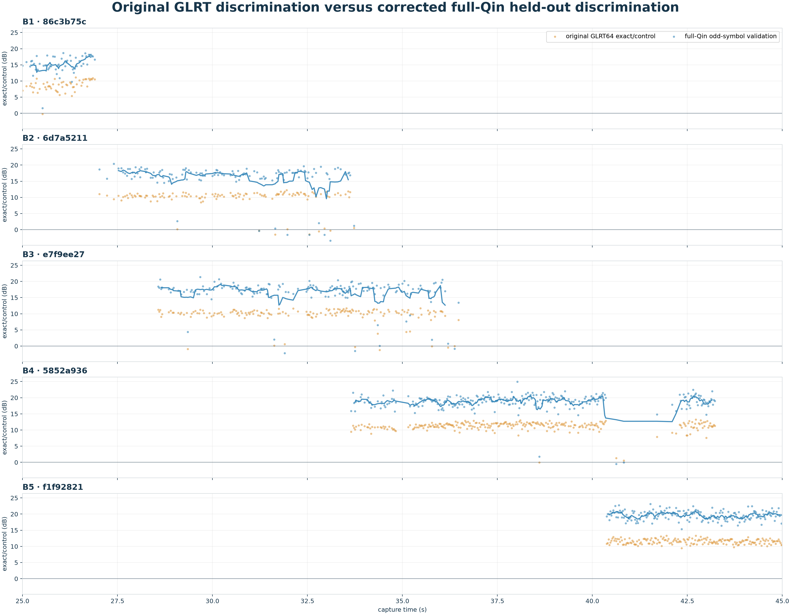

# Continuous refinement of persisted GLRT64 CFO

## Result

The prototype preserves the original 20 ms GLRT64 likelihood exactly and
replaces only its discrete residual-CFO bin with a bounded continuous maximum.
The optimizer uses analytic gradient and curvature with a bracketed Newton step
and a golden-section fallback.  No dense fine grid is used.  Across all
788 associated windows, the median exact-score gain is
0.153% and the p90 gain is
0.941%; the median absolute CFO correction is
77.2 Hz.  Every exact score is non-decreasing,
while independently maximizing the control means the exact-minus-control margin improves in
81.6% of windows.

The total tracking CFO (acquired CFO plus the GLRT residual) is shown before
and after continuous refinement below.  The first two panels deliberately use
the same vertical scale; the third exposes their sub-bin difference.

The same basin is then re-optimized on even symbols from the complete
300-symbol Qin frame and evaluated on the disjoint odd symbols.  The following
figure compares exact/control discrimination in dB; it does not equate the two
raw score normalizations.

The held-out exact/control margin is positive in
98.7% of windows, with a median
18.4 dB ratio.  That larger change comes
mainly from using all 300 Qin symbols rather than from the modest sub-bin CFO
correction.

| branch | n | abs(ΔCFO) med/p90 | Δexact | Δmargin | held-out dB | pass |
| --- | ---: | ---: | ---: | ---: | ---: | ---: |
| B1 · 86c3b75c | 54 | 114.0 / 192.4 | 0.34546% | +0.000882 | 15.3 dB | 100.0% |
| B2 · 6d7a5211 | 126 | 120.4 / 202.0 | 0.35134% | +0.001090 | 17.5 dB | 96.0% |
| B3 · e7f9ee27 | 162 | 111.2 / 199.1 | 0.32121% | +0.001161 | 17.7 dB | 98.1% |
| B4 · 5852a936 | 263 | 82.7 / 196.8 | 0.17534% | +0.000940 | 19.1 dB | 99.2% |
| B5 · f1f92821 | 183 | 38.9 / 86.0 | 0.03877% | +0.000126 | 19.7 dB | 100.0% |

## Interpretation

The before/after GLRT64 comparison is apples-to-apples: same samples, symbols,
normalization, and frame-phase policy.  Consequently, its score gain measures
only discrete-bin loss.  The full-Qin odd-symbol result is a separate held-out
test of whether the continuously refined basin recovers the longer pilot.

The optimizer remains local by design.  Symbol-rate alias choice, integer timing
basin, and sawtooth reset placement remain discrete decisions outside this
continuous refinement.
