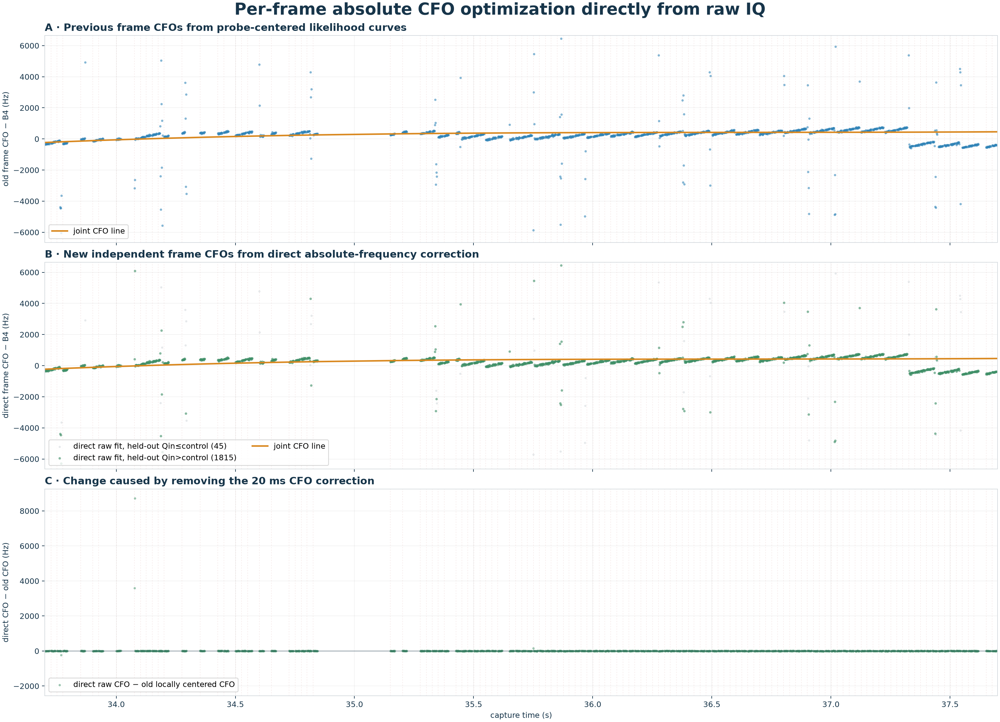
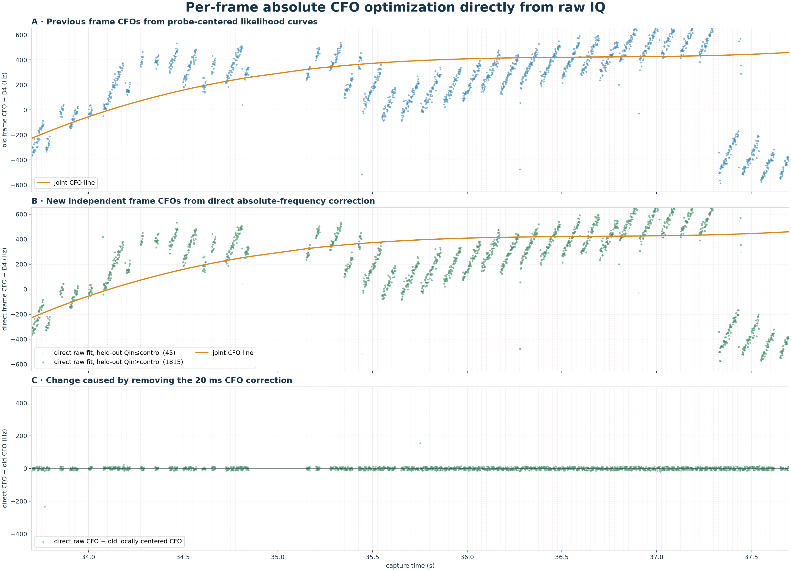

# Direct raw-IQ CFO optimization for every 1.333 ms frame

## Method

Each frame is returned to raw IQ.  Candidate absolute CFO is applied directly
to every pilot sample in that frame, and the even-symbol Qin matched-filter
power is maximized independently.  No 20 ms probe CFO is applied.  Odd Qin
symbols and the rolled control sequence provide disjoint validation.  The
20 ms acquisition is retained only to locate frame timing.

| statistic | old probe-centered frame CFO | direct raw-frame CFO |
| --- | ---: | ---: |
| median within-probe residual swing | +53.4 Hz | +50.0 Hz |
| median absolute boundary reset | 48.2 Hz | 48.0 Hz |
| median residual slope | +2.996 kHz/s | +2.997 kHz/s |

The direct fits achieve 21.53 dB aggregate
held-out exact/control discrimination, and
97.6% of individual frames favor Qin over
control.  4 frames land at the ±6 kHz search boundary.
