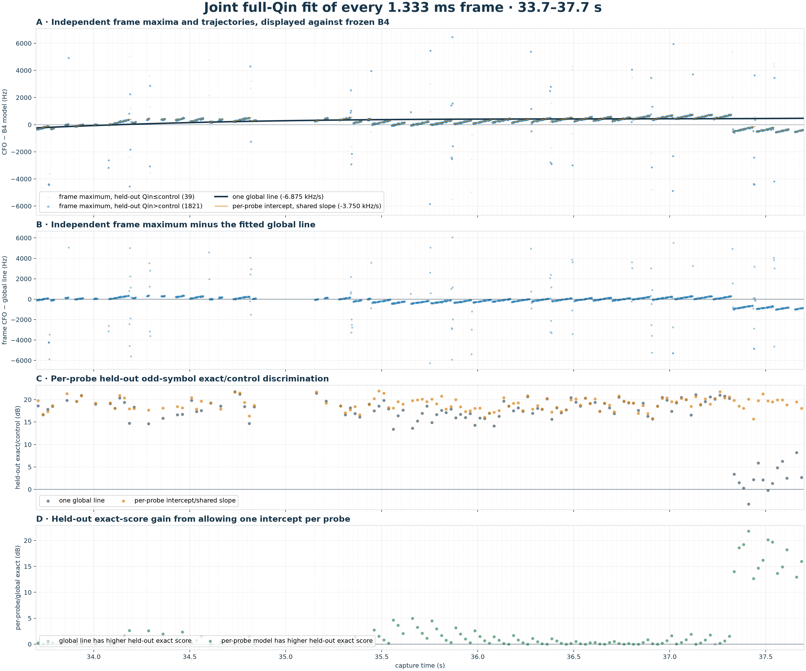

# Joint linear CFO fit of every 1.333 ms Qin frame

## Result

This analysis uses all 1860 complete frames from
124 20 ms probes in the strict
33.7–37.7 s interval.
Even Qin symbols fit the model; disjoint odd symbols validate it.  Every frame
has an independent nuisance phase, so no phase continuity across probe gaps is
assumed.

| model | CFO rate | train exact/control | held-out exact/control | held-out exact score |
| --- | ---: | ---: | ---: | ---: |
| one global line | -6.875 kHz/s | 17.88 dB | 17.65 dB | 0.46632 |
| per-probe intercept/shared slope | -3.750 kHz/s | 19.15 dB | 18.93 dB | 0.62120 |

Allowing one intercept per probe changes the aggregate held-out exact score by
+1.25 dB.  It improves
122 of 124 probe holdouts;
the median per-probe gain is
+0.60 dB.

## Interpretation

The global line is fit directly to the Qin likelihood, not to accepted tracker
updates or to preselected frame-CFO points.  The per-probe model uses the same
shared slope but permits every artificial 20 ms analysis window to choose its
own intercept.  Its held-out advantage therefore measures how much frequency
structure the single smooth line cannot explain, while protecting against
within-frame symbol overfit.
