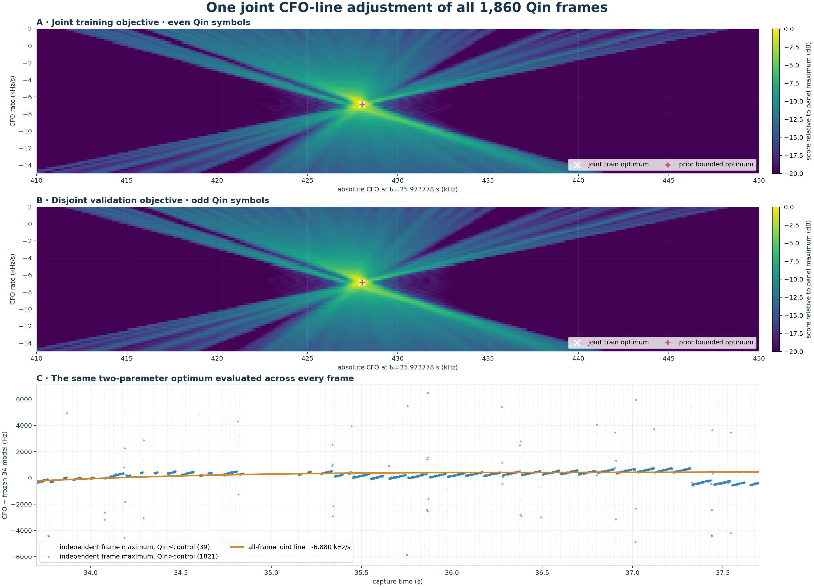

# Unseeded joint CFO-line fit of all 1.333 ms Qin frames

## Result

The frequency optimizer evaluates one absolute intercept and one slope against
all 1860 frame likelihoods simultaneously.  It does not first
choose a CFO for each 20 ms probe or regress independent frame maxima.  The
20 ms results contribute timing epochs and a numerically convenient NCO origin
only; the broad joint search spans the complete configured absolute box.

| quantity | result |
| --- | ---: |
| CFO at reference time 35.973778 s | 428030.0 Hz |
| global CFO rate | -6.880 kHz/s |
| train exact/control | 17.88 dB |
| held-out exact/control | 17.65 dB |
| frames inside their computed likelihood support | 100.0% |

The unseeded optimum differs from the earlier bounded joint fit by
-0.7 Hz in intercept and
-5.0 Hz/s in rate.  Its held-out exact
score changes by -0.0001 dB.

## Interpretation

The local NCO values do not act as fitted per-probe corrections in this
objective.  Each stored curve is sampled at `absolute line CFO - local NCO`, so
changing the NCO origin only changes coordinates while the complete line stays
inside curve support.  Timing acquisition remains inherited from the 20 ms
locks; a fully joint timing-and-frequency search would be a separate, much
larger problem.
