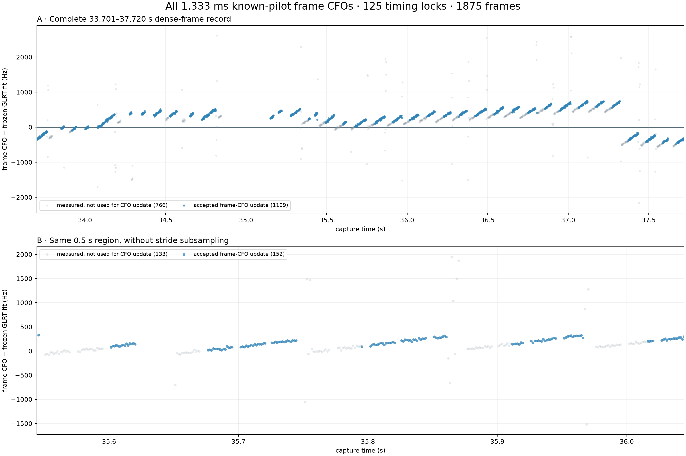
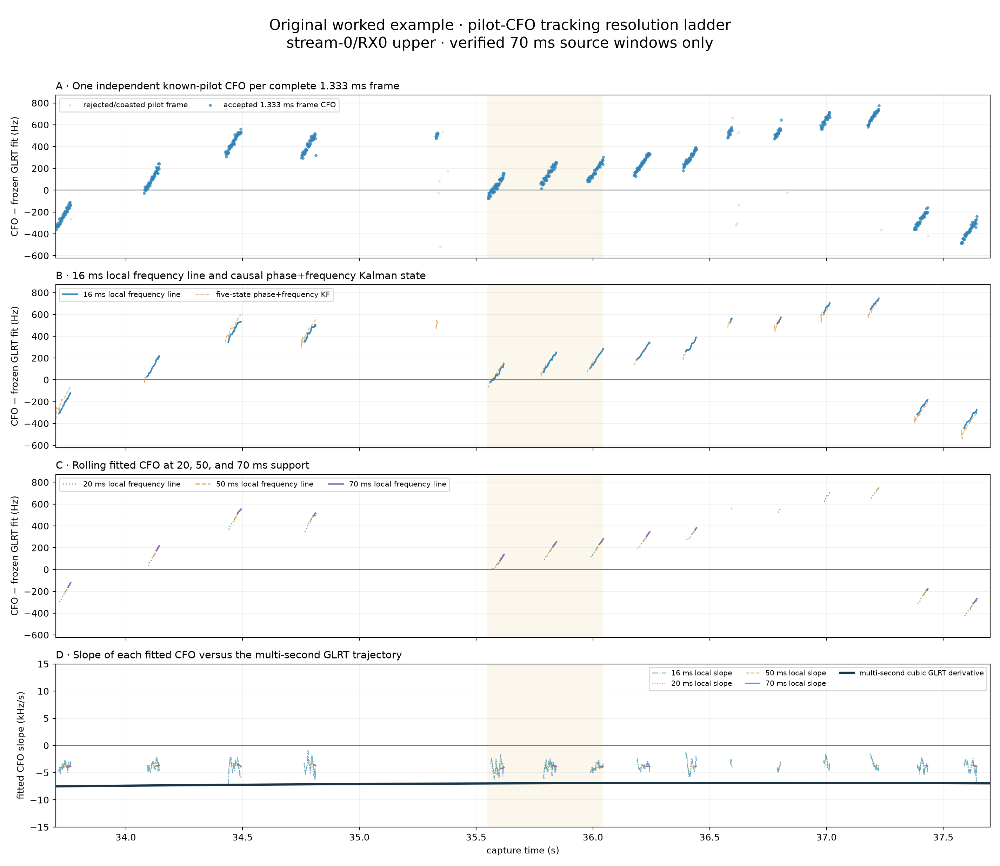
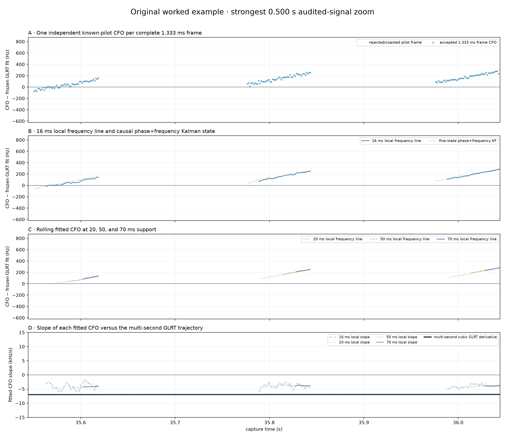

# Multiscale pilot-CFO tracking in the 470384 worked example

Date: 2026-08-23

Capture: `cap-20260821T140820-470384cc9284`
Path: `stream-0`, receiver 0, upper edge
Interval: 33.700–37.700 s

## Result

The same resolution ladder is now reproduced for the original worked example. It contains 652 accepted 1.333 ms pilot-frame CFO measurements and 563 applied modulo-pi phase updates across 16 digest-verified 70 ms raw-IQ windows, selected at stride 8 from 125 qualifying timing locks.

The frozen multi-second GLRT product is cubic, so it has no single rate: its derivative changes from -7.516 kHz/s at 33.7 s to -6.966 kHz/s at 37.7 s. Panel D therefore plots the derivative curve rather than a horizontal line.

## Every 1.333 ms frame-CFO measurement

*Figure 1. The upper panel includes all 1875 frame-local CFO measurements exposed by all 125 timing locks; 1109 were accepted for tracker updates. The lower panel contains 285 frames in the same 35.544–36.044 s zoom, including 152 accepted CFO updates. There is no stride subsampling in this figure.*

## Sparse multiscale 33.7–37.7 s interval

*Figure 2. All four levels share capture time. Panels A–C use CFO minus the frozen cubic trajectory, which removes the arbitrary constant receiver/LNB offset but preserves slope and carrier-mode changes. Blank regions were not re-read and are not interpolated. Unlike Figure 1, this scale comparison uses the stride-8 set of longer 70 ms rereads.*

## Strongest 0.5 s region

*Figure 3. The direct-quality support maximum is 35.544–36.044 s. Each rolling curve is fitted only inside one verified 70 ms source interval and never bridges a rejected-frame gap above 4.1 ms.*

## Scale comparison

| Support (ms) | Full estimates | Median rate (kHz/s) | P10 | P90 | Median local−GLRT (kHz/s) | Median line RMS (Hz) | Zoom median rate (kHz/s) |
|---|---:|---:|---:|---:|---:|---:|---:|
| 16 | 509 | -3.866 | -5.026 | -2.603 | +3.242 | 13.1 | -4.031 |
| 20 | 479 | -3.831 | -4.603 | -2.956 | +3.238 | 13.2 | -4.051 |
| 50 | 243 | -3.816 | -4.092 | -3.555 | +3.197 | 14.4 | -3.885 |
| 70 | 111 | -3.820 | -4.102 | -3.628 | +3.145 | 15.4 | -3.892 |

The 1.333 ms level is a frequency measurement, not a rate measurement. A Doppler-rate estimate appears only after fitting multiple frame CFOs over 16–70 ms. Those rolling samples overlap heavily and are descriptive, not independent trials.

The orange curve in panel B is the causal five-state phase+frequency Kalman state. Phase tracking improves continuity and ambiguity handling, while the blue/green/purple local slopes in panels C–D are fitted directly to accepted frame-CFO measurements. Their agreement or disagreement can therefore be inspected without treating the Kalman rate as independent evidence.

This remains receiver-relative, candidate-only evidence. It does not resolve an absolute transmitter frequency, an LNB offset, a satellite identity, or which part of the short-scale carrier motion is geometric Doppler.

## Machine-readable evidence

- [Full result JSON](figures/2026_08_23_470384_multiscale_cfo/multiscale-cfo-results.json)
