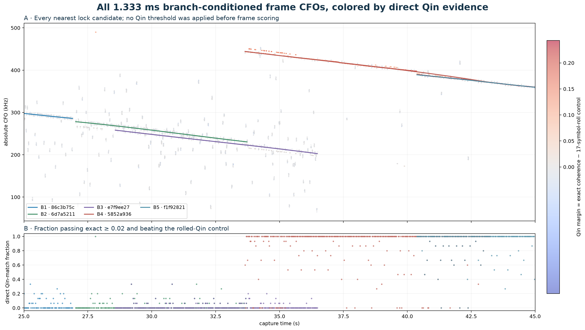
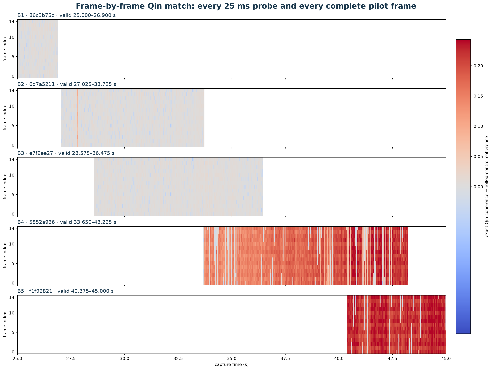
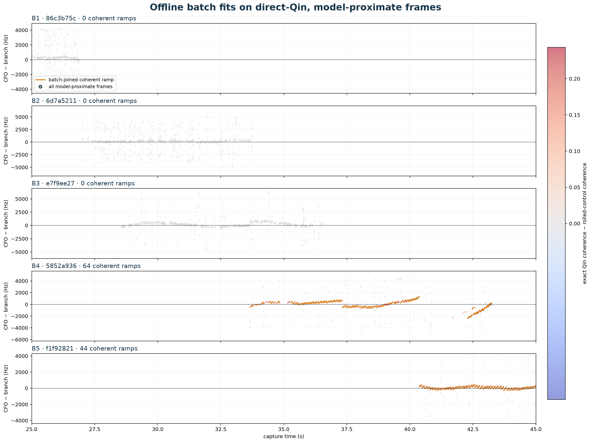

# Qin frame evidence and offline fits, 25–45 s

## Result

This pass computes every complete 1.333 ms frame exposed by the nearest
persisted timing-lock candidate for each frozen GLRT branch intersecting
25–45 s.  The computation is deliberately **not** gated by Qin score.  Frames
are colored by the direct discriminant
`exact Qin coherence − 17-symbol-rolled control coherence`.

There are 1233 branch/window associations,
1001 unique IQ windows, and
18495 branch-associated frame rows
(15015 distinct computed frames).  The
branches overlap, so the association count is intentionally larger than the
number of distinct IQ windows.

## Fit gate and result by frozen branch

The offline sawtooth fit uses a frame only when its parent lock is within
2500 Hz of that frozen
branch, exact coherence is at least 0.02, and the exact
sequence beats the rolled control.  This fit gate is separate from frame
computation and visualization.

| branch | span | locks | frames | strong gate | ramps | rate | acceleration | ΔBIC |
| --- | ---: | ---: | ---: | ---: | ---: | ---: | ---: | ---: |
| B1 · 86c3b75c | 25.000–26.900 | 77 / 54 | 1155 | 4.2% | 0 | — | — | — |
| B2 · 6d7a5211 | 27.025–33.725 | 269 / 126 | 4035 | 2.6% | 0 | — | — | — |
| B3 · e7f9ee27 | 28.575–36.475 | 317 / 162 | 4755 | 1.5% | 0 | — | — | — |
| B4 · 5852a936 | 33.650–43.225 | 384 / 263 | 5760 | 87.5% | 64 | -3.751 | +31.3 | -40.6 |
| B5 · f1f92821 | 40.375–45.000 | 186 / 183 | 2790 | 93.1% | 44 | -3.518 | +63.3 | -54.7 |

The table's rate is kHz/s, acceleration is Hz/s², and `ΔBIC` is
progression-minus-common.  The same fitted progression also survives complete
probe holdout, although the predictive improvement is modest:

- **B4 · 5852a936:** progression +31.34 ± 3.86 Hz/s²; the fitted rate changes by +297.5 ± 36.6 Hz/s over 9.492 s. Leave-one-probe-out RMS changes from 17.040 to 16.840 Hz (-1.17%).
- **B5 · f1f92821:** progression +63.35 ± 5.91 Hz/s²; the fitted rate changes by +285.5 ± 26.6 Hz/s over 4.507 s. Leave-one-probe-out RMS changes from 15.085 to 14.769 Hz (-2.10%).

Positive ΔBIC means the extra linear slope-progression term is disfavored.  The
five rows must not be combined into one Doppler history: the frozen branches
overlap in time and are not statistically independent.  In particular, exact
candidate reuse is:

- B2 · 6d7a5211 and B3 · e7f9ee27: 142 shared candidate windows.
- B3 · e7f9ee27 and B4 · 5852a936: 4 shared candidate windows.
- B4 · 5852a936 and B5 · f1f92821: 86 shared candidate windows.

Within a row, each recovered ramp has its own arbitrary CFO intercept, so the
fit is not assuming a known LNB offset or assigned Starlink carrier frequency.

## What “all frames” means here

The persisted scan does not provide one verified carrier/timing lattice for all
20 seconds.  It provides 20 ms windows on a 25 ms probe schedule, with eight
candidate locks per probe.  For each frozen branch, this report takes the
nearest candidate by CFO-model distance and evaluates all 15 complete frames in
that candidate window.  It does not claim that the uncovered 5 ms between
probes, or the seven unselected candidates in each probe, belong to that branch.
