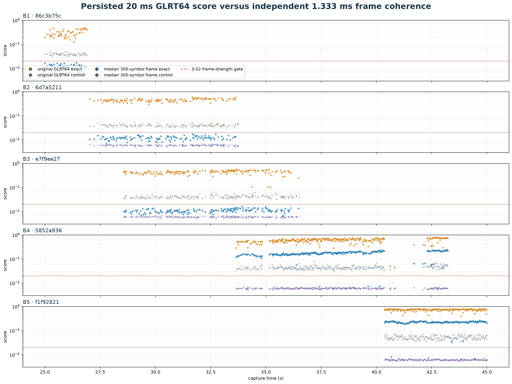
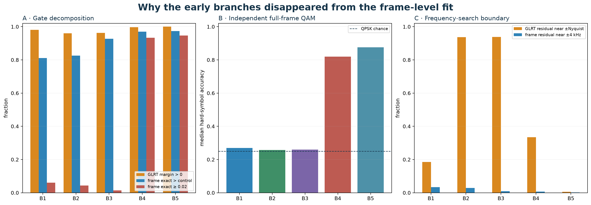

# Audit of original GLRT64 versus 1.333 ms Qin scores

## Correction

The earlier statement that B1–B3 “fail the exact-Qin-versus-control test” was
too strong.  The reported 1.5–4.2% fractions included a separate
`exact coherence ≥ 0.02` strength gate.  Without that threshold, exact Qin
still beats the rolled control in 81–93% of model-proximate early frames.

| branch | GLRT e/m | frame e/m | Qin>ctrl | exact≥.02 | QAM | GLRT edge | frame edge |
| --- | ---: | ---: | ---: | ---: | ---: | ---: | ---: |
| B1 · 86c3b75c | 0.280 / 0.244 | 0.0121 / 0.0059 | 81.1% | 6.0% | 0.270 | 18.5% | 3.3% |
| B2 · 6d7a5211 | 0.457 / 0.414 | 0.0120 / 0.0058 | 82.5% | 4.3% | 0.257 | 93.7% | 2.9% |
| B3 · e7f9ee27 | 0.444 / 0.406 | 0.0108 / 0.0048 | 92.7% | 1.4% | 0.260 | 93.8% | 0.9% |
| B4 · 5852a936 | 0.608 / 0.568 | 0.1712 / 0.1655 | 97.0% | 93.4% | 0.819 | 33.5% | 0.7% |
| B5 · f1f92821 | 0.748 / 0.691 | 0.2257 / 0.2192 | 97.3% | 94.6% | 0.876 | 0.5% | 0.2% |

## What changed

The two scores do not have the same integration or normalization:

- persisted GLRT64 uses symbols 2–65 from every complete frame in the 20 ms
  probe (normally 14–15 frames), pools their likelihood noncoherently, and
  normalizes after the per-symbol matched correlation;
- the new estimator makes one independent CFO estimate from all 300 pilot
  symbols in one 1.333 ms frame and normalizes by the total energy in the eight
  demodulated edge bins.

Thus the original GLRT track can be a real, sequence-specific **window-pooled**
correlation while still being too weak or contaminated for a precise CFO from
one frame.  Moving to 1.333 ms discarded most of the GLRT's cross-frame
integration gain.  The 0.02 gate then discarded the remaining low-coherence
frame evidence.

This is not primarily a ±4 kHz search-range failure: only 0.9–3.3% of early
frame estimates hit that boundary.  However, B2 and B3 place about 94% of their
original GLRT residuals near the ±113.6 kHz symbol-rate Nyquist boundary, so
their absolute GLRT CFO coordinate is especially alias-sensitive.

The independent full-frame QAM check is also important.  B1–B3 remain near the
QPSK chance level (median 0.26–0.27), whereas B4–B5 reach 0.82–0.88.  So the
early line is not lost raw signal; it is weaker evidence that does not support
the same per-frame phase/CFO precision as the later signal.

## Consequence for fitting

Removing only the 0.02 threshold does not recover trustworthy early ramps.
Their independent-lock robust CFO RMS is roughly 1.1–1.6 kHz, and no segment
passes the existing 20 ms / 40 Hz-RMS coherence gate.  Recovery therefore needs
longer coherent or semi-coherent pooling—not simply a looser frame threshold.
