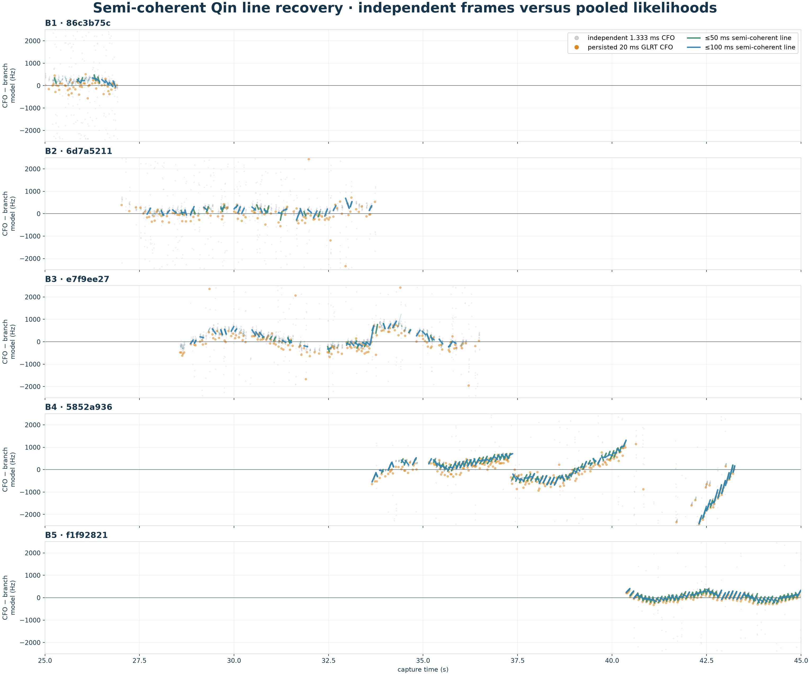
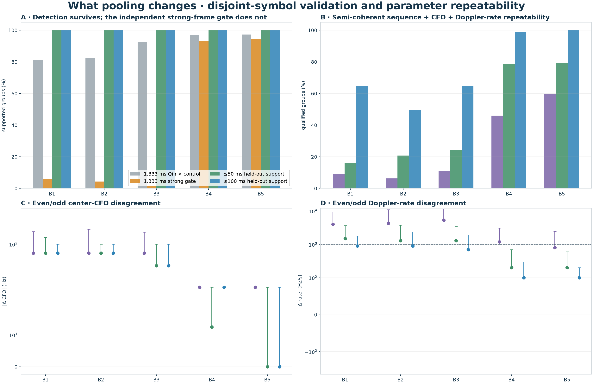
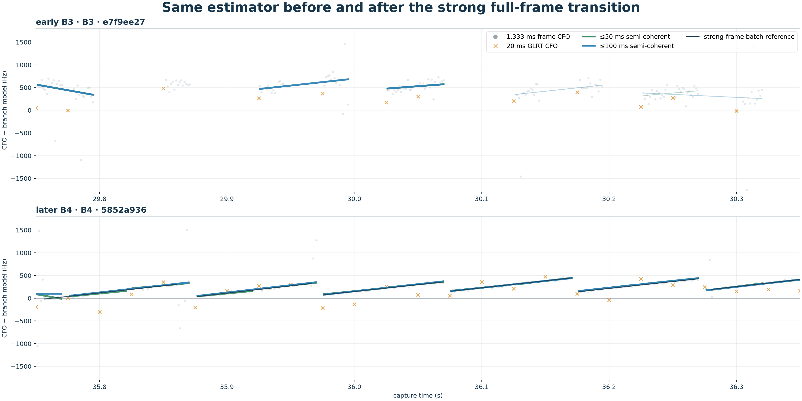

# Semi-coherent recovery of weak Qin Doppler lines

## Result

This experiment returns to the original complex Qin matched correlations.  It
fits one absolute-frequency line across 20, 50, and 100 ms groups while
maximizing over an independent complex phase in every 1.333 ms frame.  Even
pilot symbols fit the line; odd symbols validate it.  The 17-symbol-rolled Qin
control is evaluated at exactly the fitted line, and no inter-frame phase
continuity is used.

## What changed from the earlier estimator

The sequence-specific evidence was never absent: exact Qin already beat the
rolled control in most independent early frames.  What failed was the separate
`exact >= 0.02` strength cut and, after that, frame-by-frame Doppler-rate
repeatability.  Pooling the original complex correlations restores the held-out
sequence test first and improves rate repeatability as the time support grows.

The semi-coherent columns are `held-out supported / repeatability-qualified`.

| branch | median GLRT margin | frame Qin>ctrl | frame strong gate | <=50 ms | <=100 ms |
| --- | ---: | ---: | ---: | ---: | ---: |
| B1 · 86c3b75c | 0.244 | 81.1% | 6.0% | 100.0% / 16.2% | 100.0% / 64.6% |
| B2 · 6d7a5211 | 0.414 | 82.5% | 4.3% | 100.0% / 20.8% | 100.0% / 49.5% |
| B3 · e7f9ee27 | 0.406 | 92.7% | 1.4% | 100.0% / 24.1% | 100.0% / 64.5% |
| B4 · 5852a936 | 0.568 | 97.0% | 93.4% | 100.0% / 78.5% | 100.0% / 99.2% |
| B5 · f1f92821 | 0.691 | 97.3% | 94.6% | 100.0% / 79.3% | 100.0% / 100.0% |

## Disjoint-symbol statistics

`supported` means exact Qin beats the rolled control in both the fit and held-out
symbols.  `qualified` additionally requires even/odd center CFO agreement within
250 Hz, Doppler-rate agreement within
1000 Hz/s, and neither solution at a search boundary.
The groups overlap, so these are descriptive fractions rather than independent
trial p-values.

| branch | scale | groups | supported | qualified | held-out margin | ΔCFO | Δrate |
| --- | ---: | ---: | ---: | ---: | ---: | ---: | ---: |
| B1 · 86c3b75c | 20 | 54 | 100.0% | 9.3% | 0.0391 | 75 | 4050 |
| B1 · 86c3b75c | 50 | 37 | 100.0% | 16.2% | 0.0384 | 75 | 1500 |
| B1 · 86c3b75c | 100 | 48 | 100.0% | 64.6% | 0.0373 | 75 | 900 |
| B2 · 6d7a5211 | 20 | 126 | 99.2% | 6.3% | 0.0373 | 75 | 4350 |
| B2 · 6d7a5211 | 50 | 53 | 100.0% | 20.8% | 0.0370 | 75 | 1300 |
| B2 · 6d7a5211 | 100 | 95 | 100.0% | 49.5% | 0.0373 | 75 | 900 |
| B3 · e7f9ee27 | 20 | 162 | 96.9% | 11.1% | 0.0369 | 75 | 5350 |
| B3 · e7f9ee27 | 50 | 87 | 100.0% | 24.1% | 0.0374 | 50 | 1300 |
| B3 · e7f9ee27 | 100 | 124 | 100.0% | 64.5% | 0.0363 | 50 | 700 |
| B4 · 5852a936 | 20 | 263 | 99.6% | 46.0% | 0.6399 | 25 | 1200 |
| B4 · 5852a936 | 50 | 228 | 100.0% | 78.5% | 0.6278 | 12 | 200 |
| B4 · 5852a936 | 100 | 245 | 100.0% | 99.2% | 0.6161 | 25 | 100 |
| B5 · f1f92821 | 20 | 183 | 100.0% | 59.6% | 0.7378 | 25 | 800 |
| B5 · f1f92821 | 50 | 179 | 100.0% | 79.3% | 0.7241 | 0 | 200 |
| B5 · f1f92821 | 100 | 182 | 100.0% | 100.0% | 0.7074 | 0 | 100 |

## Concordance with the later strong-frame ramps

For B4 and B5 only, a comparison is made when an entire semi-coherent group is
contained within one previously recovered 40 Hz-RMS frame segment.  These
segments are a useful internal reference, not independent truth.

| branch | scale (ms) | referenced groups | median |CFO error| (Hz) | median |rate error| (Hz/s) |
| --- | ---: | ---: | ---: | ---: |
| B4 · 5852a936 | 20 | 194 | 7 | 726 |
| B4 · 5852a936 | 50 | 130 | 6 | 223 |
| B4 · 5852a936 | 100 | 31 | 7 | 41 |
| B5 · f1f92821 | 20 | 153 | 8 | 466 |
| B5 · f1f92821 | 50 | 109 | 5 | 142 |
| B5 · f1f92821 | 100 | 24 | 6 | 53 |

Fixed 100 ms groups can cross a sawtooth reset.  In that case the even and odd
symbols may agree on a reproducible **window-average** rate that is not the
within-tooth Doppler rate.  The reference table avoids that ambiguity by using
only groups fully contained in one independently recovered tooth.  Adaptive
reset segmentation remains the next step for turning every supported group
into a physical sawtooth segment.

## Interpretation boundary

The semi-coherent statistic answers whether a common frequency line is present
without demanding carrier-phase continuity between frames.  A positive
exact-versus-control margin recovers sequence-specific evidence.  Agreement of
the even/odd fits is the separate test that the data identify the line's CFO and
rate.  Neither test assigns a satellite or resolves the receiver's absolute LNB
offset.
