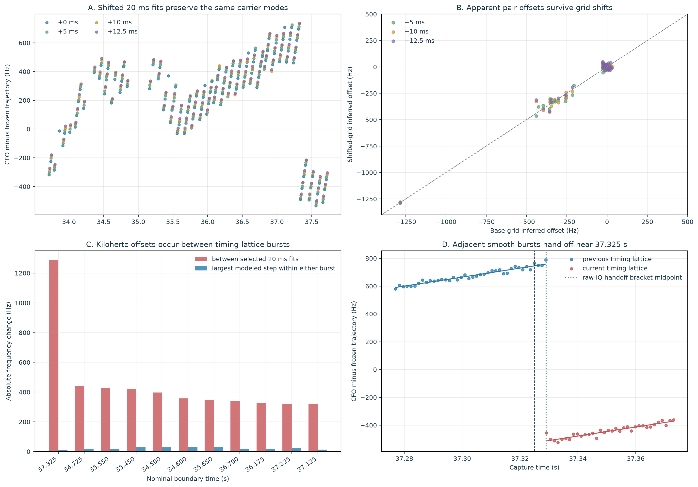

# Shifted-grid test of the 50–100 ms pilot-CFO structure in `470384`

> **Interpretation update (2026-08-24):** The shifted-grid and fixed-IQ
> measurements below remain valid, but the conclusion that scheduled Starlink
> source handoffs are the best explanation is superseded. The approximately
> 104.86 ms cadence is the local Pluto refill period, and omitted RF time at
> those handoffs explains both the apparent timing-lattice replacement and CFO
> step. See
> [Refill-time compression explains the Starlink CFO sawtooth](2026_08_24_refill_time_compression_sawtooth.md).

## Bottom line

The raw-IQ rerun does **not** show one Starlink carrier changing frequency every
20–50 ms.

The 20 ms teeth are the width of this repository's acquisition probes.  When the same
probes are moved by 5, 10, and 12.5 ms, overlapping absolute frames return the same CFO
to numerical precision, and the robust local rate remains near −3.8 kHz/s.  The strong
frequency offsets also survive the grid shifts, so they are not merely a plotting reset.

The decisive fixed-IQ result is more specific: around the strongest apparent offsets,
the old timing lattice is supported before a boundary and a different timing lattice is
supported after it.  Each burst is internally smooth.  The two burst fits meet within
about one 750 Hz frame but extrapolate to different carrier frequencies.  The largest
case near 37.325 s is a −1.285 kHz between-burst offset; the two fixed-IQ burst models are
separated by −1.272 ± 0.008 kHz, while neither burst supports an internal step above
about 10 Hz.

The best present interpretation is therefore **scheduled selection or handoff between
distinct pilot-bearing timing/frequency sources**.  Those sources could be different
satellites, beams, transmitter chains, or another Starlink scheduling state.  The Qin
pilot is not satellite-specific, so this experiment cannot choose among those identities.
It disfavors—but does not logically exclude—a single transmitter retuning its carrier
and changing its apparent frame timing at every handoff.

## Exact rerun

The experiment reread digest-verified raw IQ from receiver 0 of `stream-0` in
`cap-20260821T140820-470384cc9284`.  It used the same frozen branch prefix
`sha256:5852a936` and the 33.7–37.7 s interval from the piecewise pilot Doppler report.
No RF was collected and the recording/analysis corpus was not modified.

The persisted scan supplied 125 independently selected source locks.  For each lock the
current frame-local known-pilot estimator was rerun on four 20 ms windows:

- the persisted window;
- the same source timing lattice shifted by 5 ms;
- the same source timing lattice shifted by 10 ms; and
- the same source timing lattice shifted by 12.5 ms.

The shift changes which raw frames enter a fit while preserving the absolute 750 Hz
frame lattice.  Exact-pilot coherence, rolled-pilot negative control, coverage, gap,
line-RMS, and interleaved holdout thresholds were held fixed.  The 20 ms direct screen
does not apply the production modulo-π phase-lock gate: a 20 ms probe contains only
about 15 complete frames, below that gate's 20-frame minimum.  This is explicitly a
test of the direct CFO observable and its window dependence.

For the 12 largest base-grid offsets, the experiment then analyzed a fixed 100 ms raw-IQ
interval twice: once on the preceding source's timing lattice and once on the following
source's timing lattice.  Each fit was also repeated with the other source's CFO seed.
A weighted smooth line was compared with a searched shared-slope step model.  Positive
ΔBIC favors the step; ΔBIC ≥ 6 was declared strong evidence.

## 1. What moves when the 20 ms grid moves?

| Grid shift | Direct-quality fits | Median local rate | 10th–90th percentile | Median line RMS | Median conditional slope σ |
|---:|---:|---:|---:|---:|---:|
| 0 ms | 110 / 125 | −3.774 kHz/s | −4.668 to −2.656 kHz/s | 12.83 Hz | 638 Hz/s |
| 5 ms | 108 / 121 | −3.644 kHz/s | −4.778 to −2.648 kHz/s | 12.95 Hz | 644 Hz/s |
| 10 ms | 106 / 113 | −3.749 kHz/s | −4.545 to −2.875 kHz/s | 13.31 Hz | 663 Hz/s |
| 12.5 ms | 105 / 111 | −3.932 kHz/s | −4.982 to −2.680 kHz/s | 13.03 Hz | 645 Hz/s |

The four median rates have a standard deviation of 119 Hz/s and a full range of
289 Hz/s.  That grid-placement spread is a better uncertainty for the median local rate
than the conditional error of any single short fit.  The broad within-grid percentiles
also show why no individual 20 ms rate should be promoted to orbital acceleration.

More decisively, the overlapping grids contain identical absolute frames:

| Comparison | Matched absolute frames | CFO difference RMS | Maximum absolute difference |
|---|---:|---:|---:|
| Base vs +5 ms | 945 | 5.75 × 10⁻¹¹ Hz | 3.49 × 10⁻¹⁰ Hz |
| Base vs +10 ms | 531 | 5.75 × 10⁻¹¹ Hz | 2.33 × 10⁻¹⁰ Hz |
| Base vs +12.5 ms | 494 | 5.91 × 10⁻¹¹ Hz | 2.91 × 10⁻¹⁰ Hz |

Those tiny values are deterministic reproducibility, **not** RF measurement
uncertainty.  The actual base-grid median line RMS is 12.83 Hz, the median conditional
uncertainty of a window mean is 3.43 Hz, and the freshly measured median per-frame
reported uncertainty is retained in the JSON evidence.

The apparent offsets between neighboring selected fits are also stable under shifts:

| Comparison | Matched pairs | Correlation | Median absolute change | RMS change |
|---|---:|---:|---:|---:|
| Base vs +5 ms | 83 | 0.9940 | 9.29 Hz | 20.15 Hz |
| Base vs +10 ms | 75 | 0.9894 | 15.01 Hz | 26.54 Hz |
| Base vs +12.5 ms | 73 | 0.9866 | 17.33 Hz | 30.06 Hz |

This rejects a pure “the CFO estimator resets to an arbitrary value at every shifted
window” explanation.  It does not make every inter-window difference a physical step in
one transmitter; source selection is still conditional on a timing lock.

## 2. Where the large offsets actually occur

On the base grid, 20 of 93 qualified adjacent pairs exceed 100 Hz.  Their observed
inter-event spacing is 75.96 ms minimum, 100.75 ms median, and 99.52–324.25 ms over the
interquartile range.  Long spacings can contain a missed or unqualified event, so this is
not a scheduler-period estimate.  Importantly, it is not evidence of 20 ms retuning.

Eleven of the 12 strongest candidate boundaries supplied enough frames on both timing
lattices for the fixed-IQ audit:

| Nominal time | Pair offset | Boundary-mode separation | Separation − pair | Handoff bracket | Timing-lattice offset | Largest modeled within-burst step | Best ΔBIC |
|---:|---:|---:|---:|---:|---:|---:|---:|
| 37.325 s | −1285.3 ± 5.5 Hz | −1272.3 ± 7.6 Hz | 13.0 Hz | 0.191 ms | 191.5 µs | 10.3 Hz | −6.01 |
| 34.725 s | −438.9 ± 6.3 Hz | −333.4 ± 14.5 Hz | 105.5 Hz | 1.286 ms | 47.5 µs | 18.5 Hz | −4.49 |
| 35.550 s | −425.8 ± 6.1 Hz | −405.0 ± 8.0 Hz | 20.8 Hz | −0.122 ms | 121.6 µs | 14.2 Hz | −5.04 |
| 35.450 s | −421.8 ± 16.3 Hz | −405.4 ± 8.6 Hz | 16.4 Hz | 0.959 ms | 374.5 µs | 27.1 Hz | −1.28 |
| 34.500 s | −396.6 ± 6.1 Hz | −374.4 ± 8.2 Hz | 22.2 Hz | 0.825 ms | 508.5 µs | 27.3 Hz | −0.79 |
| 34.600 s | −357.1 ± 7.9 Hz | −409.8 ± 8.4 Hz | −52.6 Hz | 1.310 ms | 22.9 µs | 30.7 Hz | 0.12 |
| 35.650 s | −346.6 ± 5.3 Hz | −312.4 ± 7.8 Hz | 34.2 Hz | 1.719 ms | 385.5 µs | 32.5 Hz | 1.36 |
| 36.700 s | −338.0 ± 4.5 Hz | −335.1 ± 7.2 Hz | 2.9 Hz | 1.752 ms | 418.8 µs | 20.3 Hz | −2.95 |
| 36.175 s | −325.2 ± 5.2 Hz | −319.1 ± 7.3 Hz | 6.2 Hz | 0.528 ms | 528.4 µs | 14.4 Hz | −4.83 |
| 37.225 s | −321.1 ± 4.0 Hz | −329.3 ± 6.9 Hz | −8.2 Hz | 0.734 ms | 598.9 µs | 26.6 Hz | 0.59 |
| 37.125 s | −320.6 ± 5.2 Hz | −316.2 ± 7.4 Hz | 4.4 Hz | 0.950 ms | 382.5 µs | 13.8 Hz | −4.72 |

The between-fit offset and independently extrapolated boundary-mode separation correlate
at 0.991; their RMS disagreement is 38.8 Hz.  The old burst's last supported frame and
the new burst's first supported frame are separated by a median 0.950 ms and a maximum
1.752 ms.  The −0.122 ms value is a tiny overlap between receiver-relative frame
reference epochs, not negative dead time.

No timing lattice has strong evidence for a step inside its supported burst: the largest
searched ΔBIC is only 1.36, versus the declared threshold of 6.  Changing the CFO seed
changes the extrapolated burst CFO by only 0.016 Hz median and 0.271 Hz maximum.  Thus
the two solutions are selected by their timing lattices and raw support, not by which
CFO initial guess was supplied.

The conditional ± errors in the table come from within-burst line residuals and reported
per-frame uncertainties.  They do not include source-selection systematics.  The
38.8 Hz separation-versus-pair RMS is the more honest empirical frequency error for this
boundary comparison.  Boundary timing is frame-limited: the observed last/first-frame
bracket is the useful uncertainty, while the original probe-assigned boundary can miss
its midpoint by several milliseconds (6.16 ms RMS here).

## 3. Hypothesis discrimination

| Hypothesis | Prediction | Result |
|---|---|---|
| 20 ms analysis geometry alone | Teeth and CFO values change when the grid moves | Tooth width is imposed, but identical raw frames and large pair offsets reproduce; pure numerical reset rejected |
| CFO optimizer chooses a seed-dependent basin | Same timing lattice follows the alternate CFO seed | Alternate-seed difference ≤ 0.271 Hz; rejected for the audited bursts |
| Smooth orbital Doppler from one source | One continuous CFO curve, with no 0.3–1.3 kHz discontinuities | Strongly contradicted |
| One transmitter retunes while preserving its frames | CFO changes but the 750 Hz timing lattice remains continuous | Disfavored because support hands off between offset timing lattices; timing-acquisition ambiguity prevents absolute rejection |
| Scheduled switch between pilot-bearing sources or states | Smooth burst on one timing/CFO lattice, near-frame-boundary handoff, smooth burst on another | Best match to all observed controls |
| Receiver-0 oscillator/chain jump | A discontinuity independent of Starlink timing-source selection | Not favored by timing-lattice-specific support, but not independently excluded |

Receiver 1 does not provide a useful hardware control in this interval: rerunning all
125 receiver-0 timing locks on receiver 1 produced zero direct-quality window fits.
That is a sensitivity null, not evidence for or against a shared receiver oscillator
step.

## Why would Starlink transmit this way?

The evidence supports burst scheduling much more strongly than rapid frequency
retuning.  Starlink's physical downlink is organized as 750 frames/s, and demand-driven
resource allocation can make a receiver observe runs of occupied frames followed by a
different beam/source run.  Because the known edge pilots repeat across Starlink
transmissions, a pilot-only receiver can follow whichever compatible source dominates a
given time slot.  Different satellites or transmit chains naturally have different
Doppler, oscillator bias, propagation delay, and receiver-relative frame epoch even
when they occupy the same nominal RF channel.

So the likely causal picture is:

1. one pilot-bearing source is scheduled for a run of frames;
2. its CFO evolves smoothly at roughly −3.8 kHz/s;
3. around a frame boundary that run ends and another timing/CFO source becomes visible;
4. the tracker associates both runs with the same broad frozen ridge because their CFOs
   are nearby and the pilot sequence carries no satellite ID; and
5. subtracting a steeper frozen line plus plotting independent 20 ms probes creates the
   visible sawtooth pattern.

The experiment cannot yet say whether “source” means satellite, beam, RF chain, or a
single spacecraft's internal scheduling state.  Resolving that requires a satellite-
specific observable: payload/beam metadata, simultaneous geographically separated
receivers, or a TLE-constrained multi-burst association that treats timing/CFO handoffs
as explicit latent states.

## Reproducibility and artifacts

- Machine-readable evidence:
  [`shifted-grid-boundary-audit.json`](figures/2026_08_23_470384_shifted_pilot_grid/shifted-grid-boundary-audit.json)
- Figure:
  [`shifted-grid-boundary-audit.png`](figures/2026_08_23_470384_shifted_pilot_grid/shifted-grid-boundary-audit.png)
- Rerun tool: [`tools/report_shifted_pilot_grid_experiment.py`](../tools/report_shifted_pilot_grid_experiment.py)
- Focused tests:
  [`tests/analysis/test_shifted_pilot_grid_experiment_tool.py`](../tests/analysis/test_shifted_pilot_grid_experiment_tool.py)

The JSON closes the recording manifest digest, persisted scan/bank hashes, current
measurement/local-fit implementation hashes, every selected source lock, every grid fit,
every pair offset, and every frame retained by the fixed-IQ boundary audits.  Five
focused tests cover lattice preservation, true-step recovery, smooth-line step
penalization, common-epoch pair-offset geometry, and same-frame matching.
