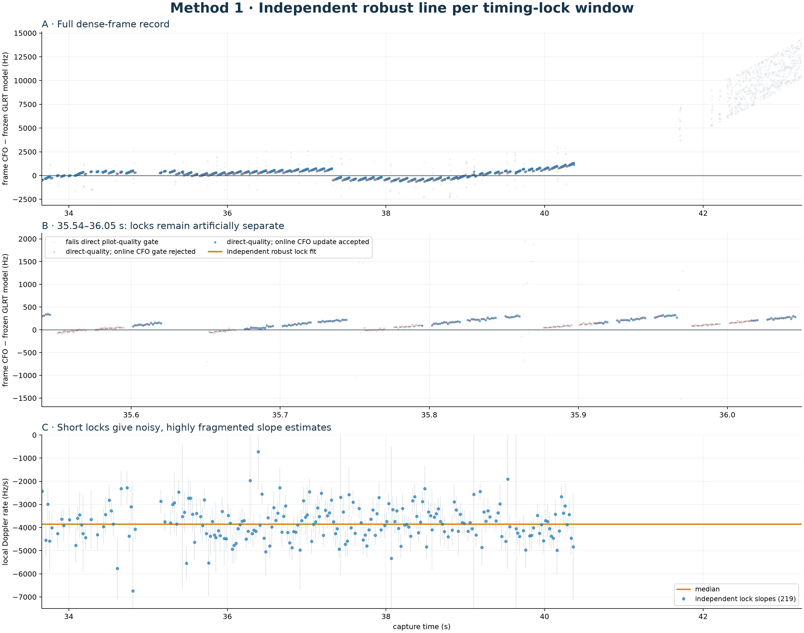
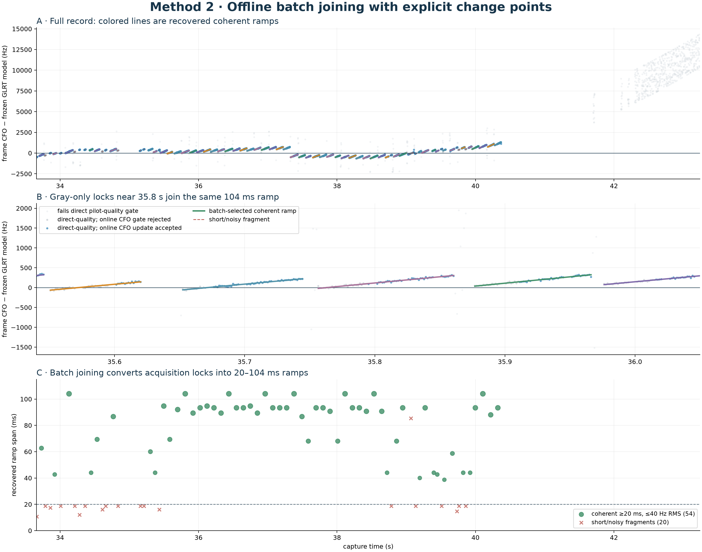
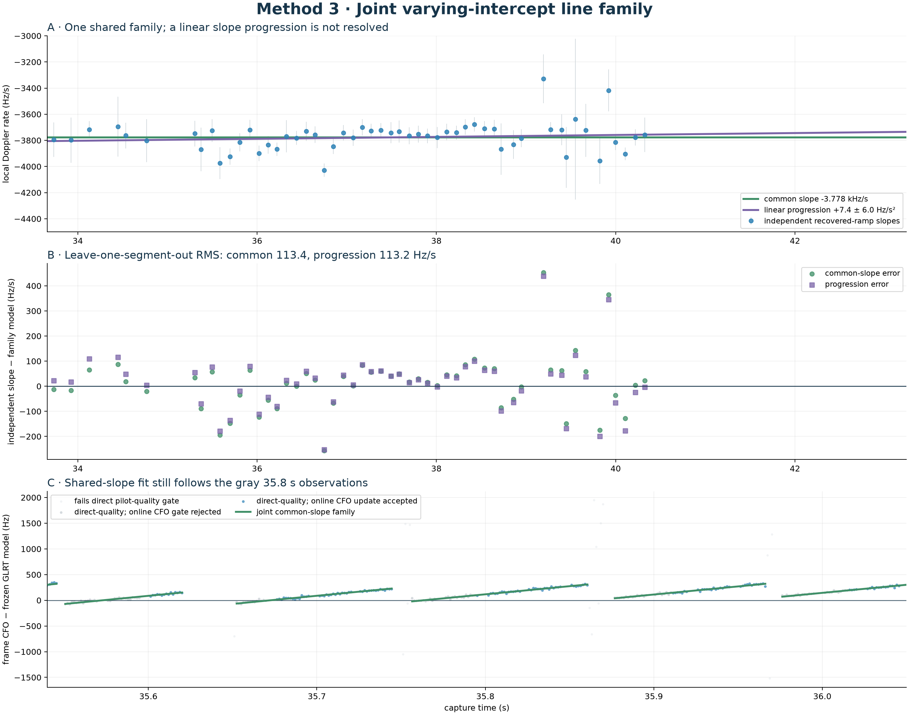
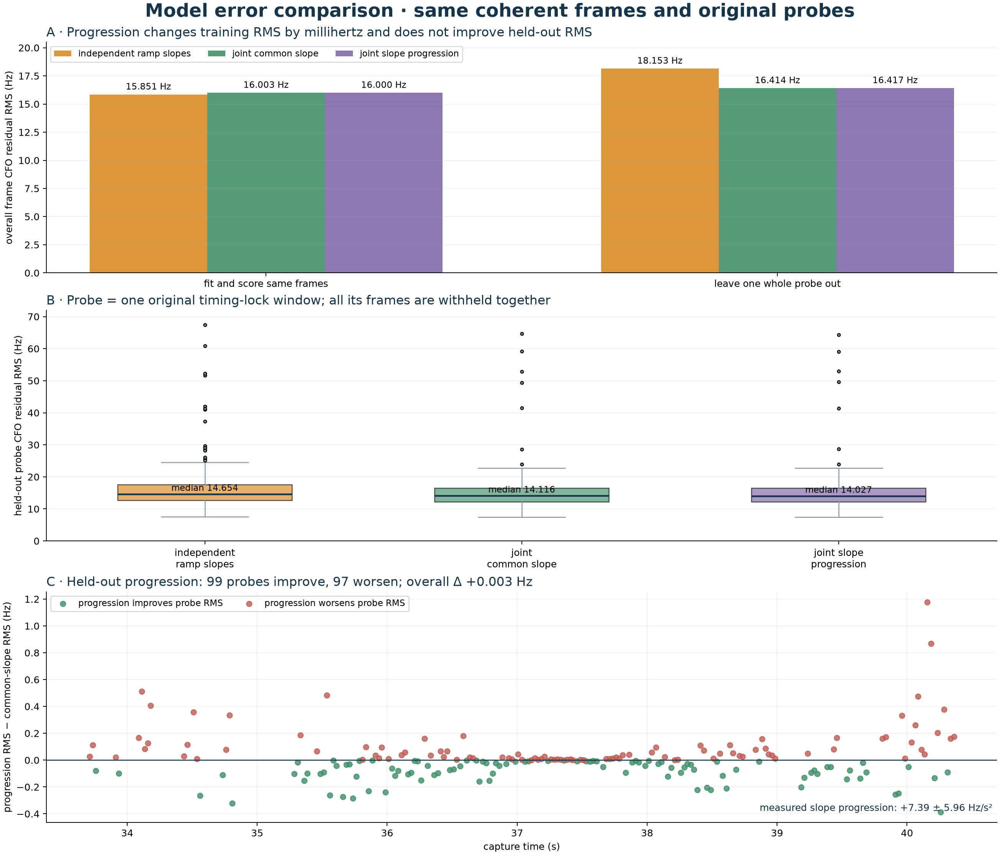

# Offline sawtooth recovery on `470384`

## Bottom line

The gray 1.333 ms frame CFOs are useful observations.  The best of the three
methods is the offline batch partition: it joins the 125 timing-lock acquisition
windows into 74 line segments, of which
54 pass the explicit 20 ms / 40 Hz-RMS coherence gate.
Those coherent ramps contain 2793 of the
3122 direct-quality
frames.

In the disputed interval, source locks 48–
52 become one 104.0 ms ramp:
64 frames, 39 accepted by the
online CFO gate, Doppler rate -3.815 kHz/s, raw line
RMS 17.2 Hz, and interleaved held-out RMS
17.8 Hz.  In other words, the offline result recovers
the gray-only coast instead of treating the online Kalman decision as truth.

## Scope and ordinate

- Capture: `cap-20260821T140820-470384cc9284`, `stream-0`, receiver 0, upper edge, 33.701–37.720 s.
- Input: the persisted dense known-pilot evidence; no new IQ collection and no
  re-use of the online Kalman state as a fit prior.
- Every direct-quality frame has exact pilot coherence ≥
  0.02 and non-negative exact-minus-control margin.
- The figures display frame CFO minus the frozen cubic GLRT trajectory so the
  sawtooth is visible.  Every reported line slope is fit in **absolute CFO
  space**, so subtracting the display model does not define the Doppler rate.
- Blue/gray records only whether the online CFO update was accepted.  Both are
  observations for all three offline methods.

## Method 1 — independent timing-lock lines



This is the least-assumptive baseline: robustly fit each of the
219 timing locks by itself.  It confirms that local slopes
exist, but the typical lock spans only 18.7 ms.
The resulting slope spread is -4.875 to
-2.510 kHz/s (5th–95th percentile), much of it
from short-baseline slope uncertainty.  This method cannot answer which adjacent
locks are samples of the same physical ramp.

## Method 2 — batch joining with change points



An exact dynamic program partitions the ordered locks.  A candidate may join at
most 8 locks, span at most
125 ms, and contain no inter-frame gap above
16 ms.  Its cost is a capped-square robust
line residual plus a BIC-like per-segment penalty of
16.09.  The noise normalization,
17.83 Hz, is the 90th percentile of
the independent-lock robust RMS values.

This finds 54 coherent 20–104 ms ramps with median raw
RMS 13.8 Hz and median interleaved held-out RMS
14.8 Hz.  The red dashed pieces are retained
as honest short/noisy fragments, not silently discarded measurements.

## Method 3 — varying intercepts, shared slope family



For recovered ramp `j`, with center `tau_j`, the joint model is

```text
f_ij = a_j + beta_0*x_ij
       + beta_1*((tau_j - T0)*x_ij + 0.5*x_ij^2) + robust error,
x_ij = t_ij - tau_j.
```

Every ramp receives its own CFO intercept `a_j`; `beta_0` is the shared Doppler
rate and `beta_1` is a linear progression of that rate in time.  The common-rate
fit is -3.7782 ±
0.0094 kHz/s.  Allowing progression gives
`beta_1 = +7.39 ±
5.96 Hz/s²`.

This recording does **not** resolve the proposed progression: adding it worsens
BIC by 6.73, and leave-one-ramp-out slope prediction changes from
113.4 Hz/s (common) to
113.2 Hz/s (progression).  A single
shared-slope family is therefore the more defensible description of these four
seconds.  A progression remains physically plausible; it needs a longer span or
multiple captures to estimate without confusing real acceleration with
tooth-to-tooth slope scatter.

Across the observed ramp centers, the fitted rate changes from
-3805.1 to
-3756.5 Hz/s: a progression of
+48.7 ±
39.3 Hz/s over
6.592 s.  This is a change in **Doppler rate**, not a
carrier-frequency shift.

## Overall and per-probe error comparison



All models below are scored on the same 2793 frames from
196 original probe
windows.  “Leave one probe out” removes every frame from one probe, refits, and
then predicts that complete probe.  The recovered ramp partition is held fixed,
so this tests CFO-model prediction conditional on segment membership rather than
re-running end-to-end segment discovery.

| model | in-sample frame RMS | held-out frame RMS | median held-out probe RMS |
| --- | ---: | ---: | ---: |
| independent ramp slopes | 15.851 Hz | 18.153 Hz | 14.654 Hz |
| joint common slope | 16.003 Hz | 16.414 Hz | 14.116 Hz |
| joint slope progression | 16.000 Hz | 16.417 Hz | 14.027 Hz |

Progression reduces same-frame RMS by only
0.0035 Hz, or
0.022%.
That tiny training improvement disappears under probe holdout: overall RMS is
+0.0028 Hz
(+0.017%)
worse than the common-slope model.  It improves
99 probes and
worsens 97.
The common-slope model is therefore the useful regularizer; the progression
term does not provide measurable predictive value in this record.

## Interpretation and next use

The important conceptual separation is now explicit:

1. a **timing lock** says where a short pilot-frame lattice was acquired;
2. the batch partition decides which locks lie on one continuous CFO ramp;
3. the line family estimates the common Doppler rate after giving every ramp an
   arbitrary CFO intercept.

That arbitrary intercept is exactly what makes the approach compatible with an
unknown LNB offset and unknown per-satellite carrier assignment.  Association to
a TLE should compare the measured **rate (and eventually rate progression)** to
predicted range-rate derivatives, not compare absolute received frequency.

These thresholds were tested on one worked example, so this is a diagnostic
analysis rather than a frozen production contract.  The next honest validation
is to hold the configuration fixed and run it on other captures, especially
passes with weaker or crossing sawtooth families.
