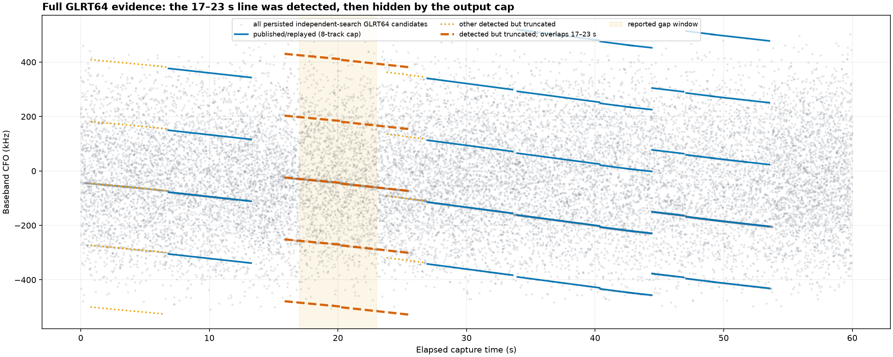
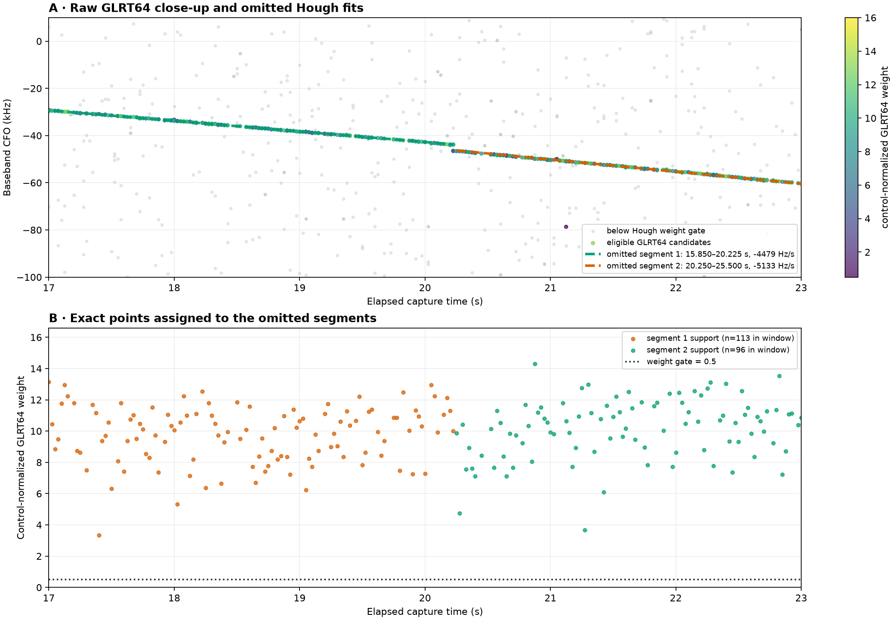
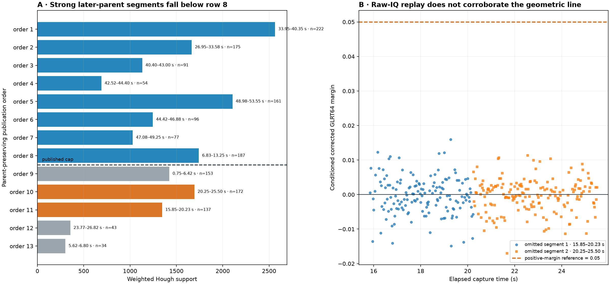
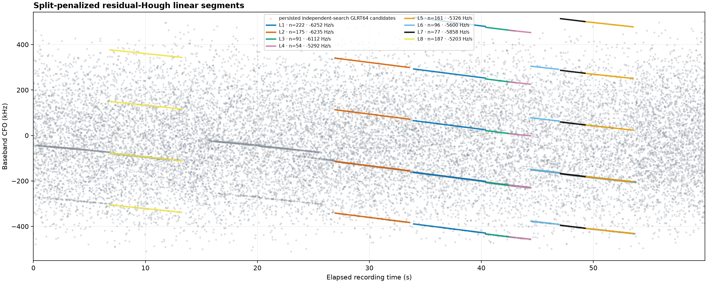
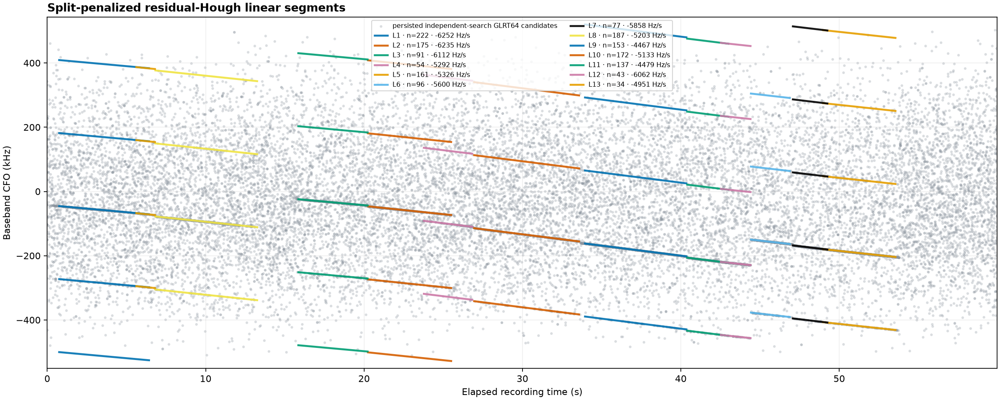

# Missing CFO track at 17–23 s: root-cause analysis

## Executive finding

The signal near 17–23 s on `cap-20260823T144200-34e2144863ce`,
`radio_pluto_19f2` RX1 was **detected by the residual-Hough analysis**. It is
missing from the registered `cfo-alternate.png` because the product retains the
first eight child segments in parent-preserving order. The two adjacent
segments covering the reported window are rows 10 and 11 of 13, so both are
removed by that output limit before replay, de-aliasing, Kalman tracking, or
presentation can consume them.

This is a publication/seed-budget problem, not a raw-signal, GLRT, Hough,
alias, storage, API, or browser-rendering failure.

A narrow fix is included with this report: the product-only
`path-alternate-tracks` stage now uses the existing contract's 16-track display
ceiling, while the scientific `path-standard` correction path remains at eight.
On this dwell, that changes the display from 8 to all 13 detected child
segments without feeding the five extra candidates into replay, de-aliasing,
or Kalman estimation. The existing registered product is immutable; the new
view will appear after a release containing this change reprocesses the path.

## Motivation and question

The current alternate-CFO PNG visibly follows several sloped ridges but has a
clear gap over approximately 17–23 s. The investigation asked where the signal
was lost:

1. Was it absent from the independent GLRT64 search?
2. Did the residual-Hough detector fail to form a line?
3. Was it rejected by association, alias handling, replay, or a later filter?
4. Was the product correct but hidden by the API or web UI?

The answer is between steps 2 and 3: Hough formed the line, and an eight-row
slice removed it.

## Scope and reproducibility

| Item | Value |
| --- | --- |
| Recording | `cap-20260823T144200-34e2144863ce` |
| Receiver path | `radio_pluto_19f2` RX1 (`stream-1`, receiver 1, lower edge) |
| Standard run | `capture-da59c914adfe41278262fe4b5d297de0` |
| Pipeline release | `88a5bc8b855f6e1f4edfbb8f627ad525e4ad3f77` |
| Path scope digest | `ac0e930aa4149a9123fcbf2eaee95e938a4aefca11f503f4cecc6f4c1e0b01bd` |
| Verified recording manifest | `sha256:59a0363d0c5ad12eec53e62f63cf472adf3ab5cc3f10ebf641c61f60e690e85b` |
| Pilot-scan digest | `sha256:2ef34c93cdd8fe1a496d5b6fd9c404902e89175295449c67cdc771e6a5f27aab` |
| Reported window | 17.000–23.000 s |

The selected Standard run completed on 2026-08-23 from 14:43:40 to 14:48:03
UTC. The only commits between its scientific release and the then-current
`main` were documentation changes, so this was the newest applicable scientific
pipeline, not an old analysis. No new RF data was collected and no analysis job
was scheduled. The diagnosis replayed the registered products and verified raw
IQ directly from the read-only recording store, avoiding duplicate scheduling.

The complete machine-readable evidence is in
[`evidence.json`](figures/2026_08_23_cap_144200_missing_track/evidence.json).
The reproduction program is
[`tools/report_missing_glrt_track.py`](../tools/report_missing_glrt_track.py).

## Approach

The investigation followed the exact evidence lineage:

```text
verified raw IQ
  └─ independent GLRT64 scan: 2,400 probes × 10 candidates = 24,000 points
       └─ alias-aware Hough: 6 initial parents
            └─ residual-Hough split: 13 child segments
                 ├─ first 8: persisted, replayed, de-aliased, tracked, rendered
                 └─ last 5: truncated before downstream processing
                      └─ rows 10 and 11 cover the reported 17–23 s window
```

The production detector was rebuilt from the persisted pilot scan with the
registered release configuration. Exact point memberships were recovered for
each residual line. The eight-track rebuild then reproduced the web-served PNG
bit for bit. Finally, only the two omitted window segments were replayed against
verified raw IQ to determine whether geometric detection alone justified
promoting them into correction.

## Results

### 1. The full GLRT evidence contains the line



Gray points are all 24,000 persisted independent-search GLRT64 candidates.
Solid blue lines are the eight segments available to the current downstream
pipeline. Orange dotted lines are other detected but truncated geometry. The
two thick dashed lines crossing the shaded 17–23 s window are the signal the
operator expected to see.

The repeated vertical aliases are separated by 227.273 kHz. The requested
ridge is present on each equivalent alias, and offline replay inferred alias
index 0 for both local segments. Alias selection did not remove it.

### 2. Close-up: two adjacent strong local fits, not one continuous fit



The upper panel shows raw candidates near the ridge. Points colored by
control-normalized GLRT64 weight pass the detector's 0.5 weight gate; faint gray
points do not. The lower panel shows the exact candidates assigned to the two
omitted residual-Hough lines.

| Selection order | Interval | Support | Support in 17–23 s | Slope | RMS residual | Max gap | Weighted support |
| ---: | ---: | ---: | ---: | ---: | ---: | ---: | ---: |
| 11 | 15.850–20.225 s | 137 | 113 | −4,478.6 Hz/s | 92.7 Hz | 0.325 s | 1,345.7 |
| 10 | 20.250–25.500 s | 172 | 96 | −5,132.7 Hz/s | 124.2 Hz | 0.100 s | 1,694.4 |

Together, the segments own 209 of the 241 probe epochs in the requested window,
or 86.7% coverage. Their minimum assigned weights are 3.34 and 3.66—more than
six times the 0.5 gate—and their median weights are 10.00 and 10.50. This is not
a marginal Hough detection.

The detector correctly split the ridge at about 20.24 s. Extrapolating the two
local fits to that seam gives a roughly 2.44 kHz frequency offset, and their
slopes differ by about 654 Hz/s. Therefore, the evidence supports two adjacent
coherent line segments; it does **not** yet establish one physically continuous
satellite-Doppler trajectory. The step could reflect a transmission/carrier
state change, a different component, or another receiver-relative effect.

### 3. Why a high-quality segment was omitted



The initial Hough parents are peeled strongest first. Every selected child of a
stronger parent is emitted before the children of the next parent; children are
sorted by weighted support only within a parent. This intentionally prevents a
weaker later parent from evicting a valid split of the strongest parent, but it
also means the final list is not a global top-eight ranking. In this dwell, the
parent containing the 17–23 s ridge is reached only after rows 1–9 have already
been emitted. Its two strong children become rows 10 and 11.

The lower publication line in the left panel is the exact eight-track slice.
The red bars are the two reported-window segments. Their geometry is stronger
than several published rows, but parent-preserving order—not signal strength
across parents—determines the cutoff.

### 4. Raw-IQ replay does not independently corroborate pilot promotion

Expanding the seed budget offline associated 152 of 176 replay probes for the
first segment and 179 of 211 for the second. However, no conditioned GLRT64
score reached the accounting system's positive-margin reference of 0.05:

| Interval | Associated / replay probes | Median conditioned margin | Maximum conditioned margin | Probes ≥ 0.05 | Median ordinary margin delta |
| ---: | ---: | ---: | ---: | ---: | ---: |
| 15.850–20.225 s | 152 / 176 | −0.00034 | 0.01597 | 0 | −0.36225 |
| 20.250–25.500 s | 179 / 211 | +0.00008 | 0.01136 | 0 | −0.36401 |

This is a crucial distinction. The current CFO-lift replay V4 path records
conditioned replay as audit evidence, while correction selection still follows
retained geometry.
It does not presently use 0.05 as a hard promotion gate. Consequently, simply
raising the `path-standard` seed limit would admit these lines to correction
despite weak known-pilot corroboration. The implemented change deliberately
does not do that.

This replay result does not prove that the visible ridge is unreal. It says the
current GLRT64 known-pilot test does not verify that this geometry is the pilot
component suitable for automatic trajectory correction.

### 5. The API and web UI are faithful

The existing artifact endpoint returned HTTP 200, an immutable artifact-cache
response, and 841,064 PNG bytes. The production-code rebuild of the current
eight-track product had the same SHA-256 digest as the served image:

```text
sha256:323d7b85cd7408700f2ef2d882045e22bb1f998410d4248ebd80f124668a1914
```

That bit-for-bit match rules out a stale browser rendering, route mismatch,
unregistered file, or web presentation filter. The UI accurately shows the
eight tracks it was given.

## Layer-by-layer disposition

| Layer | Finding | Disposition |
| --- | --- | --- |
| Raw recording | Manifest verified; no recording-store mutation | Not the cause |
| Independent GLRT64 | Ridge densely represented in persisted candidates | Not the cause |
| Weight/coverage gates | 86.7% window coverage; weights far above 0.5 | Not the cause |
| Initial and residual Hough | One parent split into two strong local segments | Not the cause |
| Aliasing | Equivalent aliases plotted; replay selects alias 0 | Not the cause |
| Publication/seed budget | Rows 10 and 11 sliced by `maximum_published_tracks=8` | **Root cause** |
| Replay and association | Never reached in the registered run for these rows | Consequence of cutoff |
| Offline known-pilot replay | Associated, but no positive conditioned margins | Caution against correction promotion |
| De-alias/Kalman/50–100 ms analysis | No source trajectory arrived | Consequence of cutoff |
| API/web UI | Served PNG exactly matches local rebuild | Not the cause |

## Implemented fix

The change separates visibility from correction authority using existing stage
boundaries:

- `path-alternate-tracks`, which creates the operator-facing alternate-CFO bank
  and PNG, now uses `maximum_published_tracks=16`, the existing V2 contract
  ceiling.
- `path-standard.segmentation` remains at eight. Its replay, de-aliasing,
  Kalman, and 50–100 ms products receive exactly the same bounded seed inventory
  as before.
- No persisted schema or published contract changes.
- The analyzer's no-stage-config fallback uses the same display policy as the
  production release configuration.

On this dwell, the display product grows from 8 to 13 returned tracks and has no
remaining detected-child truncation.

Current eight-track rendering:



Proposed 16-row-ceiling rendering of the same persisted evidence:



### Runtime and storage effect

A five-repeat, same-host build-and-render benchmark on this exact pilot product
measured:

| Policy | Median product-stage time | Returned tracks | PNG size |
| --- | ---: | ---: | ---: |
| Current cap 8 | 0.729 s | 8 | 841,064 bytes |
| Display cap 16 | 0.751 s | 13 | 871,536 bytes |
| Difference | **+0.022 s (+3.0%)** | +5 | +30,472 bytes (+3.6%) |

The detector already computes all 13 child segments before slicing, so the
increment is primarily serialization and drawing. Relative to the observed
approximately 263 s Standard-run wall time, the projected end-to-end addition
is about 0.01%, below normal run-to-run noise. This is a product-stage benchmark,
not a new full-pipeline timing run. The 22.1 s offline raw-IQ replay used for
this diagnosis is not part of the implemented fix and adds no production time.

## Tests and checks

Component-owned tests assert that:

- the science/correction policy stays at eight;
- the display policy uses 16 without mutating the science policy;
- the production registry applies those policies to the correct stages; and
- existing alternate-track, production-analyzer, and research-pipeline behavior
  remains valid.

Verification completed with:

- `ruff format --check` and `ruff check`: passed for every changed Python file;
- targeted alternate-track, production-analyzer, research-pipeline, and
  non-PostgreSQL processing tests: 27 passed, 2 PostgreSQL tests explicitly
  deselected; and
- the full non-hardware, non-PostgreSQL, non-real-corpus analysis suite: 442
  passed, 5 explicitly deselected.

The report generator also provides three reproducibility checks that normal
unit fixtures cannot: verified raw-IQ reads, exact recovery of the 13-segment
inventory, and bit-for-bit reproduction of the currently served PNG.

## Recommended follow-up work

1. **Make disposition explicit in a future product version.** Persist separate
   `detected`, `retained_for_replay`, `replay_corroborated`, and
   `selected_for_correction` states. V2 contracts remain immutable, so this
   belongs in a new contract version rather than silently changing V2 meaning.
2. **Make correction evidence-gated.** Require conditioned known-pilot evidence
   and held-out prediction before a residual-Hough line can alter samples.
   Replay/accounting should become an input to selection, not audit-only output.
3. **Evaluate parent-fair selection offline.** Compare the present
   parent-preserving order with a bounded per-parent quota followed by global
   weighted ranking. Validate on the existing dwell/scanner corpus before
   changing correction semantics; global ranking alone can over-select several
   fragments of one ridge.
4. **Expose truncation in presentation.** If more than 16 child segments exist,
   the PNG and UI should visibly state how many remain hidden. The display fix
   reduces ambiguity but cannot exceed the V2 contract ceiling.
5. **Do not infer satellite dynamics yet.** Require dual-receiver common-mode
   agreement and orbital/TLE consistency before interpreting either local slope
   as range rate or Doppler rate.

## Conclusion

The apparent 17–23 s detection hole is an observability bug caused by sharing a
small, parent-ordered track budget between an operator display and the
scientific correction seed path. The underlying GLRT and Hough stages found the
geometry. The safe immediate action is to show a wider bounded inventory while
leaving correction conservative. The next scientific improvement is to replace
geometry-only correction admission with explicit known-pilot and held-out
evidence.
