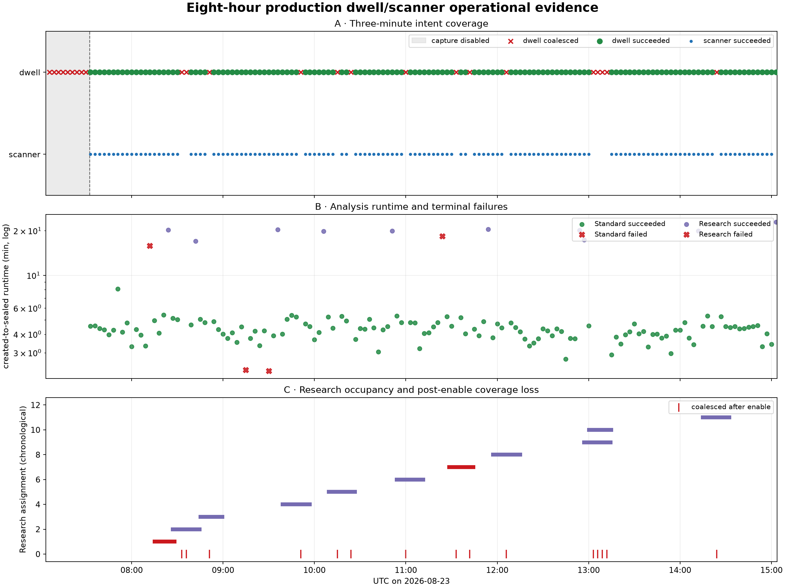

# Eight-hour production dwell and scanner operational audit

## Overview

This independent audit covers the fixed half-open interval **2026-08-23 07:03:41–15:03:41
UTC**. It follows every production recording intent scheduled in that interval through terminal
acquisition, analysis, persistence, integrity validation, and the production API routes consumed by
the web UI. It does not schedule or reprocess data and does not modify the QNAP archive.

The interval straddles a deployment boundary. Release
`e91ea2afaf2bbf713bc847ca823860361e7eb60f` was registered at 06:44:47 UTC, but capture remained
disabled and it produced no in-window result. Release
`88a5bc8b855f6e1f4edfbb8f627ad525e4ad3f77` was registered at 07:30:56 UTC, its API, acquisition
supervisor, and 20 workers started at 07:31:03 UTC, and capture was explicitly enabled at
07:32:32 UTC. Every successful dwell and scanner result in this report therefore belongs to the
second release. Scanner bundles use analysis identity
`standard-scan-analysis-pilot-plots-v1`; that contract does not persist a release ID, so their
release attribution is operational (the sole deployed executable), not an assertion embedded in
the manifest.

## Questions and method

The audit asks:

1. Did the scheduler preserve the intended three-minute dwell-plus-scanner cadence, and why were
   slots lost?
2. How did Standard and Research allocation affect runtime, concurrency, and acquisition
   backpressure?
3. Which failures retried successfully, which failed the whole run, and were any runs or jobs
   duplicated?
4. Did every successful result publish the complete immutable artifact set, and were all focused
   PNGs reachable through production UI routes?

The evidence is read from PostgreSQL acquisition operations, analysis runs, processing jobs and
attempts; the bounded systemd and kernel journals (extended beyond 15:03:41 only for downstream
work belonging to an in-window intent); immutable bulk product registries and scanner
V3 manifests; and HTTP `HEAD`/hierarchy requests against `http://127.0.0.1:8090`. Dwell bytes are
checked against registered size and SHA-256, PNGs are decoded and checked for nonconstant content,
and every JSON product is passed through its closed Standard contract decoder (Research envelopes
are validated before their Standard payloads). Scanner manifests and all eight referenced
artifacts per capture are digest-checked; all five production PNGs per capture are decoded.

Minute telemetry begins at 09:14:02 UTC (the separately requested six-hour monitor), so sampled
queue/service statements are explicitly limited to 09:14:02–15:03:41. Full-window operation,
run, job, retry, and failure counts are reconstructed from durable rows and journals.

## Outcome at a glance

| Area | Exact outcome |
|---|---|
| Three-minute dwell intents | 160 total: 136 succeeded (85.0%), 24 coalesced (15.0%) |
| Scanner coverage | 135 completed bursts, one paired burst pending after an operator pause, and 24 absent because their dwell was coalesced |
| Dwell analysis | 132/136 runs succeeded (97.1%); four failed with no products |
| Lane assignment | Standard: 122 succeeded, two failed; Research: 10 succeeded, two failed |
| Dwell persistence | 17,688 products / 46.69 GB; 10,428 JSON and 7,260 PNG; zero byte, digest, parse, or decode issues |
| Scanner persistence | 540 completed capture bundles / 3.28 GB; 4,320 manifest-referenced artifacts; zero digest issues; 2,700/2,700 PNGs decoded |
| Recovered instability | Three native child crashes on three workers; all three jobs succeeded on attempt 2 |
| Fatal estimator defects | Three residual-Hough rejections and one Kalman ordering rejection; each failed a complete 12-job run |
| Duplicate logical work | Zero duplicate operation keys, session/lane/release runs, run/stage/scope jobs, or run/scope/kind products |

## What worked

After capture was enabled, the recorder committed 136 complete dwells without an acquisition
failure or operation retry. Of their production analyses, 132 sealed successfully. Each successful
run published exactly 134 registered products including exactly 55 PNGs. The 488 successful
Standard path quality records and 40 Research path records all reported complete sample coverage,
zero missing samples, no constant-IQ path, and no clipped complex samples.

The scanner completed 135 bursts (540 independent retune-bounded captures). Every completed V3
bundle contained one manifest plus all eight referenced artifacts, and all manifest hashes matched.
Scanner capture itself was stable: median capture time was 1.892 s per bundle. The much larger
10.788 s median per-bundle analysis cost, rather than radio I/O, dominates the scanner operation.

The sampled service interval was clean: all 350 one-minute samples returned HTTP 200, API and
acquisition remained active, all 20 workers were active, capture was desired/observed running, and
the collector logged no errors. The API journal contained no HTTP 5xx response in the full fixed
window. The sole service transition was the planned 07:30 deployment described below.

## What did not work

### Capture was disabled for the first 29 minutes

The fixed interval begins while capture control was disabled. Nine in-window dwell intents,
07:06 through 07:30 UTC, were successively coalesced. At 07:30:48 the prior services stopped for
the planned deployment; API, acquisition, and all 20 workers restarted at 07:31:03; an explicit
`POST /api/v1/capture-control/start` succeeded at 07:32:32; and the 07:33 dwell began at
07:33:35. This is not evidence of a crashed service or analysis backpressure, but it is real lost
coverage in an eight-hour result accounting. Operational availability should separately expose
“service healthy” and “capture desired/observed running.”

The deployment explicitly sent `SIGKILL` to all 20 worker units, so systemd recorded each stopped
worker as `Failed with result 'signal'`. No processing attempt straddled 07:30:48, and all 20 new
workers started 15 seconds later, so this caused no in-window product loss. Deployment-aware alerts
must nevertheless distinguish this intentional stop from the three unplanned child-process faults
below.

### Research selection is statistically fair but not cadence-aware

Research selection uses a deterministic 1-in-8 manifest bucket, not a spacing rule. It can place
long Research runs close together. The interval contains an 08:12/08:24/08:42 cluster and an
adjacent 12:54/12:57 pair. Because Research path analysis occupies the same heavy workers and the
acquisition guard is lane-blind, these clusters correspond to multiple coalesced dwell intents and
missing scanner sweeps. Final spacing, overlap, and missing-slot counts are reported below.

### Three isolated analyzers crashed in native Python execution, then retry hid the failure

Three different `path-standard` jobs exited without a receipt:

- Standard `cap-20260823T075100-6cb9ff7b57f6`, job 25179, worker 9. The kernel logged a
  `python3.14` `ThreadPoolExecu` segmentation fault at 07:56:09. Attempt 1 failed with
  `ProcessingError: isolated analyzer exited without a receipt`; attempt 2 succeeded.
- Research `cap-20260823T082400-4636467359eb`, job 25311, worker 7. The kernel logged a
  `python3.14` `ThreadPoolExecu` general-protection fault at 08:27:10. Attempt 1 failed with the
  same receipt error; attempt 2 succeeded.
- Research `cap-20260823T150300-92ac23cd745f`, job 26721, worker 5. This dwell was scheduled just
  inside the fixed interval; its downstream attempt faulted at 15:13:51 during the drain. The
  kernel logged another `ThreadPoolExecu` general-protection fault at the same Python instruction
  pointer as the 08:27 fault. Attempt 2 succeeded; the run sealed at 15:27:34 after 1,374.2 s.

There was no kernel OOM event. Different workers and the recovered reruns point to a nondeterministic
native/concurrency fault, not a deterministic corrupt input. Publication can ultimately succeed,
but a green run hides this instability unless attempt history is monitored. Persist the child exit
code/signal, enable usable core dumps or native stack capture, and alert on any retry whose first
attempt exited without a receipt.

`addr2line` against the deployed Python 3.14.4 executable resolves the repeated
general-protection instruction pointer to `PyObject_Malloc` and the earlier segmentation-fault
instruction pointer to `_PyObject_GC_NewVar`. Both are core object-allocation paths. That is
consistent with memory corruption or unsafe concurrent native execution, but it is not a root-cause
proof: the host lacks `coredumpctl`, and no native backtrace was available.

### Three residual-Hough failures and one Kalman ordering failure discarded complete runs

Three path analyzers rejected overlapping residual-Hough proposals with
`exclusive residual-Hough proposal has fewer than two points`: Research
`cap-20260823T081200-e63228b11f55`, and Standard
`cap-20260823T091503-ae0acd1df7cd` and
`cap-20260823T093000-8c791df0895a`. Research
`cap-20260823T112531-8460cc6f3fd7` instead failed the immutable Kalman track contract because
frames were not ordered. Each path-local exception failed one job and cancelled its eleven peers,
so each run published no products. The Research failures are particularly expensive: they surfaced
after roughly 16 and 18 minutes.

The run-level fail-fast policy is internally consistent, but running siblings are not cooperatively
interrupted: three sibling jobs in each failed run continued before their now-cancelled leases
could no longer publish. Treat sparse/overlapping Hough proposals as inadmissible candidates,
resolve crossed frame-time observations before filtering, and add inner-loop cancellation checks.

### The final paired scanner is stranded by an operator pause

The 15:03 dwell completed and its Research analysis eventually succeeded, but capture control was
changed to desired/observed `paused` by the web UI at 15:04:37, three seconds before that dwell
committed. Its already-created scanner operation 1242 therefore remains pending. No processing
jobs from the production `new_capture` cohort remain, so this is pause semantics, not analysis
backpressure. The audit does not resume
capture: this report validates 135 completed bursts and explicitly excludes the four unpublished
captures of the pending burst. A pause should either cancel pending radio operations with an
explicit reason or expose them as paused, rather than leaving an ordinary `pending` row indefinitely.

### The five-minute reconciler repeatedly scans unchanged history

The reconcile timer completed 95 full committed-bundle/history passes. It consumed 3,298.1 CPU-s
and 3,260.1 wall-s in aggregate (median 34.0 CPU-s and 33.3 wall-s per pass), emitted 115,531
journal lines / 6.58 MB, repeated 10,165 historical incompatibility lines, and emitted the same
Matplotlib cache warning 95 times. This did not stop publication, but it is persistent avoidable
CPU, I/O, and journal churn beside compute-heavy Research work. Use a durable high-water mark,
cache unchanged historical verdicts, and schedule any full integrity sweep separately.

## Aggregate cadence, runtime, and queue results

| Metric | Count | Median | p90 | Maximum |
|---|---:|---:|---:|---:|
| Successful dwell operation | 136 | 105.24 s | 110.12 s | 113.60 s |
| Completed scanner operation | 135 | 61.80 s | 65.49 s | 75.60 s |
| Paired dwell + scanner cycle | 135 | 167.63 s | 174.21 s | 186.47 s |
| Standard successful analysis | 122 | 258.46 s | 303.47 s | 484.98 s |
| Research successful analysis | 10 | 1,198.20 s | 1,239.69 s | 1,374.16 s |

Four paired cycles exceeded the three-minute intent interval; the worst overrun was 6.47 s. Dwell
start lag was normally tiny (median 0.21 s) but had a 53.89 s p90 and 159.11 s maximum after
coalescing/backpressure episodes. The maximum sampled queue was 24 pending and 12 leased jobs;
the lane maxima were 20 Standard pending and 16 Research pending. Dependency jobs are created
upfront, so the sampled 1,191 s maximum “oldest pending” age includes DAG-blocked work and is not a
pure runnable-queue latency.

Research was assigned to 12/136 dwells (8.8%). Assignment separation ranged from 180 to 4,500 s
(median 1,980 s), one pair was adjacent, and at most two Research runs overlapped. The nine initial
coalesced slots occurred while capture was disabled. Every one of the remaining 15 coalesced slots
occurred while a long Research run was active. Because no scanner intent is created for a
coalesced dwell, the 24 lost dwell slots also removed 24 scanner opportunities; the longest loss
streak was the nine-slot disabled interval.

## Persistence and web-UI audit

The exhaustive dwell inventory read 46,694,893,262 bytes across 17,688 products. Registered sizes
and SHA-256 digests matched for every object; all 10,428 JSON documents parsed; all 7,260 PNGs
decoded with plausible dimensions and nonconstant pixels. The largest individual product was
90,154,863 bytes. A second closed-contract audit validates every JSON against its versioned
Standard decoder, after validating Research envelopes: 9,638 Standard payloads and 790 Research
payloads validated with zero issues.

For scanners, all 4,320 referenced files in 540 completed bundles matched their manifest digest.
All 2,700 PNGs decoded; minimum dimensions were 2,480 × 992, and sizes ranged from 83,219 to
1,060,953 bytes. The unresolved 15:03 burst is not counted as an artifact failure because capture
was paused before its four bundles existed.

The production route audit covers 488 Standard receiver subjects, 40 Research receiver subjects,
and 135 scanner bursts: 1,584 focused dwell PNG routes plus 2,700 scanner routes, 4,284 in total.
Every hierarchy request resolved to four receiver paths, and all 4,284 PNG `HEAD` requests returned
HTTP 200, `Content-Type: image/png`, and `X-Leo-PNG-Cache: artifact`; there were zero hierarchy or
route issues.

## Duplicates, retries, and provenance

The 136 production `new_capture` runs materialized 1,632 logical jobs. Final states were 1,584
succeeded, four failed, and 44 cancelled. Each of the four fatal runs contributed one failed and
11 cancelled jobs; 12 cancelled siblings had already started and later recorded “analysis run
failed,” while 32 never started. Three successful jobs required a second attempt because their
isolated analyzer crashed. There were no acquisition-operation retries.

Uniqueness checks found zero duplicate operation keys, zero duplicate
session/lane/release `new_capture` runs, zero duplicate run/stage/scope jobs, and zero duplicate
run/scope/kind products. Automatic retries reuse the same logical job and are not duplicate runs.
All in-window production runs carry release
`88a5bc8b855f6e1f4edfbb8f627ad525e4ad3f77`; the earlier registered release produced no result in
the fixed window. Scanner release attribution remains the deployment-time inference described in
the overview.

## New operational patterns and deeper interpretation

1. **Research burstiness, not average allocation, is the capacity problem.** A 1-in-8 long-run
   fraction can still create overlapping Research runs. Capacity control needs a
   Research-specific token or minimum spacing, while Standard cadence should use its own pending
   threshold. The current pending count also includes dependency-blocked jobs materialized for the
   whole DAG, so it is not a clean measure of runnable work or immediate worker pressure.
2. **The scanner is operationally coupled to dwell admission twice.** A scanner intent is only
   created after its paired dwell succeeds, so a coalesced dwell silently removes the scanner slot;
   then four scanner analyses run synchronously in the single acquisition supervisor. A scanner
   success rate calculated only over created scanner operations overstates scheduled coverage.
3. **Final-state dashboards undercount recovered instability.** The three native crashes leave
   successful jobs and runs after retry. Reliability monitoring needs first-attempt failure and
   kernel-fault counters alongside terminal run state.
4. **Release attribution is asymmetric.** Dwell runs carry immutable pipeline release IDs; scanner
   V3 bundles carry analysis/config/input digests but no executable release ID. Add the release ID
   to the next scanner manifest version or a sidecar registry so cross-release comparisons do not
   depend on deployment timing inference.

## Recommendations and checkpoints

1. Gate Research with a separate heavy-work budget and enforce a minimum assignment spacing;
   calculate capture pressure from runnable work/capacity rather than every dependency-blocked DAG
   node. Replay this exact schedule to verify no adjacent Research pair can suppress
   Standard/scanner cadence.
2. Decouple scanner persistence from scanner analysis: commit the four raw bundles, enqueue
   content-deduplicated analyses, and keep the acquisition supervisor free for the next intent.
3. Alert on desired capture not running independently of service liveness, and show planned
   deployment/disabled intervals in coverage dashboards.
4. Preserve and expose processing attempt history. Any analyzer signal exit should be a visible
   degraded event even if retry succeeds; collect return code, signal, and native crash evidence.
5. Fix the residual-Hough and Kalman ordering invariants and add full-run regression fixtures; add
   cooperative cancellation checkpoints so peer work stops promptly after fail-fast.
6. Add `pipeline_release_id` (or immutable executable/configuration digests) to the next scanner
   manifest contract.
7. Replace full-corpus five-minute reconciliation with incremental discovery plus a separately
   scheduled bounded integrity sweep.
8. Give pause an explicit pending-operation policy: terminally cancel queued radio operations or
   represent them as paused, and verify resume does not duplicate the old scanner.
9. Promote only when a bounded soak has zero analyzer signal exits, zero fatal estimator invariant
   failures, no duplicate logical jobs, complete product/route audits, and no Research-induced
   coalesced Standard slots.

## Evidence and limitations

Machine-readable evidence is in
[`figures/2026_08_23_eight_hour_operational_agent/`](figures/2026_08_23_eight_hour_operational_agent/).
The principal files are `facts.json`, `operational-database-audit.json`,
`dwell-product-audit.json`, `closed-contract-audit.json`, `scanner-png-audit.json`, and
`ui-route-audit.json`. The directory also contains the exact acquisition/run/product and scanner
artifact CSV inventories, losslessly compressed segment-level CSVs, the plotted evidence, and the
two small deterministic render/audit scripts. Audit JSONs include every checked identity or route,
not only their summaries.

The interval is a single host/site and one deployed analysis release after capture resumed. It can
demonstrate reproducible software failures and operational coupling, but not their frequency across
hardware or releases. Scanner release attribution is inferred as described above. The minute queue
series does not cover 07:03:41–09:14:02; durable state transitions cover that period, but sub-minute
queue peaks before 09:14 cannot be reconstructed exactly from samples. Scanner operation 1242 is
still pending because capture is paused; its absent four bundles and 20 routes are explicitly
outside the completed-artifact denominator and require a follow-up audit after an authorized
resume or cancellation.
