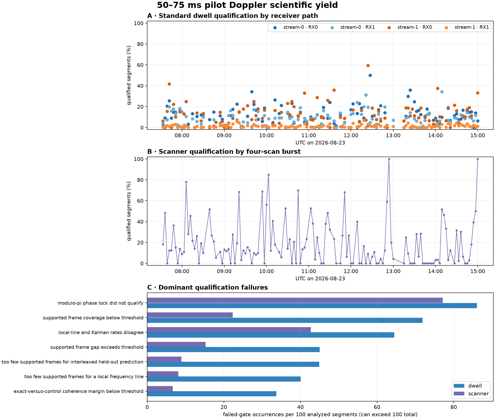
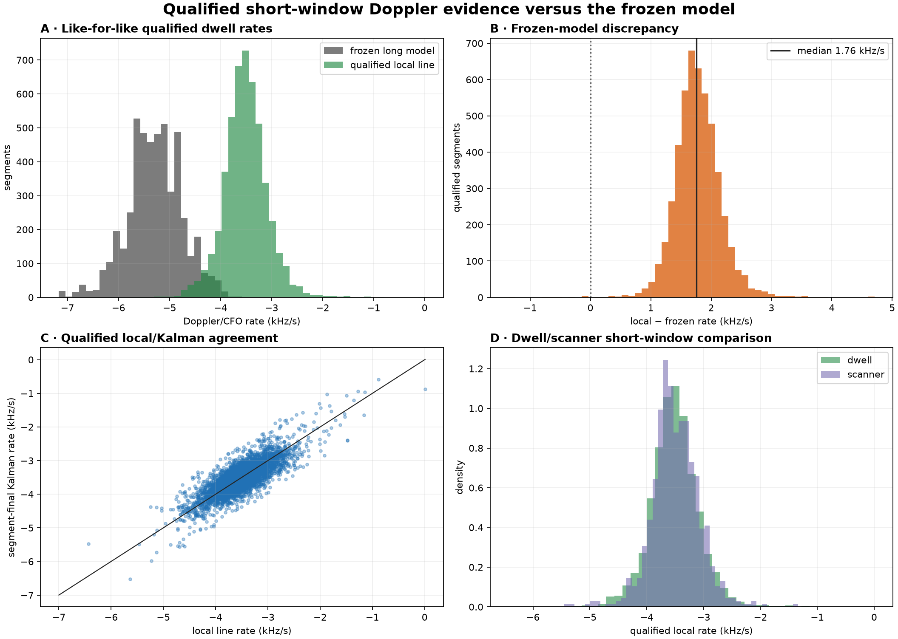
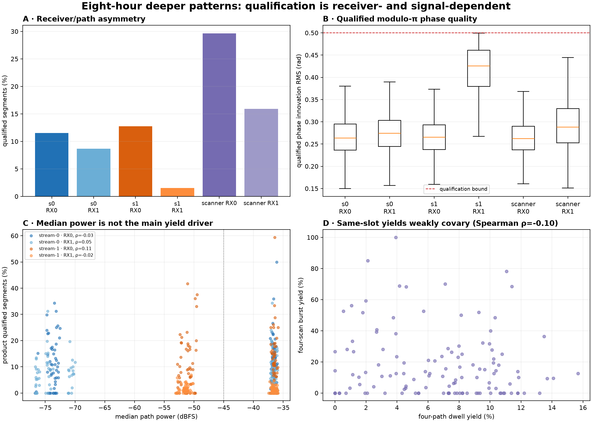
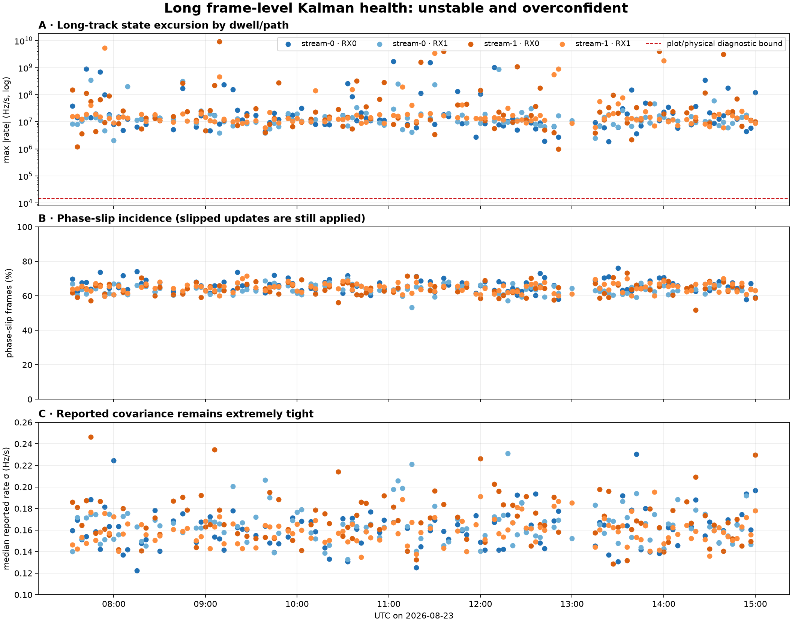

# Eight-hour dwell and scanner scientific audit

## Overview

This report independently audits production Starlink dwell and scanner analysis scheduled in the fixed half-open window **2026-08-23 07:03:41–15:03:41 UTC**. It asks whether the new 50–75 ms known-pilot analysis yields repeatable carrier phase and Doppler-rate evidence, where it fails, and what can truthfully be inferred.

The short answer is encouraging but bounded:

- The **qualified short-window estimator works**. Across sealed Standard dwells it produced 4,894 qualified 75 ms segments. Their median held-out frequency-prediction RMS was 23.24 Hz, and the median absolute difference between the local frequency-line slope and the segment-final Kalman slope was 168.37 Hz/s.
- The **frozen long model does not represent the accepted local slope**. The median qualified local rate was -3.520 kHz/s, versus -5.281 kHz/s for the frozen model. Local minus frozen was positive in 4,886 of 4,894 accepted segments (99.84%), with a median discrepancy of +1.756 kHz/s, or 11.93 times the segment's reported local-slope uncertainty.
- The **long frame-level Kalman product is not scientifically usable**. In Standard products, 65.65% of 7,551,587 frames were marked as phase slips, every one of those updates was nevertheless applied, 53.82% of frame rates exceeded the 15 kHz/s diagnostic bound, and the largest absolute state was 9.25 GHz/s while the median reported rate sigma was only 0.162 Hz/s.
- Yield is **strongly receiver/path dependent**. `stream-1 / RX1` qualified 1.53% of analyzed Standard segments, versus 8.69–12.78% on the other paths. Its accepted phase-innovation RMS, held-out error, and local/Kalman disagreement were also materially worse. Scanner RX1 was likewise weaker than RX0, but the four positions within a scan burst were nearly indistinguishable.
- Scanner and dwell results support the same receiver-relative rate family but are **not interchangeable observations**. Qualified median local rates were -3.520 kHz/s for Standard dwell and -3.520 kHz/s for scanner, yet same-slot qualification yields had Spearman rho -0.10. They sample different target selections and should not be treated as repeated observations of one emitter.

These are receiver-relative CFO/Doppler-rate measurements. Without same-emitter association, dual-receiver common-mode separation, receiver-clock calibration, and TLE agreement, they do **not** establish satellite range, range rate, range acceleration, orbit, or distance change.

## Population and provenance

The time boundary is applied to `acquisition_operation.scheduled_for`, not product creation time. The product census closed at 15:37 UTC, after every in-window dwell analysis had sealed. A successful capture is assigned to exactly one analysis lane. Standard and Research are mutually exclusive lane assignments; Research is not a second analysis of the same Standard dwell.

| Population | Intended/acquired | Analysis outcome included here | Scientific products |
| --- | ---: | ---: | ---: |
| scheduled dwell | 160 intents; 136 captures; 24 coalesced before capture | Standard: 122 succeeded, 2 failed; Research: 10 succeeded, 2 failed | Standard: 16,348 products; Research: 1,340 products |
| scanner | 136 intents; 135 completed bursts; the 15:03 boundary intent remained pending when capture was operator-paused | 540 completed per-position V3 bundles | 4,320 hashed bundle artifacts, including 2,700 PNGs |

Every persisted Standard and Research run in the window records release `88a5bc8b855f6e1f4edfbb8f627ad525e4ad3f77`. Scanner bundles record immutable analysis ID `standard-scan-analysis-pilot-plots-v1`, V3 manifest schema, and the input-manifest digest, but **do not persist a pipeline release ID**. Their deployment-time association with `88a5bc…` is therefore operational context, not self-contained product provenance.

The 24 coalesced dwell intents and the associated absent scanner intents matter scientifically: the products are a production-availability sample, not a uniformly complete eight-hour time series. The early part of the window has no completed acquisition until 07:33 UTC, and later Research pressure also creates holes.

## Approach

The audit is read-only. It joins acquisition operations to capture sessions and immutable analysis runs in PostgreSQL, then reads persisted products from `/srv/bulk/leo`. It does not reprocess a dwell, schedule work, or mutate the QNAP corpus.

For each sealed lane, it separately counts:

1. typed pilot-segment status and generic registry status;
2. analyzed and qualified 50–75 ms segments;
3. local line, segment-final Kalman, and frozen-model rates;
4. local-line uncertainty and held-out frequency prediction;
5. modulo-pi phase innovation, ambiguity-bit transitions, coverage, gaps, and bias changes;
6. long frame-level Kalman slips, out-of-bound rate states, covariance, and bytes;
7. receiver/path, scan receiver, scan position, time, and input-quality patterns.

All 540 sealed scanner bundles had their eight declared artifacts located and SHA-256 checked; there were zero missing or mismatched artifacts. Generic `analysis_product.status` is never substituted for the typed scientific status inside the Doppler-segment payload. The pending 15:03 scanner intent has no raw bundle or analysis product and is excluded from the scientific denominator. At 15:14 UTC capture control was operator-paused, so the audit did not resume capture merely to force that intent to terminal state.

## Results

### 1. Qualification is intermittent, but accepted segments are predictive

| Lane | Analyzed segments | Qualified | Segment yield | Products with at least one qualified segment |
| --- | ---: | ---: | ---: | ---: |
| Standard dwell | 66,294 | 4,894 | 7.38% | 375 / 488 path products (76.84%) |
| Research dwell | 5,467 | 384 | 7.02% | 28 / 40 path products (70.00%) |
| scanner | 3,516 | 747 | 21.25% | 285 / 540 bundles (52.78%) |

Scanner's higher segment yield is not evidence that it is intrinsically more accurate. It analyzes short, retuned candidate windows with a different candidate population. At product level, a scanner bundle is actually more likely than a Standard path product to have no qualified segment.

For accepted Standard segments:

- duration was 75.000 ms throughout;
- supported-frame fraction had median 1.00 and p10 0.80;
- local line RMS had path medians 20.8–32.4 Hz;
- held-out RMS had overall median 23.24 Hz, p10 15.30 Hz, p90 34.66 Hz, and maximum 73.82 Hz;
- absolute local versus segment-Kalman rate difference had median 168.37 Hz/s and p90 439.95 Hz/s.

Scanner accepted segments give the same result family: median held-out RMS 22.62 Hz and median absolute local/Kalman difference 177.66 Hz/s. This is the most useful validation in the present products: the line slope predicts observations that were not used to fit it, over the intended 50–75 ms coherence interval.

The dominant Standard failures were phase lock (57,055 occurrences; 86.1 per 100 analyzed segments), coverage (71.9 per 100), and local/Kalman disagreement (64.5 per 100). Held-out prediction and fitted-line RMS gates failed only 0.18 and 0.55 times per 100 segments, respectively. Thus most rejected segments never reach a credible dense line; once the dense line is established, its short-horizon predictive error is usually good.

### 2. The local and segment-Kalman slopes agree; the frozen slope is a different process

| Qualified statistic | Standard | Research | scanner |
| --- | ---: | ---: | ---: |
| local rate median | -3.520 kHz/s | -3.628 kHz/s | -3.520 kHz/s |
| local rate p10–p90 | -3.998 to -3.015 kHz/s | -3.974 to -3.170 kHz/s | -3.935 to -2.998 kHz/s |
| segment-final Kalman median | -3.516 kHz/s | -3.618 kHz/s | -3.526 kHz/s |
| local slope sigma median | 149.6 Hz/s | 146.6 Hz/s | 135.6 Hz/s |
| held-out frequency RMS median | 23.24 Hz | 23.19 Hz | 22.62 Hz |

Standard's qualified frozen rate has median -5.281 kHz/s. The local-minus-frozen distribution has median +1.756 kHz/s and p10–p90 +1.353 to +2.213 kHz/s. Only eight accepted segments have the opposite sign. The discrepancy is not explained by ordinary local-fit uncertainty: its median magnitude is 11.93 local-slope sigmas.

The local and scanner hourly medians remain in a fairly narrow receiver-relative family despite intermittent yield: full Standard hours range from about -3.34 to -3.66 kHz/s; scanner hourly medians range from about -3.39 to -3.66 kHz/s after excluding the one-segment 15:00 boundary bin. This cross-mode similarity is useful repeatability evidence, but it also raises the possibility of a strong common receiver/reference contribution. It is not independent validation of satellite dynamics.

The segment product's piecewise carrier-bias state is doing real work. Among 4,525 accepted Standard segments for which a previous same-track segment exists, the bias change has median -20.5 Hz, p10 -92.1 Hz, and p90 +58.4 Hz; 494 changes (10.9%) exceed 100 Hz in magnitude. `stream-1 / RX1` has 17.8% above 100 Hz, versus about 9.5% on the other paths. A continuous physical rate plus a separate piecewise carrier-bias state is therefore more faithful than forcing the frozen carrier track through each discontinuity.

### 3. “Phase coherent” means modulo-pi coherent inside one segment

Each 75 ms segment starts a new five-state tracker. It follows the complete 750 Hz frame lattice within that window, so a normal segment contains 55 or 56 approximately 1.333 ms frame epochs. Phase is observed only modulo π because the known pilot vector has a binary sign ambiguity.

For qualified Standard segments the phase-innovation RMS median is 0.273 rad, versus 0.765 rad for unqualified segments. Scanner gives 0.271 versus 0.823 rad. This is strong separation at the configured 0.50 rad phase-lock threshold.

The ambiguity bit changes frequently even in good segments: the median is 26 transitions in a qualified Standard segment and 25 in a qualified scanner segment. These are **not 26 physical phase resets**. They are changes in which of the two π-separated observation branches represents the same modulo-π phase. Coherence is carried by the wrapped innovation and accepted phase updates. Conversely, the present product does not preserve absolute carrier phase between independently initialized segment windows, so it cannot claim coherent phase across a gap or from one segment to the next.

### 4. The receiver/path deficit is real and not a scan-position warm-up effect

| Source | Segment yield | Qualified phase RMS median | Held-out RMS median | Absolute local/Kalman difference median |
| --- | ---: | ---: | ---: | ---: |
| `stream-0 / RX0` | 11.52% | 0.264 rad | 21.87 Hz | 148 Hz/s |
| `stream-0 / RX1` | 8.69% | 0.274 rad | 23.71 Hz | 176 Hz/s |
| `stream-1 / RX0` | 12.78% | 0.265 rad | 22.28 Hz | 157 Hz/s |
| `stream-1 / RX1` | 1.53% | 0.426 rad | 33.70 Hz | 425 Hz/s |
| scanner RX0 | 29.64% | 0.262 rad | 21.14 Hz | 155 Hz/s |
| scanner RX1 | 15.93% | 0.288 rad | 25.31 Hz | 223 Hz/s |

`stream-1 / RX1` is not merely producing fewer candidates. Its accepted tail is much closer to the phase threshold and has worse held-out and local/Kalman agreement. That points to a path-specific measurement-quality or calibration problem deserving targeted diagnosis.

The four scanner positions argue against a sequential warm-up explanation. Their aggregate segment yields are 21.22%, 20.69%, 20.76%, and 22.32%; their qualified held-out medians are 22.85, 22.79, 22.05, and 22.31 Hz. Zero-qualified bundle counts are likewise similar (62, 66, 68, 59).

All 488 Standard input-quality paths and 40 sealed Research paths had coverage 1.0, zero missing samples, no constant IQ, and zero clipped-complex fraction. Median path power has almost no monotonic relation to per-product qualification yield (pathwise Spearman rho -0.03 to +0.11). This rules out missing samples, clipping, constant IQ, and gross median-power loss as the primary explanation. It does not rule out in-band pilot SNR, interference, timing calibration, or trajectory-selection differences.

Across 122 same-slot completed dwell/scanner pairs, aggregate yields have Spearman rho -0.10. Thirty-three pairs have positive dwell yield but zero scanner yield, while only two have zero dwell yield and positive scanner yield. The modes are therefore finding largely different usable opportunities. Cross-path dwell yields correlate only weakly to moderately (rho 0.26–0.59), consistent with a mixture of shared signal conditions and path-local effects.

### 5. The long frame-level Kalman state is unstable and overconfident

| Long-product diagnostic | Standard | Research |
| --- | ---: | ---: |
| frames | 7,551,587 | 706,678 |
| phase-slip fraction | 65.65% | 66.14% |
| declared slips whose updates were applied | 100% | 100% |
| absolute rate over 15 kHz/s | 53.82% | 54.31% |
| maximum absolute rate | 9.25 GHz/s | 214.79 MHz/s |
| median path/track rate sigma | 0.162 Hz/s | 0.165 Hz/s |

The combination of extreme state excursions, a majority of frames outside the diagnostic bound, and sub-Hz/s covariance is textbook filter inconsistency. These frame-level rates must not be averaged, converted to range acceleration, or used to calibrate the short-window estimator. The short segment tracker is separately initialized, bootstraps its rate from supported frames, applies explicit gates, and is validated by held-out prediction; its qualified final state is the defensible product today.

The scanner frame observations expose a smaller semantics problem rather than the same post-bootstrap instability. Of 177,083 persisted scanner frames, 6,467 have an absolute tracked rate above 15 kHz/s, and all occur before the inferred twelfth supported frame where rate bootstrapping completes. None occur after bootstrap. There are 660 such early frames inside otherwise qualified segments. The immutable V1 scanner frame schema does not persist `doppler_rate_bootstrapped` or its uncertainty, so plots can visually overstate the meaning of early orange rate points. Segment-final qualified rates remain bounded (-5.453 to -1.336 kHz/s).

## Failures and issues

### P0 — Residual-Hough overlap can fail an entire run

Three captured dwells failed with the same exception:

- Research `cap-20260823T081200-e63228b11f55`, `stream-1 / RX1`;
- Standard `cap-20260823T091503-ae0acd1df7cd`, `stream-0 / RX0`;
- Standard `cap-20260823T093000-8c791df0895a`, `stream-0 / RX1`.

The exact error is `ValueError: exclusive residual-Hough proposal has fewer than two points`. One path failure triggers run fail-fast cancellation, so no scientific products are published for the other paths. This affected 3 of 136 captured dwells (2.21%). The exclusive proposal code must handle overlapping proposals after prior points have been removed, and needs an overlapping-proposal regression fixture.

### P0 — Dense Kalman observations can violate lattice ordering

Research `cap-20260823T112531-8460cc6f3fd7`, `stream-0 / RX0`, failed immutable `KalmanTrajectoryTrackV1` validation: `Kalman frames must be unique and ordered`. Dense neighboring frame bins can have measured correlation centers whose time order crosses their lattice-index order. The fix should preserve canonical causal lattice order and explicitly coalesce or reject crossed observations before filtering; merely sorting the serialized output would conceal a non-causal update sequence.

### P0 — Long Kalman slip handling and covariance are unsafe

The long-product evidence above is systematic across both lanes and all paths. A slip flag currently does not prevent the update that caused it, while the covariance remains implausibly tight. Until the filter is redesigned and calibrated on golden sequences, the long-frame rate should be quarantined from scientific summaries and its large per-run payload should be replaced by bounded diagnostics.

### P1 — `stream-1 / RX1` has a persistent scientific-quality deficit

This is visible in yield, phase RMS, held-out prediction, local/Kalman agreement, and inter-segment bias changes. Raw completeness and median power do not explain it. The next experiment should compare the two receivers on a demonstrably common emitter and inspect path timing, pilot vector orientation/sign convention, coherence margin, and frequency residuals before changing gates.

### P1 — Frozen-model discrepancy is systematic

The accepted local/frozen difference is positive in 99.84% of Standard segments and is almost twelve reported local-fit sigmas at the median. Summaries should present the qualified local/segment-Kalman rate as the short-window measurement and retain frozen rate only as a baseline-discrepancy diagnostic. A frozen track crossing piecewise carrier biases should never be labeled “true Doppler.”

### P1 — Isolated Python analyzers crash nondeterministically

Three `path-standard` attempts exited without a receipt and were automatically retried: Standard `cap-20260823T075100-6cb9ff7b57f6`, Research `cap-20260823T082400-4636467359eb`, and Research `cap-20260823T150300-92ac23cd745f`. The kernel recorded one Python 3.14 segmentation fault and two general-protection faults in `ThreadPoolExecu`. All three second attempts succeeded, so this did not reduce the sealed product population, but it added latency and duplicated heavy analysis work. It is a recurrent runtime defect rather than a scientific rejection and should be investigated with retained crash metadata, interpreter/native-library versions, and a reproduction under the deployed release.

### P2 — Scanner frame bootstrap and provenance are underspecified

Scanner V1 does not mark pre-bootstrap frame states or persist per-frame uncertainty, and the V3 bundle manifest does not persist the deployed pipeline release. A replacement contract should add bootstrap state and sigma, while a future manifest version should include release/config identifiers. Published V1/V3 contracts should remain immutable.

### P2 — Generic registry status is not scientific status

For the 488 Standard pilot products, typed status is 363 `complete`, 12 `partial`, 69 `insufficient_data`, and 44 `no_result`. The 40 Research products are 27 `complete`, 1 `partial`, 4 `insufficient_data`, and 8 `no_result`; the 540 scanner products are 13 `complete`, 272 `partial`, 227 `insufficient_data`, and 28 `no_result`. Yet 169 typed-complete Standard products are registered as `partial_coverage`, and 60 typed-insufficient products are registered as `complete`. The registry describes generic product availability/coverage; UI and monitoring must read the typed payload status for scientific conclusions.

## Interpretation boundary

For a carrier frequency \(f_c\), a physically associated Doppler rate could be related to line-of-sight range acceleration by \(\ddot\rho \approx -c\dot f/f_c\). Applying that equation here would be premature. The measured slope may contain satellite motion, satellite oscillator/control action, receiver reference drift, retune effects, and piecewise carrier bias. The striking agreement of dwell and scanner median slopes may represent repeatability, a common instrument term, or both.

Promotion to range dynamics requires all of the following:

1. associate each segment to one emitter/satellite across time;
2. compare simultaneous receiver paths and remove a demonstrated common receiver/reference term;
3. preserve coherent phase or a defensible bias model across segment boundaries;
4. compare measured CFO and rate against TLE-predicted sign and magnitude;
5. show held-out prediction beyond the fitting window and calibrated uncertainty;
6. repeat on independent passes and releases.

Until then, the truthful label is **receiver-relative short-window carrier/CFO rate**.

## Recommended next checkpoints

1. Fix the two run-fatal invariants and add overlapping-Hough and crossed-lattice-order regression tests.
2. Quarantine long Kalman frame rates from scientific panels; retain slip/outlier/calibration health metrics.
3. Make the qualified segment product the primary scientific rate source and continue monitoring held-out RMS, local/Kalman difference, phase RMS, coverage, and bias change.
4. Diagnose `stream-1 / RX1` with same-emitter dual-receiver data before loosening any qualification gate.
5. Add scanner bootstrap/uncertainty semantics in a replacement version and release provenance in the next manifest version.
6. Monitor product-level zero-yield fraction in addition to aggregate segment yield; aggregate yield alone hides intermittent complete failures.
7. Add a paired common-mode/TLE experiment as an explicit promotion gate for range/range-acceleration claims.

## Evidence inventory

Machine-readable evidence is under [`figures/2026_08_23_eight_hour_science_agent/`](figures/2026_08_23_eight_hour_science_agent/):

- `facts.json` — bounded aggregate census;
- `derived-scientific-stats.json` — receiver, phase, bias, correlation, and hourly derived statistics;
- `dwell-pilot-segments.csv.gz`, `research-pilot-segments.csv.gz`, `scanner-pilot-segments.csv.gz` — compressed segment-level observations;
- `dwell-path-yield.csv`, `research-path-yield.csv`, `scanner-bundle-yield.csv` — product-level yield;
- `dwell-long-kalman-health.csv`, `research-long-kalman-health.csv` — path/product Kalman health;
- `dwell-input-quality.csv`, `dwell-input-power.csv` — raw-input checks;
- `standard-runs.csv`, `research-runs.csv`, `standard-products.csv.gz`, `research-products.csv.gz` — persisted run/product census;
- `runtime-retry-incidents.csv` — the three recovered isolated-analyzer crashes;
- `scanner-artifacts.csv.gz` and `scanner-png-inventory.tsv.gz` — declared scanner artifacts and hashes.

The evidence directory also contains operational and inventory tables inherited from the bounded extractor. Monitor snapshots begin at 09:14 UTC, not at the eight-hour report boundary, so this report does not use them to claim continuous host/service health over 07:03–09:14.
