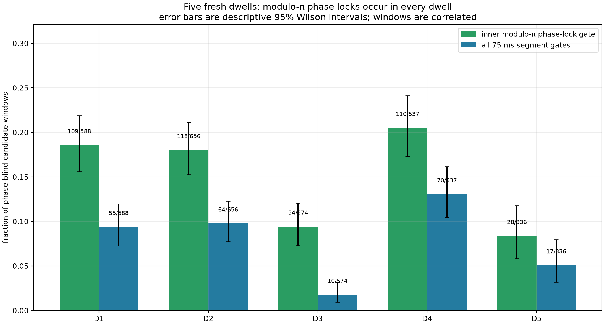
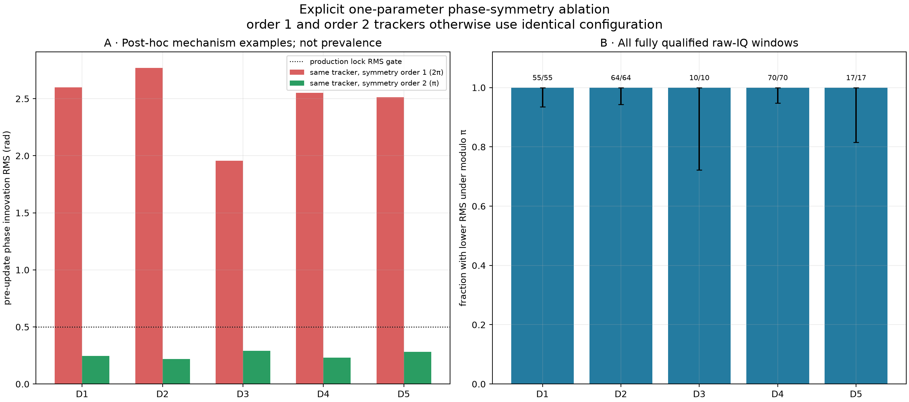

# Five-dwell audit of `modulo-π-qualified`

**Date:** 2026-08-23 UTC

**Scope:** five historical 60 s dwells, four receiver paths per dwell, freshly rerun with sealed Standard release `e71412cf7ff716e7a25dd846fc926f0b80dd9b12`

**Result:** every dwell contains independently gated, exact-known-pilot windows that pass the production modulo-π phase-lock gate and the stricter full 75 ms segment gate. Across all 216 fully qualified windows, the explicit order-1/order-2 raw-IQ ablation lowers phase-innovation RMS in 216 (100.0%). Conditional on those modulo-π-selected windows, this confirms that π-periodic phase is operationally consistent and avoids the ordinary 2π reset storm. The direction of the RMS change is not, by itself, an unbiased model-selection test because the quotient has a shorter wrap interval and the population was selected with a modulo-π gate. It does **not** show that Starlink intentionally resets phase, changes RF frequency every 50–75 ms, or identify any satellite.

## What the term means

The known-pilot channel observation is treated as equivalent under

\[\phi \equiv \phi + \pi.\]

For every supported frame the tracker therefore uses the pre-update innovation wrapped into `[-π/2, +π/2)`. `modulo-π-qualified` means the window passed three inner gates: at least 20 supported frames, phase updates on at least 80% of those frames, and pre-update modulo-π innovation RMS no greater than 0.50 rad. A production segment is `qualified` only if it also passes support coverage/gap, exact-versus-rolled-pilot coherence, local line RMS, interleaved holdout RMS, and local-versus-Kalman rate-agreement gates.

The π branch index is an analyzer representation. A transition in that index is **not** evidence of a physical phase reset, and no transition count is used to select or qualify the population result.

## Phase-blind population result

Candidate windows were fixed by the sealed track/probe geometry before this audit looked at phase continuity. The table includes every analyzed 75 ms window on all four paths.

| Dwell | Fresh sealed run | Windows | Inner phase lock | 95% Wilson | Full qualified | 95% Wilson |
|---|---|---:|---:|---:|---:|---:|
| D1 | `reprocess-b8f39f61f17d43d6a4720324f4aebc45` | 588 | 109 (18.5%) | 15.6%–21.9% | 55 (9.4%) | 7.3%–12.0% |
| D2 | `reprocess-e149d494252c4265b4010b7ce85bd4c7` | 656 | 118 (18.0%) | 15.2%–21.1% | 64 (9.8%) | 7.7%–12.3% |
| D3 | `reprocess-586820308a34449e891c196dc3177aa1` | 574 | 54 (9.4%) | 7.3%–12.1% | 10 (1.7%) | 0.9%–3.2% |
| D4 | `reprocess-338bc961078a40fda6de2b7efcf49b98` | 537 | 110 (20.5%) | 17.3%–24.1% | 70 (13.0%) | 10.4%–16.1% |
| D5 | `reprocess-67959c6a6df5470e8f9ef6d06eacd9a3` | 336 | 28 (8.3%) | 5.8%–11.8% | 17 (5.1%) | 3.2%–8.0% |

Across the five dwells: 2691 windows, 419 inner locks, and 216 fully qualified segments. The Wilson intervals treat windows as independent and are therefore descriptive and likely too narrow because windows from one track/dwell are correlated. The stronger replication statement is simply five of five dwells with nonzero full-qualified yield; five dwells are still a small cohort.

## Clean symmetry ablation on measured IQ

Every fully qualified window was reopened through a digest-verifying IQ reader. The same phase tracker was then run twice with identical settings except `phase_symmetry_order=1` (ordinary 2π) versus `phase_symmetry_order=2` (modulo π). The production five-state modulo-π tracker was separately rerun and required to reproduce its sealed counts, Boolean lock result, and innovation RMS.

| Dwell | Raw windows | π lowers RMS | Median 2π RMS | Median π RMS | Median reduction | 2π resets | π resets |
|---|---:|---:|---:|---:|---:|---:|---:|
| D1 | 55 | 55 (100.0%) | 1.902 rad | 0.378 rad | +1.385 rad | 721 | 22 |
| D2 | 64 | 64 (100.0%) | 1.951 rad | 0.321 rad | +1.544 rad | 762 | 13 |
| D3 | 10 | 10 (100.0%) | 1.867 rad | 0.437 rad | +1.204 rad | 168 | 7 |
| D4 | 70 | 70 (100.0%) | 1.270 rad | 0.413 rad | +0.764 rad | 566 | 30 |
| D5 | 17 | 17 (100.0%) | 1.935 rad | 0.372 rad | +1.577 rad | 250 | 0 |

This is a controlled operational ablation of the π representation, distinct from merely observing a good known-pilot match: the order-1/order-2 pair differs in exactly the declared rotational symmetry. It is **not** neutral discovery evidence for the symmetry order. Wrapping onto a shorter quotient tends to reduce angular residuals, and these windows already passed a modulo-π gate. The useful result is that the same π model remains causal, reproduces the sealed gates in all five dwells, avoids hundreds of ordinary resets, rejects the matched rolled pilot, and agrees with independent local-frequency checks. This audit does not test whether an even finer symmetry such as π/2 could lower residuals further. The rolled-pilot negative control is applied below to one mechanism example per dwell.

### Correction to the older PNT report helper

The current checked-in `tools/report_pilot_pnt_kalman.py` labels one comparison `ordinary 2π` but calls `PilotPhaseDopplerTrackingConfig()` without overriding its current default `phase_symmetry_order=2`. A new rerun of that helper would therefore not be a valid 2π ablation. This report does not reuse that label or its comparison output: it constructs explicit order-1 and order-2 configurations and records both complete configurations in JSON. The older checked-in artifact may reflect code at its original generation time, but the present helper cannot establish that provenance by itself.

## How each dwell supports—or limits—the finding

The plotted example in each dwell is the fully qualified window with the largest order-1 minus order-2 RMS reduction. That is a disclosed post-hoc mechanism selection; the all-window table above, not these five examples, estimates prevalence.

| Dwell | Path / start | Frames / updates | 2π RMS | π RMS | Paired block-bootstrap 95% reduction | Rolled support | Line / holdout RMS | Rate ± formal 1σ |
|---|---|---:|---:|---:|---:|---:|---:|---:|
| D1 | stream-0/RX0/upper / 22.900 s | 47 / 47 | 2.600 | 0.245 | +2.111 to +2.586 rad | 0/47 | 21.6 / 22.7 Hz | -3976 ± 174 Hz/s |
| D2 | stream-1/RX0/upper / 14.175 s | 56 / 56 | 2.771 | 0.218 | +2.411 to +2.678 rad | 0/56 | 27.6 / 27.7 Hz | -3996 ± 171 Hz/s |
| D3 | stream-0/RX1/upper / 20.050 s | 55 / 48 | 1.958 | 0.292 | +1.431 to +1.875 rad | 0/55 | 27.2 / 28.2 Hz | -3112 ± 173 Hz/s |
| D4 | stream-0/RX1/lower / 6.125 s | 46 / 46 | 2.551 | 0.231 | +2.073 to +2.526 rad | 0/46 | 19.1 / 21.1 Hz | -3338 ± 159 Hz/s |
| D5 | stream-1/RX0/upper / 14.500 s | 56 / 56 | 2.511 | 0.283 | +2.123 to +2.329 rad | 0/56 | 12.3 / 12.6 Hz | -3325 ± 77 Hz/s |

### D1 — `cap-20260821T201522-841b2a20e151`

This dwell contributes 55 full segments. In the raw-IQ corpus ablation, modulo π lowers RMS in 55/55 full-qualified windows. The showcased window retains 47/47 phase updates, its rolled control supports 0 frames, and its independent local CFO line has 21.6 Hz fit RMS with 22.7 Hz interleaved holdout RMS. This supports a local known-pilot phase lock with π-periodic representation; it does not resolve absolute sign or transmitter intent.

### D2 — `cap-20260821T193701-87f96f47e73f`

This dwell contributes 64 full segments. In the raw-IQ corpus ablation, modulo π lowers RMS in 64/64 full-qualified windows. The showcased window retains 56/56 phase updates, its rolled control supports 0 frames, and its independent local CFO line has 27.6 Hz fit RMS with 27.7 Hz interleaved holdout RMS. This supports a local known-pilot phase lock with π-periodic representation; it does not resolve absolute sign or transmitter intent.

### D3 — `cap-20260821T193440-17c2e0ebef6a`

This dwell contributes 10 full segments. In the raw-IQ corpus ablation, modulo π lowers RMS in 10/10 full-qualified windows. The showcased window retains 48/55 phase updates, its rolled control supports 0 frames, and its independent local CFO line has 27.2 Hz fit RMS with 28.2 Hz interleaved holdout RMS. This supports a local known-pilot phase lock with π-periodic representation; it does not resolve absolute sign or transmitter intent.

### D4 — `cap-20260821T190912-ffd441556880`

This dwell contributes 70 full segments. In the raw-IQ corpus ablation, modulo π lowers RMS in 70/70 full-qualified windows. The showcased window retains 46/46 phase updates, its rolled control supports 0 frames, and its independent local CFO line has 19.1 Hz fit RMS with 21.1 Hz interleaved holdout RMS. This supports a local known-pilot phase lock with π-periodic representation; it does not resolve absolute sign or transmitter intent.

### D5 — `cap-20260821T190701-7a5d980ec1c6`

This dwell contributes 17 full segments. In the raw-IQ corpus ablation, modulo π lowers RMS in 17/17 full-qualified windows. The showcased window retains 56/56 phase updates, its rolled control supports 0 frames, and its independent local CFO line has 12.3 Hz fit RMS with 12.6 Hz interleaved holdout RMS. This supports a local known-pilot phase lock with π-periodic representation; it does not resolve absolute sign or transmitter intent.

## Competing hypotheses

| Hypothesis | Prediction | Result | Disposition |
|---|---|---|---|
| Accidental/noise match | Exact and 17-symbol-rolled templates should support similar frames | Exact production pilots support 260 showcase frames; rolled control supports 0/260 | Disfavored for these five examples; this is a matched control, not a universal false-alarm calibration |
| Ordinary 2π phase is sufficient | Symmetry order 2 should not systematically reduce innovations | π lowers RMS in 216/216 full-qualified windows across all five dwells | Disfavored as the general representation |
| π-periodic phase is the observable | Order 2 improves continuity while production gates remain causal | Seen in every dwell, with sealed production results exactly reproduced | Supported for these receiver-relative pilot channel observations |
| π-branch transitions are transmitter resets | Branch count should directly encode physical reset events | Branch choice depends on modulo representation and is not used as evidence | Not supported |
| 75 ms windows are Starlink transmission slots | Qualification boundaries should be signal-defined | Boundaries are analyzer windows seeded from persisted probes | Rejected as an inference from this audit |
| A specific Starlink satellite produced a window | TLE geometry should uniquely fit the track | No TLE or sky model enters this report | Untested; no identity claim |

## Error and limitation accounting

1. **Reproduction error:** 216/216 sealed full-qualified windows were rerun from verified IQ. The maximum absolute reproduced innovation-RMS difference was 2.22e-12 rad; count and Boolean-lock disagreements were zero.
2. **Population sampling error:** per-dwell Wilson intervals are shown, but within-dwell correlation makes them anti-conservative. The independent experimental unit is closer to a dwell than a window, and only five dwells were reviewed.
3. **Mechanism-example error:** each paired 95% interval uses 4000 circular four-frame block bootstrap replicates. It is conditional on the selected window and does not include post-selection uncertainty, so it is explanatory rather than a prevalence interval.
4. **Pilot-specificity error:** the five showcase rolled controls yielded 0/260 supported frames; the descriptive Wilson 95% upper bound is 1.5%. This does not replace a broad off-template/off-time false-alarm campaign.
5. **Frequency/rate error:** each showcase reports direct in-sample line RMS, interleaved held-out RMS, and the robust local slope's formal 1σ. These are conditional estimator errors, not satellite-identification uncertainties.
6. **Identity error:** satellite identity is outside this report. Its error is therefore unestimated, and `modulo-π-qualified` must not be read as `Starlink-satellite-qualified`.
7. **Model-selection error:** all 216 ablation windows were conditioned on the production modulo-π qualification gate, and a shorter angular quotient naturally cannot be judged solely by lower wrapped RMS. The ablation establishes operational consistency and reset avoidance, not a calibrated Bayes factor for symmetry order 2 versus every possible phase model.

## Provenance and reproducibility

- Main reviewed at `292dd4dc3864334a909bc41e10884903b1d323e4`; `origin/main` matched.
- All five sealed runs use Standard release `e71412cf7ff716e7a25dd846fc926f0b80dd9b12`. The worktree's relevant radio-analysis sources were byte-diff-equivalent to that release before rerunning IQ.
- Recording manifest digests: D1 `sha256:df21f3b1ad825b1aeea53a58146da698f87f4d731b20aa60ae239a149db9c07a`, D2 `sha256:aba52834f94ccf4ad743816732aae17a5ec37995e7bb742e07489da8083894d4`, D3 `sha256:1cdf3eb897f280ee89dc48622cc541b49d03abddd87f9266afc4b4501f577864`, D4 `sha256:300e9eb30c0e8d371b80e9623ec78e99ddccd58fae61ddfb1714f53c22598b8f`, D5 `sha256:a64f17d249590714532c90c9eebf2c6d1aa4edafe69a83de7936db5137fe5132`.
- The machine-readable result includes every full-qualified raw-IQ ablation row, all artifact digests, exact configurations, showcase frame innovations, and explicit limitations: [`five-dwell-modulo-pi-results.json`](figures/2026_08_23_five_dwell_modulo_pi_qualification/five-dwell-modulo-pi-results.json).
- Reproduce with `.venv/bin/python tools/report_five_dwell_modulo_pi_qualification.py`.

## Bottom line

`modulo-π-qualified` is a bounded analyzer statement: on a verified 75 ms IQ window, the exact known-pilot channel supports causal phase updates when phase is treated as π-periodic, and (for `qualified`) the independent frequency checks also pass. Five fresh dwells reproduce that behavior. The evidence says the receiver cannot safely distinguish `φ` from `φ + π`; it does not say the satellite physically flips phase, hops frequency, or transmits only for 75 ms.
