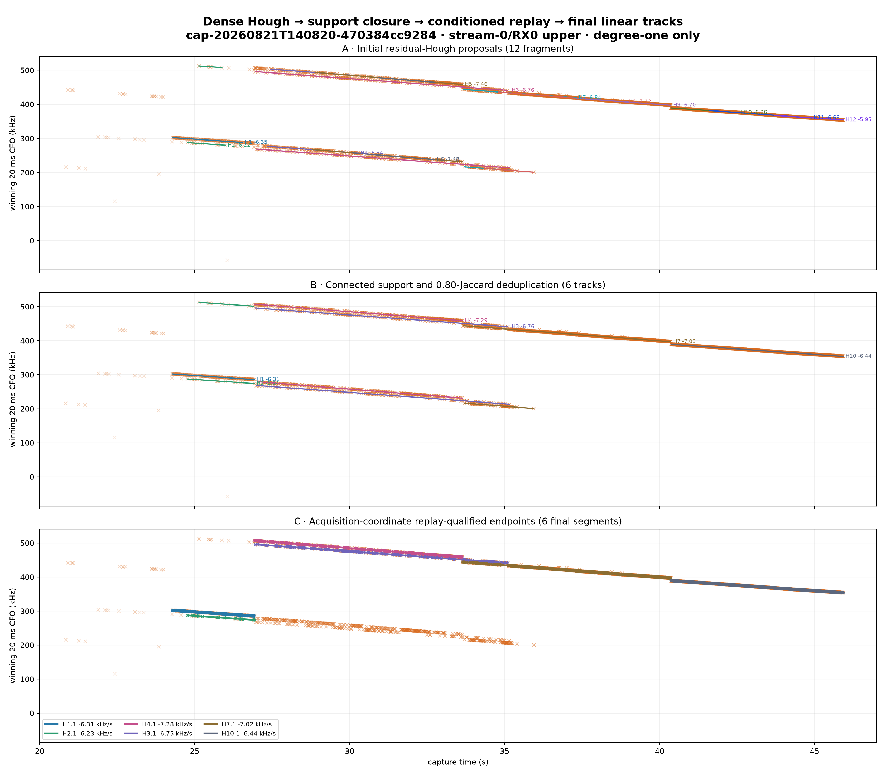
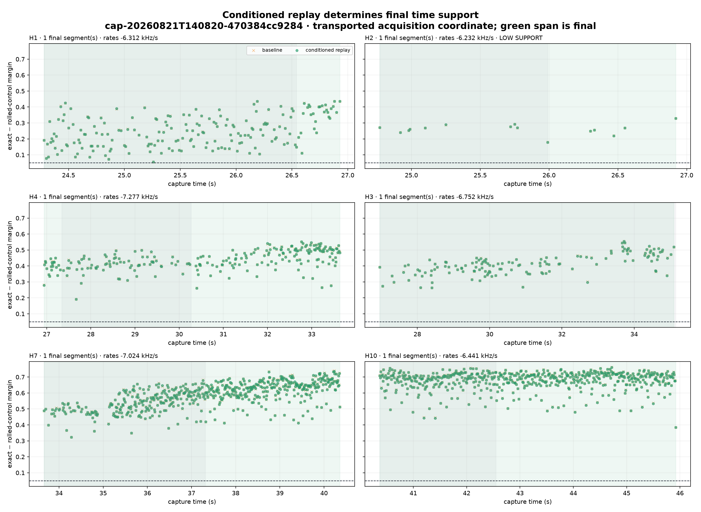
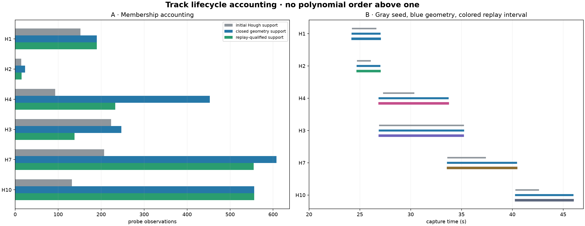

# Dense Hough downstream-analysis prototype

## Result

The updated dense Hough tracks can drive conditioned IQ replay without losing H1. The prototype keeps geometry and correction qualification separate, transports the acquisition CFO rather than the residual-adjusted tracking CFO, derives endpoints from connected replay-positive support, and refits degree-one lines only.

It reduced 12 initial Hough fragments to 6 geometry tracks and retained 6 replay-qualified final tracks. 1 of those tracks is explicitly marked low-support and should remain Research-only.

## Track results

| Track | Seed interval | Closed geometry | Final replay interval | Seed / closed / final support | Seed rate | Final rate | Alias | Current P→N | Transport P→N | Status |
|---|---:|---:|---:|---:|---:|---:|---:|---:|---:|---|
| H1 | 24.28–26.54 s | 24.28–26.93 s | 24.28–26.93 s | 152 / 190 / 190 | -6.350 kHz/s | -6.312 kHz/s | +2 | 98 | 0 | replay qualified |
| H2 | 24.77–25.99 s | 24.77–26.92 s | 24.77–26.92 s | 14 / 23 / 15 | -6.224 kHz/s | -6.232 kHz/s | +1 | 10 | 0 | replay qualified low support |
| H4 | 27.34–30.27 s | 26.94–33.64 s | 26.94–33.64 s | 93 / 453 / 233 | -6.841 kHz/s | -7.277 kHz/s | +3 | 54 | 0 | replay qualified |
| H3 | 26.96–35.15 s | 26.96–35.15 s | 26.96–35.10 s | 223 / 247 / 138 | -6.758 kHz/s | -6.752 kHz/s | +2 | 0 | 0 | replay qualified |
| H7 | 33.66–37.31 s | 33.66–40.36 s | 33.66–40.36 s | 207 / 608 / 555 | -6.840 kHz/s | -7.024 kHz/s | +2 | 0 | 0 | replay qualified |
| H10 | 40.37–42.55 s | 40.37–45.92 s | 40.37–45.92 s | 132 / 556 / 556 | -6.256 kHz/s | -6.441 kHz/s | +2 | 0 | 0 | replay qualified |

## Exact prototype rule

1. Start from independently searched 20 ms windows at 10 ms stride.
2. Fit residual-Hough straight lines, close alias-aware support using the ±2.5 kHz gate, and split after a 0.75 s geometry gap.
3. Remove no endpoint merely because its new tail spans less than 0.75 s; require eight connected compatible probes instead.
4. Deduplicate tracks at 0.80 support Jaccard without consulting replay outcome.
5. Correct IQ with each lifted line and seed conditioned GLRT at `acquired CFO − lifted line`; GLRT re-estimates its own residual.
6. Define the correction-eligible envelope from the first and last replay-positive geometric members and require 8 such probes. Preserve internal no-evidence windows as an explicit mask; absence of an associated winner is not treated as a replay failure or a phase-continuous bridge.
7. Robustly refit one Huber degree-one line to replay-positive geometric members.

## Interpretation and limits

Hough proposes geometry; replay validates use of that geometry as a correction. The integer alias is a component-relative canonical lift, not an absolute RF frequency determination. The 10 ms-stride windows overlap by 10 ms, so probe counts are support counts rather than independent statistical trials.

H2 technically passes the prototype's eight-probe replay gate, but its final support is only 15 observations. It is retained as low-support candidate evidence, not treated as equivalent to H1/H4/H3/H7/H10.

This remains a post-hoc single-path prototype. It is candidate-only, makes no satellite attribution or phase-continuity claim, and changes no Standard product.

Machine-readable results: [`hough-downstream-prototype.json`](figures/2026_08_23_full_capture_hough_downstream_prototype/hough-downstream-prototype.json)
