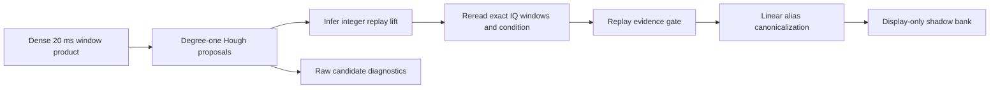
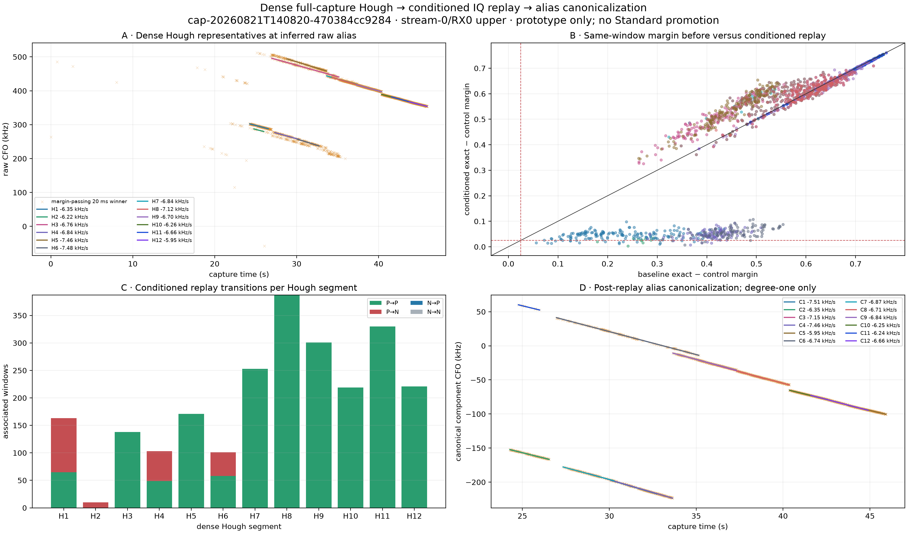

# Full-capture Hough conditioned-replay prototype

## Question

Can the dense 20 ms / 10 ms-stride Hough segments feed the existing conditioned IQ replay and then the linear alias canonicalizer?

## Answer

Yes. The numerical interfaces are compatible once replay rereads the exact dense probe starts instead of regenerating Standard's sparse 0/25 ms schedule. This prototype does that without changing a persisted contract or production output.

The experiment is candidate-only. It does not identify Starlink, select a final correction, or promote these tracks into Standard.

## Headline result

Conditioned replay preserved all previously positive associated windows for **8/12** Hough representatives and exposed harmful P→N transitions for **4/12**. **4** representatives improved their median margin by more than 0.01. The alias graph still retained 12 branches in 6 components, so alias geometry alone did not reject the harmful alternatives. This is exactly the separation of duties we want: Hough proposes; IQ replay tests; canonicalization names coordinates only after the test.

## Proposed dataflow

The dense window product and verified receiver IQ are the only inputs. The replay accounting and a post-gate canonical linear bank are separate outputs. Raw CFO, integer replay lift, and canonical CFO remain explicit coordinates; none is silently substituted for another.

## Method

1. Load the previously persisted independent full-capture window measurements.
2. Rebuild the current expanded degree-one Hough representatives.
3. Infer one integer replay lift per representative from its own support.
4. Reread the original IQ at every exact 10 ms-stride winner start covered by a segment, including sub-threshold controls.
5. Correct IQ with the lifted straight line and reacquire the pilot.
6. Score the original candidate epoch/CFO again after correction.
7. Record positive/negative replay transitions at the 0.025 margin gate.
8. Only after replay, build the alias map and robust Huber degree-one bank.

## Per-segment results

| Segment | Interval | Hough rate | Support | Replay lift | Associated | P→P | P→N | N→P | N→N | Median margin before | after | Δ | Canonical rate |
|---|---:|---:|---:|---:|---:|---:|---:|---:|---:|---:|---:|---:|---:|
| H1 | 24.28–26.54 s | -6.350 kHz/s | 152 | +2 | 163 | 65 | 98 | 0 | 0 | +0.225 | +0.048 | -0.170 | -6.350 |
| H2 | 24.77–25.99 s | -6.224 kHz/s | 14 | +1 | 10 | 0 | 10 | 0 | 0 | +0.269 | +0.027 | -0.243 | -6.236 |
| H3 | 26.96–35.15 s | -6.758 kHz/s | 223 | +2 | 138 | 138 | 0 | 0 | 0 | +0.410 | +0.498 | +0.086 | -6.740 |
| H4 | 27.34–30.27 s | -6.841 kHz/s | 93 | +2 | 103 | 49 | 54 | 0 | 0 | +0.416 | +0.048 | -0.364 | -6.871 |
| H5 | 28.81–33.64 s | -7.456 kHz/s | 226 | +3 | 171 | 171 | 0 | 0 | 0 | +0.458 | +0.544 | +0.086 | -7.461 |
| H6 | 30.09–32.73 s | -7.485 kHz/s | 70 | +2 | 101 | 58 | 43 | 0 | 0 | +0.450 | +0.055 | -0.393 | -7.510 |
| H7 | 33.66–37.31 s | -6.840 kHz/s | 207 | +2 | 253 | 253 | 0 | 0 | 0 | +0.541 | +0.592 | +0.044 | -6.842 |
| H8 | 34.34–38.92 s | -7.124 kHz/s | 110 | +2 | 387 | 387 | 0 | 0 | 0 | +0.583 | +0.606 | +0.013 | -7.150 |
| H9 | 37.33–40.36 s | -6.702 kHz/s | 239 | +2 | 301 | 301 | 0 | 0 | 0 | +0.636 | +0.635 | -0.002 | -6.705 |
| H10 | 40.37–42.55 s | -6.256 kHz/s | 132 | +2 | 219 | 219 | 0 | 0 | 0 | +0.694 | +0.693 | -0.001 | -6.246 |
| H11 | 41.60–44.89 s | -6.661 kHz/s | 260 | +2 | 330 | 330 | 0 | 0 | 0 | +0.699 | +0.697 | -0.002 | -6.661 |
| H12 | 43.72–45.92 s | -5.948 kHz/s | 132 | +2 | 221 | 221 | 0 | 0 | 0 | +0.702 | +0.700 | -0.001 | -5.950 |

## Interpretation rules

- P→P means the independently positive window remains positive after the exact candidate is conditioned by the proposed segment.
- P→N is harmful evidence: the segment correction destroys a formerly positive candidate.
- N→P is recovered evidence: the proposed segment makes a previously associated but sub-threshold candidate positive.
- In this example N→P is zero because none of the sub-threshold winners entered the tight 2.5 kHz trajectory-association gate; retaining them was still necessary to make that a measured result rather than an assumption.
- Canonical rate is still a degree-one Huber estimate. No quadratic or cubic radio model is used.
- Replay and alias identity remain separate. A good canonical grouping does not by itself prove that an absolute lift is safe for correction.

## Production integration plan

1. **Persist the dense numerical result.** Add a new versioned JSON product for window winners, Hough support, inferred replay lifts, and explicit truncation. Keep the existing PNG as a rendering of that product.
2. **Add a dedicated replay job.** Consume that JSON plus verified receiver IQ. Replay only declared dense starts with bounded batches and publish conditioned transition accounting. Do not expand the fused path job further.
3. **Canonicalize only replay-audited representatives.** Publish a separate linear dense de-aliased bank, preserving raw CFO, canonical CFO, and absolute replay lift as different coordinates.
4. **Introduce conservative gates.** Require minimum associated support and span, bounded P→N count/run, positive lower-tail conditioned margin, and stable replay lift. Begin as display-only; do not replace the current final bank.
5. **Run shadow comparisons.** On at least five completed signal dwells plus matched null controls, compare recovered support, harmful transitions, alias stability, runtime, and agreement with the existing final bank.
6. **Promote by contract version.** Only after review, add the dense replay bank as an eligible input to Kalman/phase analysis. Preserve the current Standard products and make rollback a configuration change.

## Proposed initial acceptance gates

| Gate | Initial shadow-mode rule |
|---|---|
| Model order | Exactly degree one |
| Minimum associated support | 20 windows and at least 0.75 s span |
| Harmful replay | No more than 5% P→N and no long consecutive harmful run |
| Conditioned evidence | Median conditioned margin > 0.025 and positive 10th-percentile margin delta |
| Alias stability | One modal integer lift with no contradictory component cycle |
| Controls | Must beat matched rolled-pilot and time-permuted controls after multiplicity correction |
| Promotion | Display-only until five-dwell shadow review passes |
