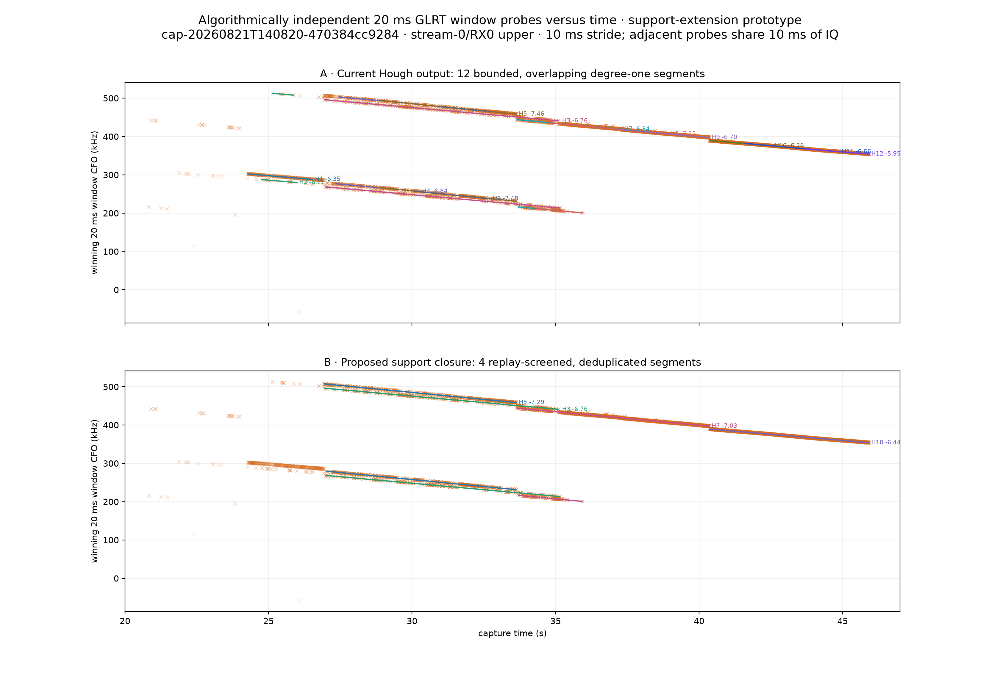
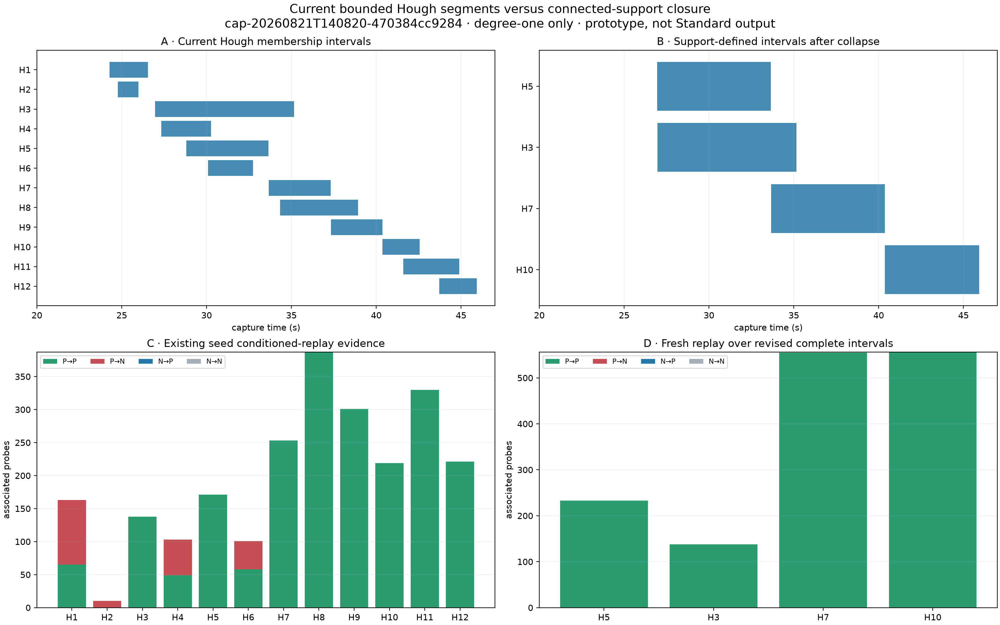

# Connected-support extension prototype

## Question

Can each degree-one Hough line be treated as mathematically unbounded, with its observed time interval derived from connected frame-probe support instead of being estimated by alias EM?

## Answer

Yes, and this capture supports the simpler approach. The deterministic closure reduced 12 bounded Hough fragments to 4 replay-screened support tracks. It uses no quadratic/cubic radio model and no time-length parameter in EM.

Three of the four retained tracks expanded in time. Fresh replay over the revised intervals produced 1482 P→P and 0 P→N associated probes. The proposed bank retains 1864 unique probe observations versus 1858 across all original Hough fragments; 1692 are shared, 172 are newly included, and 166 current members are excluded. The current Hough partition assigns those observations exclusively even though its reported time intervals overlap. Duplicate claims arise only when the candidate lines are extended, and are removed before the proposed bank is formed.

## Exact prototype rule

1. Evaluate each existing Hough degree-one line at every independently searched, margin-passing 20 ms probe. Adjacent 10 ms-stride probes share 10 ms of IQ and are therefore statistically correlated.
2. Select alias-aware inliers within the existing 2.5 kHz gate.
3. Split at the existing 0.75 s maximum gap and retain the component anchored to the seed support.
4. Permit an endpoint extension only when that side independently supplies at least eight observations across at least 0.75 s.
5. Refit one MAD-scaled Huber straight line and repeat until membership stabilizes.
6. Reject seeds that failed the existing conditioned replay screen.
7. Collapse survivors with at least 0.80 support Jaccard overlap, retaining the seed with the strongest prior replay result.
8. Rerun conditioned IQ replay over every revised complete interval.

## Selected tracks before and after

| Track | Seed interval | Revised interval | Seed rate | Revised rate | Seed support | Revised support | Fresh P→P | P→N |
|---|---:|---:|---:|---:|---:|---:|---:|---:|
| H5 | 28.81–33.64 s | 26.94–33.64 s | -7.456 kHz/s | -7.287 kHz/s | 226 | 453 | 233 | 0 |
| H3 | 26.96–35.15 s | 26.96–35.15 s | -6.758 kHz/s | -6.755 kHz/s | 223 | 247 | 138 | 0 |
| H7 | 33.66–37.31 s | 33.66–40.36 s | -6.840 kHz/s | -7.030 kHz/s | 207 | 608 | 555 | 0 |
| H10 | 40.37–42.55 s | 40.37–45.92 s | -6.256 kHz/s | -6.441 kHz/s | 132 | 556 | 556 | 0 |

## Support groups and selections

| Group | Seeds | Minimum support Jaccard | Selected | Revised interval | Rate | Support | Fresh P→P | P→N | Median Δ margin |
|---|---|---:|---|---:|---:|---:|---:|---:|---:|
| G1 | H3 | 1.000 | H3 | 26.96–35.15 s | -6.755 kHz/s | 247 | 138 | 0 | +0.086 |
| G2 | H5 | 1.000 | H5 | 26.94–33.64 s | -7.287 kHz/s | 453 | 233 | 0 | +0.087 |
| G3 | H7, H8, H9 | 0.926 | H7 | 33.66–40.36 s | -7.030 kHz/s | 608 | 555 | 0 | +0.002 |
| G4 | H10, H11, H12 | 1.000 | H10 | 40.37–45.92 s | -6.441 kHz/s | 556 | 556 | 0 | -0.002 |

## Rejected seeds

| Seed | Interval | Prior associated | Prior P→N | Reason |
|---|---:|---:|---:|---|
| H1 | 24.28–26.54 s | 163 | 98 | failed the conservative seed replay screen |
| H2 | 24.77–25.99 s | 10 | 10 | failed the conservative seed replay screen |
| H4 | 27.34–30.27 s | 103 | 54 | failed the conservative seed replay screen |
| H6 | 30.09–32.73 s | 101 | 43 | failed the conservative seed replay screen |

## Interpretation

The original endpoints are properties of Hough proposal membership, not evidence that the radio signal begins or ends at those times. Connected support supplies a simpler interval definition. Deduplication is mandatory: without it, several nearby lines claim nearly identical probes after extension.

This remains a post-hoc, single-capture prototype. It is candidate-only, makes no satellite attribution, changes no Standard product, and requires multi-dwell plus matched-null validation before promotion.
