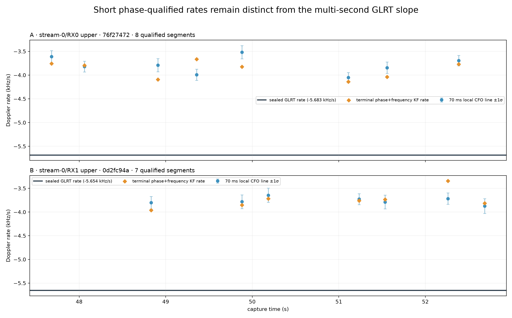
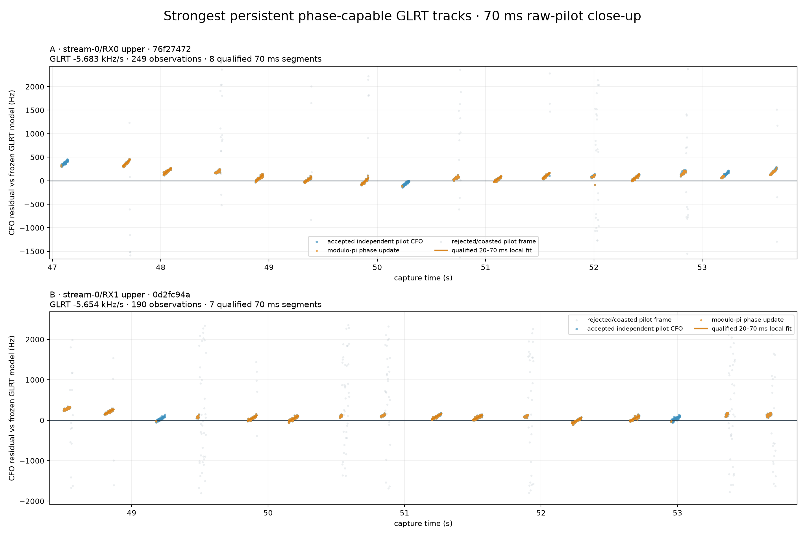

# Short-window pilot Doppler versus sealed GLRT trajectories

Date: 2026-08-23

Capture: `cap-20260823T144200-34e2144863ce`
Sealed analysis run: `capture-da59c914adfe41278262fe4b5d297de0`
Pipeline release: `88a5bc8b855f6e1f4edfbb8f627ad525e4ad3f77`

## Executive conclusion

The multi-second GLRT line and the short phase-qualified carrier segments do not estimate the same effective slope in this capture. The comparison is receiver-relative and candidate-only; it does not identify a satellite or prove that either slope is geometric Doppler.

Across 15 qualified segments, applied modulo-pi phase updates bridge 58.7–68.0 ms. The local CFO rates span -4.051 to -3.518 kHz/s and are consistently +1.632 to +2.165 kHz/s relative to their matched frozen GLRT slopes.

Key findings:

- The selected receiver paths independently place the repeatable short-window rate near **-3.8 kHz/s**.
- The matched sealed GLRT trajectories are near **-5.7 kHz/s**; every qualified segment is less negative by at least 1.63 kHz/s.
- The result replicates across two channels, but a shared receiver/LO or transmitter nuisance can still be common to both. This is not yet an absolute satellite-Doppler measurement.

The two close-ups were chosen by final-bank observation count after collapsing same-branch CFO aliases. A track had to contain at least one already-qualified production pilot window, but neither its local rate nor its GLRT/local agreement was used for ranking.

## Selected tracks

| Rank | Path | Track | GLRT obs | GLRT rate (kHz/s) | Qualified segments | Median local CFO rate (kHz/s) | Median phase+frequency KF rate (kHz/s) |
|---|---:|---:|---:|---:|---:|---:|---:|
| 1 | stream-0/RX0 upper | 76f27472 | 249 | -5.683 | 8 | -3.807 | -3.812 |
| 2 | stream-0/RX1 upper | 0d2fc94a | 190 | -5.654 | 7 | -3.781 | -3.760 |

## Rate comparison

*Figure 1. Each blue point is a straight line fitted to independently measured known-pilot CFO inside one 70 ms raw-IQ window; whiskers are the line-slope 1σ values. Orange diamonds are the terminal five-state modulo-pi phase+frequency Kalman estimates. The dark line is the sealed multi-second GLRT slope.*

The two receiver channels agree on both scales: their sealed GLRT slopes differ by only 28 Hz/s, and their median local slopes differ by 25 Hz/s. That cross-channel recurrence makes random estimator noise unlikely, while still allowing a nuisance shared by the radio or transmitter.

## Carrier structure in the two strongest tracks

*Figure 2. Accepted pilot CFO measurements form repeated short ramps—the "teeth"—against the frozen GLRT model. Gray frames fail or coast through the declared gates; orange lines are the qualified local fits.*

## Every qualified 20–70 ms segment

| Path | Track | Start (s) | Phase span (ms) | GLRT (kHz/s) | Local CFO (kHz/s) | 1σ (kHz/s) | Phase+freq KF (kHz/s) | Local−GLRT (kHz/s) |
|---|---:|---:|---:|---:|---:|---:|---:|---:|
| stream-0/RX0 upper | 76f27472 | 47.650 | 58.7 | -5.683 | -3.613 | 0.130 | -3.758 | +2.070 |
| stream-0/RX0 upper | 76f27472 | 48.025 | 68.0 | -5.683 | -3.821 | 0.112 | -3.797 | +1.862 |
| stream-0/RX0 upper | 76f27472 | 48.875 | 68.0 | -5.683 | -3.792 | 0.138 | -4.093 | +1.891 |
| stream-0/RX0 upper | 76f27472 | 49.325 | 61.3 | -5.683 | -3.991 | 0.118 | -3.667 | +1.692 |
| stream-0/RX0 upper | 76f27472 | 49.850 | 61.3 | -5.683 | -3.518 | 0.140 | -3.827 | +2.165 |
| stream-0/RX0 upper | 76f27472 | 51.075 | 66.7 | -5.683 | -4.051 | 0.106 | -4.137 | +1.632 |
| stream-0/RX0 upper | 76f27472 | 51.525 | 61.3 | -5.683 | -3.845 | 0.119 | -4.037 | +1.838 |
| stream-0/RX0 upper | 76f27472 | 52.350 | 68.0 | -5.683 | -3.694 | 0.110 | -3.771 | +1.989 |
| stream-0/RX1 upper | 0d2fc94a | 48.800 | 61.3 | -5.654 | -3.804 | 0.133 | -3.962 | +1.851 |
| stream-0/RX1 upper | 0d2fc94a | 49.850 | 61.3 | -5.654 | -3.781 | 0.145 | -3.851 | +1.873 |
| stream-0/RX1 upper | 0d2fc94a | 50.150 | 68.0 | -5.654 | -3.645 | 0.150 | -3.716 | +2.009 |
| stream-0/RX1 upper | 0d2fc94a | 51.200 | 68.0 | -5.654 | -3.727 | 0.116 | -3.760 | +1.928 |
| stream-0/RX1 upper | 0d2fc94a | 51.500 | 65.3 | -5.654 | -3.788 | 0.146 | -3.735 | +1.867 |
| stream-0/RX1 upper | 0d2fc94a | 52.225 | 68.0 | -5.654 | -3.716 | 0.122 | -3.345 | +1.939 |
| stream-0/RX1 upper | 0d2fc94a | 52.650 | 68.0 | -5.654 | -3.874 | 0.155 | -3.815 | +1.780 |

## Interpretation

The short-window estimate is not merely a noisier version of the sealed trajectory. Its line-fit uncertainties are 0.106–0.155 kHz/s and its held-out frequency RMS is 14.7–24.9 Hz, while the rate disagreement is 1.63–2.16 kHz/s. The discrepancy is therefore structured and systematic.

A constant LNB frequency offset cannot change a Doppler rate. Time-varying oscillator drift, discrete receiver/transmitter bias changes, or smoothing across those changes can. The evidence supports a local ramp-plus-jump carrier model and argues against using a single multi-second line as the instantaneous observable.

The strongest defensible output is therefore a receiver-relative local CFO and CFO rate with explicitly bounded phase support. Satellite identity, absolute carrier phase, pseudorange, and geometric range rate remain unresolved.

## Method and selection guardrails

1. Read and digest-verify the sealed final trajectory bank, de-aliased bank, pilot scan, and production pilot-segment product for all four receiver paths.
2. Collapse same-branch CFO aliases because they have identical slopes.
3. Require at least one production phase-qualified window, then rank only by final-bank observation count, evaluated probes, and span. Local-rate values never enter the ranking.
4. Return to the pinned raw IQ for the two selected tracks and re-run every selected source window at a strict 70 ms bound.
5. Accept a segment only when modulo-pi phase lock, supported-frame coverage, coherence, line-fit, held-out prediction, and local/Kalman agreement gates pass. Measure the reported span from the first to last applied phase update and reject spans below 20 ms.

No new RF was collected and no sealed Standard product was modified.

## Appendix A — all alias-deduplicated final GLRT rates

| Path | Branch | Span (s) | Observations | Median replay margin | Rate (kHz/s) | Qualified 75 ms windows |
|---|---:|---:|---:|---:|---:|---:|
| stream-0/RX1 upper | c520c77c | 7.200–13.500 | 184 | 0.392 | -5.462 | 0 |
| stream-0/RX1 upper | d4424862 | 21.975–26.900 | 124 | 0.217 | -6.140 | 0 |
| stream-0/RX1 upper | 24c81154 | 26.950–33.625 | 196 | 0.387 | -6.636 | 0 |
| stream-0/RX1 upper | f5d18415 | 33.650–40.325 | 194 | 0.382 | -6.461 | 0 |
| stream-0/RX1 upper | c205d5a7 | 40.600–44.175 | 82 | 0.275 | -5.938 | 0 |
| stream-0/RX1 upper | 2c05c62d | 44.325–47.000 | 105 | 0.495 | -5.766 | 9 |
| stream-0/RX1 upper | e4314fd7 | 47.075–48.625 | 58 | 0.484 | -5.877 | 6 |
| stream-0/RX1 upper | e82aceb7 | 48.500–53.775 | 190 | 0.446 | -5.654 | 7 |
| stream-1/RX0 upper | 287d0b6a | 8.350–10.675 | 13 | 0.001 | -5.081 | 0 |
| stream-1/RX0 upper | fdd6555b | 26.975–33.575 | 107 | 0.365 | -6.233 | 0 |
| stream-1/RX0 upper | bbe9d037 | 33.675–40.325 | 157 | 0.368 | -6.221 | 0 |
| stream-1/RX0 upper | e9e26de3 | 40.400–43.850 | 87 | 0.356 | -5.868 | 0 |
| stream-1/RX0 upper | 0abf2289 | 44.475–47.050 | 73 | 0.397 | -5.604 | 8 |
| stream-1/RX0 upper | 71782c18 | 47.075–49.200 | 62 | 0.398 | -5.855 | 7 |
| stream-1/RX0 upper | 0764472f | 49.000–53.775 | 141 | 0.408 | -5.316 | 6 |
| stream-0/RX0 upper | 6726789f | 5.575–6.725 | 8 | 0.116 | -4.712 | 1 |
| stream-0/RX0 upper | 81fbe645 | 8.225–10.850 | 23 | 0.247 | -5.564 | 2 |
| stream-0/RX0 upper | f7560e6e | 20.775–25.225 | 25 | 0.337 | -5.317 | 0 |
| stream-0/RX0 upper | d5e81bf9 | 27.125–33.575 | 77 | 0.264 | -6.666 | 0 |
| stream-0/RX0 upper | 4ec8633c | 33.650–40.325 | 210 | 0.434 | -6.464 | 0 |
| stream-0/RX0 upper | fafb73cc | 40.475–44.300 | 128 | 0.493 | -5.924 | 0 |
| stream-0/RX0 upper | bbdd7a84 | 44.325–47.050 | 95 | 0.510 | -5.786 | 9 |
| stream-0/RX0 upper | 997d8dcd | 47.075–53.775 | 249 | 0.538 | -5.683 | 8 |
| stream-1/RX1 upper | cf0b88ab | 6.825–13.250 | 187 | 0.342 | -5.204 | 0 |
| stream-1/RX1 upper | 8a1aab05 | 26.950–33.575 | 175 | 0.334 | -6.240 | 0 |
| stream-1/RX1 upper | ae39717d | 33.950–40.350 | 222 | 0.439 | -6.252 | 0 |
| stream-1/RX1 upper | b3e958b7 | 40.400–43.000 | 91 | 0.497 | -6.111 | 0 |
| stream-1/RX1 upper | 8a0c361f | 42.525–44.400 | 54 | 0.517 | -5.287 | 0 |
| stream-1/RX1 upper | 3ddc59d1 | 44.425–46.875 | 96 | 0.525 | -5.602 | 2 |
| stream-1/RX1 upper | a27f369d | 47.075–49.250 | 77 | 0.552 | -5.857 | 1 |
| stream-1/RX1 upper | c50b856f | 48.975–53.550 | 161 | 0.521 | -5.326 | 0 |

## Appendix B — measurement definitions and limits

- `GLRT rate` is coefficient 0 of the sealed degree-one final trajectory; same-branch frequency aliases are listed once because their slope is identical.
- `Local CFO rate` is a straight-line fit to independently measured known-pilot CFO inside a raw-IQ 70 ms container. The reported phase span is the interval from the first to last applied modulo-pi phase update, and spans below 20 ms are rejected.
- `Phase+frequency KF rate` is the terminal five-state modulo-pi pilot Kalman estimate. It is not a phase-only derivative, so agreement between it and the local CFO fit is a consistency check, not a fully independent estimator.
- The large local-versus-GLRT difference is consistent with a ramp-plus-jump receiver-relative carrier process: the multi-second line averages local ramps and discrete carrier-bias changes. Unknown LNB/receiver and transmitter states remain nuisance terms.
- The selection is not Starlink-specific evidence and makes no satellite association, absolute carrier-phase, range, or range-rate claim.

## Machine-readable evidence

- [Full result JSON](figures/2026_08_23_glrt_phase_segment_comparison/glrt-phase-segment-results.json)
- [All final GLRT rates CSV](figures/2026_08_23_glrt_phase_segment_comparison/glrt-rates.csv)
- [Qualified 20–70 ms segments CSV](figures/2026_08_23_glrt_phase_segment_comparison/phase-segment-rates.csv)
- [All selected-window diagnostics CSV](figures/2026_08_23_glrt_phase_segment_comparison/all-window-diagnostics.csv)
