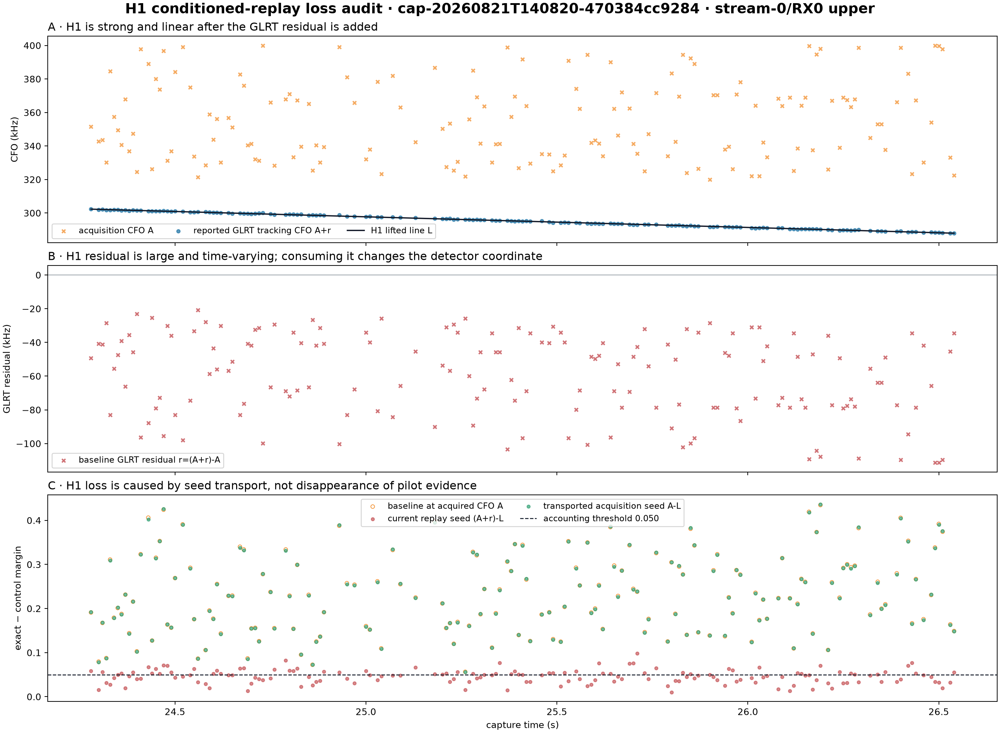
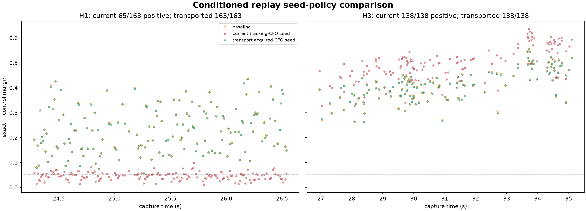

# H1 conditioned-replay seed-policy experiment

## Result

H1 is not lost by Hough or by support closure. It is lost when conditioned replay subtracts the trajectory and seeds GLRT with the already residual-adjusted tracking CFO. Transporting the acquisition CFO instead preserves all H1 pilot evidence while the recomputed acquisition-plus-residual coordinate remains near zero.

## Statistics

| Track | Rate | Associated | Baseline positive | Current P→P / P→N | Transported P→P / P→N | Baseline median margin | Current | Transported |
|---|---:|---:|---:|---:|---:|---:|---:|---:|
| H1 | -6.350 kHz/s | 163 | 163 | 65 / 98 | 163 / 0 | 0.2254 | 0.0477 | 0.2249 |
| H3 | -6.758 kHz/s | 138 | 138 | 138 / 0 | 138 / 0 | 0.4102 | 0.4984 | 0.4116 |

For H1, transported replay leaves a median absolute total residual of 135.2 Hz, a 90th percentile of 404.2 Hz, and a maximum of 602.8 Hz.

## Detector-coordinate interpretation

Let `A` be acquisition CFO, `r` the GLRT correlation-domain residual, `T=A+r` the reported tracking CFO, and `L` the trajectory correction. The current policy seeds replay at `T-L`. The tested policy seeds at `A-L`, then allows GLRT to re-estimate `r`. The latter preserves the two-stage detector coordinate. It is intentionally reported separately from the stronger question of whether `r` can be consumed directly as a sample-domain phase correction.

This experiment is degree-one, candidate-only, research-only, and makes no satellite attribution. It changes no Standard product or gate.

Probe-level results: [`h1-replay-seed-policy.json`](figures/2026_08_23_h1_replay_seed_policy/h1-replay-seed-policy.json)

## Provenance

- Session: `cap-20260821T140820-470384cc9284`
- Path: `stream-0/RX0 upper`
- Window/stride: 20 ms / 10 ms
- GLRT size: 512
- H1 is the first time-ordered production Hough representative; H3 is the surviving-track control.
