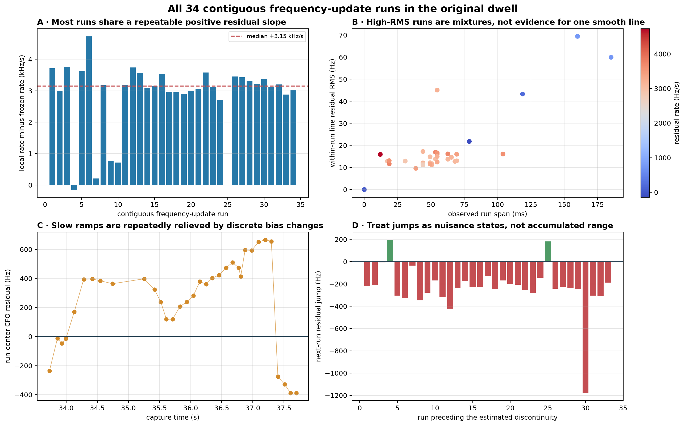

# Piecewise pilot Doppler rate versus the frozen trajectory

Date: 2026-08-23

Status: read-only research re-analysis and Standard-pipeline design proposal; no RF was
collected and no deployed product contract or tracker was changed

## Decision

The short, phase-supported carrier ramps in the target dwell support a receiver-relative
Doppler-rate candidate near **-3.8 kHz/s**. The multi-second frozen trajectory is near
**-6.9 kHz/s** at the same epochs because it absorbs both the continuous local ramp and
discrete carrier-offset changes between sparse groups of observations. It is a useful
association/search prior, but it is not a valid instantaneous Doppler-rate reference for
this comparison.

The physically appropriate measurement model is

\[
\hat f_m=f_D(t_m)+q_{r(m)}+e_m,
\]

where \(f_D\) is the smooth receiver-relative Doppler/clock component and \(q_r\) is an
additive bias that may change at a declared run boundary. A carrier-offset change must
update or reset \(q_r\); it must not be interpreted as instantaneous satellite
acceleration or used to drive the Doppler-rate state.

Fifty to 75 milliseconds is a well-supported local-line interval in this dwell. An
unconditional 100 ms continuity assumption is too broad: some 100 ms windows cross a
frequency-coast or reacquisition boundary. The satellite dynamics are physically smooth
for much longer than 100 ms; the short continuity horizon belongs to the present
measurement process, not to the spacecraft.

## Provenance and scope

The audited signal is the upper edge of `stream-0`, receiver 0, from
`cap-20260821T140820-470384cc9284`, using final trajectory
`sha256:f751bbe5a13af4ba0481e6d434fc5a373c5a95a64c55aa0df8b80a86963ca601`.
The plotted interval is 33.7–37.7 s. The 125 source windows contain 1,875 requested pilot
frames at the nominal 750 Hz frame rate.

The frozen trajectory came from the only persisted Standard product available for this
target capture and was produced by historical pipeline release `0a8fc11...`. The raw-IQ
reconstruction in this report was rerun with the current merged modulo-pi tracker. The
comparison is consequently current local tracking versus a historical frozen search
trajectory, not a claim that the historical Standard output is current.

The persisted inputs and independently regenerated evidence are documented in
[`2026_08_22_edge_pilot_phase_slope.md`](2026_08_22_edge_pilot_phase_slope.md) and
[`2026_08_22_subsecond_pilot_structure.md`](2026_08_22_subsecond_pilot_structure.md).
All QNAP and recording-store access was read-only.

## Raw GLRT64 context and the exact analysis window

Here **raw GLRT64** means the independent-search GLRT64 candidate CFO and score persisted
before any trajectory correction. It does not mean raw time-domain IQ. The complete
path product contains 2,400 probe epochs and eight bounded candidates per probe: 19,200
raw GLRT64 candidate points in total.

The dense pilot example is exactly **33.7–37.7 s**. Within that four-second interval are
161 probe epochs and 1,288 raw candidates. At each probe, selection first discards GLRT64
margins below 0.05, chooses the remaining candidate nearest the frozen target trajectory,
and requires an absolute target-model error no larger than 2.5 kHz. That produces the 125
source timing locks used for the 1,875-frame dense analysis.


*Figure 1. The exact 33.7–37.7 s interval at three scales. Panel A preserves all 1,288
raw candidate CFO values and marks the 125 selected locks. Panel B exposes the target
neighborhood and the declared +/-2.5 kHz model gate. Panel C shows the underlying
exact-minus-control GLRT64 margins and the 0.05 threshold. The visible gaps in orange are
probe epochs where no candidate passes both gates; they are not missing raw samples.*

The full-path view below places that window back into the complete candidate field. It
overlays all 15 pre-dealias trajectory fits—five each of degrees one, two, and three—and
the final target cubic used as the frozen model. The highlighted interval is the early
four-second portion of the upper target ridge; the frozen target itself spans
33.65–43.225 s.


*Figure 2. All 19,200 persisted independent-search candidates and all 15 initial
polynomial track fits. The black line is target branch `5852a936...`; orange triangles
are the 125 source locks; the shaded red-bounded band is the 33.7–37.7 s dense-analysis
window. The other fitted ridges show why this window must be identified in the full
multi-candidate context rather than presented as an isolated carrier.*

This view also makes an important conditioning explicit: the GLRT source-lock selection
is close-to-frozen by construction. It cannot validate the frozen trajectory against
itself. The subsequent 750 Hz frame-local CFO slopes, modulo-pi phase derivatives, and
held-out local prediction are the independent measurements used to test its instantaneous
rate.

## What the dense plot measures

Each visible rising bunch in the CFO-residual panel is normally 15 individually analyzed
frames spanning about 18.7 ms. The median separation between source-window centers is
25.3 ms, with larger gaps also present. A frame supplies a within-frame CFO measurement;
the Doppler rate becomes well-conditioned only after combining several frames over a
longer continuous interval.

The local accepted-frame line has median slope

\[
\dot f_{\mathrm{local}}=-3.769\ \mathrm{kHz/s},
\]

while the frozen trajectory has median slope

\[
\dot f_{\mathrm{frozen}}=-6.919\ \mathrm{kHz/s}.
\]

The residual plotted against the frozen model must therefore rise at approximately

\[
\dot f_{\mathrm{local}}-\dot f_{\mathrm{frozen}}
=+3.150\ \mathrm{kHz/s}.
\]

Over an 18.7 ms bunch this produces about 59 Hz of upward residual motion, which explains
the repeated teeth. The large orange rate excursions in the lower panel occur mainly
when a short-baseline derivative state is initialized or when an offset/phase change is
treated as a rate innovation. They are estimator transients, not credible spacecraft
accelerations.

## Current-tracker reconstruction

Rerunning the same raw frames with modulo-pi phase symmetry changes the amount of usable
phase evidence without changing the basic within-run frequency result:

| Inventory | Earlier ordinary-phase tracker | Current modulo-pi tracker |
|---|---:|---:|
| Phase updates | 471 | 1,060 |
| Frequency updates | 1,109 | 1,110 |
| Phase resets | 570 | 372 |
| Phase segments | 571 | 373 |
| Qualified 50–100 ms segments | 2 | 21 |

Twenty of the 21 current qualified segments have no internal gap above 10 ms. Robust
weighted lines fitted directly to their accepted CFO measurements give:

| Quantity over 21 qualified segments | Result |
|---|---:|
| Median direct local rate | **-3.769 kHz/s** |
| 25th–75th percentile | -3.912 to -3.595 kHz/s |
| 10th–90th percentile | -4.061 to -3.424 kHz/s |
| Median within-segment line RMS | **13.20 Hz** |
| Median formal line-slope standard error | 124 Hz/s |
| Median settled modulo-pi Kalman rate | **-3.807 kHz/s** |
| Median frozen rate at the same epochs | **-6.919 kHz/s** |

The formal 124 Hz/s value describes line-fit noise under the local model; it is not a
complete uncertainty bound because the segments overlap, selection is conditional, and
clock/transmitter systematics remain. The empirical segment spread, approximately -4.1
to -3.4 kHz/s, is the more honest current statement.

The most important modulo-pi improvement is coverage: it produces 21 independently
qualified medium-length segments instead of two. On already settled, frequency-supported
frames, the old and new filters both cluster near the direct local-line result; the new
measurement model prevents binary half-cycle changes from needlessly destroying phase
support.


*Figure 3. Five phase-qualified complete-lattice screens. Direct local CFO slopes and
binary-pi phase-supported derivatives independently select rates near -3.8 kHz/s, while
the frozen rate remains near -7 kHz/s.*

## Why the multi-second slope is steeper

For 13 adjacent qualified segment pairs separated by at most 150 ms:

| Between-segment quantity | Median |
|---|---:|
| Center separation | 105.1 ms |
| Direct center-to-center rate | -6.663 kHz/s |
| Average continuous local rate | -3.702 kHz/s |
| Carrier change unexplained by the local ramp | -318 Hz |

Dividing the median offset change by the median separation contributes approximately
-3.0 kHz/s. Adding it to the continuous -3.7 kHz/s ramp gives about -6.7 kHz/s, close to
the frozen model. The arithmetic explains why a long fit across sparse observations can
look stable yet disagree strongly with every clean local ramp.

The changes align with gaps and the tracker's 50 ms maximum frequency-coast horizon.
That correlation supports treating them as measurement change points. It does not yet
identify whether their physical source is receiver reacquisition, transmitter behavior,
timing re-anchoring, another protocol state, or a mixture. The estimator should remain
agnostic and expose them explicitly.



*Figure 4. Thirty-four contiguous frequency-update runs. Within-run ramps have low
residuals, while run-center offsets change discontinuously relative to the frozen model.*

## Continuity-horizon sensitivity

Sliding direct fits show a stable local answer at 50–75 ms and contamination when 100 ms
windows are permitted to cross undeclared changes:

| Nominal span | Fit count | Median rate | 10th–90th percentile | Median line RMS |
|---|---:|---:|---:|---:|
| 50 ms | 54 | -3.738 kHz/s | -4.162 to -3.421 kHz/s | 13.5 Hz |
| 75 ms | 69 | -3.788 kHz/s | -4.137 to -3.424 kHz/s | 13.3 Hz |
| 100 ms | 113 | -3.980 kHz/s | lower tail reaches -8.047 kHz/s | 16.8 Hz |

When each continuous run receives its own intercept, the 100 ms fixed-effect rate returns
to -3.756 kHz/s. Thus a 100 ms physical prediction interval is reasonable only when a
change-point model prevents offset boundaries from entering the derivative.

Held-out prediction leads to the same conclusion. The frozen trajectory gives 396.46 Hz
RMS and a source-window GLRT64 hold gives 165.00 Hz. A 10 ms local-linear smoother gives
16.48 Hz; causal 20 and 50 ms histories give 19.63 and 18.88 Hz. Causal histories of 100
and 250 ms degrade to 94.49 and 121.23 Hz because they blend regimes.


*Figure 5. Held-out prediction selects short local memory. This is predictive evidence,
not merely a reduction in training residual.*

## Effect on a Doppler/range interpretation

Replacing -6.919 with -3.769 kHz/s reduces the inferred Doppler-rate magnitude by 45.5%.
At the session's approximately 11.6903125 GHz RF center, a pure-Doppler interpretation
would map these values to:

| Rate source | Conditional slant-range acceleration |
|---|---:|
| Local qualified segments | +96.7 m/s^2 |
| Frozen trajectory | +177.4 m/s^2 |
| Difference | 80.8 m/s^2 |

The sign follows \(f_D=-(f_c/c)\dot\rho\). This is a slant-range acceleration, not the
satellite's inertial acceleration. It is also not yet an absolute physical measurement:
receiver/LNB clock drift, transmitter frequency steering, and unknown offset states are
still present. The defensible output is **receiver-relative Doppler-rate candidate**, with
the nuisance inventory and qualification evidence attached.

CFO can constrain range rate only after RF/clock calibration. Integrating it gives range
change plus an unknown constant; neither CFO nor CFO rate alone supplies absolute range.
A physical orbit conclusion requires TLE association and residual testing, preferably
with simultaneous receivers to identify common-mode clock behavior.

## What should become automatic

The following computations are deterministic, bounded, and suitable for every eligible
Standard receiver path:

1. **Frame inventory:** project every supported timing anchor onto the complete 750 Hz
   raw-sample lattice inside declared continuous spans; distinguish recorded-but-rejected
   frames from true sample gaps.
2. **Known-pilot observations:** retain per-frame CFO, uncertainty, modulo-pi phase,
   ambiguity index, fractional frame timing, exact/rolled-pilot control, coherence, and
   channel similarity.
3. **Piecewise tracking:** estimate continuous phase/CFO/rate while allowing an additive
   bias state to change at detected frequency-coast or robust-innovation boundaries.
   Preserve Doppler rate when only the bias state resets.
4. **Qualification:** report raw coverage, maximum internal gap, line RMS, binary-pi phase
   RMS, interleaved-pilot held-out RMS, and filter/direct-line agreement for each segment.
5. **Model comparison:** compute held-out error for frozen, source-window hold, and local
   10/20/50/75/100 ms predictors. A local model is promoted only when it predicts unseen
   frames better.
6. **Dwell summary:** publish eligible-segment count, duration, rate median and empirical
   percentiles, jump count/amplitude, frozen-minus-local discrepancy, and explicit
   candidate-only/receiver-relative labels.
7. **Presentation:** render CFO versus frozen, direct/Kalman rate versus time, segment
   qualification, change points, and held-out predictor error in one bounded PNG.

These measurements should run only for final supported trajectories and within explicit
per-path frame/track budgets. Window selection must be phase-blind—for example, based on
final trajectory support and raw coverage—so favorable phase residuals cannot select
their own evidence.

## Elegant Standard-pipeline plan

### 1. Extract and qualify the pure numerical component

Move the report-only segment construction, robust local lines, blocked holdout, and
change-point accounting behind a small infrastructure-independent analyzer. Its inputs
are arrays or narrow IQ/trajectory ports; it must not import PostgreSQL, storage paths,
HTTP, or CLI code. Add synthetic tests for ramps, pi flips, sample gaps, offset jumps,
outliers, and clock drift, plus the existing digest-pinned corpus case as an explicitly
marked real-corpus test.

Initially run this as a shadow calculation. Version every gate in configuration and
publish raw metrics even when a segment fails. The current 75% coverage and 0.35 rad
phase/held-out gates are research thresholds, not universal constants; cross-dwell data
should set the production operating point.

### 2. Add one immutable, bounded scientific product

Do not change `standard.kalman-tracking.v1` or any existing path-report schema. Add an
additive `standard.pilot-doppler-segments.v1` contract containing:

- exact source and predecessor digests, release/config/implementation identity, and
  bounded track/frame accounting;
- per-segment start/end, frame inventory, maximum gap, local rate and uncertainty, line
  RMS, settled Kalman rate, frozen rate, held-out phase metrics, ambiguity transitions,
  adjacent bias change, qualification status, and reasons; and
- bounded dwell aggregates and explicit `candidate_only`, `known_pilots_only`,
  `receiver_relative`, `absolute_range_claimed=false`, and `payload_decoded=false` flags.

Emit it from the existing per-path Standard computation alongside the current Kalman
product. This reuses the same bounded IQ port and final-trajectory selection, avoids a
second job per dwell, and lets the runner share frame observations where profiling shows
that material read or demodulation cost. Normal release/config/content digests provide
deduplication. Reconciliation should never schedule a separate analysis run merely to
make this metric.

### 3. Add one replaceable presentation product

Render `standard.pilot-doppler-segments-png.v1` solely from the persisted scientific
product and existing trajectory products. The UI can display it without changing the
immutable scientific report. The JSON remains authoritative; the PNG is replaceable
presentation.

### 4. Monitor scientific quality, not just job success

Aggregate these release-stratified metrics across dwells:

- eligible paths/dwells and qualified milliseconds per analyzed minute;
- phase/frequency update and reset rates;
- median and 10th–90th-percentile local Doppler rate;
- direct-line versus settled-Kalman disagreement;
- frozen-minus-local rate discrepancy;
- bias-change count, amplitude, and association with gaps;
- held-out local/frozen error ratio; and
- exact-versus-control and bidirectional phase qualification failures.

Operational alerts should identify pipeline regressions—for example, a release-wide
collapse in eligible coverage or held-out performance. Unusual Doppler values should be
scientific review flags, not automatic satellite claims.

### 5. Promote physical interpretation only after two validations

First compare simultaneous receiver/LNB paths to separate common oscillator motion from
signal-specific motion. Then associate a candidate with TLE-predicted Doppler and fit a
constant frequency bias plus declared piecewise nuisance offsets. Only the remaining
smooth residual may be promoted from receiver-relative CFO rate to a satellite Doppler
or range-dynamics observable.

## Reproduction

The raw-GLRT figures and their input/product digests are regenerated without reading IQ:

```bash
OPENBLAS_NUM_THREADS=1 OMP_NUM_THREADS=1 \
  .venv/bin/python tools/report_piecewise_pilot_doppler_rate_figures.py
```

The resulting machine-readable inventory is
[`glrt-context.json`](figures/2026_08_23_piecewise_pilot_doppler_rate/glrt-context.json).
The focused component test is:

```bash
.venv/bin/python -m pytest -q \
  tests/analysis/test_piecewise_pilot_doppler_rate_report_tool.py
```

## Acceptance criteria for the automated product

The first production increment is complete when:

- existing Standard contracts and products remain byte-compatible;
- identical source, release, configuration, and implementation identities reuse the same
  immutable result rather than create duplicate work;
- every expected frame is accounted for as evaluated, rejected, outside support,
  truncated by budget, or absent across a declared recording gap;
- synthetic offset jumps do not move the preserved Doppler-rate state;
- pi-flipped synthetic frames retain phase support without false resets;
- blocked held-out tests demonstrate the reported local-model advantage;
- empty, sparse, and incoherent dwells publish bounded `no_result` or
  `insufficient_data` products rather than silently disappear; and
- the target corpus case reproduces the approximately -3.8 kHz/s local rate, 13 Hz
  within-segment residual, and frozen/local discrepancy within declared tolerances.

This design turns the present analysis into a routine, auditable Standard measurement
while keeping orbit/range claims behind the calibration evidence they require.
