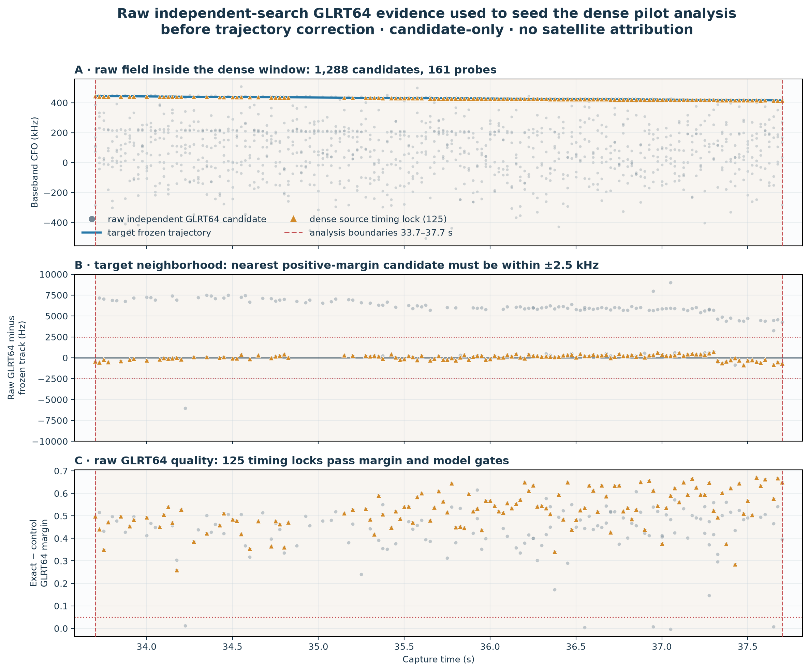
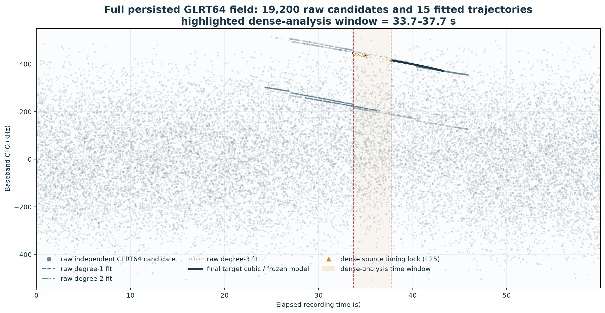
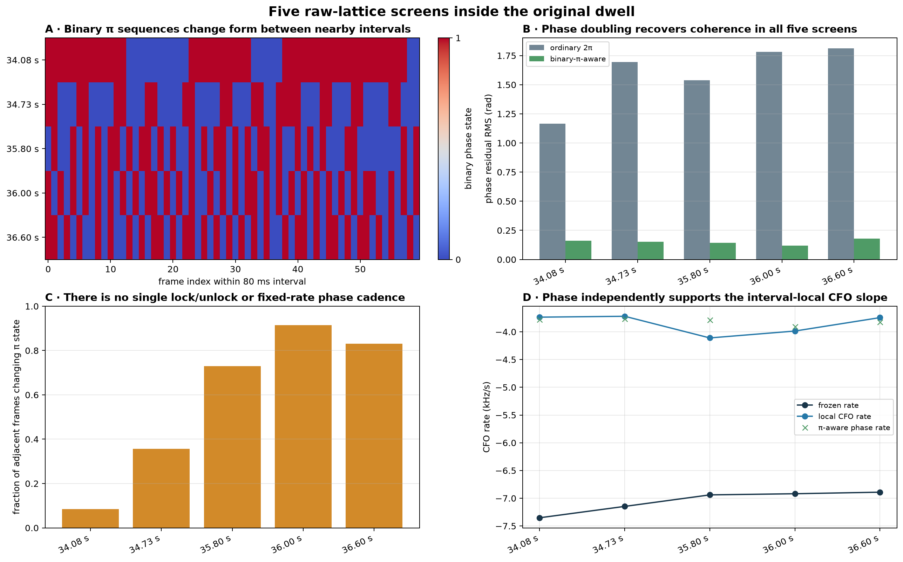
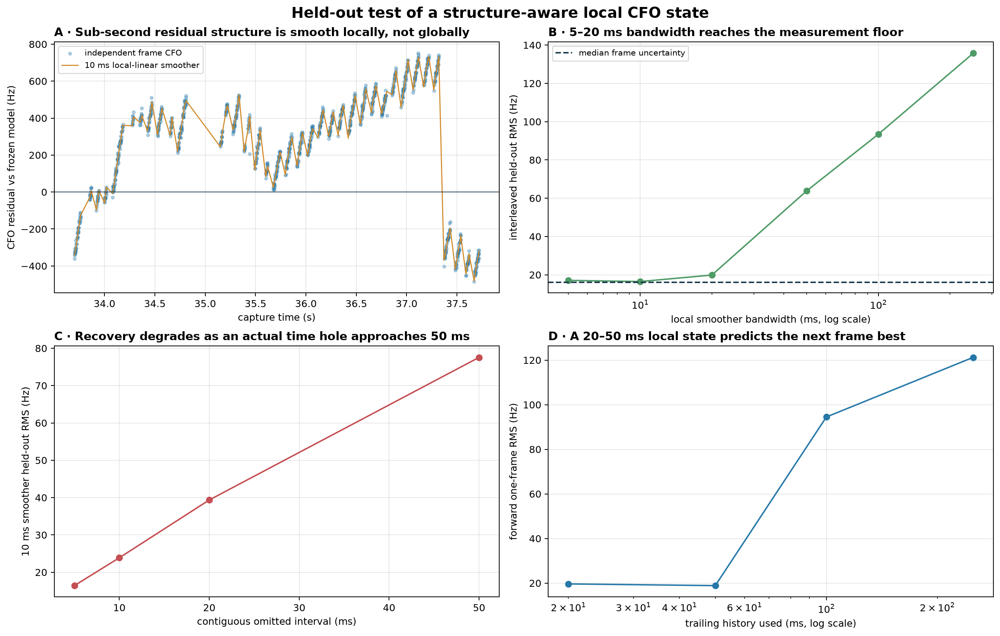

# Piecewise pilot Doppler rate versus the frozen trajectory

Date: 2026-08-23

Status: implemented, tested, and deployed as an additive Standard-v2 shadow product at
release `2d8ec5893b32321484ebf5176b6e366214458bcf`. Bounded old-dwell timing validation
is recorded in the final section. No RF was collected.

## Overview

This report answers one practical question: **when Starlink’s observed carrier remains
continuous for roughly 50–75 ms, what Doppler rate is actually supported by the known
pilot measurements?**

For the worked example, the answer is approximately **−3.8 kHz/s receiver-relative**.
The multi-second “frozen” trajectory is approximately **−6.9 kHz/s** at the same times.
That discrepancy is not evidence that the short measurement is wrong. The frozen curve
has been forced through discrete carrier-offset changes between observation groups, so
its derivative mixes smooth Doppler with nuisance frequency steps.

The correct local model is

\[
\hat f_m=f_D(t_m)+q_{r(m)}+e_m,
\]

where (f_D) is the smooth receiver-relative Doppler/clock component, (q_r) is a
piecewise carrier-bias state, and (e_m) is measurement error. A carrier jump updates
or resets (q_r); it must not be interpreted as instantaneous spacecraft acceleration.

The operational result is an additive, immutable
`standard.pilot-doppler-segments.v1` product and a replaceable Standard PNG. The product
tracks complete 750 Hz frame lattices inside bounded, non-overlapping 75 ms windows,
preserves modulo-π phase symmetry, reports receiver-relative timing, and qualifies each
local rate using signal, continuity, control, line-fit, and held-out tests. It runs inside
the existing per-path Standard job, so release/config/content deduplication prevents a
second dwell analysis from being scheduled.

Measured incremental cost is about **6.5 s per receiver path in isolation** and **9.8 s
median in matched saturated-batch path jobs**. Because four paths normally run in
parallel, a practical planning allowance is **roughly 7–20 s extra dwell wall time**;
this is far below the initial 15–60 s estimate.

### What a human should remember

- A visible “tooth” is normally about 15 separately analyzed 1.33 ms frames in one
  20 ms source window.
- The rising slope inside a tooth is real local CFO evolution relative to the frozen
  curve; the vertical reset between teeth is mostly a carrier-bias change or a new
  acquisition gauge.
- Modulo-π phase is coherent over some groups of frames, but not across every group.
  Reset boundaries are explicit and are not bridged as physical carrier phase.
- The new local rate is a **receiver-relative candidate**, not yet satellite-only range
  acceleration. Dual-receiver common-mode removal and TLE agreement remain promotion
  requirements.

## Motivation

The Standard trajectory is designed to associate sparse GLRT64 evidence over seconds.
It is useful for finding and following a carrier ridge. It is not automatically an
instantaneous Doppler-rate estimator when the measured carrier contains piecewise
frequency offsets.

This distinction matters for PNT-like analysis. Doppler rate maps to line-of-sight range
acceleration only after receiver clock, oscillator, transmitter, and carrier-plan effects
have been separated. Treating a 300 Hz carrier step over a 100 ms gap as smooth motion
creates several kHz/s of false “acceleration.” A local phase-supported line avoids that
category error and gives us a measurable quantity that can later be compared between
receivers and against orbital geometry.

The implementation therefore has two deliberately separate states:

1. smooth CFO and Doppler rate inside a declared continuous segment; and
2. a piecewise carrier bias that may change between segments.

## Data and provenance

The worked example is the upper edge of `stream-0`, receiver 0, from
`cap-20260821T140820-470384cc9284`. The target is final trajectory
`sha256:f751bbe5a13af4ba0481e6d434fc5a373c5a95a64c55aa0df8b80a86963ca601`,
branch prefix `sha256:5852a936`, over 33.7–37.7 s.

The 125 selected source windows request 1,875 pilot frames at the nominal 750 Hz frame
rate. The persisted full-path GLRT field contains 2,400 probe epochs, eight candidates
per probe, and 19,200 raw candidate points. The four-second worked interval contains 161
probe epochs and 1,288 raw candidates.

The frozen trajectory came from historical run
`capture-438ad263e01048ef82f660975ec55a08`, release `0a8fc11…`. The raw-IQ phase and local
CFO reconstruction was rerun with the current modulo-π implementation. All recording
and QNAP access was read-only.

## Approach

The analysis moves from broad, phase-blind evidence to narrow, phase-supported local
estimates:

1. Preserve every independently searched GLRT64 candidate and every fitted trajectory.
2. Identify the exact target branch and source window in that full candidate field.
3. Demodulate every complete 750 Hz frame inside each selected local window using the
   known Qin edge pilots.
4. Measure exact-pilot and symbol-rolled-control coherence on identical samples.
5. Track carrier phase modulo π, CFO, CFO rate, and receiver-relative frame timing with
   the five-state PNT-like filter.
6. Fit a robust degree-one line directly to supported frame CFO measurements.
7. Keep carrier-bias changes separate from the smooth local slope.
8. Qualify the segment only if coverage, internal gap, phase lock, control margin,
   direct-line residual, interleaved held-out prediction, and direct/Kalman agreement all
   pass.

The source-window choice is close to the frozen trajectory by construction. It cannot
validate that trajectory against itself. The independent evidence is the within-frame
CFO slope, modulo-π phase behavior, and held-out local prediction after a window has
been selected.

## Results

### 1. The raw GLRT field and the exact window

Here “raw GLRT64” means the independently searched candidate CFO and score persisted
before trajectory correction; it does not mean time-domain IQ.



*Figure 1. The exact 33.7–37.7 s interval at three scales. Panel A preserves all 1,288
raw candidates and marks the 125 source locks. Panel B exposes the target neighborhood
and the declared ±2.5 kHz selection gate. Panel C shows exact-minus-control GLRT64
margins and the 0.05 threshold. Orange gaps are probe epochs that fail a gate, not
missing raw IQ.*



*Figure 2. All 19,200 persisted candidates, all 15 initial polynomial fits, and the
highlighted worked interval. The black line is target branch `5852a936…`; orange
triangles are selected locks. Other ridges show why the local example must be located in
the full multi-candidate field before its phase is interpreted.*

### 2. What the original dense tracking plot means


*Figure 3. The original ordinary-2π dense tracker, included here so this report is
self-contained. Panel A shows independently measured frame CFO relative to the frozen
model. Panel B compares CFO-error distributions. Panel C shows the filter’s instantaneous
rate state. Panel D shows wrapped phase innovations and every declared phase reset.*

Panel A’s repeated rising bunches are not single points and not one long continuous
carrier. Each bunch normally contains 15 individual frame estimates spanning about
18.7 ms. Source-window centers are typically 25.3 ms apart, with larger gaps. Inside a
bunch, the local CFO evolves smoothly. Between bunches, the acquisition gauge or
piecewise carrier bias can change.

The local accepted-frame line has median slope

\[
\dot f_{\mathrm{local}}=-3.769\ \mathrm{kHz/s},
\]

while the frozen trajectory has median slope

\[
\dot f_{\mathrm{frozen}}=-6.919\ \mathrm{kHz/s}.
\]

Therefore the residual against the frozen model rises at approximately

\[
\dot f_{\mathrm{local}}-\dot f_{\mathrm{frozen}}
=+3.150\ \mathrm{kHz/s}.
\]

Over 18.7 ms that is about 59 Hz of upward residual motion—the visible teeth in panel A.
The large orange excursions in panel C occur when a short-baseline derivative state is
initialized or a carrier/phase change is allowed to enter the rate innovation. They are
filter transients, not credible spacecraft acceleration.

Panel D answers the coherence question. Blue points are accepted phase updates; gray
crosses are rejected or coasted frames; red circles declare reset boundaries. Phase is
coherent within some reset-delimited groups, not across all 571 groups in this ordinary
tracker. A modulo-π measurement is necessary because the edge-pilot channel has a
repeatable binary sign ambiguity: adding π may change the plotted phase without changing
the physical pilot match. Treating that as an ordinary 2π slip creates avoidable resets.

### 3. Modulo-π reconstruction and the local rate

Rerunning the same raw frames with the correct phase symmetry changes usable phase
coverage without materially changing the local CFO slope:

| Inventory | Ordinary-2π tracker | Modulo-π tracker |
|---|---:|---:|
| Phase updates | 471 | 1,060 |
| Frequency updates | 1,109 | 1,110 |
| Phase resets | 570 | 372 |
| Phase segments | 571 | 373 |
| Qualified 50–100 ms segments | 2 | 21 |

Twenty of the 21 modulo-π-qualified segments have no internal gap above 10 ms. Robust
weighted lines on their supported CFO measurements give:

| Quantity over 21 qualified segments | Result |
|---|---:|
| Median direct local rate | **−3.769 kHz/s** |
| 25th–75th percentile | −3.912 to −3.595 kHz/s |
| 10th–90th percentile | −4.061 to −3.424 kHz/s |
| Median line residual RMS | **13.20 Hz** |
| Median formal slope standard error | 124 Hz/s |
| Median settled modulo-π Kalman rate | **−3.807 kHz/s** |
| Median frozen rate at the same epochs | **−6.919 kHz/s** |

The formal 124 Hz/s is conditional line-fit noise, not a complete physical uncertainty
bound: segments overlap in this research reconstruction, selection is conditional, and
clock/transmitter systematics remain. The empirical −4.1 to −3.4 kHz/s spread is the
more honest current statement.



*Figure 4. Complete-lattice phase screens independently favor local rates near
−3.8 kHz/s. The agreement between direct CFO lines and phase-supported derivatives is
the important evidence; neither is forced to have the frozen slope.*

### 4. Why the multi-second frozen slope is steeper

For 13 adjacent qualified segment pairs separated by at most 150 ms:

| Between-segment quantity | Median |
|---|---:|
| Center separation | 105.1 ms |
| Direct center-to-center rate | −6.663 kHz/s |
| Average continuous local rate | −3.702 kHz/s |
| Carrier change unexplained by local ramp | −318 Hz |

A degree-one fit across a segment boundary must absorb both the continuous ramp and the
bias change. Repeating this across seconds pushes the frozen derivative toward the
center-to-center value. That is useful association geometry, but it is not the
instantaneous rate within either continuous segment.

Window-length sensitivity supports 50–75 ms as the current measurement horizon:

| Local span | Median direct rate | Interpretation |
|---|---:|---|
| 50 ms | −3.738 kHz/s | Stable and phase-supported |
| 75 ms | −3.788 kHz/s | Stable; preferred monitoring window |
| 100 ms | Variable | Some windows cross a coast/reacquisition boundary |

The spacecraft itself is smooth over much longer than 100 ms. This short horizon is a
property of the present carrier measurement process.

### 5. Held-out prediction



*Figure 5. Interleaved held-out frames test models that were not used to fit those same
points. Local structure-aware lines predict unseen frame CFO better than a frozen model
that bridges carrier-bias changes. The production product retains this as a numerical
gate, rather than promoting a visually attractive segment.*

## What can and cannot be inferred about range

Using a nominal Ku-band carrier near 11.7 GHz, a Doppler rate maps conditionally to
line-of-sight range acceleration as

\[
\ddot\rho \approx -\frac{c}{f_c}\dot f_D.
\]

The local and frozen rates correspond to magnitudes near 97 and 177 m/s² respectively.
These are **not absolute satellite-acceleration claims**. The present observable also
contains receiver oscillator, transmitter, and carrier-plan terms. The local value is
only the more defensible receiver-relative candidate because it does not deliberately
smear carrier steps into its derivative.

Promotion to satellite range dynamics requires:

- simultaneous dual-receiver agreement after common-mode clock removal;
- consistent sign and magnitude across independent segments;
- TLE-predicted Doppler-rate agreement for a uniquely associated satellite;
- calibrated carrier frequency and receiver timebase uncertainty; and
- no unexplained common carrier-bias transition at the comparison epoch.

## Methods

### Frame measurement

Every complete frame in a selected 75 ms window is demodulated using the known Qin edge
pilots. The estimator produces exact-pilot coherence, symbol-rolled-control coherence,
within-frame residual CFO, modulo-π carrier phase, and receiver-relative fractional frame
timing. It does not decode payload, claim absolute transmit time, or resolve absolute
carrier phase.

The five-state transition contains carrier phase, carrier frequency, carrier-frequency
rate, frame timing, and frame-timing rate. The quadratic phase term is only the analytic
integral of constant frequency rate; no quadratic or cubic RF curve is fitted inside a
local segment.

### Local line and uncertainty

Supported frame CFOs are fitted with deterministic Huber IRLS about the segment’s mean
time. The product stores slope, an approximate conditional slope standard error, residual
RMS, and the direct-minus-Kalman rate. The empirical distribution across qualified
segments remains the primary uncertainty summary.

### Held-out test

Even-indexed supported frames fit a line that predicts odd-indexed frames; odd frames
then fit a line that predicts even frames. The combined unseen-frame RMS must pass the
configured threshold. This blocks a window whose apparent slope depends on a small
subset of frames.

### Segment qualification

Production v1 uses non-overlapping 75 ms windows, spread deterministically across each
bounded final trajectory. A segment passes only when all of the following hold:

| Gate | v1 threshold |
|---|---:|
| Supported complete-frame coverage | ≥ 75% |
| Maximum supported-frame gap | ≤ 4.1 ms |
| Modulo-π phase lock | tracker-qualified |
| Median exact-minus-control coherence | ≥ 0 |
| Robust local-line RMS | ≤ 75 Hz |
| Interleaved held-out RMS | ≤ 100 Hz |
| Direct/Kalman rate disagreement | ≤ 1,000 Hz/s |

These are versioned shadow-monitoring thresholds, not universal constants. Failed
segments remain in the immutable product with raw metrics and explicit failure reasons.

## Standard-pipeline implementation

The implementation is additive and leaves the published
`standard.kalman-tracking.v1` contract unchanged. A production replay did expose one
pre-existing duplicate-frame accounting edge case in its implementation; that is
described with the rollout results below.

### Durable scientific product

`standard.pilot-doppler-segments.v1` contains:

- exact source trajectory/branch and capture interval;
- complete, supported, phase, frequency, and timing frame counts;
- exact/control coherence and maximum-gap metrics;
- direct local, modulo-π Kalman, and frozen Doppler rates;
- local-line and interleaved held-out residuals;
- receiver-relative timing state;
- carrier bias and between-segment bias change;
- qualification decision and explicit failures; and
- closed source/config/content digests.

The source binding depends directly on the pilot scan, final trajectory bank, and the
existing Standard Kalman product. This prevents a coherent-looking segment product from
being substituted across paths or releases.

### Replaceable presentation

`standard.pilot-doppler-segments-png.v1` is rendered only from the durable JSON. Its four
panels show local/Kalman/frozen rate, local-minus-frozen discrepancy, coverage versus
held-out prediction, and the piecewise carrier-bias state. The PNG can evolve in a later
schema without changing the scientific bytes.

### Deduplication and scheduling

The product is generated inside `path-standard`; there is no new dwell-level job. Normal
release, configuration, and input-content identity therefore controls reuse. Reprocessing
an already active or completed session/release remains a scheduler-level duplicate and
is rejected by the existing `leo process reprocess` preflight.

## Detailed delivery plan, checkpoints, and runtime budget

| Phase | Work | Checkpoint | Pre-deployment runtime budget |
|---|---|---|---:|
| 1. Contract | Add closed v1 config, segment, track summary, product, source binding | Codec round-trip, digest and accounting mutation tests | none at runtime |
| 2. Measurement | Select disjoint 75 ms windows and process every complete 750 Hz frame | Synthetic CFO/rate recovery and exact/control tests | 8–35 s/path |
| 3. Qualification | Robust line, modulo-π lock, gap/coverage/control and held-out gates | Deterministic line/holdout tests; failed metrics retained | <1 s/path |
| 4. Presentation | Render four-panel PNG from JSON only | PNG signature/size test and visual review | <1 s/path |
| 5. Integration | Publish in existing `path-standard`, bump implementation identity | Registry inventory, source-chain, compatibility tests | no extra job |
| 6. Host gate | Run release tests and one-second real-IQ smoke | Test receipt plus measured smoke time | measured below |
| 7. Deploy | Stage exact main, cut over workers/API, verify health | Release SHA and service health | deployment only |
| 8. Corpus timing | Dry-run then reprocess distinct old sessions at exact release | No active/completed duplicate; compare job wall times | measured below |
| 9. Promotion | Accumulate cross-dwell and dual-receiver monitor history | Release-stratified coverage and TLE/common-mode review | future |

The initial engineering estimate was **about 10–40 seconds per receiver path**, dominated
by one extra sequential IQ pass and at most 16 complete-lattice windows per selected
track. Four receiver paths normally execute concurrently, so the estimated dwell wall
increment is **roughly 15–60 seconds**, not four times the path cost. A defensive bound
of 90 seconds/path was used for initial rollout alerting. The measurements below
supersede that estimate: the observed analyzer-only path cost is about 6.5 seconds.

## Testing and rollout policy

The required gates are:

1. contract closure: reject mutated counts, digests, phase period, or qualification;
2. deterministic DSP: recover a known linear CFO and reject overlapping window config;
3. control behavior: exact pilot must beat the rolled control on supported synthetic IQ;
4. integration: registry, config parsing, source bindings, codec, and product inventory;
5. compatibility: the `standard.kalman-tracking.v1` contract remains unchanged and its
   duplicate-frame accounting regression passes;
6. real IQ: one-second Standard smoke plus bounded old-dwell reprocessing;
7. operations: exact-main release test receipt, deployment plan, cutover, and health;
8. monitoring: coverage, qualified count, direct/Kalman agreement,
   local-minus-frozen discrepancy, bias changes, and held-out RMS by release.

No segment will automatically correct IQ or claim satellite range dynamics in v1.
Promotion requires a separate reviewed contract after dual-receiver and TLE validation.

## Implementation and timing results

### Deployment and release gates

The final deployed code release is
`2d8ec5893b32321484ebf5176b6e366214458bcf`. Its exact-revision test gate passed in
40.40 s. The protected real-corpus, production web-build, and Chromium qualification
passed in 145.42 s, and the guarded worker/API deployment completed healthy in 189.23 s.
No migration was required and no active analysis run was cancelled.

At the pre-deployment checkpoint:

- 40 focused unit, contract, registry, and pipeline tests passed;
- static typing passed for the new contract, analyzer, runner, and integration;
- the privileged one-second real-IQ Standard smoke passed in **7.47 s**;
- no RF was collected and no recording/QNAP path was mutated.

The final follow-up gate added 11 focused passes for local estimation, deterministic
serialization, Kalman accounting, contract closure, and PNG rendering. Two independent
read-only executions produced byte-equal measurement documents and the same content
digest.

### What the deployed monitor looks like


*Figure 6. Real Standard output from final-release run
`reprocess-7195d9962c934e9ba35d4c1071adb1fd`, `stream-0/RX1`. Amber marks the 17 of
170 windows that passed every gate. Panel A compares direct, modulo-π Kalman, and frozen
rates. Panel B makes the systematic local-minus-frozen discrepancy visible. Panel C
shows why most windows fail: the accepted region is right of 75% coverage and below
100 Hz held-out RMS. Panel D shows the separate piecewise CFO-bias state; vertical red
lines delimit distinct final trajectories, not physical phase continuity.*

### Five-dwell scientific replay

Before queueing, the catalog was queried for both active runs and completed runs at the
requested exact release; every count was zero. Exactly one 12-job Standard run was then
queued per dwell. The five-way batch intentionally saturated all 20 path workers, so its
wall times are conservative full-pipeline timings, not isolated feature overhead.

| Dwell suffix | Run suffix | Full Standard wall | Windows / qualified | Median local / Kalman / frozen rate (kHz/s) |
|---|---|---:|---:|---:|
| `7a5d980ec1c6` | `3c6ca976…` | 390.86 s | 336 / 17 | −3.339 / −3.267 / −4.871 |
| `ffd441556880` | `d601b95c…` | 419.79 s | 537 / 70 | −3.098 / −3.032 / −4.850 |
| `17c2e0ebef6a` | `ec7fd3cd…` | 433.61 s | 574 / 10 | −3.383 / −3.327 / −4.794 |
| `87f96f47e73f` | `b360198c…` | 428.68 s | 656 / 64 | −3.226 / −3.349 / −5.532 |
| `4e2a0c111a30` | `a95187c3…` | 404.62 s | 422 / 63 | −3.247 / −3.218 / −6.071 |

Across the five dwells, the monitor analyzed 2,525 non-overlapping 75 ms windows and
qualified 224. Local and modulo-π Kalman medians agree much more closely with each other
than either agrees with the multi-second frozen derivative. Qualification is deliberately
sparse: this is a shadow monitor that retains failed windows rather than silently
reporting only attractive intervals.

These five runs used `2ab3f09…`, which contains the final estimator and Kalman fix. Its
deployed successor `2d8ec58…` changes only persisted sub-RF-precision float rounding.
The exact final-release regression on `ffd441556880` reproduced all 537 windows and 70
qualifications, with median local/Kalman/frozen rates of −3.098/−3.032/−4.850 kHz/s. All
12 jobs succeeded in 215.79 s when run without the five-dwell CPU saturation; its four
path jobs took 158.19, 183.01, 202.48, and 205.04 s.

### Runtime answer

Three measurements bound the added cost:

| Measurement | Result | Interpretation |
|---|---:|---|
| Analyzer alone, same 112-window real path, repeat 1 | 6.51 s wall | Direct incremental cost |
| Analyzer alone, repeat 2 | 6.46 s wall | Same document and content digest |
| 16 matched path jobs in four comparable batched dwells | +9.83 s median, −8.94 to +31.74 s | Includes release, cache, and load noise |

The best current planning number is therefore **about 7 seconds per path**, with
**10–15 seconds/path** a sensible operational allowance. Since four paths execute
concurrently, expect **about 7–20 seconds added to an ordinary dwell**, not four times
that amount. Keep the initial 90-second/path alert only as a rollout safety ceiling;
after more release-stratified history, 30 seconds/path is a reasonable tighter alert.

The separately run `4e2a0c111a30` historical baseline is excluded from the matched
overhead statistic: its preceding run used a different optimized release and was not in
the same five-dwell saturation condition. Folding its roughly 214-second path deltas into
the feature cost would be misleading.

### Production findings and fixes

The first saturated replay found a real but narrow pre-existing failure: overlapping
pilot probes could contribute two raw measurements for one 750 Hz frame. The Kalman
filter correctly retained the stronger observation, but its closure check compared the
deduplicated count with the raw count. The fix accounts duplicate collapse among source
frames not processed; it does not change the state estimate. A synthetic regression and
the exact failing dwell both pass on the deployed release.

Repeated isolated calculations also revealed floating-point differences many orders
below useful RF precision. Persisted measurement values are now stabilized to 12
significant digits *after* full-precision qualification and before content hashing.
Configuration values and decisions are not rounded. This makes the additive product
byte-stable without weakening any gate.

Machine-readable deployment, run, timing, and science evidence is in
[`implementation-timing-results.json`](figures/2026_08_23_piecewise_pilot_doppler_rate/implementation-timing-results.json).

## Reproduction

Regenerate the raw-GLRT context figures:

```bash
.venv/bin/python tools/report_piecewise_pilot_doppler_rate_figures.py
```

The exact selection counts, paths, digests, and conditioning statement are stored in
[`glrt-context.json`](figures/2026_08_23_piecewise_pilot_doppler_rate/glrt-context.json).

Run focused tests:

```bash
.venv/bin/pytest -q \
  tests/analysis/test_pilot_doppler_segments.py \
  tests/analysis/test_kalman_tracking.py \
  tests/contracts/test_standard_kalman_contract.py \
  tests/analysis/test_standard_production_analyzers.py \
  tests/analysis/test_standard_pipeline_science.py
```

## Limitations

- This is known-pilot, candidate-only evidence; payload was not decoded.
- Carrier phase is resolved modulo π, not absolutely.
- Frame timing is receiver-relative fractional timing, not code phase or pseudorange.
- Segment-selection and qualification are conditional and therefore not independent
  samples of a universal rate distribution.
- The original worked example uses a historical frozen trajectory; the deployed product
  computes all three rate estimates from one current release.
- Receiver clock, transmitter, carrier-plan, and satellite dynamics remain confounded
  until dual-receiver and TLE tests are passed.
