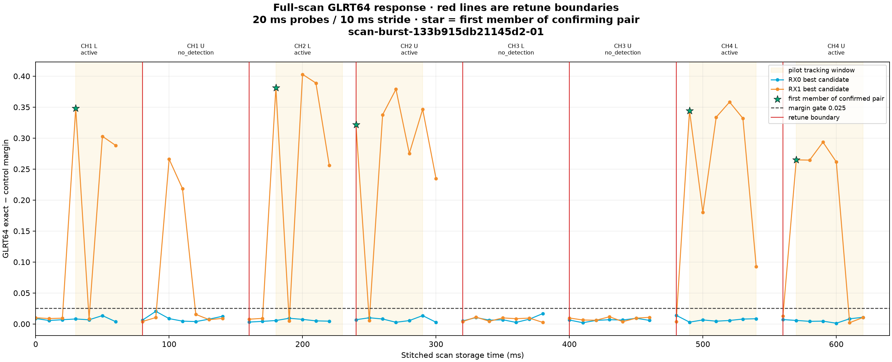
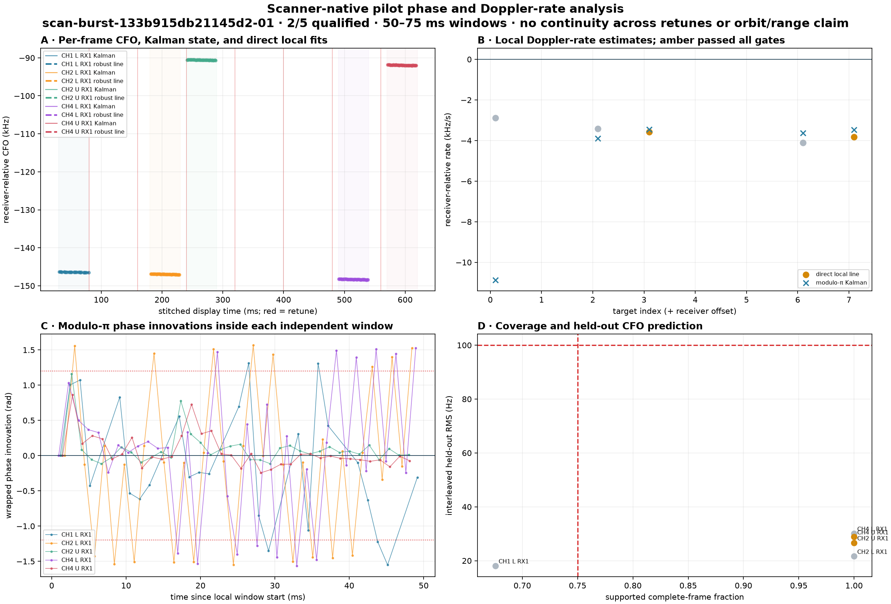

# Scanner Standard analysis with retune-bounded pilot phase and Doppler rate

## Overview

The dwell and scanner pipelines now share the same scientific principle—immutable raw IQ in, bounded candidate-only numerical evidence out—but they do not pretend to have the same time geometry.

The dwell Standard pipeline sees a continuous 60 s receiver path. It can build multi-second trajectory families, resolve CFO aliases, freeze a long-baseline polynomial reference, and then compare independent 50–75 ms pilot segments with that reference. The scanner sees eight separately tuned 80 or 120 ms frames. It can truthfully estimate local phase, CFO, frame timing, and Doppler rate inside one frame, but a retune destroys carrier continuity and the scan does not contain a long-baseline frozen trajectory.

This change adds a scanner-native `scanner.pilot-doppler-segments` v1 product and a third Standard PNG. It starts only from independently confirmed GLRT64 candidates, analyzes the complete 750 Hz pilot-frame lattice, applies the same local-line, modulo-π Kalman, coverage, phase, control-pilot, held-out, and agreement tests used by dwell Standard, and stops at every retune boundary.

The operational result is deliberately conservative: local receiver-relative rates are monitored, but no scanner product claims absolute phase, pseudorange, range dynamics, or satellite orbit dynamics.

## Motivation

The previous scanner answered an important but narrower question: “does this 80–120 ms edge capture contain a repeatable Qin-pilot-like GLRT response?” It persisted all candidate responses and made a scan-wide waterfall, but it did not answer:

- whether the known-pilot carrier phase remains coherent frame by frame;
- whether independently measured per-frame CFO follows a local line;
- whether that direct line agrees with the five-state phase/CFO/rate/timing Kalman state;
- whether the estimate predicts held-out frames;
- whether both receivers independently see the same local rate.

Those distinctions matter because a high GLRT margin establishes pilot-like presence, not phase lock. Several stored scans have strong detections and plausible direct slopes but fail modulo-π phase continuity or local/Kalman agreement. Keeping those failures explicit prevents an attractive line on a plot from becoming an unsupported Doppler-rate claim.

## Dwell Standard versus scanner analysis

| Property | Dwell Standard | Scanner before this change | Scanner with pilot segments |
|---|---|---|---|
| Source geometry | One continuous 60 s receiver path | Eight independently retuned frames; historical 80 ms, configured 120 ms | Same retune-bounded source |
| Receiver topology | Two radios × two receiver paths, followed by radio and paired reductions | One selected radio, two receivers per frame | Same; receiver comparison only when both independently confirm |
| Capture scheduling | Long scheduled dwell | Four capture-first sweeps; RF lease is released before numerical analysis | Unchanged |
| Initial evidence | Independent pilot probes across the dwell | 20 ms probes on a 10 ms stride, up to ten acquisition basins, exact-control GLRT64 margin | Same immutable GLRT evidence is the acquisition authority |
| Long-time association | Residual-Hough trajectories, alias map, dealiased/final banks, conditioned replay | None | None; never joins evidence across retunes |
| Carrier model | Long-baseline final trajectory plus Kalman state | One CFO per confirmed GLRT candidate | Direct local CFO line plus modulo-π five-state Kalman inside 50–75 ms |
| “Frozen” reference | Available from the multi-second final trajectory | Unavailable | Explicitly `null`; product says `long_baseline_trajectory_available=false` |
| Timing | Receiver-relative fractional frame timing | Acquisition epoch only | Per-frame receiver-relative fractional timing and timing-rate state |
| Qualification | Track/replay gates plus segment coverage, phase, line, hold-out, and agreement gates | Two non-overlapping CFO-consistent GLRT probes | Same local segment gates after the scanner confirmation pair |
| Durable outputs | Closed Standard product graph; 39 products in the current four-path run | Scanner report v1, metrics v1, waterfall PNG, GLRT64 PNG | Adds pilot-segment JSON, highlighted GLRT PNG, and pilot phase/Doppler PNG |
| Deduplication | Database run/release/config/content identity | Local analysis ID plus immutable input URI and manifest digest | New immutable analysis ID plus exact input binding; legacy products prevent automatic deployment backfill |
| Range/orbit claim | Still requires common-mode receivers and TLE agreement | None | None; explicitly forbidden by the product contract |

The scanner is therefore “Standard-like” in contracts, provenance, bounded analysis, deterministic presentation, and failure accounting. It is intentionally not a shortened copy of the dwell trajectory graph.

## Approach

### 1. Preserve the retune boundary

Each target frame is analyzed independently. The concatenated scanner IQ sample coordinate is a storage coordinate only. A local pilot window cannot cross into the next channel edge, and no phase, CFO, or timing state is propagated across a retune.

### 2. Require an existing GLRT confirmation pair

For each receiver, the new layer reuses the scanner detector’s acquisition rule:

- two 20 ms probes;
- non-overlapping in time;
- both above the exact-minus-control margin gate;
- tracking CFO values within 8 kHz.

The first member provides frame epoch and initial CFO. The second member proves that the acquisition is not a single isolated probe. A receiver without its own pair does not receive a pilot segment merely because the other receiver detected one.

### 3. Select a complete local window

The present on-disk corpus has 227 scanner recordings and every manifest uses 80 ms per target. These use a 50 ms window beginning at the source probe. The current scanner configuration is 120 ms; it will use the preferred 75 ms window when at least 25 ms remains as acquisition/placement guard, and fall back to 50 ms for a later confirmed source. If even 50 ms does not remain, the confirmed track is counted as unavailable rather than shortened silently.

No real 120 ms scanner recording was present on disk during validation. The 75 ms selection path is covered by component tests; its first live result remains an operational checkpoint.

### 4. Track every supported 750 Hz pilot frame

Inside the selected window, the known Qin edge pilots drive the same five-state structure used by the dwell work:

1. carrier phase modulo π;
2. absolute receiver-relative CFO;
3. CFO/Doppler rate;
4. fractional frame timing;
5. timing rate.

The product stores every returned frame state: exact and control coherence, support decision, wrapped phase innovation, ambiguity bit, measured and tracked CFO, tracked rate, timing measurement/state, and which Kalman updates were applied.

### 5. Estimate and qualify the local slope independently

Supported per-frame CFO measurements are fit with a robust Huber line. Interleaved even/odd frames test held-out prediction. A segment qualifies only if all of the following pass:

- supported lattice coverage ≥ 75%;
- maximum supported-frame gap ≤ 4.1 ms;
- modulo-π phase lock qualifies;
- median exact-minus-control coherence margin ≥ 0;
- local line RMS ≤ 75 Hz;
- interleaved held-out RMS ≤ 100 Hz;
- direct local and Kalman rates differ by ≤ 1 kHz/s.

The direct line remains visible when a gate fails, but it is gray and carries the exact failure list. It is not promoted as a trusted rate.

### 6. Test receiver common mode without overclaiming

When both receivers independently confirm the same target, the product binds their two segment IDs and records local CFO/rate differences only if both segments qualify. This is a prerequisite diagnostic, not evidence of satellite range dynamics by itself.

## Figures

### Acquisition context and selected windows

Red vertical lines are hard retune boundaries. Pale amber regions are the exact 50 ms windows handed to phase/rate tracking. The green star is the first member of the scanner’s already-required confirming pair. CH1 upper has individual high-margin probes but no valid pair, so it receives no local pilot segment. This is an important distinction between “one good response” and a trackable acquisition.

### Frame CFO, local rate, Kalman rate, and phase qualification

Panel A shows supported per-frame CFO measurements, the causal Kalman state, and the independent robust line. Red lines remain retune boundaries; the apparently continuous horizontal layout is only a stitched display coordinate.

Panel B compares direct and Kalman Doppler-rate estimates. Amber direct-rate points passed every gate; gray points did not. There is no frozen-model series because the scanner has no multi-second trajectory from which to construct one.

Panel C explains most rejections. Qualified CH2-upper and CH4-upper innovations remain compact around zero modulo π. Other edges repeatedly approach or cross the ±1.2 rad innovation gate, so a plausible CFO slope is not enough to claim phase lock.

Panel D shows the coverage and held-out prediction gates. The two qualified segments have full lattice coverage and held-out RMS below 30 Hz.

## Results on distinct stored scanner IQ

Five non-duplicate scanner recordings were selected: three signal-bearing examples with different capture IDs and two negative controls. All outputs were written to an isolated validation store, not the production scanner-analysis namespace.

| Scan | Active edges | Confirmed receiver tracks | Segments | Qualified | Result |
|---|---:|---:|---:|---:|---|
| `scan-burst-133b915db21145d2-01` | 5 | 5 | 5 | 2 | Recent strong example; CH2 upper and CH4 upper qualified |
| `scan-burst-a87aa43951b64501-04` | 8 | 14 | 14 | 0 | Strong GLRT presence, but no segment passed phase/rate gates |
| `scan-burst-5245b3272a2c4280-02` | 8 | 13 | 13 | 1 | One qualified CH3 lower RX0 segment |
| `scan-burst-95134d5b6f1e4a59-02` | 0 | 0 | 0 | 0 | High isolated margins but no confirmation pair; correct null result |
| `scan-burst-6066f3c3d00b4bab-01` | 0 | 0 | 0 | 0 | Quiet negative control; correct null result |

Across the three signal-bearing scans, 32 acquisition-confirmed segments produced three fully qualified local measurements. The two negative controls produced no segments. Eleven same-edge dual-receiver pairs were available in the older strong examples, but none had both receiver segments qualified; consequently no common-mode rate was promoted.

For the recent example, the two qualified segments were:

| Edge | Direct local rate | Kalman rate | Difference | Held-out RMS | Coverage |
|---|---:|---:|---:|---:|---:|
| CH2 upper RX1 | −3.582 kHz/s | −3.460 kHz/s | −0.122 kHz/s | 26.7 Hz | 100% |
| CH4 upper RX1 | −3.819 kHz/s | −3.465 kHz/s | −0.355 kHz/s | 28.9 Hz | 100% |

These are receiver-relative carrier rates over one 50 ms interval. They are not yet attributable uniquely to satellite radial acceleration because oscillator drift, receiver effects, signal-specific carrier bias, satellite identity, and orbital geometry remain unresolved.

## Runtime

The expensive scanner work remains wide acquisition and GLRT scoring. The new phase/rate layer is small because it runs only after a confirmed pair and evaluates at most one segment per receiver per target.

Five repeated isolated timings per scan gave:

| Scan class | Segment computation | New PNG | Added total |
|---|---:|---:|---:|
| Recent strong, 5 segments | 0.206 s | 0.304 s | 0.510 s |
| Dense positive, 14 segments | 0.500 s | 0.416 s | 0.919 s |
| Dense positive, 13 segments | 0.466 s | 0.397 s | 0.864 s |
| Negative controls, 0 segments | 0.038 s | 0.193–0.197 s | 0.231–0.234 s |

The median added time was 0.510 s per eight-edge scan, with a measured range of 0.231–0.919 s. Full current-pipeline validation—including IQ verification/decompression, waterfall, complete GLRT analysis, all three PNGs, and atomic publication—took 6.24–7.44 s per scan, median 7.02 s.

The first production replay after deployment took 8.18 s total: 0.027 s to verify/load IQ, 6.552 s for the complete existing plus new analysis, 0.803 s to render all figures, and 0.795 s to publish the 4.6 MB digest-verified bundle. This one cold deployed run is slightly above the repeated validation range because rendering and publication were slower; it does not change the isolated 0.51 s median estimate for the new phase/rate layer itself.

For the four-scan production burst, expect roughly 1–4 s additional wall time depending on the number of confirmed receiver tracks, typically about 2 s. Analysis runs after the RF capture lease is released, so it does not extend radio occupancy. This is small relative to the 180 s scanner cadence.

Historical persisted `analysis_elapsed_ms` values are not used as an old-versus-new benchmark because they span earlier GLRT implementations and hardware/runtime conditions. The isolated measurement above is the like-for-like incremental cost.

Machine-readable timing and content digests are in [`implementation-timing-results.json`](figures/2026_08_23_scanner_standard_analysis/implementation-timing-results.json).

## Persisted products and operator surface

The new analysis identity is `standard-scan-analysis-pilot-v1`. Its v2 bundle retains the existing report and metrics contracts and adds:

- `scanner-pilot-doppler-segments.v1.json`;
- `presentation/scanner-pilot-doppler-segments.v1.png`;
- selected-window shading in the existing GLRT64 PNG.

The scanner browser exposes a third “Pilot phase / Doppler” tab only when the selected bundle contains the new product. Legacy `standard-scan-analysis-stitched-v2` bundles remain readable and show only the waterfall and GLRT64 tabs.

Publication remains atomic and digest verified. Re-running the same selected IQ/configuration five times produced one stable content digest per scan. A matching analysis ID bound to a different input URI or manifest digest fails closed.

Deployment reconciliation deliberately treats a verified legacy Standard scanner bundle as already analyzed. Therefore changing the deployed analysis ID does not automatically launch 227 historical analyses or duplicate existing work. New captures receive the new product; selected historical backfills use the explicit `tools/run_scanner_recording_analysis.py` command and reuse an exact existing bundle instead of overwriting it.

## Deployment validation

Revision `e91ea2afaf2bbf713bc847ca823860361e7eb60f` was merged to and pushed on `main`, passed exact-revision release qualification, and was deployed as an immutable release. API, acquisition, and worker services all resolved to that revision and returned active after cutover.

The live gallery initially remained at 227 legacy products and zero new-ID products, confirming that restart reconciliation scheduled no historical backfill. One explicit replay of `scan-burst-133b915db21145d2-01` then published `standard-scan-analysis-pilot-v1`. The live API served its 470,522-byte pilot PNG with HTTP 200 and artifact-cache provenance. Its scientific content digest, `sha256:25689f6a3a2095b7bbc2e65c282cbf07b514d478e015b6ae8a65688f88bc3f69`, exactly matched the isolated validation result. An immediate second invocation returned `reused`, proving the deployed backfill path is idempotent and does not overwrite or duplicate the bundle.

The deployed product contains five confirmed receiver segments and the same two qualified rates reported above, remains `partial`, and explicitly records `range_dynamics_claimed=false`.

## Testing and checkpoints

Implemented checks cover:

- 80 ms historical capture selects exactly 50 ms;
- 120 ms current capture selects 75 ms when acquisition room exists and 50 ms for a later source;
- too-late confirmation is counted as unavailable rather than shortened;
- synthetic known pilots recover the injected −1.8 kHz/s rate in both direct and Kalman estimates;
- retune boundaries are never crossed;
- v1 legacy and v2 pilot analysis bundles both inspect and verify;
- a corrupted artifact fails closed;
- the third API artifact and browser tab are available only for the new product;
- restart reconciliation repairs truly missing analyses but does not backfill verified legacy products;
- five real-corpus products remain digest stable across five repeated computations;
- positive and negative stored-IQ examples behave differently for the intended reasons.

At the implementation checkpoint, 66 scanner/storage/API/supervisor tests passed, 53 web tests passed, the production web build passed, Ruff passed, and MyPy reported no errors. The repository's change-selected `./ops test` gate also passed all nine selected checks. A read-only production audit verified that all 227 stored scanner recordings have an input-matching legacy Standard product, so deployment reconciliation has no historical work to schedule. The first naturally captured 120 ms scanner result remains an operational checkpoint; no new RF collection was started for this work.

## Interpretation and next steps

This is now the correct scanner analogue of the dwell segment analysis. It can answer, “within this independently tuned edge capture, is there a phase-coherent known-pilot carrier whose direct CFO slope predicts held-out frames and agrees with the Kalman rate?”

It cannot answer, “what is the satellite’s range acceleration?” To promote toward that claim, require all of the following:

1. both receivers independently qualify the same edge and show stable common-mode rate;
2. receiver-differential behavior is separated from common-mode behavior across repeated scans;
3. satellite identity and TLE-predicted Doppler/rate agree over a multi-scan time series;
4. oscillator calibration or a defensible common-clock model bounds receiver/satellite frequency bias;
5. discontinuous retunes remain measurements in a higher-level association layer, never a continuous carrier-phase track.

The next useful monitoring aggregate is therefore not a cross-retune Kalman filter. It is a time series of immutable qualified local segments keyed by capture time, edge, receiver, configuration digest, and pipeline release, followed by explicitly gated receiver-common-mode and TLE comparison.
