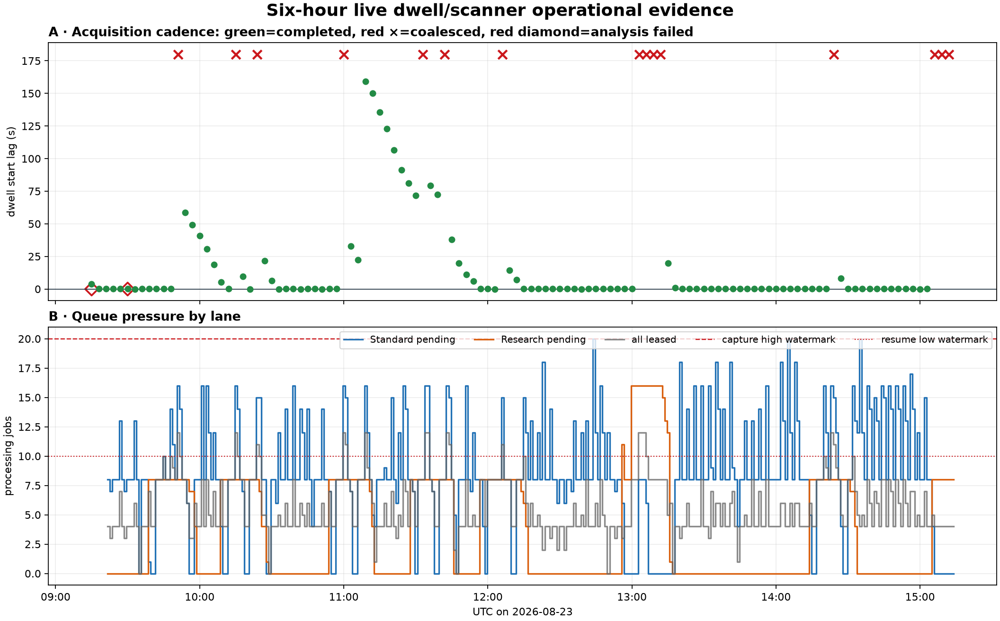
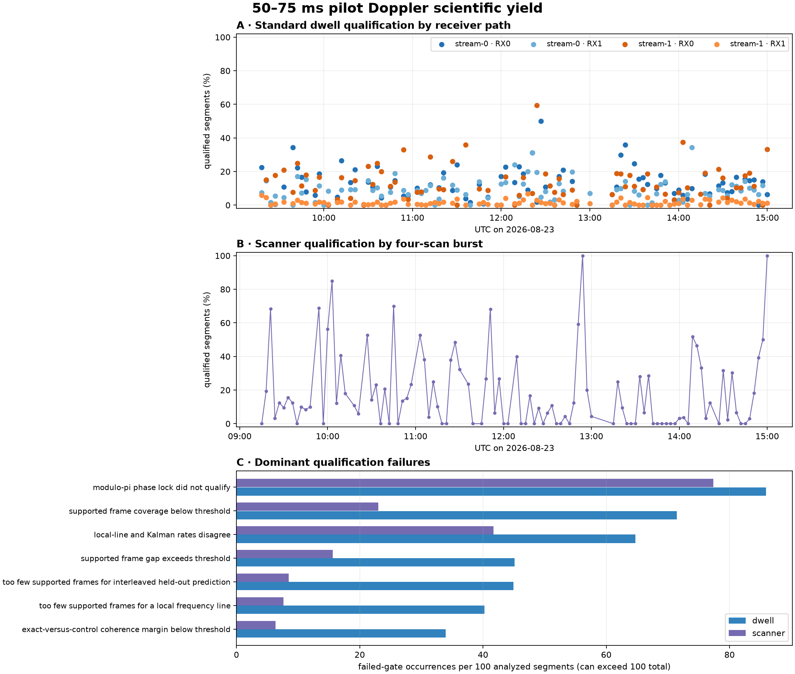
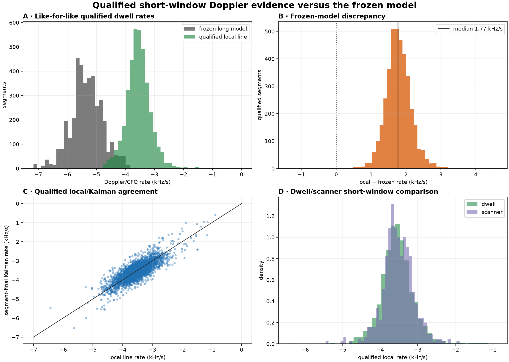
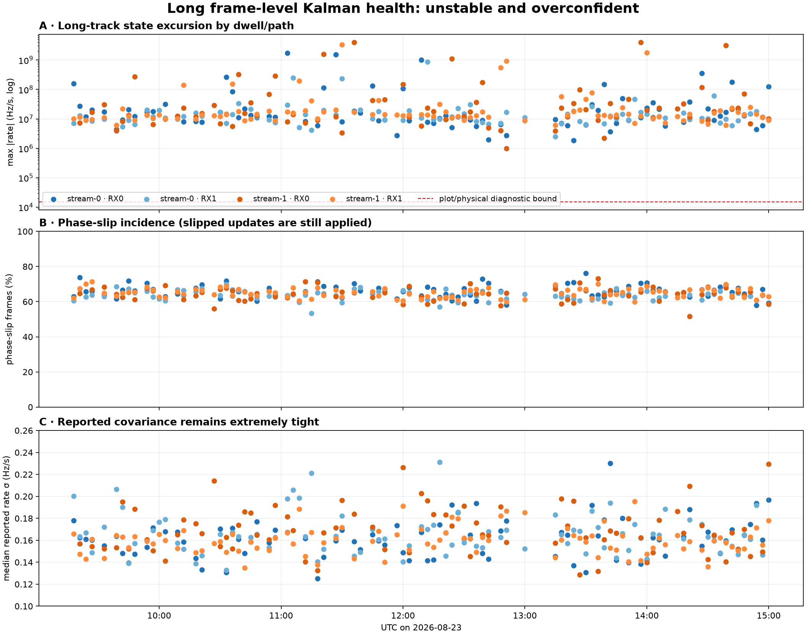

# Six-hour live dwell and scanner monitoring report

## Overview

This report audits the production Starlink dwell and scanner pipelines over the fixed interval
**2026-08-23 09:14:02–15:14:02 UTC**. The deployed source revision is
`88a5bc8b855f6e1f4edfbb8f627ad525e4ad3f77`.

The audit answers four questions:

1. Did live acquisition remain enabled, healthy, and correctly interspersed between 60 s dwells
   and scanner sweeps?
2. Did every resulting Standard run complete without retry, cancellation, backlog, or silent
   product loss?
3. Were every dwell and scanner pilot product and PNG present, digest-valid, decodable, and
   accessible through the production API used by the web UI?
4. What do the complete 50–75 ms segment population and frame-level Kalman states say about
   phase lock, local Doppler rate, frozen-model disagreement, and scientific fitness?

The report separates operational correctness from scientific qualification. A valid gray
failed-gate segment is not a publication failure. Conversely, a decodable PNG does not prove that
its underlying estimator is physically credible.

## Motivation

The newly deployed products expose per-frame carrier tracking and independently qualified local
Doppler-rate regions for both Standard dwells and retune-bounded scanner captures. A live run is
needed to verify more than renderer correctness: sustained cadence, failure propagation, UI
accessibility, empirical qualification yield, and the stability of the phase-derived carrier-rate
state all matter before these products can be treated as routine PNT evidence.

## Monitoring method

An independent collector samples production once per minute for the full six hours. It records:

- capture-control state and API response;
- API and acquisition service state and restart counts;
- active and failed worker counts;
- acquisition-operation state, retry count, duration, and error/outcome;
- Standard run and processing-job state, queue depth, queue age, retries, failures, and
  cancellations;
- storage utilization.

The core capture/service collector began exactly at 09:14:02 UTC. A second, lane-aware
processing-job collector began at 09:21:35 UTC, after the first failed run made per-lane queue
pressure material; its one-minute series therefore covers the remaining 5 h 52 min 27 s rather
than the first 7 min 33 s. Exact processing-job states, attempts, failures, and cancellations for
the full interval are reconstructed after the drain from durable database rows and the bounded
worker journal. The report does not infer minute-level Standard/Research queue depth for that
initial interval.

After the interval, the audit enumerates every in-window Standard run and scanner V3 bundle. Dwell
products are checked against the analysis registry for status, availability, byte size, and
persisted digest. Scanner bundles are inspected through all five production PNG routes, which
perform manifest and content-digest verification before serving. PNGs are then decoded and checked
for dimensions and nonempty pixel content. Every dwell JSON is also passed through its closed,
versioned Standard contract decoder; Research envelopes and payload digests are validated before
the shared Standard payload contract is decoded. Scientific JSON products are aggregated without
discarding failed-gate segments.

## Results

### Outcome at a glance

| Area | Six-hour outcome |
|---|---|
| Capture control and services | 361/361 valid samples; API/acquisition always active; 20/20 workers healthy; no restarts. An operator pause began at 15:04:37 UTC and is preserved as terminal state. |
| Dwell cadence | 105 captured and 15 coalesced intents; 96 Standard and 9 exclusive Research assignments. |
| Standard analysis | 94 succeeded, 2 failed; median 257.0 s, p90 303.2 s. |
| Research analysis | 8 succeeded, 1 failed; median 1,198.2 s, p90 1,269.6 s. |
| Scanner analysis | 104 bursts/416 bundles completed; one final intent is pending under the operator pause; median per-bundle analysis 10.79 s. |
| Persisted artifact integrity | 13,668 dwell and 3,328 scanner artifacts enumerated; zero byte/digest/decoder/PNG issues. |
| Web-UI accessibility | 3,304 focused dwell/scanner PNG routes requested after drain; zero hierarchy or route issues. |
| 50–75 ms scientific yield | Standard 3,864/50,957 (7.58%); Research 328/4,487 (7.31%); scanner 567/2,704 (20.97%). |
| Long frame-level Kalman | Standard: 5.84 M frames, 65.80% slips, 53.39% above 15 kHz/s, maximum 4.01 GHz/s, median reported rate sigma 0.162 Hz/s. |

### Operational cadence and runtime

The top panel below distinguishes capture cadence from downstream analysis success. Green points
are successful dwell starts measured against their three-minute intent, red crosses are coalesced
dwells, and open red diamonds are captures whose Standard run later failed. The queue panel separates
Standard and Research pending work and shows the global 20/10 capture-backpressure hysteresis.



Across the complete interval, the API and acquisition service remained active in every sample,
neither restarted, all 20 workers remained active, and no failed worker was observed. Root storage
peaked at 20% used. The queue reached 24 pending jobs (20 Standard and 16 Research in their
respective lane maxima), a maximum pending age of 1,191 s, three failed jobs, 33 cancelled jobs,
and one retried job. Capture control was `running` for 350 samples, then a web-UI operator pause at
15:04:37 UTC produced one `pausing` and ten terminal `paused` samples. The audit did not resume or
cancel externally controlled capture.

There were 105 successful dwell operations and 15 coalesced/cancelled intents. Successful dwells
took a median 104.87 s (p90 109.87 s). The 104 completed scanner sweeps took a median 61.77 s
(p90 65.47 s); paired dwell-plus-scanner cycles had median 167.40 s, p90 173.17 s, and maximum
186.47 s. Three cycles exceeded the nominal three-minute cadence. One scanner intent queued just
before the operator pause remains pending and has no product; it is explicitly excluded from
scanner-product denominators.

Standard completed 94 runs and failed two; successful runtime was median 257.01 s (p90 303.24 s,
maximum 321.76 s). Research completed eight and failed one; successful runtime was median
1,198.20 s (p90 1,269.57 s, maximum 1,374.16 s). The final in-window Research job required one
automatic retry after a native Python crash and sealed successfully during the bounded drain.

### Persisted products and web-UI accessibility

Artifact correctness is evaluated independently of scientific qualification. Every successful
dwell registry entry is checked against its immutable byte size and SHA-256 digest; JSON must parse
as an object, and PNGs must decode, have plausible dimensions, and contain nonconstant pixels.
Scanner V3 manifests and all referenced JSON/PNG digests are checked in the same way. The focused
PNG routes are then requested through the production API used by the web UI: three routes for every
dwell receiver path and five routes for every scanner capture.

The 94 successful Standard runs each published exactly 134 products, including 55 PNGs: 12,596
products totaling 29.36 GB. The eight successful Research runs did the same: 1,072 products
totaling 6.89 GB. Across their 408 receiver paths, every quality summary reported complete sample
coverage, zero missing samples, no constant-IQ receiver, and zero clipped complex samples.

The 104 scanner bursts produced 416 immutable bundles and 3,328 manifest-referenced artifacts,
including 2,080 PNGs. The scanner scientific pass found zero digest or structural integrity issues;
six of 2,704 segment records were explicitly unavailable/no-result evidence rather than missing
files. The exhaustive dwell byte/digest audit, closed-contract audit, PNG decode audit, and API
route audit are persisted beside the figures as `dwell-product-audit.json`,
`strict-contract-audit.json`, `scanner-png-audit.json`, and `web-ui-route-audit.json`.
They respectively checked 13,668 dwell artifacts, decoded 8,058 scientific JSON contracts, decoded
2,080 scanner PNGs, and requested 3,304 production artifact routes; every audit reported zero
issues.

### 50–75 ms segment qualification

Scientific yield is deliberately stricter than artifact publication. Panel A reports each Standard
dwell receiver path; panel B aggregates the four retune-bounded captures in each scanner burst; and
panel C normalizes each failed-gate occurrence by the number of analyzed segments so dwell and
scanner populations are comparable. A segment can fail more than one gate.



The direct local frequency line and the independently reset modulo-π segment Kalman agree closely
when every gate passes. The long frozen trajectory remains directionally more negative. The next
figure preserves like-for-like qualified segments when comparing estimators and shows scanner rates
only for independently qualified retune-bounded windows.



Standard analyzed 50,957 local windows and qualified 3,864 (7.58%); Research analyzed 4,487 and
qualified 328 (7.31%); scanner analyzed 2,704 and qualified 567 (20.97%). On qualified Standard
segments, median held-out frequency RMS was 22.98 Hz, the median absolute local-versus-segment-KF
rate difference was 170.20 Hz/s, and the median direct local-rate uncertainty was 148.30 Hz/s.
The qualified local, segment-KF, and frozen-model medians were respectively −3.558, −3.564, and
−5.336 kHz/s. Local minus frozen was positive for 3,857/3,864 qualified segments (99.82%), with a
median +1.767 kHz/s discrepancy. Scanner qualification showed the same local/KF consistency:
median held-out RMS 22.64 Hz, median phase-innovation RMS 0.271 rad, and median absolute
local/KF-rate difference 177.46 Hz/s.

### Long frame-level Kalman health

The long tracker is evaluated separately from the reset segment tracker. The figure uses persisted
states, not renderer clipping: panel A is the maximum absolute state rate per dwell/path on a log
scale, panel B is the fraction of returned frames declared slipped, and panel C is the track-median
reported rate uncertainty. This combination reveals whether a large state is accompanied by
appropriately large uncertainty.



The 94 successful Standard runs persisted 5,844,504 long-tracker frames. Of these, 3,845,789
(65.80%) were declared phase slips and every declared slip was still applied; 3,120,408 frames
(53.39%) exceeded 15 kHz/s in absolute rate. The maximum absolute persisted state was 4.006 GHz/s,
while the path-median reported rate sigma had median 0.162 Hz/s. The long-Kalman JSON alone occupied
5.40 GB, or 57.42 MB per successful Standard dwell. Research independently persisted 552,556
frames with 65.33% slips, 56.47% above 15 kHz/s, a 214.8 MHz/s maximum, and median reported sigma
0.166 Hz/s. These are state/uncertainty contradictions, not plot clipping.

## Confirmed issues observed during the interval

| Priority | Issue | Why it matters |
|---|---|---|
| P0 | Residual-Hough proposal invariant | A path-local sparse overlap aborts all four paths and all products for a dwell. |
| P0 | Kalman lattice/time ordering invariant | A crossed dense-probe observation aborts a Research run after most of its runtime and discards every path product. |
| P0 | Native Python analyzer crash | A Python 3.14 child process faulted in core allocation; retry recovered it, masking a probable memory-safety/concurrency defect. |
| P0 | Long frame-level Kalman instability | Persisted rate states are physically implausible while their reported covariance is extremely tight. |
| P1 | Low/intermittent segment qualification | Operationally green products often contain little PNT-qualified evidence. |
| P1 | Frozen-rate directional bias | Using the long model as truth would materially bias later range-acceleration inference. |
| P1 | Unspaced Research/backpressure coupling | Sampled Research work can cluster, drop consecutive cadence slots, and shift subsequent dwell/scanner timing. |
| P1 | `stream-1 · RX1` phase-yield anomaly | One path produces abundant candidates but qualifies an order of magnitude fewer segments. |
| P2 | Registry/scientific status ambiguity | A registry-only dashboard can misstate whether pilot evidence qualified. |
| P2 | Invalid-state persistence cost | Large V1 Kalman histories consume substantial storage without credible rate evidence. |
| P2 | Full-corpus five-minute reconcile | Repeated archive scans consume CPU/I/O and flood the journal with unchanged evidence. |
| P2 | Scanner pre-bootstrap rate semantics | Initialization transients are persisted and plotted as ordinary tracked rates. |
| P2 | Synchronous scanner-analysis cadence headroom | Four analyses keep the single acquisition supervisor busy long after radio capture, leaving little three-minute margin. |
| P3 | Silent zero-track rendering | A truthful no-result alternate-CFO PNG can look like a failed overlay. |

### 1. A sparse overlapping residual-Hough proposal can fail an entire Standard dwell

The Standard run for `cap-20260823T091503-ae0acd1df7cd` failed on `stream-0 · RX0` with:

```text
RunRejectedError: ValueError: exclusive residual-Hough proposal has fewer than two points
```

The selector accumulates point identifiers from earlier proposals and requires every subsequent
proposal to contribute at least two previously unseen points. Weighted Hough proposals are allowed
to overlap, so a valid but redundant/sparse later proposal can violate this assumption. The
exception is fatal rather than treating the proposal as inadmissible. Eleven peer/dependent jobs
were then cancelled, preventing a complete product and PNG set for the dwell. Acquisition
continued normally.

The same exception recurred on `cap-20260823T093000-8c791df0895a`, this time on
`stream-0 · RX1`, again causing one failed and eleven cancelled jobs. The recurrence on a different
receiver path rules out a single damaged RX0 product and makes this a pipeline reliability defect,
not an isolated presentation failure.

Fail-fast cancellation also does not interrupt sibling analyzers already executing. In each failed
run, three other `path-standard` workers continued dense processing for roughly another 50 seconds,
then attempted to publish and received `LeaseLostError` because their leases had been cancelled.
The database correctly retained only the original failing job, but the workers spent that interval
on results that could no longer commit, and the journal alternated between “1 failed” and “12 failed
or cancelled” summaries. Cooperative cancellation at bounded inner-loop checkpoints would recover
that capacity and make the failure count less confusing.

These were the only two failed Standard runs among 96 attempts (2.08%). The failing paths were
`stream-0 · RX0` and `stream-0 · RX1`; all 94 successful runs retained their exact 134-product
inventory. The defect is therefore sparse and path-data-dependent, but its blast radius is a whole
dwell.

### 2. Dense overlapping probes can violate the Kalman frame-order contract after a long run

The Research run for `cap-20260823T112531-8460cc6f3fd7` failed on
`stream-0 · RX0` with:

```text
RunRejectedError: ValidationError: 1 validation error for KalmanTrajectoryTrackV1
  Value error, Kalman frames must be unique and ordered
```

The failing path ran for about 18 minutes 21 seconds before constructing the persisted contract.
One job failed and the other eleven were cancelled, so the Research-assigned dwell published no
products. Three already-running sibling path jobs continued for another 40–47 seconds and then
received `LeaseLostError`, reproducing the cooperative-cancellation waste described above.

This is an ordering defect, not a duplicate frame left by the de-duplicator. `_build_track()` first
collapses observations into a dictionary keyed by rounded 750 Hz frame index and emits unique keys
in numerical order. `track_frame_observations()` then reorders those observations by measured
correlation-center time. The V1 contract finally requires returned frame indexes themselves to be
strictly ordered. With overlapping dense probes, two adjacent lattice bins can have correlation
centers in the opposite order; the filter accepts strictly increasing times, returns decreasing
frame indexes, and the contract rejects the whole product. Bounded frame selection preserves the
input sequence and cannot create a duplicate.

A two-observation reproduction—frame indexes 0 and 1 with crossed measured centers—reaches the
same contract error. Existing tests cover duplicate collapse within one rounded frame but not an
adjacent-index/time inversion. Resolve one canonical causal order before filtering: either coalesce
or reject a crossed measurement while preserving the 750 Hz lattice, and require both time and frame
index to increase. Sorting only the persisted frames after filtering would hide the contract error
without correcting the state-update order. Add a regression for crossed adjacent frames and a
Research-density end-to-end case, and validate the track incrementally so an ordering defect does
not surface only after an 18-minute computation.

The immediately following Research-assigned dwell completed all four paths and sealed after
1,221 s. The invariant failure is therefore data-dependent, not an unconditional property of the
Research configuration; dense overlap increases the opportunity for a crossed observation but
does not guarantee one.

### 3. The long frame-level Kalman carrier-rate state can become physically unstable and severely overconfident

Across all 94 successful Standard runs, local 75 ms frequency lines retained held-out errors of only
tens of hertz, while the long frame-level Kalman state reached an absolute rate of **4.006 GHz/s**.
It marked 3,845,789/5,844,504 frames (65.80%) as phase slips. Those observations were still applied
to the state; the slip flag is diagnostic and does not gate or reset the update.

The same path products reported a median Doppler-rate uncertainty of **0.162 Hz/s**. The configured
carrier-frequency measurement sigma is only **0.005 Hz**, orders of magnitude below empirical
per-frame discriminator error. The combination of ingesting wrapped/slipped phase innovations and
an unrealistically tight measurement covariance causes state excursions while covariance collapses.

This is not a renderer artifact: the persisted Kalman states contain the excursions, and the focused
PNG explicitly counts clipped states. Independently reset 50–75 ms segment trackers are materially
better behaved, and direct local frequency slopes remain the most credible rate observable at this
stage.

The eight successful Research-assigned dwells independently reproduced the failure: 360,958 of
552,556 returned frames (65.33%) were marked slipped, every slipped frame was still applied, and
the maximum absolute rate reached 214.8 MHz/s while path-median reported sigma remained near
0.166 Hz/s. Their 328 fully qualified local segments simultaneously retained a 24.57 Hz median
held-out error. This rules out a Standard-only renderer or cadence artifact.

### 4. Scientific segment yield is intermittent even when publication is healthy

Scanner bursts ranged from no qualified segments to more than half of analyzed segments,
despite every bundle and PNG publishing successfully. The four positions inside a burst had similar
aggregate yield and held-out error, so this was not a simple first/last-scan warm-up effect. Variation
was primarily burst-to-burst and was dominated by phase-lock and local/Kalman agreement gates.

The complete dwell population showed the same separation between frequency evidence and
phase-state qualification: only 3,864/50,957 Standard segments (7.58%) passed every gate, even
though qualified held-out local-line RMS had a 22.98 Hz median against the configured 100 Hz gate.
Phase lock, coverage, and local/Kalman disagreement rejected most candidates. Operational success
therefore must not be presented as PNT-quality success; both counts belong in monitoring and the UI.

This intermittency is not explained by damaged input files. Every successful Standard and Research
path quality summary inspected in the interval reported 100% sample coverage, zero missing samples,
no constant-IQ receiver, and zero clipped complex samples across all 408 successful Standard and
Research paths. Low pilot yield is therefore downstream signal/estimator evidence, not a raw-capture
coverage failure.

### 5. Registry status is stage-level and can disagree with scientific product status

Every product emitted by `path-standard` inherits the overall path-report outcome in the analysis
registry. The pilot-segment JSON also carries its own scientific status. Live examples included
registry `complete` products whose internal pilot status was `insufficient_data` because 0/32 or
0/64 segments qualified, and registry `partial_coverage` products whose pilot JSON was internally
`complete` because at least one segment qualified.

This is consistent with the fused-stage implementation, but it is an observability trap: querying
`analysis_product.status` alone does not measure pilot/PNT success. Monitoring and UI summaries must
read the typed pilot product's analyzed and qualified counts and internal status. The two status
domains should be labeled explicitly as operational path coverage and scientific pilot result.

### 6. The frozen long-baseline rate is systematically more negative than credible local rates

The complete dwell population shows a directional discrepancy, not symmetric estimator noise.
Among fully qualified Standard segments, 3,857/3,864 (99.82%) had local-minus-frozen rate greater
than zero. The median offset was **+1.767 kHz/s**, with a 10th–90th percentile range of +1.354 to
+2.229 kHz/s.

Among segments that passed every gate, the direct local and segment-final modulo-π Kalman medians
were −3.558 and −3.564 kHz/s, while the frozen model median was −5.336 kHz/s. Median local slope
uncertainty was 148.3 Hz/s and median held-out RMS was 22.98 Hz, making the 1.767 kHz/s frozen
discrepancy much larger than local statistical error. Because carrier bias
changes are present, a long trajectory fit can absorb piecewise carrier discontinuities into its
slope. It should therefore remain an association/reference model, not the truth source for local
Doppler rate.

The sign was not driven by one bad receiver. Early path medians ranged only from about +1.58 to
+1.71 kHz/s. Three paths were positive in more than 96% of usable segments; the noisier fourth path
was positive in 87%. This rules out a single RX channel as the sole cause, although it does not by
itself distinguish common receiver/clock drift from a systematic long-model bias or true satellite
motion.

This result supports using independently qualified 50–75 ms local slopes as the primary short-window
rate observable. It still does not establish satellite range dynamics until receiver common mode and
orbit agreement are demonstrated.

Research showed the same direction on 327/328 qualified segments: median local rate −3.577 kHz/s,
frozen rate −5.208 kHz/s, and local-minus-frozen **+1.721 kHz/s**. The independent lane therefore
corroborates the Standard bias direction even though its denser probe policy changes the selected
population.

### 7. The exclusive 1-in-8 Research sampling policy can suppress later live dwells

The dwell scheduled for 09:51 UTC was admitted to the durable acquisition queue but never leased.
At 09:54 it was cancelled as designed and superseded by the newer cadence intent. The corresponding
09:51 scanner burst was also lost, but no cancelled `scanner_sweep` operation was persisted; its
absence is only inferable from the three-minute cadence. The previous dwell plus scanner sweep had
finished at about 09:50:59, so the radio itself was free. Admission was suppressed by processing
backpressure: total pending jobs exceeded the 20-job high watermark. The same dwell-plus-scanner
loss recurred at 10:15 UTC during the second Research sample.

Production uses a versioned deterministic manifest bucket to send one eighth of ordinary new dwells
to the Research lane. The lane choice is exclusive: a selected dwell gets Research products rather
than a simultaneous Standard run. The first in-window Research sample took 1,221 s and published
134 products occupying 852.7 MiB. While it was active, it contributed roughly 5–8 pending and four
leased jobs; overlapping live Standard runs contributed the rest. Without those lower-priority
Research jobs, the observed Standard pending count remained below the high watermark. A second
Research sample entered the same state about 30 minutes later, demonstrating that this is a
recurring consequence of the production sampling policy, not an accidental manual reprocess.

The backpressure snapshot is lane-blind, so Research work that is correctly lower priority at
worker claim time can still suppress new live acquisition before workers claim it. The 20/10
hysteresis then prolongs suppression until the combined queue falls below ten. The exclusive lane
choice also means that a user expecting a Standard product on every successful dwell will see an
intentional Standard gap for Research-assigned captures; the UI and monitoring should label this as
lane assignment, not missing analysis. Persist a terminal suppressed/coalesced scanner intent as
well, so cadence accounting does not have to infer missing scanner bursts from wall-clock gaps.

A third deterministic Research sample ran for 1,193 s and reproduced the operational pattern. The
11:00 dwell was coalesced with no persisted scanner intent. Recovery dwells then started 33 s and
22 s late before the 11:09 dwell waited 159 s despite the radio becoming free at 11:09:20. That late
start propagated through the following dwell/scanner pairs even after Research sealed at 11:12:38.
Research pressure therefore causes both discrete missing cadence slots and a longer phase shift of
the otherwise three-minute acquisition sequence.

A fourth Research sample began at 11:27:16 from the dwell scheduled for 11:24. Combined pending
work reached 24 jobs while 12 more were leased. The 11:33 dwell then remained unleased after the
radio became free, was superseded at 11:36, and had no persisted scanner intent. This is a fourth
independent reproduction of Research-coupled cadence loss during the observation window.

The fifth Research sample began at 11:55:54. Pending work again crossed the high watermark, and the
12:06 dwell remained unleased for the entire cadence period before being superseded at 12:09; its
scanner intent was again absent. The 12:09 replacement leased 14 seconds later once pending work
had fallen below the resume threshold. This independently reproduces both the discrete lost slot
and the low-watermark recovery behavior.

The policy also has no spacing or maximum-concurrency guarantee. Its immutable-manifest digest
bucket is uniform in aggregate, but adjacent captures are independent enough to cluster. It selected
both the 12:54 and 12:57 dwells for Research, creating two simultaneous dense runs with 16 Research
jobs pending and eight leased. After the 13:00 Standard dwell added its jobs, the queue reached 24
pending plus 12 leased. The 13:03, 13:06, 13:09, and 13:12 dwell intents were then successively
superseded; no scanner intent was persisted for any of them. Capture resumed at 13:15:19, once
pending work fell below the ten-job low watermark. Thus one adjacent bucket collision suppressed
four consecutive dwell/scanner opportunities over 12 minutes even though the radio had been free
since 13:02:51. Tests prove bucket uniformity, but do not bound adjacent Research selections or
concurrent dense runs.

Both clustered Research runs ultimately succeeded and published their complete inventories, sealing
at 13:15:46 and 13:16:06. The four lost capture slots therefore cannot be attributed to either
known Research exception; they are the direct operational cost of otherwise-successful concurrent
dense analysis under the shared hysteresis policy.

The next isolated Research assignment at 14:12 reproduced the milder form: the 14:24 dwell was
superseded, then the 14:27 replacement leased 8.2 seconds late after pending work fell to eight.
This controlled contrast—one lost slot with one dense run versus four consecutive lost slots with
two—shows why spacing/concurrency control matters independently of lane-aware backpressure.

Backpressure itself is working as implemented, and coalescing prevents duplicate overdue captures.
The issue is policy coupling: live capture cadence is being reduced by sampled Research work. Use a
lane-aware or weighted admission signal, defer Research expansion while live Standard pressure is
high, or reserve worker capacity for the live lane. Preserve a hard total-resource/storage guard
separately so capture cannot grow an unsafe backlog.

The final three coalesced dwell slots at 15:06, 15:09, and 15:12 UTC have a different cause and are
not counted as Research/backpressure evidence: the web-UI operator paused capture at 15:04:37 UTC.
The paired 15:03 scanner intent had already been queued and remains pending under that pause. This
report preserves the operator state and does not infer a pipeline failure or resume acquisition.

### 8. The invalid long-Kalman history has a material persistence cost

The complete Standard product set is intentionally evidence-rich, but the unstable long
frame-level Kalman history is also one of its largest additive products. Across 94 successful
in-window dwells, `standard.kalman-tracking` occupied **5.40 GB**, or **57.42 MB per dwell** across
four receiver paths. The full immutable Standard product set occupied 29.36 GB, or 312.31 MB per
successful dwell.

Persistence is working correctly and no corruption was found; the issue is the value of the bytes
being retained. Until the long tracker passes innovation and covariance-consistency tests, keeping
hundreds of thousands of overconfident, slipped state updates per dwell adds storage and audit cost
without adding credible rate evidence. Preserve the published V1 contract, but consider an explicit
replacement product with bounded diagnostic sampling and aggregate innovation statistics after the
estimator itself is corrected. Do not silently rewrite or remove already published V1 products.

### 9. A valid no-track alternate-CFO PNG is visually ambiguous

The lowest-contrast PNG in the final inventory was not corrupt or blank. It was the
`standard.alternate-cfo-tracks-png.v2` product for
`cap-20260823T091800-9bd536243a3e · stream-1 · RX0`: the underlying candidate bank truthfully
reported zero returned tracks, while the figure retained the full gray source-point cloud. Unlike
the zero-result pilot-segment-rate PNG, however, the alternate-CFO renderer did not annotate
“0 tracks returned” or explain the absence of colored overlays. A human can therefore mistake a
valid zero-result figure for a rendering failure. Add an explicit zero-result annotation and retain
the raw evidence points; this is a presentation-clarity defect, not lost scientific data.

### 10. Five-minute reconciliation repeatedly scans and prints the entire historical corpus

`leo-reconcile.timer` starts a full `process reconcile --json` pass five minutes after every prior
start. `RecordingStore.reconcile()` glob-walks every dated recording directory and inspects every
bundle; the returned CLI contract then contains every already-cataloged session identifier and
every historical incompatibility. One live invocation returned **1,080 existing sessions, 107
historical incompatibilities, zero new registrations, and zero queued runs**. Because JSON output
is pretty-printed into journald, that no-change invocation occupied 1,214 journal lines.

Across the six hours, 72 invocations started and 71 completed before the boundary. A completed pass
used median **34.26 CPU seconds, 33.58 wall seconds, and 318.6 MiB peak memory**. Together they
consumed 2,516.6 CPU seconds and 2,495.8 wall seconds. The bounded journal contained 87,822 lines
(4.98 MB), including 7,597 repeated historical-incompatibility lines and 72 Matplotlib temporary-
cache warnings. The process exits successfully, so service-health monitoring remains green while
this load and log noise repeat.

This did not corrupt a live product, but it is avoidable CPU, memory, metadata-I/O, release-startup,
and observability load concurrent with analysis workers. Reconcile incrementally from a durable
cursor or a recording-commit journal; retain a slower bounded full audit as a separate task. Record
known historical incompatibility fingerprints once and report count/delta summaries by default,
with bounded detailed evidence on demand. The lightweight reconcile entry point should also avoid
importing Matplotlib, or set a persistent writable `MPLCONFIGDIR`, so every pass does not rebuild
the font cache. New or changed failures must remain visible rather than being globally suppressed.

### 11. Scanner PNGs present pre-bootstrap rate transients as ordinary tracked states

The reset 50–75 ms tracker has a robust causal rate bootstrap after 12 supported frames and a
configured maximum absolute rate of 15 kHz/s. Before that bootstrap, however, phase/frequency
updates can drive the unconstrained rate state beyond the configured maximum; the clamp is applied
only in the `elif rate_bootstrapped` branch. In all 104 bursts, 4,992 of 136,822 persisted scanner
frame states exceeded 15 kHz/s, all before the twelfth supported frame. The maximum was 236.2
kHz/s. This affected 300 otherwise-qualified segments (497 early frames, maximum 54.1 kHz/s), while
no qualified post-bootstrap state exceeded 15 kHz/s.

This does **not** invalidate the qualified segment-final rate: phase qualification requires at
least 20 supported frames, and the local/Kalman agreement gate uses the final, post-bootstrap
state. It does make the frame-level presentation scientifically ambiguous. The internal
`PilotPntKalmanFrame` has a `doppler_rate_bootstrapped` flag, but `ScannerPilotFrameStateV1` does not
persist it. Panel C therefore labels the early orange points as “tracked rate on supported frames”;
it counts off-scale points but cannot tell a human that they precede rate initialization.

Keep V1 immutable. In an additive scanner product, persist rate-valid/bootstrap state (and ideally
rate sigma), render pre-bootstrap states with a distinct nonphysical-initialization style, and
separate pre-bootstrap excursions from post-bootstrap/clamped counts. Either bound the rate from
the first frame or explicitly mark it unavailable until the robust bootstrap; add a qualification
invariant that no post-bootstrap state exceeds the configured bound.

### 12. `stream-1 · RX1` has a persistent phase/rate qualification deficit

The final Standard population contained 18,081 analyzed segments on `stream-1 · RX1`, but only
282 qualified (1.56%). The other three paths qualified 8.83–13.38%. Research independently
reproduced the ordering: `stream-1 · RX1` qualified 21/1,646 (1.28%), while the other Research
paths qualified 9.64–15.30%.

This is specifically a phase/rate-quality problem, not missing IQ or an absence of candidates.
`stream-1 · RX1` had the largest segment population and complete raw sample coverage. Its median
exact coherence (0.0777) was comparable to `stream-1 · RX0` (0.0847). Yet its median
phase-innovation RMS was 0.760 versus 0.517 rad and frequency-line RMS was 36.85 versus 21.40 Hz.
Scanner RX1 showed the same direction at lower severity: 15.14% qualified versus 30.21% on RX0,
despite RX1 having materially fewer coverage/too-few-frame failures.

The evidence does not identify the cause. Receiver paths can select different emitters, so this is
not yet a same-signal hardware comparison; it could reflect candidate population, antenna/LNB or
channel phase noise, clock/LO behavior, or estimator covariance that is not path-calibrated. Keep
the gates fixed while diagnosing. Monitor phase innovation, frequency-line residual, and yield by
physical radio/receiver/edge; then perform explicit contemporaneous same-emitter association before
comparing channels. A controlled input-path swap or common-source test can distinguish RF-chain
from receiver-channel effects without weakening scientific qualification.

### 13. Synchronous scanner analysis leaves little acquisition-cadence headroom

An ordinary successful dwell plus its paired scanner operation used a median 167.40 s in the final
population, with a 90th percentile 173.17 s and a maximum of 186.47 s. Three cycles therefore
exceeded the fixed three-minute cadence by up to 6.5 s even without a backpressure cancellation.
These short intrinsic overruns explain a small class of late starts that must not be attributed to
Research. No dwell was lost solely because of one such overrun, but the normal path has little
margin for capture, storage, or analysis variance and compounds recovery after queue suppression.

The radio capture lease is correctly scoped around the four physical sweeps, but the single
acquisition supervisor does not complete its `scanner_sweep` operation afterward. It synchronously
publishes and analyzes all four immutable bundles before claiming the next acquisition operation.
Per bundle, physical capture took median 1.89 s while Standard scanner analysis took median 10.79 s;
four serial analyses therefore dominate the roughly 62 s scanner-operation median after the radio
has finished collecting IQ.

Persist all four raw scanner bundles while holding capture authority, then complete the acquisition
phase and enqueue immutable, content-deduplicated scanner-analysis jobs outside the single radio
supervisor. Preserve a durable parent/burst status so the UI can distinguish “captured, analysis
pending” from complete publication. Keep an overall storage/worker-pressure guard, and prove with a
soak test that asynchronous publication cannot duplicate an analysis or let raw bundles become
unbounded. This would add cadence margin without weakening scanner scientific contracts.

### 14. A native Python analyzer crash can be hidden by a successful retry

The final in-window Research run for `cap-20260823T150300-92ac23cd745f` experienced a native child
failure at 15:13:51 UTC. Job 26721 attempt 1 exited with `isolated analyzer exited without a
receipt`; the kernel recorded a Python 3.14 `ThreadPoolExecu` general-protection fault. Address
resolution against the installed Python build maps the repeated instruction pointer `0x50b94c` to
`PyObject_Malloc`. There was no OOM or I/O failure. Attempt 2 on the same worker succeeded and the
Research run sealed at 15:27:34 during the bounded downstream drain.

Automatic retry preserved the final scientific inventory, but that is exactly why this is a P0
observability and safety issue: a successful run state can conceal native memory corruption. The
independent eight-hour operational audit found two earlier instances on different workers—one
segmentation fault resolving to `_PyObject_GC_NewVar` and one general-protection fault at the same
`PyObject_Malloc` address—both also recovered on retry. The common allocation sites strengthen a
memory-corruption or unsafe concurrent-native-execution hypothesis, but without a core/native
backtrace that remains an inference rather than a root cause.

Enable bounded core capture for isolated analyzer children, record signal/address/build ID and
attempt history as durable run diagnostics, and reproduce under sanitizer-compatible native
libraries or reduced thread concurrency. A retry should remain available for service continuity,
but a recovered native crash must raise a distinct degraded/safety alert rather than disappear
inside a green terminal run.

## Scientific interpretation boundary

All rates in this report remain receiver-relative CFO/Doppler rates. A well-qualified local slope is
evidence of continuous short-window carrier motion, but it is not yet a satellite range-rate or
range-acceleration estimate. Promotion requires dual-receiver common-mode rejection and external
orbit/TLE agreement. Scanner segments additionally reset at every retune and never claim continuity
across retune boundaries.

For scale only, if an observed rate were entirely kinematic at an 11.3 GHz carrier,
`range acceleration = -c × Doppler rate / carrier frequency`. The qualified local median of
−3.558 kHz/s would correspond to about +94 m/s² line-of-sight range acceleration, versus about
+142 m/s² for the −5.336 kHz/s frozen median; their difference is roughly 47 m/s². These are not
range estimates, and the conversion is not a claim that receiver/LNB or transmitter frequency drift
is absent. It shows why choosing the wrong rate estimator would materially alter any later orbit fit.

The current products also do not associate an emitter across receiver paths. A scanner target and
edge can contain different CFO candidates on RX0 and RX1; matching only by target would therefore
compare different signals. In one early example the two CH1-lower receiver segments were separated
by about 568 kHz in local CFO and used confirmation ranks 4 and 0. Their rate disagreement is not a
valid common-mode test. Dwell trajectory identifiers are likewise path-local. A truthful dual-path
test needs an explicit association gate using contemporaneous time, canonical CFO/alias, edge,
frequency evolution, and preferably TLE support before receiver differences are interpreted.

## Recommendations

The complete interval supports these concrete actions, ordered by scientific and operational risk:

1. **Make redundant residual-Hough proposals nonfatal.** Treat a proposal with fewer than two new
   exclusive points as inadmissible or coalesce it with its containing proposal; do not abort the
   path. Add regression cases for identical, fully contained, and one-new-point proposals, and an
   end-to-end Standard test proving that one sparse proposal cannot cancel the remaining dwell.
   Independently, contain an unexpected path failure: allow unaffected receiver paths to finish and
   publish, mark the run/path inventory partial with the explicit failing path, and suppress only
   downstream products whose required inputs are missing. One path-local exception should not erase
   all four path results. If a run is deliberately failed fast, propagate cooperative cancellation
   into the dense analyzer loops so cancelled workers do not spend another minute on unpublishable
   results.
2. **Make Kalman lattice order causal and fail early.** Coalesce or reject observations whose
   measured center crosses the order of adjacent 750 Hz lattice indexes, then require both index
   and time to increase before entering the filter. Add crossed-frame and dense-Research regression
   cases; do not conceal a wrong update sequence by sorting only the output contract.
3. **Capture and surface native analyzer crashes even when retry succeeds.** Persist the child
   signal, instruction address, Python/native-library build IDs, worker, and attempt chain; enable
   bounded core dumps and obtain a native backtrace. Reproduce with reduced thread counts and
   sanitizer-compatible numerical libraries before assuming the allocator is causal.
4. **Do not publish the long frame-level Kalman rate as physically tracked while slips are ingested.**
   Gate, coast, or explicitly reset phase on a declared slip. Calibrate phase and frequency
   measurement covariance from held-out pilot residuals, then require normalized-innovation and
   covariance-consistency tests. Until those pass, the direct qualified local line is the primary
   Doppler-rate estimate and the long Kalman state is diagnostic.
5. **Persist an explicit cross-path emitter association before common-mode claims.** Match by time,
   canonical CFO/alias, edge, short-window frequency evolution, and external orbit support. Never
   equate two scanner segments merely because channel and edge agree.
6. **Monitor scientific yield independently of pipeline success.** Track segment qualification,
   phase-lock yield, local/Kalman disagreement, frozen discrepancy, clipped-state fraction, and
   held-out error by receiver path and pipeline release. A green run with mostly gray segments is
   operationally correct but scientifically low-yield.
7. **Bound the corrected long-tracker evidence volume in a new contract.** Retain enough frames to
   reproduce resets, innovations, and representative accepted/coasted regions, plus complete
   aggregate counts. Preserve V1 immutability; make any reduced representation an explicit new
   product/version whose digest and truncation policy are visible.
8. **Decouple and space Research sampling.** Make queue pressure lane-aware or reserve Standard
   capacity, while retaining a separate hard total-resource guard. Admit at most one dense Research
   run at a time (or enforce a measured minimum spacing) and defer a selected manifest rather than
   launching adjacent samples. Test long-run allocation, adjacent bucket collisions, restart-safe
   deferral, and maximum concurrent Research work. Persist a terminal scanner intent whenever
   backpressure suppresses a cadence slot so the loss is directly observable instead of inferred.
9. **Make every zero-result PNG self-describing.** Keep the source evidence visible, but annotate
   the relevant zero count and reason whenever no overlay survives selection. Include zero-result
   renderer tests for both dwell and scanner presentations.
10. **Make routine reconciliation incremental and its evidence bounded.** Use the durable recording
   commit path/cursor for frequent repair, move full-corpus inspection to a slower explicit audit,
   and emit counts plus changes instead of thousands of unchanged identifiers. Cache or avoid
   Matplotlib in this non-rendering service and retain a bounded drill-down for newly changed
   incompatibilities.
11. **Do not label a pre-bootstrap scanner state as a physical rate.** Persist a bootstrap/validity
   flag and uncertainty in a new scanner contract, style initialization states separately, and
   monitor pre- and post-bootstrap excursions independently. Enforce the configured rate bound as
   a post-bootstrap contract invariant.
12. **Investigate the receiver-path yield anomaly without relaxing gates.** Add per-radio/receiver
    phase, line-residual, and qualification dashboards. Require same-emitter association for
    cross-channel comparison, then use a controlled common-source or input-swap test to separate
    candidate-selection, RF-chain, and receiver-channel causes.
13. **Move immutable scanner analysis off the single acquisition supervisor.** Persist the four
    captured bundles under the radio lease, then enqueue digest-deduplicated analysis jobs and expose
    an explicit captured/analysis-pending/published lifecycle. Retain bounded global backpressure and
    test restart, duplicate-enqueue, and orphan-bundle recovery before deployment.

## Evidence inventory and reproducibility

The fixed raw monitor evidence is retained on the analysis host at:

```text
/var/tmp/leo-six-hour-monitor-20260823T091357Z
```

The repository evidence directory
[`figures/2026_08_23_six_hour_live_monitor`](figures/2026_08_23_six_hour_live_monitor/)
contains the exact run/operation/product inventories, `facts.json`, four summary figures, and these
independent audit outputs:

- `dwell-product-audit.json`: immutable dwell file presence, byte size, digest, JSON object, and PNG
  decode checks;
- `strict-contract-audit.json`: every Standard scientific JSON and Research envelope/payload through
  its closed versioned contract and content-digest validation;
- `scanner-png-audit.json`: 2,080 scanner PNG digest/decode/dimension/nonconstant-pixel checks;
- `web-ui-route-audit.json`: focused dwell and scanner PNG requests through the production API;
- `standard-runs.csv`, `research-runs.csv`, and `acquisition-operations.csv`: exact population
  denominators, including the three failed dwell runs and the operator-paused scanner intent;
- `dwell-pilot-segments.csv.gz`, `research-pilot-segments.csv.gz`, and
  `scanner-pilot-segments.csv.gz`: deterministically compressed, lossless segment-level aggregate
  inputs.

Two independently prepared eight-hour reports provide a wider-boundary cross-check:

- [operational audit](2026_08_23_eight_hour_dwell_scanner_operational_agent.md)
- [scientific audit](2026_08_23_eight_hour_dwell_scanner_science_agent.md)

All dwell runs in the fixed populations identify release
`88a5bc8b855f6e1f4edfbb8f627ad525e4ad3f77`. Scanner V3 manifests do not currently persist an
equivalent pipeline-release identifier; that provenance omission is itself recorded in the
independent science audit.
