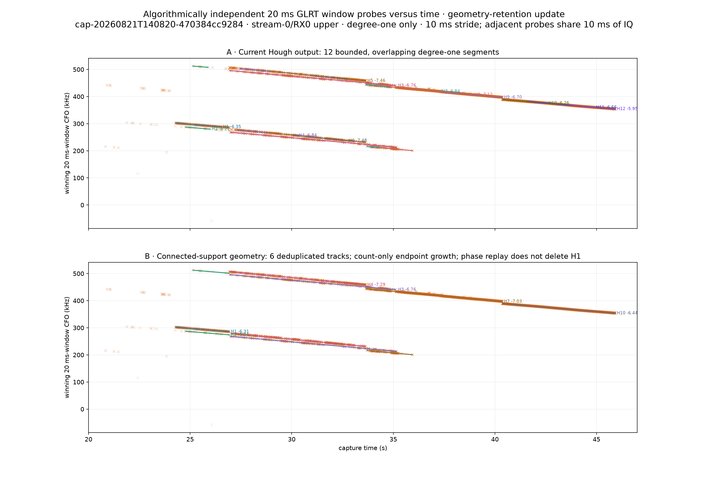
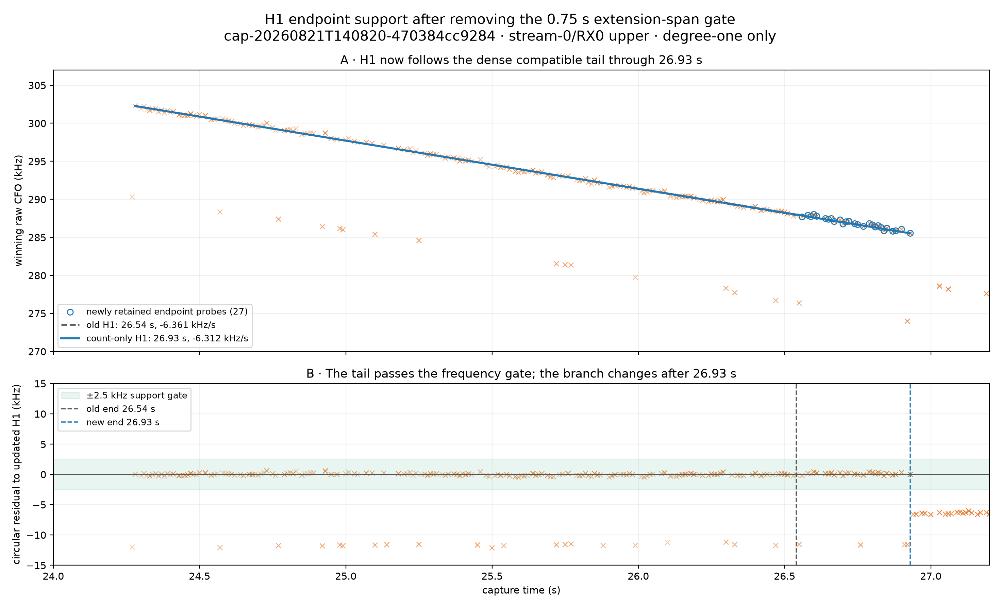

# Connected-support geometry retention after the H1 replay audit

## Result

The earlier four-track lower panel was not a neutral support-closure result. It deleted H1, H4, and H6 using the tracking-CFO residual-consumption replay test. The updated view keeps line geometry and known-pilot evidence separate from phase-correction qualification. Connected support therefore yields six deduplicated geometric tracks, including H1. Endpoint growth requires eight connected compatible probes but no longer requires the tail to span 0.75 s.

## Retained geometry

| Track | Seed interval | Closed interval | Rate | Seed support | Closed support | Status |
|---|---:|---:|---:|---:|---:|---|
| H1 | 24.28–26.54 s | 24.28–26.93 s | -6.312 kHz/s | 152 | 190 | strong pilot geometry; original-seed transport replay 163/163 P→P |
| H2 | 24.77–25.99 s | 24.77–26.92 s | -6.243 kHz/s | 14 | 23 | low-support geometry; phase qualification pending |
| H4 | 27.34–30.27 s | 26.94–33.64 s | -7.287 kHz/s | 93 | 453 | geometry retained; residual-consumption replay is diagnostic only |
| H3 | 26.96–35.15 s | 26.96–35.15 s | -6.755 kHz/s | 223 | 247 | previous residual-consumption replay had zero P→N |
| H7 | 33.66–37.31 s | 33.66–40.36 s | -7.030 kHz/s | 207 | 608 | previous residual-consumption replay had zero P→N |
| H10 | 40.37–42.55 s | 40.37–45.92 s | -6.441 kHz/s | 132 | 556 | previous residual-consumption replay had zero P→N |

## H1 evidence

Count-only endpoint growth expands H1 from 26.54 to 26.93 s and from the previous span-gated closure's 163 probes to 190 geometric probes. The separate seed-policy replay audit covers those original 163 associated probes. The current replay keeps 65 and changes 98 from positive to negative. Transporting the acquisition coordinate keeps 163/163 positive with zero P→N transitions. Its median margin is 0.2249, versus 0.2254 before correction.

H2 remains visible as low-support geometry. It is not promoted to phase correction merely because it appears in this panel. Likewise, retaining H1 as evidence does not claim satellite attribution or phase continuity.

Machine-readable geometry: [`geometry-retention.json`](figures/2026_08_23_support_extension_geometry_retention/geometry-retention.json)

This is a research-only, degree-one analysis and changes no Standard product.
