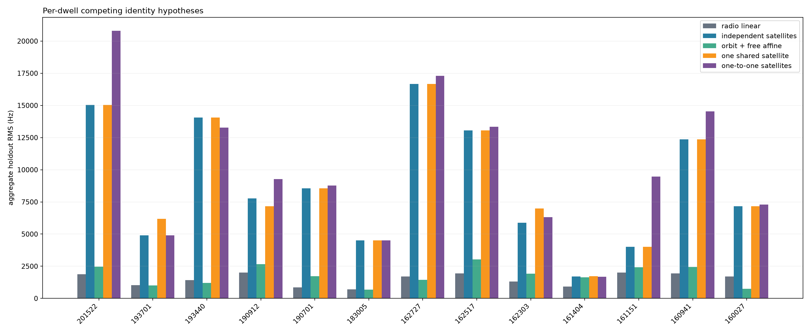
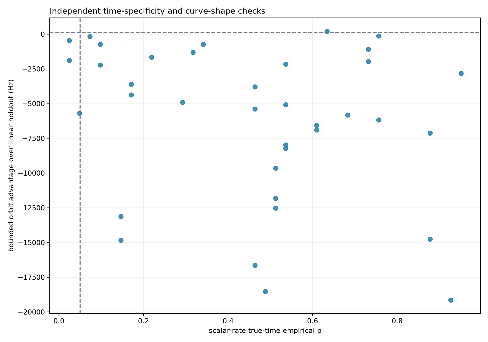

# Fresh 13-dwell Starlink association audit

**Date:** 2026-08-23 UTC

**Radio source:** 13 newly sealed Standard runs at release `e71412cf7ff716e7a25dd846fc926f0b80dd9b12`

**Report analysis:** `main` and `origin/main` at `292dd4dc3864334a909bc41e10884903b1d323e4`

**Outcome:** **0 of 37 eligible tracks can be securely associated with a known Starlink satellite.**

This is a negative association result, not a negative signal-detection result. The same captures contain many independently detected, strictly linear radio tracks and locally qualified known-pilot windows. What fails is the stronger step from “a Starlink-like radio track exists” to “this track is satellite X.”

## Inputs were rebuilt before association

All 13 dwell analyses were rerun and sealed before this audit. The strict-linear report then reopened each digest-verified `standard.pilot-scan` V3 product and fitted a new trajectory bank with `polynomial_degrees=(1,)`. It did not read membership from persisted raw-family, de-aliased, replay, or final trajectory banks. This produced 181 raw degree-1 tracks and 180 selected pre-replay families.

The association stage preselected the three longest families per dwell before looking at a TLE. Tracks shorter than 5 s or with fewer than 50 observations were excluded, leaving 37 eligible tracks across 13 dwells.

- [Fresh 13-dwell strict-linear report](2026_08_23_thirteen_dwell_degree1_fresh.md)
- [Strict-linear machine evidence](figures/2026_08_23_thirteen_dwell_degree1_fresh/five-dwell-d1only-evidence.json)
- [Association machine evidence](figures/2026_08_23_thirteen_dwell_starlink_association_fresh/multi-dwell-starlink-association.json)
- [All 37 track outcomes](figures/2026_08_23_thirteen_dwell_starlink_association_fresh/multi-dwell-track-summary.csv)

The new full-capture 20 ms diagnostic recently merged to `main` is additive and is not an input to this refit. The Pilot Scan V3 candidate implementation used here is unchanged relative to the sealed run release.

## Association test

For each eligible track:

1. The chronologically first 60% of radio observations selected the satellite identity, frequency offset, bounded epoch adjustment, and nuisance drift.
2. The final 40% was held out from identity selection and scored once.
3. Every Starlink object continuously visible above 10° for at least 95% of the radio interval was considered from the latest causal Space-Track snapshot.
4. The primary physical nuisance model allowed a constant offset, drift bounded to ±200 Hz/s, and epoch adjustment bounded to ±0.30 s.
5. The result was compared with a radio-only straight line, a free-affine orbit model, ±2 s epoch diagnostic, wrong-time scalar-rate controls, the preceding causal TLE snapshot, shared-satellite and one-to-one assignments.

A secure association required all of these gates:

- held-out orbital residual RMS ≤500 Hz;
- at least 100 Hz held-out advantage over the radio-only straight line;
- at least 100 Hz training separation from the runner-up identity;
- wrong-time scalar-rate empirical p≤0.05;
- best identity stable across the declared nuisance models;
- primary epoch optimum inside, not on, the ±0.30 s search boundary;
- adjacent causal TLE affine-removed shape change ≤100 Hz; and
- RF reconstruction consistent with the manifest channel/edge within 10 Hz.

## Aggregate result

| Quantity | Fresh result |
|---|---:|
| Eligible tracks | 37 |
| Secure known-satellite associations | **0** |
| Median radio-only linear holdout RMS | 1,314 Hz |
| Median primary bounded-orbit holdout RMS | 6,059 Hz |
| Primary orbit beats linear, per track | 1 / 37 |
| Primary orbit beats linear by ≥100 Hz | 1 / 37 |
| Primary orbit beats linear, aggregate per dwell | 0 / 13 |
| Primary orbit holdout RMS ≤500 Hz | 0 / 37 |
| Free-affine orbit beats linear, per track | 16 / 37 |
| Free-affine orbit beats linear, aggregate per dwell | 5 / 13 |
| Median free-affine orbit holdout RMS | 1,558 Hz |
| Wrong-time scalar-rate p≤0.05 | 3 / 37 |

The primary bounded orbital model loses to the simpler radio-only line in 36 of 37 tracks and all 13 dwell aggregates. Allowing an unrestricted affine drift makes the orbital model more competitive, but that nuisance can absorb the very orbital curvature needed for identity discrimination. Its median remains worse than the linear null, and only 6/37 tracks retain the same identity across nuisance models.

The descriptive 95% Wilson upper bound for the secure-association yield is 9.4% at the track level (0/37) and 22.8% at the dwell level (0/13). These are cohort bounds, not a probability that any named candidate is correct.

## Competing multi-track hypotheses

| Hypothesis | Prediction if satellite identity is informative | Result | Disposition |
|---|---|---|---|
| Radio-only straight line | No orbital identity is needed over this interval | Beats the primary independent-satellite aggregate in 13/13 dwells | Best supported baseline |
| Independent satellite per track, bounded drift | Each track should hold out better than a line | Wins only 1/37 tracks and 0/13 dwell aggregates | Strongly disfavored |
| Independent satellite per track, free affine drift | Orbit helps after arbitrary clock/LNB drift | Wins 16/37 tracks and 5/13 dwell aggregates, but median is still worse and identities are unstable | Diagnostic only; nuisance is too flexible for secure ID |
| One shared satellite per dwell | Multiple paths/tracks observe one spacecraft | Usually selects repeated identities but has multi-kHz holdout errors | Disfavored |
| One-to-one satellite assignment | Simultaneous tracks come from distinct spacecraft | Does not systematically improve holdout | Disfavored |
| Scalar Doppler-rate coincidence | True-time rate is rarer than wrong-time controls | Only 3/37 pass p≤0.05 | Insufficient for identity |

The frequent reuse of one best catalog number across several tracks is not evidence of a shared spacecraft. When all candidates fit poorly, a common least-bad curve can be selected repeatedly.

## Closest near miss

Only one track beats the radio-only line under the primary bounded model:

| Dwell / track | Candidate | Duration / observations | Train RMS | Holdout RMS | Linear holdout | Advantage | Runner-up margin | Wrong-time p | Secure? |
|---|---|---:|---:|---:|---:|---:|---:|---:|---:|
| `cap-20260821T193701-87f96f47e73f` T2, stream-0/RX1 | STARLINK-3999 / 52704 | 7.175 s / 85 | 953 Hz | 724 Hz | 938 Hz | +213 Hz | 102 Hz | 0.634 | **No** |

It clears the held-out advantage and runner-up-margin gates, but misses the absolute 500 Hz holdout gate and fails the wrong-time specificity test badly. It therefore remains a candidate coincidence, not an association.

## Which secure gates fail

| Failed gate | Tracks failing | What it says |
|---|---:|---|
| Absolute holdout RMS | 37 / 37 | No orbital candidate predicts the reserved radio data closely enough |
| Beats linear holdout | 36 / 37 | Nearly every orbit is worse than a straight radio trend |
| Epoch optimum interior | 35 / 37 | The optimizer usually pushes against the allowed timing boundary |
| Wrong-time scalar null | 34 / 37 | Similar scalar-rate matches occur at deliberately wrong times |
| Identity stable across nuisance models | 31 / 37 | The selected catalog number depends on clock/LNB assumptions |
| Runner-up training margin | 5 / 37 | Most training winners are separated, but that does not rescue holdout |
| Adjacent TLE shape stability | 4 / 37 | Four identities are sensitive to the available causal element set |
| RF manifest consistency | 0 / 37 | RF reconstruction is not the failure |

The failure pattern is important. Candidate crowding is not the dominant limitation: 32/37 training winners clear the runner-up margin. They still fail on future data, wrong-time specificity, epoch-boundary behavior, or nuisance-model stability.

## Section-level error budget

### Radio model

Eligible tracks span 6.95–31.83 s with 85–2,312 observations. Their degree-1 in-sample residual RMS is 427–1,358 Hz (median 967 Hz). This residual scale is already larger than precision needed for unique orbital identity. The train/holdout split prevents the same samples from both choosing and validating a catalog object, but tracks and dwells are not independent because they share hardware, time, and selection rules.

### Capture timing

Manifest timing uncertainty can move raw predicted frequency by 637–1,188 Hz across these geometries. After removing the same offset/drift nuisance allowed by the association model, its shape contribution is only 0.53–29.70 Hz RMS. Thus timing is material to absolute frequency but too small in shape to explain typical 6 kHz orbital holdout errors. Only 2/37 primary optima are interior to ±0.30 s; the boundary behavior is evidence against treating the selected epochs as measured corrections.

### Observer position

A ±50 m site perturbation changes raw predicted frequency by at most 18.8–40.5 Hz RMS and affine-removed shape by at most 0.02–0.81 Hz RMS. The observer coordinates are a reviewed Sausalito preset, not capture-bound GPS authority, so the 50 m study is conditional on that preset being broadly correct.

### RF reconstruction and receiver reference

Manifest channel/edge RF and reconstructed IF+9.75 GHz LO agree within 2 Hz for every tested track. Pilot-cluster placement within ±937.5 kHz changes the expected Doppler rate by only 0.28–0.50 Hz/s. RF channel arithmetic is therefore not the association failure.

However, 0/37 path bindings declare a calibrated receiver frequency reference. The bounded ±200 Hz/s nuisance is a policy assumption, not a measured oscillator bound. The free-affine diagnostic shows that more drift can reduce residuals, but also removes identity specificity. A calibrated common frequency reference is required before that ambiguity can be closed.

### TLE age and snapshot sensitivity

Selected element ages are 12,842–180,710 s (3.6–50.2 h; median 14.3 h). All candidates were selected from snapshots collected before capture. Comparing each winner with the preceding causal snapshot gives affine-removed shape changes of 0–259 Hz RMS: 33/37 pass the 100 Hz gate and four fail. Raw adjacent-snapshot differences can be much larger because element changes also alter offset/drift, which the radio model treats as nuisance.

### Statistical controls

- Secure yield: 0/37, Wilson 95% interval 0–9.4%.
- Primary orbit track win: 1/37, Wilson 95% interval 0.5–13.8%.
- Primary orbit dwell win: 0/13, Wilson 95% interval 0–22.8%.
- Free-affine orbit dwell win: 5/13, Wilson 95% interval 17.7–64.5%.
- Wrong-time specificity pass: 3/37, Wilson 95% interval 2.8–21.3%.

These intervals describe this selected historical cohort. They do not correct for trying multiple tracks, satellites, nuisance models, or report iterations, and therefore must not be used as discovery p-values.

## What can and cannot be associated

The evidence supports these statements:

- exact Qin-pilot-compatible radio structure is present;
- many candidate measurements form coherent degree-1 tracks over seconds;
- local 75 ms modulo-π pilot locks occur in multiple dwells; and
- the observed rates lie in the broad range expected from LEO motion.

The evidence does **not** currently support assigning any of the 37 tested tracks to a specific cataloged Starlink satellite. Consequently, no track in these reports should be relabeled with a satellite name or catalog number. The correct association field remains unknown.

The next decisive experiment is not a wider TLE search. It is a capture-bound observer/time authority plus calibrated shared frequency reference, followed by a predeclared multi-dwell train/holdout analysis. Those measurements would reduce nuisance freedom without letting the orbit model absorb the radio track.
