# Receiver-relative CFO curvature and causal TLE comparison

- **Capture:** `cap-20260824T192252-9981b9c27853`
- **Path:** `radio_pluto_19f2 / stream-1 / RX1 / upper edge`
- **Interval:** `[0, 30 s)` from stream-1 sample zero
- **Sample-zero UTC:** `2026-08-24T19:22:55.412378614Z`
- **Analysis status:** candidate-only, known-pilots-only, payload not decoded

## Executive summary

The 20 ms GLRT carrier-frequency-offset (CFO) observations require curvature beyond a constant rate or constant acceleration. A robust cubic fitted to 881 unique selected-branch observations has a 1 s blocked-cross-validation RMS of **63.5 Hz**, compared with **163.4 Hz** for a quadratic and **1,152.5 Hz** for a line. The cubic therefore lowers blocked-CV RMS by **61.15%** relative to the quadratic and **94.49%** relative to the line.

The cubic is also the minimum adequate model. A quartic improves 1 s blocked-CV RMS by only 1.37 Hz, from 63.50 to 62.13 Hz, but is worse on contiguous 6 s holdouts, 109.65 versus 104.23 Hz. The quintic rises to 211.65 Hz on 6 s holdouts. This favors the cubic as the lean, stable description of the 30 s radio trajectory rather than as a claim that the physical orbit is exactly cubic.

The inferred receiver-relative CFO rate evolves from **−3.828 kHz/s** at 0 s to **−2.855 kHz/s** at 30 s. Its second derivative rises from **+9.20 Hz/s²** to **+55.73 Hz/s²**. Single-frame fitted CFO follows the same broad shape, but is roughly 20 times noisier in blocked CV and is source-conditioned; it is a diagnostic cross-check, not independent acquisition evidence.

A strictly pre-capture Space-Track snapshot selects **STARLINK-36865 / NORAD 67930** as the best shape candidate among 184 visibility-qualified Starlinks. With `δ`, offset, and bounded drift selected using the first 529 observations only, its TLE geometry predicts the chronological out-of-fit tail substantially better than train-only radio polynomials: **186.0 Hz** tail RMS for the primary bounded ±0.30 s TLE sensitivity fit, versus **465.7 Hz** for a train-only cubic, **1,026.0 Hz** for a quadratic, and **3,488.4 Hz** for a line. The exact-UTC TLE variant gives 236.8 Hz.

The result is association evidence, not identification. The observer site is an assumed reviewed preset rather than capture-bound GPS; the TLE element is almost 10 hours old; the primary epoch-sensitivity optimum hits the −0.30 s search boundary; receiver, LNB, transmitter, and propagation dynamics remain in the CFO; and the 184-way search has no calibrated false-association rate.

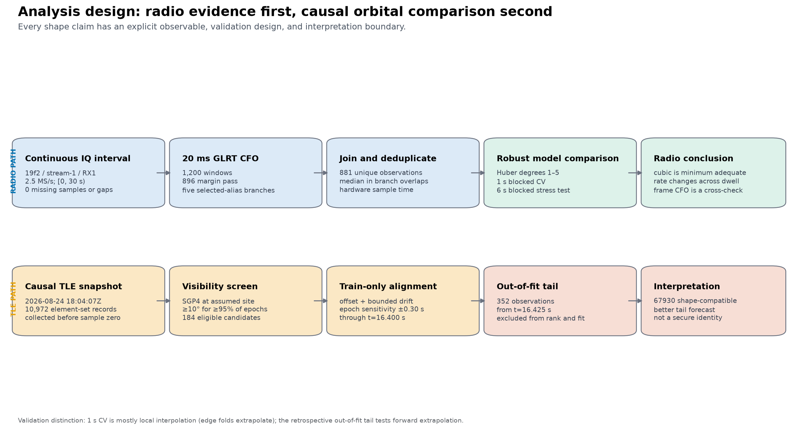

**Figure 1.** Analysis flow. The radio model-selection path and causal TLE path use different validation designs. Leave-one-1-s-block-out CV tests mostly local interpolation, with extrapolation at the edge folds; the chronological out-of-fit tail tests retrospective forward extrapolation after candidate ranking.

## 1. Introduction

This report analyzes the first 30 s of RX1 on the `19f2` radio in capture `cap-20260824T192252-9981b9c27853`. The signal is on `stream-1`, the independently tuned upper edge, sampled at 2.5 MS/s. The applied IF center is 1,690,312,498 Hz. With the capture's 9.75 GHz LNB convention, the nominal RF center used for the orbital comparison is 11,440,312,498 Hz.

The session name contains `T192252`, but that is not the analysis time origin. The authoritative sample-zero estimate for this stream is `2026-08-24T19:22:55.412378614Z`, with a manifest timing half-width of 0.000529741 s. The requested interval is therefore `[19:22:55.412378614, 19:23:25.412378614) UTC` and samples `[0, 75,000,000)`.

The observable is receiver-relative baseband CFO on one selected alias. It is not calibrated satellite Doppler. It contains satellite/transmitter frequency behavior, propagation, LNB behavior, and receiver frequency behavior. The alias choice changes the CFO intercept by an integer multiple of 227,272.727 Hz but does not change the fitted rate or curvature.

## 2. Motivation and questions

The analysis addresses four questions:

1. Is a constant CFO rate, or even a constant rate change, adequate over 30 s?
2. Does a noisier single-frame CFO estimator reproduce the broad GLRT trajectory?
3. Are branch-local rate estimators consistent with the long-baseline curve?
4. Is the observed curvature compatible with a causal, pre-capture TLE, and does that geometry predict data withheld from candidate ranking?

The distinction between descriptive fit and forward prediction matters. A flexible polynomial can describe a short interval extremely well while extrapolating poorly. A TLE supplies physics-informed range-rate geometry and may therefore predict a later segment better even when its full-dwell descriptive residual is larger than a polynomial fitted to the entire dwell.

## 3. Capture, continuity, and measurement inventory

### 3.1 Capture authority

| Field | Value |
|---|---:|
| Analysis run | `capture-6f6c7e02f16b4f6dbcb260e92864adfa` |
| Radio / stream / receiver | `radio_pluto_19f2 / stream-1 / RX1` |
| Edge | upper |
| Sample rate / bandwidth | 2.5 MS/s / 2.5 MHz |
| IF center | 1,690,312,498 Hz |
| Nominal RF center used for TLE Doppler | 11,440,312,498 Hz |
| First-sample estimate | `2026-08-24T19:22:55.412378614Z` |
| Requested sample interval | `[0, 75,000,000)` |
| Recording manifest | `RecordingManifestV2` |
| Manifest SHA-256 | `afaecccd1130c09d4604bdebc99ff8fbb4089c9dd031602b117312739be094e3` |

The manifest reports device-counter-authoritative continuity: 150,000,000 observed samples equal 150,000,000 device-span samples; missing samples, overflows, gaps, and clipped samples are all zero; and the stream has one continuous segment. No refill-time-compression correction is applied. The analysis time coordinate is hardware-supported sample time, `sample_index / 2.5e6`.

### 3.2 GLRT and frame measurements

The GLRT used 20 ms integration windows whose persisted time is the window start. Starts occur on a nominal 25 ms lattice, so adjacent probes are disjoint with a 5 ms gap. Of 1,200 interval probes, 896 passed the replay-margin gate. Five positive-replay selected-alias branches contributed 901 memberships; median deduplication at 20 overlapping starts produced 881 unique observations.

The single-frame diagnostic retained 9,061 accepted branch memberships before deduplication, 8,849 unique frame starts, and 544 nonempty 50 ms median bins. Each frame CFO is formed after source-model derotation by fitting pilot phase across 64 known pilot symbols. It is therefore model- and acquisition-conditioned. A point can be retained even when a downstream Kalman update is rejected, so these frame values are not an independent blind detection.

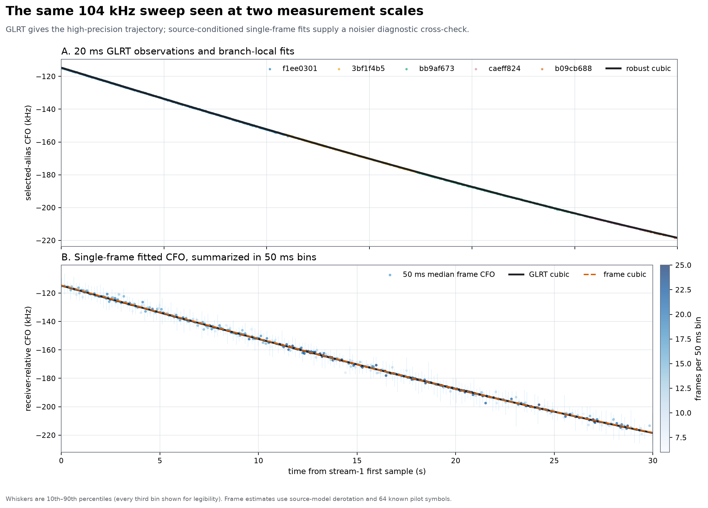

**Figure 2.** Measurement overview. Top: 881 selected-branch 20 ms GLRT observations, branch-local lines, and the global cubic. Bottom: 544 frame-CFO medians, with 10th–90th percentile whiskers shown for every third bin, plus the GLRT and frame cubics. The frame series follows the gross sweep but has kilohertz-scale scatter.

### 3.3 Selected branches

| Branch | Interval (s) | Selected branch memberships | Persisted branch rate (Hz/s) | 50 ms frame bins |
|---|---:|---:|---:|---:|
| `f1ee0301` | 0.000–11.025 | 374 | −3,755.747 | 214 |
| `3bf1f4b5` | 10.550–17.300 | 183 | −3,554.912 | 119 |
| `bb9af673` | 17.325–25.725 | 231 | −3,271.543 | 146 |
| `caeff824` | 25.500–29.875 | 90 | −2,998.438 | 63 |
| `b09cb688` | 28.450–30.000 | 23 | −2,896.375 | 18 |

The CFO mismatches where neighboring branch models meet are +156.9, −108.1, +209.4, and +59.1 Hz. These are small relative to the 227.273 kHz alias spacing. The corresponding rate steps are +200.8, +283.4, +273.1, and +102.1 Hz/s, consistent with the overall rate becoming progressively less negative.

## 4. Approach and method

### 4.1 Robust polynomial models

For degree `d`, CFO was modeled as a polynomial in centered and scaled time and fitted with Huber iteratively reweighted least squares. The headline degree-1 through degree-3 metrics use the exact selected observations. The degree-4/5 and 6 s complexity stress test was recomputed from CFO values rounded to 0.01 Hz; this is negligible at the reported precision.

Residual sign is always:

```text
residual = observed GLRT CFO - fitted CFO
```

Three validation views were kept separate:

- **In-sample residuals:** descriptive adequacy on all 881 observations.
- **Leave-one-1-s-block-out CV:** remove every `floor(t)`-second block in turn, fit on the remaining blocks, and predict the omitted block. This tests mostly local interpolation, with extrapolation for the first and last blocks, plus sensitivity to time-correlated residuals.
- **Leave-one-6-s-block-out CV:** omit a much longer contiguous block. This is a stress test for high-degree instability, not the same forecast used in the TLE comparison.

A 500-replicate, 1 s block bootstrap refitted the global models and evaluated rate and second derivative at 0, 5, …, 30 s. Blocking preserves more of the time-correlated error than an observation-wise bootstrap.

### 4.2 Branch and single-frame checks

Two frame-based checks were used:

- A Huber line through 50 ms median frame CFO within each GLRT branch, with bootstrap intervals.
- A path-specific raw-dwell analysis that extracts thousands of single-frame CFO values, groups coherent local ramps, removes local reset offsets, fits a shared branch-local rate, cluster-bootstraps the ramps, and tests on odd/pilot-held-out information.

These checks answer whether local rates are broadly compatible with GLRT. Their larger uncertainty does not make them a second high-precision global acceleration measurement.

### 4.3 Causal TLE comparison

The nearest archived complete Starlink snapshot available to this analysis and collected before stream sample zero was selected. No post-capture snapshot was used in the primary comparison.

The observer was the reviewed Spinnaker/Sausalito preset at latitude 37.858988°, longitude −122.478103°, and ellipsoidal altitude −29 m. The capture manifest does not contain a site fix, so this observer is explicitly not capture-bound. SGP4 range rate was converted to the received-minus-transmitted Doppler convention at 11,440,312,498 Hz:

```text
Doppler(t) = -RF_frequency * range_rate(t) / c
```

Candidates had to remain at or above 10° elevation for at least 95% of the observation epochs. This left 184 Starlinks.

Candidate alignment used the first 529 of 881 observations, through `t=16.400 s`. The final 352 observations, from `t=16.425 s`, were excluded from candidate ranking and nuisance fitting. This split is retrospective and computational; it was not prospectively registered or blinded. Here, “holdout” means out of fit, not prospectively sealed. For candidate `j`, the training model was:

```text
y(t) = D_j(t + δ) + β0 + β1 * (t - t_ref) + error
```

`β0` is an arbitrary CFO offset and `β1` is a constant nuisance drift bounded to ±200 Hz/s. Both are estimated only on training observations. The primary bounded sensitivity search evaluates `δ` from −0.30 to +0.30 s in 0.05 s steps. Candidates are ranked by training RMS alone.

The **exact-UTC** control fixes `δ=0` but still estimates `β0` and `β1`. The **constant-offset** control searches the same bounded `δ` but fixes `β1=0`. A wider ±2 s search is reported only as a post-hoc orbital/along-track sensitivity; it is not a capture-clock correction.

## 5. Results: polynomial fits and residuals

### 5.1 Fit comparison

| Model | In-sample RMS (Hz) | Median absolute residual (Hz) | p90 absolute residual (Hz) | 1 s blocked-CV RMS (Hz) | Adjacent residual correlation |
|---|---:|---:|---:|---:|---:|
| Linear | 1,041.24 | 766.34 | 1,490.18 | 1,152.54 | 0.9981 |
| Quadratic | 139.23 | 102.94 | 209.47 | 163.44 | 0.8974 |
| Cubic | **61.08** | **38.36** | **91.56** | **63.50** | **0.4717** |

The line leaves a broad U-shaped residual with multi-kilohertz endpoint error. The quadratic removes most of that curvature but leaves an S-shaped remainder. The cubic centers each broad time region much closer to zero. Lag-1 residual correlation falls from 0.998 for the line to 0.897 for the quadratic and 0.472 for the cubic, showing that the extra term removes slow model error rather than merely chasing isolated points.

The largest in-sample cubic residual is about 372 Hz; the cubic p95 absolute residual is 116.4 Hz. The remaining correlation and localized excursions are reasons not to describe 61 Hz as independent white-noise precision.

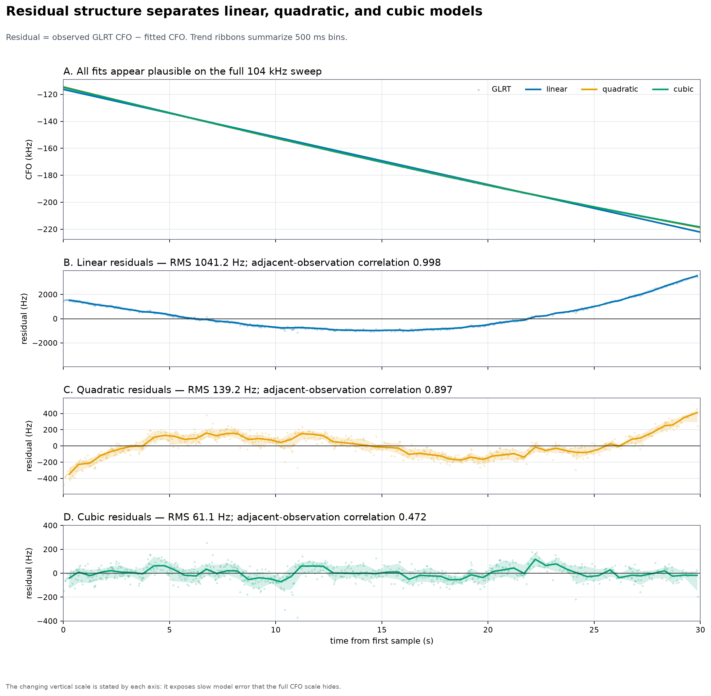

**Figure 3.** Full-scale fits and signed residual time series. All three curves look plausible across the 104 kHz sweep, but their residuals separate them decisively. Each residual panel uses a labeled scale appropriate to that model.

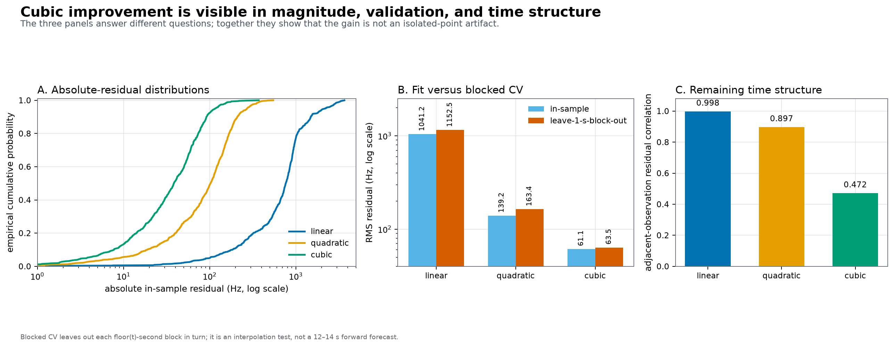

**Figure 4.** Three views of model error: empirical absolute-residual distributions, in-sample versus 1 s blocked-CV RMS, and adjacent-residual correlation. The cubic improvement appears in both magnitude and temporal structure.

### 5.2 Minimum adequate degree

| Degree | In-sample RMS (Hz) | 1 s blocked-CV RMS (Hz) | 6 s blocked-CV RMS (Hz) |
|---:|---:|---:|---:|
| 1 | 1,041.24 | 1,152.54 | 1,893.29 |
| 2 | 139.23 | 163.44 | 385.91 |
| 3 | **61.08** | 63.50 | **104.23** |
| 4 | 59.76 | **62.13** | 109.65 |
| 5 | 59.66 | 62.64 | 211.65 |

The quartic lowers in-sample RMS by 1.32 Hz and 1 s CV by 1.37 Hz relative to the cubic, but its median absolute in-sample residual is slightly worse and its 6 s CV is 5.41 Hz worse. Degree 5 adds almost no in-sample benefit and doubles the cubic's 6 s CV. Thus the cubic is the elbow: it removes the large quadratic remainder without introducing the longer-holdout instability of higher degrees.

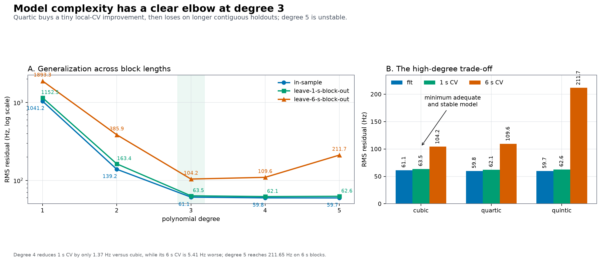

**Figure 5.** RMS versus polynomial degree. The left panel shows the degree-3 elbow on a log scale. The right panel exposes the small differences among degrees 3–5 and the high 6 s cost of the quintic.

### 5.3 Cubic trajectory and derivatives

With `x = t - 15 s`, the robust cubic is:

```text
f_CFO(t) [Hz] = -170228.009573
              - 3515.976050 x
              +   16.231350711 x²
              +    0.258521618 x³
```

It falls from approximately −114,708.825 Hz at 0 s to −218,443.086 Hz at 30 s, a 103,734.261 Hz change. Its derivatives are:

```text
df/dt   = -3515.976050 + 32.462701422 x + 0.775564854 x²  [Hz/s]
d²f/dt² = 32.462701422 + 1.551129708 x                    [Hz/s²]
d³f/dt³ = 1.551129708                                      [Hz/s³]
```

| Time (s) | CFO rate (Hz/s) | Rate change / second derivative (Hz/s²) |
|---:|---:|---:|
| 0 | −3,828.414 | +9.196 |
| 5 | −3,763.047 | +16.951 |
| 10 | −3,658.900 | +24.707 |
| 15 | −3,515.976 | +32.463 |
| 20 | −3,334.273 | +40.218 |
| 25 | −3,113.793 | +47.974 |
| 30 | −2,854.533 | +55.730 |

The rate becomes about 974 Hz/s less negative across the dwell. This is a receiver-relative CFO derivative, not a calibrated orbital acceleration.

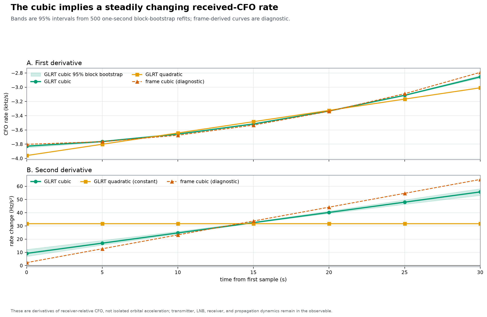

**Figure 6.** First and second derivatives. The quadratic forces a constant second derivative, while the cubic supports a rising one. Block-bootstrap bands are narrow for the GLRT cubic. The frame cubic follows the broad shape but is diagnostic.

## 6. Results: frame and branch-local checks

### 6.1 Global frame-CFO cross-check

| Frame-bin model | In-sample RMS (Hz) | 1 s blocked-CV RMS (Hz) | Median absolute residual (Hz) |
|---|---:|---:|---:|
| Linear | 1,722.0 | 1,804.4 | 987.6 |
| Quadratic | 1,310.0 | 1,319.8 | 393.3 |
| Cubic | **1,293.7** | **1,297.8** | **370.7** |

The frame cubic beats the frame quadratic by only 22.0 Hz, or 1.7%, in blocked-CV RMS. Its 1,297.8 Hz CV RMS is 20.4 times the GLRT cubic's 63.5 Hz. Nevertheless, the frame cubic's rates at 0, 15, and 30 s are −3,802.3, −3,533.0, and −2,791.6 Hz/s, broadly compatible with the GLRT values of −3,828.4, −3,516.0, and −2,854.5 Hz/s. The appropriate conclusion is qualitative cross-check, not independent proof of the global acceleration.

### 6.2 Branch-local slope checks

The branchwise 50 ms frame fits agree particularly well with the first three GLRT slopes: frame-minus-GLRT differences are −4.6, −0.7, and −12.9 Hz/s. The fourth difference is −55.1 Hz/s. The fifth is +97.5 Hz/s but has an extremely broad interval because the interval is truncated at 30 s.

The separate source-bound raw-dwell ramp cross-check produced four complete branch-local rates:

| Branch | Coherent ramps | GLRT rate (Hz/s) | Reset-debiased local rate (Hz/s) | Cluster 95% interval (Hz/s) | Progression evidence |
|---|---:|---:|---:|---:|---|
| `f1ee0301` | 18 | −3,755.75 | −3,388.92 | [−4,114.23, −2,768.66] | progression BIC-disfavored |
| `3bf1f4b5` | 8 | −3,554.91 | −3,539.89 | [−4,132.59, −3,050.12] | **+332.8 ± 78.4 Hz/s²; ΔBIC −11.1** |
| `bb9af673` | 30 | −3,271.54 | −3,269.30 | [−3,478.75, −3,035.21] | progression BIC-disfavored |
| `caeff824` | 7 | −2,998.44 | −3,801.71 | [−4,430.48, −2,786.58] | progression BIC-disfavored |
| `b09cb688` | 2 | −2,896.38 | not reported | not reported | insufficient ramp support |

All four reported shared local rates passed the core held-out/stability gates, but the local sequence is not a clean monotonic copy of the five GLRT slopes. Only `3bf1f4b5` prefers within-branch rate progression after BIC penalty. Its +332.8 ± 78.4 Hz/s² progression is roughly ten times the global cubic's approximately +31 to +36 Hz/s² over that interval: it disfavors a local constant-rate model under this estimator, but does not quantitatively validate the smooth global acceleration. The standard 75 ms pilot-segment product is even sparser: only 3 of 240 segments qualify, all on `f1ee0301`. This is why the long-baseline GLRT curve is the primary evidence for global curvature.

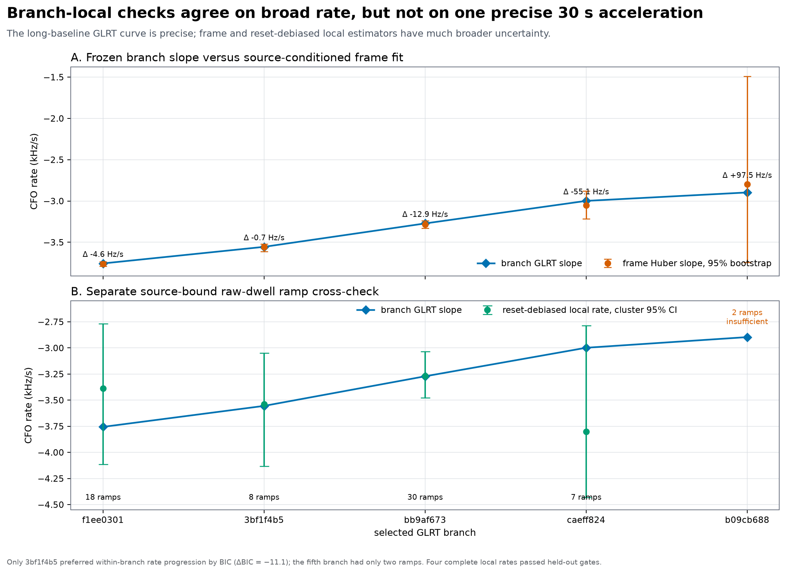

**Figure 7.** Branch-local comparisons. Top: frozen GLRT slopes and source-conditioned frame fits. Bottom: reset-debiased local ramp rates with cluster intervals. The last two branches illustrate why local evidence must not be collapsed into one artificially precise 30 s acceleration estimate.

## 7. Results: causal TLE comparison

### 7.1 Causal catalogue provenance

The primary Space-Track snapshot was collected at `2026-08-24T18:04:07.459418079Z`, **4,727.953 s** or **78 min 47.953 s** before stream sample zero. Its SHA-256 is:

```text
ac36512e603e6a21bc2ca16d0512a1e14db846ccbad9409d9ac601b371f16dee
```

It contains 10,972 element-set records, and all element epochs precede the capture. The newest element epoch in the snapshot is `15:50:30.810048Z`. The top-ranked candidate's own element epoch is much older: `2026-08-24T09:27:13.785120Z`, **9 h 55 min 41.627 s** before sample zero.

The exact primary 3LE is:

```text
0 STARLINK-36865
1 67930U 26036AC  26236.39390955  .00015614  00000-0  57538-3 0  9992
2 67930  43.0017  17.8519 0000917 255.0713 105.0037 15.27599130 29372
```

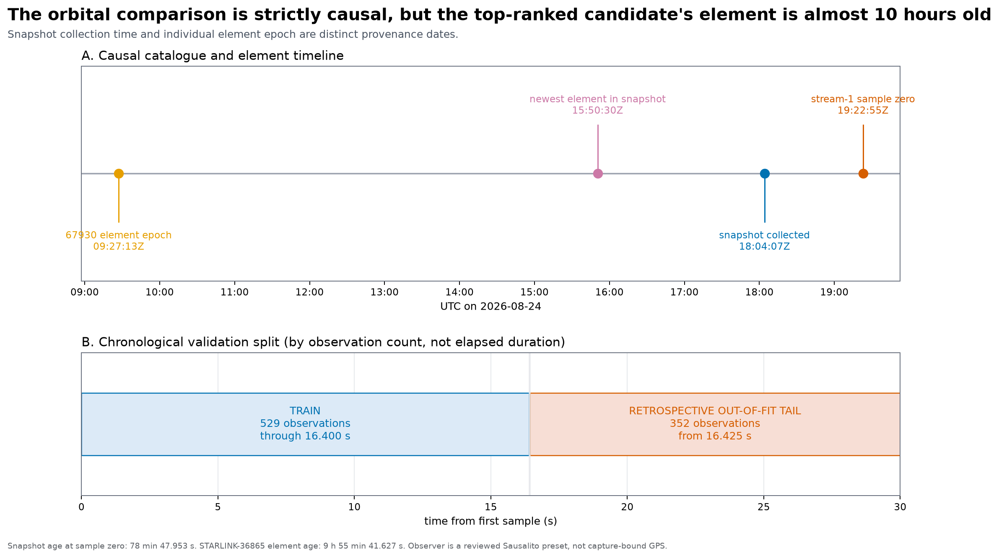

**Figure 8.** Top: element epoch, newest snapshot element, snapshot collection, and sample zero on the same UTC timeline. Bottom: the 60/40 split by observation count; it ends training at 16.400 s rather than 18 s.

### 7.2 Candidate ranking

STARLINK-36865 / NORAD 67930 ranks first under the bounded-drift fit and the stored constant-offset ranking control. Its exact-UTC training RMS is also reported, but the compact bundle does not preserve a full exact-UTC reranking of all 184 candidates. Its propagated elevation is at least 62.90° over the observation epochs and peaks near 82° on the propagation grid.

| Training rank | Object | NORAD | Element epoch (UTC) | Constrained training RMS (Hz) | Out-of-fit-tail RMS (Hz) | Best bounded δ (s) |
|---:|---|---:|---|---:|---:|---:|
| 1 | STARLINK-36865 | 67930 | 2026-08-24 09:27:13.785 | **63.33** | **186.02** | −0.30 |
| 2 | STARLINK-31476 | 59523 | 2026-08-24 00:17:02.926 | 87.19 | 616.49 | +0.30 |
| 3 | STARLINK-5464 | 54758 | 2026-08-24 01:34:02.431 | 180.18 | 1,657.97 | −0.30 |
| 4 | STARLINK-11631 | 63195 | 2026-08-24 11:17:46.702 | 604.75 | 6,648.90 | −0.30 |
| 5 | STARLINK-34592 | 64746 | 2026-08-23 22:50:44.469 | 677.59 | 2,163.88 | +0.30 |

The best-versus-runner training margin is only 23.86 Hz. The much larger chronological-tail separation is encouraging, but the candidate was selected from 184 possibilities. Without a calibrated catalogue-search null or another independent identifying observable, the rank is not a secure identity.

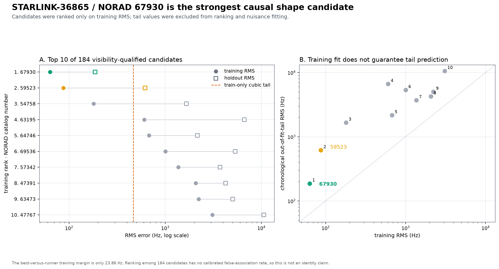

**Figure 9.** Top-10 training and out-of-fit-tail errors, and training-versus-tail behavior. Candidate 67930 has the best training fit and best tail among the shown candidates. Several alternatives fit training moderately but diverge strongly in the tail.

### 7.3 TLE alignment variants

| Variant | δ (s) | CFO offset β0 (Hz) | Nuisance drift (Hz/s) | Training RMS (Hz) | Out-of-fit-tail RMS (Hz) | Full raw-observation RMS (Hz) |
|---|---:|---:|---:|---:|---:|---:|
| Exact UTC, offset + drift | 0.00 | −104,920.791 | −11.102 | 64.70 | 236.80 | 157.85 |
| Primary bounded sensitivity | **−0.30** | −106,026.278 | −4.283 | **63.33** | **186.02** | **127.41** |
| Bounded δ, offset only / no drift | −0.30 | −106,026.278 | 0 | 66.31 | 247.92 | 164.92 |
| Wide ±2 s diagnostic | −0.95 | −108,428.144 | +9.882 | 62.09 | 82.45 | 70.93 |

The constrained solution lands exactly on the −0.30 s boundary. The manifest clock uncertainty is only ±0.000529741 s, so neither −0.30 s nor the post-hoc −0.95 s wide optimum can be described as capture-timing correction. They are sensitivity to TLE age, SGP4/orbital along-track error, or unmodeled signal-chain dynamics. The wide result is a diagnostic demonstration that the selected candidate's TLE curve can approach the cubic residual scale. It was evaluated only for the bounded-search winner, is not independent validation, and is excluded from the headline association claim; candidate specificity under the same wider search is unknown.

### 7.4 Shape and derivative agreement

For the primary constrained alignment, the smooth cubic-versus-TLE comparison on a 0.1 s grid gives:

| Quantity | RMS difference |
|---|---:|
| CFO shape | 130.44 Hz |
| CFO rate | 13.36 Hz/s |
| Second derivative | 3.05 Hz/s² |
| Third derivative | 0.70 Hz/s³ |

The grid CFO RMS is a descriptive comparison between two smooth curves after candidate selection. It is not the same statistic as the 127.41 Hz full raw-observation RMS or the 186.02 Hz chronological out-of-fit-tail RMS.

| Time (s) | Cubic rate (Hz/s) | TLE-aligned rate (Hz/s) | Cubic second derivative (Hz/s²) | TLE second derivative (Hz/s²) |
|---:|---:|---:|---:|---:|
| 0 | −3,828.414 | −3,822.644 | 9.196 | 5.529 |
| 15 | −3,515.976 | −3,502.668 | 32.463 | 35.045 |
| 30 | −2,854.533 | −2,864.441 | 55.730 | 46.822 |

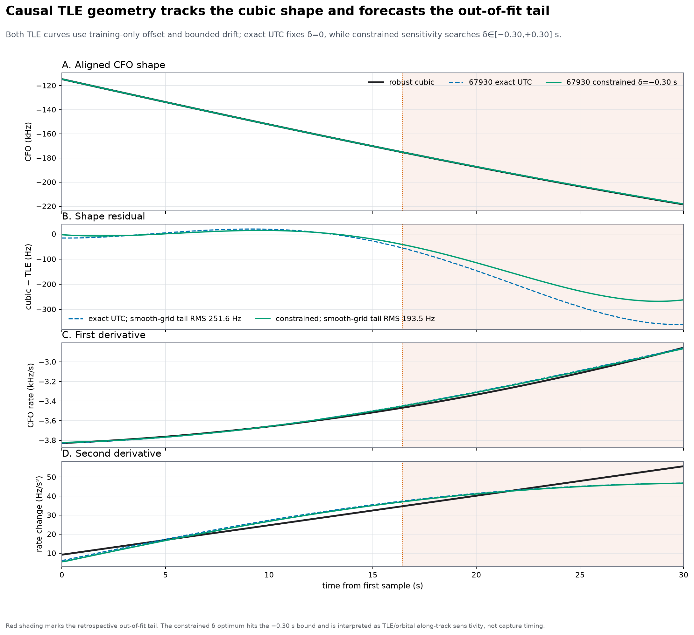

**Figure 10.** Robust cubic versus candidate 67930 at exact UTC and under the primary bounded ±0.30 s sensitivity. Red shading marks the chronological out-of-fit tail. The TLE derivatives remain close to the cubic while the CFO residual grows modestly during retrospective forward prediction. Residual-panel legend values are smooth-grid tail RMS; the tables report raw-observation tail RMS.

### 7.5 Forward-validation controls

Train-only ordinary least-squares polynomials were fit on exactly the same 529 training observations and then extrapolated to the 352-observation tail:

| Predictor fit/ranked on the first 529 observations only | Training RMS (Hz) | Out-of-fit-tail RMS (Hz) |
|---|---:|---:|
| TLE 67930, constrained ±0.30 s | 63.33 | **186.02** |
| TLE 67930, exact UTC | 64.70 | 236.80 |
| TLE 67930, bounded δ with offset only and no drift | 66.31 | 247.92 |
| Radio-only cubic | **62.17** | 465.66 |
| Radio-only quadratic | 69.46 | 1,026.05 |
| Radio-only linear | 219.86 | 3,488.38 |

The constrained TLE lowers tail RMS by 60.1% relative to the train-only cubic; the exact-UTC TLE lowers it by 49.1%. The radio cubic fits training slightly better than the constrained TLE, yet forecasts the tail much worse. This is the strongest result within this retrospective split supporting compatibility with orbital range-rate geometry rather than only an arbitrary full-dwell polynomial fit; it is not causal attribution or identity evidence by itself.

These forward results must not be compared directly with the headline 63.5 Hz 1 s blocked-CV RMS as if they were the same test. The 1 s folds train on data on both sides of each omitted block. The TLE holdout requires a 13.6 s forward prediction from the last training observation.

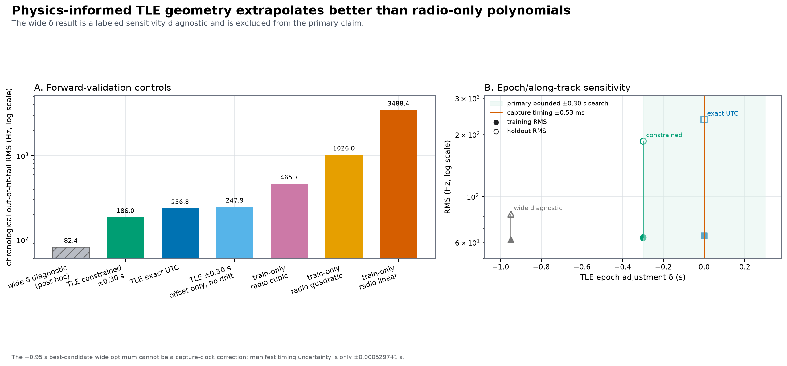

**Figure 11.** Left: chronological out-of-fit-tail errors for TLE and train-only radio controls. Right: reported epoch-sensitivity variants. The −0.95 s wide point is hatched/labeled as post hoc and lies far outside the capture's ±0.53 ms timing uncertainty.

## 8. Discussion

### 8.1 What the cubic establishes

The linear and quadratic residuals are too large and too time-structured to be credible descriptions of the full trajectory. A cubic is not merely statistically better; it changes the scientific picture from constant CFO rate or constant rate change to a rate change that itself evolves over the dwell. The stable cubic-versus-quartic result on long blocks makes degree 3 the most defensible radio-only summary.

On a 30 s interval, a cubic is also a natural local Taylor representation of a smooth Doppler curve. It should not be extrapolated far beyond the measured interval or interpreted as a universal orbital law.

### 8.2 Why the TLE forecast matters

The TLE geometry embeds a constrained family of range-rate curves. Once offset and a small constant drift are removed on training data, its higher-order shape is not free to bend arbitrarily. Its superior tail prediction is therefore more informative than a full-data curve overlay. The exact-UTC result already beats the train-only cubic, and the bounded sensitivity variant improves further.

The TLE match does not explain all CFO behavior. The fitted nuisance drift is −11.10 Hz/s at exact UTC and −4.28 Hz/s under constrained sensitivity. These are small compared with the roughly −3 kHz/s received-CFO rate, but they absorb some non-orbital dynamics. The large arbitrary offset is expected because the analysis uses one receiver-relative baseband alias rather than a calibrated transmit frequency.

### 8.3 Why this is not an identification

Several independent facts limit specificity:

- The observer position is a reviewed site preset, not capture-bound GPS.
- Candidate 67930's element is 9.93 h old, allowing along-track error or maneuver effects.
- The primary δ optimum is at the bounded-search boundary.
- A wider post-hoc δ search improves the shape but narrows the training margin over alternative candidates.
- The search considered 184 visible Starlinks and has no calibrated false-association probability.
- The signal is candidate-only known-pilot evidence; the payload was not decoded.
- The radio observable includes transmitter, propagation, LNB, and receiver behavior.

The appropriate statement is “unusually compatible causal TLE geometry,” not “satellite 67930 was decoded or securely identified.”

## 9. Limitations

1. **Receiver-relative coordinate.** Selected-alias CFO is not absolute RF Doppler. Alias changes preserve rates but branch selection and joining can affect the estimated shape.
2. **Signal-chain dynamics.** TX, propagation, LNB, and RX frequency behavior remain mixed with orbital Doppler.
3. **Source-conditioned frame estimator.** Single-frame CFO uses acquisition/model derotation and 64 known pilot symbols. Its high phase-slip/noise rate makes it a diagnostic only.
4. **Sparse independent local-rate evidence.** Only four raw-dwell branches return supported shared rates, only one prefers within-branch rate progression, and the standard 75 ms product has only 3/240 qualified segments.
5. **Assumed observer.** The site is reviewed but not capture-bound; site error changes range-rate geometry.
6. **TLE age and model.** Candidate 67930's element is almost 10 h old. SGP4 error and maneuvers can appear as along-track/epoch sensitivity.
7. **Boundary solution.** The primary ±0.30 s sensitivity optimum hits −0.30 s. The −0.95 s wide result is post hoc.
8. **Multiple-candidate search.** There is no calibrated false-association rate for selecting the best of 184 candidates from one 30 s dwell.
9. **Validation scope.** Blocked CV, chronological tail validation, and smooth-curve RMS answer different questions and are not interchangeable.
10. **Single dwell.** Repeated dwells, a capture-bound position, and an independently decoded or directionally verified transmitter would be needed for stronger identification.

## 10. Reproducibility and data lineage

All figures in this report are generated from the compact evidence bundle committed beside them:

- [`evidence.json`](figures/2026_08_24_9981b9c27853_cubic_cfo_tle_comparison/evidence.json)
- [`make_figures.py`](figures/2026_08_24_9981b9c27853_cubic_cfo_tle_comparison/make_figures.py)

From the repository root, rebuild the figures with:

```bash
uv run python reports/figures/2026_08_24_9981b9c27853_cubic_cfo_tle_comparison/make_figures.py
```

The bundle records exact paths, byte sizes, and SHA-256 digests for the recording manifest and each source analysis artifact. Principal source digests are:

| Source | SHA-256 |
|---|---|
| Compact report evidence bundle | `280ac2a7d8e75aa2bd7c12d994fe80dd01431a35d7ea3553243f29df076b8337` |
| Recording manifest | `afaecccd1130c09d4604bdebc99ff8fbb4089c9dd031602b117312739be094e3` |
| GLRT/frame trajectory analysis | `deacd1e6d736f1765cfaf3b6334f5217eface5f7f8068fc8b98af775088367fd` |
| Fit/residual comparison | `b16a03a2f66c80e6c459464606c010a21eb358e7ba48d566fbe7085d149e4498` |
| Exact residual vectors | `7b6351aae0b8470ace4684ddce6964f883212fd564e049e226192f536459264f` |
| Raw-dwell Doppler analysis | `c135dbb393f7aa584174c472d5aa399a6641bddcbf711f346d330c9826305fdb` |
| Causal TLE comparison | `f046ae631f6b4671955453773f4fd263b88aea82ac95158395aef44b4330a93b` |
| Causal Space-Track snapshot | `ac36512e603e6a21bc2ca16d0512a1e14db846ccbad9409d9ac601b371f16dee` |

The full causal TLE snapshot is not copied into the repository. Its verified digest, collection metadata, record count, and the exact top-ranked 3LE are preserved here and in the evidence bundle.

## 11. Conclusion

The data strongly support a cubic receiver-relative CFO model and show that candidate 67930's causal TLE geometry is unusually compatible and predicts the chronological out-of-fit tail better than radio-only extrapolations. This is association evidence, not a secure satellite identification.

The practical Doppler-rate result is therefore two-layered:

- **High-confidence radio result:** the 30 s selected-alias CFO is curved beyond a quadratic; the received-CFO rate evolves from about −3.83 to −2.85 kHz/s, and the cubic is the minimum adequate stable model.
- **Conditional orbital result:** under the reviewed Sausalito observer and causal catalogue, STARLINK-36865 / NORAD 67930 supplies the strongest compatible range-rate geometry and materially better forward prediction, but the association remains conditional on site, TLE age, nuisance drift, and multi-candidate search.
