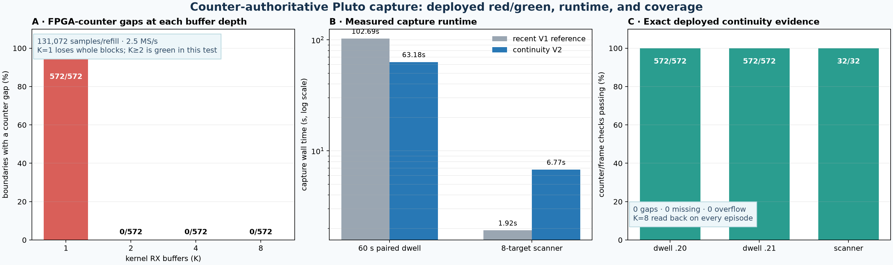
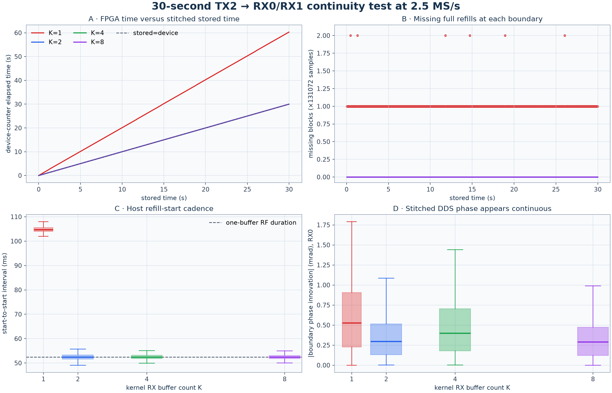

# Counter-authoritative Pluto capture: implementation and verification

Date: 2026-08-24  
Status: hardware-qualified; production cutover pending final release gates  
Plan: [`cont_buffer.md`](../cont_buffer.md)  
Baseline experiment: [Controlled Pluto refill continuity](2026_08_24_refill_continuity_loopback.md)

## Overview

New dwell and scanner captures can now use the Pluto FPGA sample counter as the
authority for IQ continuity. The implementation no longer assumes that
successive full-length host reads are adjacent in RF time. It resets the RX
buffer at each capture episode, requests and verifies eight kernel buffers,
validates every metadata header twice, drains IQ through a bounded producer /
consumer queue, persists an immutable gap map, and exposes a device-time reader
that returns logical zeros plus an explicit validity mask over missing spans.

The bounded hardware campaign passed on both production Plutos:

- A forced-delay K=1 control produced a counter gap at every tested boundary on
  both radios. This proves that the detector sees the known failure.
- K=8 produced no counter gap in either short arm or in a sustained paired
  60-second dwell: all 1,144 adjacent refill boundaries were exact.
- Each 60-second radio stream stored 150,000,000 samples and spanned exactly
  150,000,000 FPGA sample times, with no missing samples, overflow indication,
  or userspace queue rejection.
- A full eight-target scanner sweep reset and re-attested every target, returned
  eight independent sequence-zero frames, and produced all five Standard PNGs.
- The new paired dwell completed in 62.19 seconds versus 102.69 seconds for a
  recent legacy 60-second capture. Scanner capture increased from 1.86–1.98
  seconds to 5.73 seconds because it now destroys, tunes, settles, creates, and
  attests a fresh buffer for every target.



**Figure 1.** Panel A is the controlled 131,072-sample-refill experiment: K=1
lost whole buffers at 572/572 boundaries, while K=2, 4, and 8 had no detected
gap. Panel B compares measured wall time. Dwell capture is faster because radio
drain is no longer serialized behind compression and `fsync`; scanner capture
is deliberately slower because every retune becomes a fresh, metadata-attested
episode. The two workloads are different, so their ratios should not be
compared to one another.

The compact values behind Figure 1 are preserved in
[`continuity-buffer-evidence.json`](figures/2026_08_24_continuity_buffer_implementation/continuity-buffer-evidence.json),
and the deterministic renderer is
[`report_continuity_buffer_implementation.py`](../tools/report_continuity_buffer_implementation.py).

## Motivation

The earlier analysis found a sawtooth CFO pattern whose discontinuities landed
on application refill boundaries. In the legacy path, every `.rx()` result was
assigned the next synthetic host sample index. A returned array could therefore
have the requested length even when the radio had advanced past samples that
were never delivered. Downstream code interpreted concatenated stored offset
divided by sample rate as physical time, so a real RF-time omission appeared as
a CFO step and biased long/global Doppler-rate estimates.

Host request timestamps reveal slow service, but they cannot tell exactly how
many RF samples were buffered, dropped, or acquired while the host was busy.
The FPGA counter can: for adjacent returned blocks,

```text
expected = previous_first_counter + previous_sample_count
missing  = current_first_counter - expected
```

`missing == 0` proves adjacency inside that capture generation. A positive
value is the exact omitted sample count. A regression, duplicate, invalid
header, counter/sequence disagreement, or unexplained generation change is a
hard integrity failure.



**Figure 2.** The original controlled experiment. With K=1, stored time advances
smoothly while the FPGA counter exposes repeated whole-buffer omissions. The
firmware overflow flag remained clear, so continuity must be decided from
counter deltas rather than that flag alone.

## Implemented design

### Metadata runtime and radio port

The release pins `pluto-plus-utils` commit
`30e28464501a1c7706f882fd66ddf147629f6b12` and the ABI-1 metadata libiio source
`c26258bfa33098c2b215e19cf85d448e89499b1a`. The release-local installer builds
and hashes the matching native library and Python binding. Admission happens in
a fresh, scrubbed process; an ambient system libiio or wrong constructor ABI is
rejected before capture.

The metadata session atomically returns IQ with:

- stream generation;
- buffer sequence;
- first FPGA sample sequence;
- metadata flags and overflow bit;
- host request bounds and fitted sample-time intervals;
- actual receiver geometry, sample count, and verified K readback.

The ordinary `.rx()` interface remains useful for legacy/import workflows but
cannot claim sample-loss observability.

### Dwell capture

Live V2 dwells now follow this order:

```text
open and attest
  -> apply and read back RF settings
  -> destroy stale RX buffer
  -> configure K=8 and verify readback
  -> begin a fresh metadata episode
  -> refill producer -> bounded 32-refill queue -> storage consumer
  -> independently revalidate every header while writing
  -> seal timeline, gap map, chunks, and manifest
```

At 2.5 MS/s with dual CI16 receivers, the production 262,144-sample refill is
2 MiB and spans 104.8576 ms. K=8 therefore provides 16 MiB / 0.839 s of kernel
buffering per radio. The 32-refill userspace queue adds 64 MiB per radio. For
two dwell radios the planned total is about 160 MiB.

The producer never blocks behind compression, shard closure, rename, or
`fsync`. Queue-full is terminal: the last rejected metadata header is retained,
the partial bundle is publication-fenced, and a late consumer callback cannot
turn it into a committed recording. Queue capacity, synchronized high-water,
enqueue failures, maximum refill service interval, and terminal rejected-gap /
overflow evidence are persisted.

### Scanner capture

Every target is an independent RF episode:

```text
destroy old buffer -> tune and verify LO -> settle
  -> configure/read back K=8 -> create fresh metadata buffer
  -> capture exactly one frame -> close before the next retune
```

No continuity is claimed across retunes. A valid target must carry a new stream
generation, buffer sequence zero, the requested sample span, and no positive
missing count. The V2 IQ frame, report, metrics, analysis manifest, API, and UI
carry the counter and buffer evidence. An all-target failure is retained as an
immutable sweep report rather than disappearing from scanner history.

### Immutable data and logical zero fill

Observed IQ bytes are never rewritten. Every V2 stream seals a content-addressed
gap map bound to its verified timeline. The public reader provides:

- stored-axis access for the exact observed bytes;
- observed spans with their FPGA coordinates;
- `read_device_span(offset, count)`, where offset zero is the first FPGA sample
  of this capture.

The dense result contains IQ, a boolean validity mask, and continuity-segment
IDs. Missing positions are logical CI16 zero only so fixed-grid consumers can
retain coordinates; `valid=false` is the scientific meaning. The absolute
counter itself is not passed as the reader offset—a canary harness did so once,
and the reader correctly rejected the out-of-range request.

### Fail-loud analysis policy

The first production release takes the conservative policy: a stream with a
counter gap, overflow, queue rejection, unobservable continuity, or corrupt
chain is visibly degraded and is not admitted to stateful Standard or Research
analysis. This guarantees that phase, frame timing, carrier bias, Doppler rate,
and Kalman state do not bridge an invalid interval.

The dense masked reader is ready for a later additive segment-local analysis
release. That future release may analyze valid spans independently, blank
crossing windows, and give each segment independent phase/carrier nuisance
states. It must not reinterpret logical zeros as observed RF. The conservative
quarantine is intentional; this release does not pretend segment-local analysis
is already complete.

## Hardware verification

All RF work was bounded, receive-only, protected by the production global and
per-radio leases, and left capture control at the exact pre-test state:
generation 17, desired `paused`, observed `paused`. TX was never armed; both TX
gains remained -80 dB and all DDS scales were zero.

### Production-refill red/green

The production refill is 262,144 sample times. After a deterministic 350 ms
post-refill delay:

| radio | K=1 gaps | K=1 exact missing | K=8 gaps | K=8 boundaries | overflow flags |
|---|---:|---:|---:|---:|---:|
| `.20` / `5d4d` | 5/5 | 5,242,880 | 0 | 11 | 0 |
| `.21` / `19f2` | 5/5 | 5,242,880 | 0 | 11 | 0 |

Each red-arm delta was 1,310,720 samples, meaning four full 262,144-sample
refills were missing before each returned block. Each green-arm delta was
exactly 262,144. This is a true red/green test: K=1 demonstrates that the
counter path catches loss; K=8 demonstrates the intended mitigation under the
same forced-delay shape.

### Sustained paired 60-second dwell

| metric | `.20` / `5d4d` | `.21` / `19f2` |
|---|---:|---:|
| observed / device-span samples | 150,000,000 / 150,000,000 | 150,000,000 / 150,000,000 |
| refills / adjacent boundaries | 573 / 572 | 573 / 572 |
| distinct counter delta | 262,144 | 262,144 |
| gaps / missing / overflow | 0 / 0 / 0 | 0 / 0 / 0 |
| queue high-water / capacity | 1 / 32 | 1 / 32 |
| maximum refill service interval | 106.485 ms | 158.867 ms |

The bundle committed as manifest
`sha256:485c2a46932bb3f01aaef13e4762b459911c2f45945ad17c75bb6ee7a0e579a4`.
Independent reopen verified 18 IQ chunks, two timelines, two gap maps, 2.4 GB
uncompressed payload, all counter deltas, and dense-reader head/tail masks.

The `.21` maximum service interval is longer than one nominal refill, yet no
counter gap occurred. This is expected: K=8 provides a finite reservoir while
the dedicated producer drains it. Host service intervals are telemetry, not
the continuity oracle.

### Eight-target scanner and Standard products

The scanner captured 8/8 targets in 5.7335 seconds. Every target had:

- K requested/readback 8/8;
- reset episodes 1 through 8;
- a unique stream generation and sequence zero;
- exactly 300,000 sample times;
- zero missing samples and no overflow flag;
- LO readback error of 0 or -2 Hz, inside the ±10 Hz gate.

The sealed scanner manifest is
`sha256:d4d7ae0f28cf6c2b890ddd2096a9d644506931613fd9dd5929fdd75a534b2800`.
Bounded Standard analysis took 11.0111 seconds, classified four targets active,
sealed V4 analysis manifest
`sha256:96878e3dcc9709e28b7230b9313f26f71e9d8060cd09b9a130eff9b4090385fd`,
and generated five signature- and digest-verified PNGs: waterfall, GLRT64,
pilot Doppler, pilot carrier tracking, and segment rates.

## Runtime interpretation

The legacy dwell path serialized radio reading with conversion, compression,
and durable storage. A recent 60-second V1 dwell required 102.694 seconds to
create and finalize. The new paired V2 dwell required 62.190 seconds. This is a
40.5-second reduction and, more importantly, the FPGA counter proves that the
stored 60 seconds are 60 seconds of device sample time.

Scanner cost moved in the other direction: recent V1 sweeps took 1.86–1.98
seconds; the V2 sweep took 5.734 seconds, about 2.99 times the midpoint. The
additional 3.75–3.87 seconds is dominated by eight repetitions of safe
destroy/tune/settle/create/attest/close. Standard analysis then adds about 11.0
seconds outside the radio lease. This is an explicit correctness/performance
tradeoff and remains well within the scanner cadence.

## Software verification

Before hardware qualification, the integrated branch passed:

- 1,645 bounded Python tests, with 168 hardware/PostgreSQL/protected-corpus
  cases explicitly deselected;
- 371 focused contracts, station, storage, acquisition, scanner, API, and
  deployment tests;
- 158 PostgreSQL-backed tests; one additional real-corpus case was blocked by
  the invoking user's protected-corpus permissions, not by a code failure;
- strict MyPy across the source tree;
- Ruff lint and format checks;
- all 60 web tests and the production web build;
- release lock, native-runtime installer, manifest/chunk/timeline/gap-map
  digest, and late-publication-fence checks.

Coverage includes hard rejection of a non-integral one-sample ABI-1 gap, exact
reconstruction of one-refill and multi-refill gaps, duplicate, regressing,
reset, overflow-only, and mismatched headers; storage revalidation;
logical zero/mask/segment slicing; terminal gaps; queue-full and hung-`fsync`
shutdown; V1 digest compatibility; fresh scanner session ordering; missing
metadata; stale tuning; and exact K readback.

Final release-gate counts and the deployed commit will be recorded here after
cutover.

## Deployment and rollback

Production cutover is intentionally not claimed in this draft. The controller
remains operator-paused while final scanner failure-path hardening and release
qualification run. The cutover will:

1. stage a content-addressed release with the release-local metadata runtime;
2. verify ABI 1 and exact native/binding hashes before any entry point starts;
3. select the V2 paired-dwell, qualification, soak, and scanner profiles;
4. migrate/no-op the database and validate immutable V1 compatibility;
5. switch acquisition, API, and workers in documented order while preserving
   capture-control generation 17 and its paused state;
6. run deployed receive-only canaries and verify API/UI continuity fields;
7. publish and verify the final commit on `origin/main`.

Rollback restores the prior content-addressed release and configuration. It
does not relabel a continuity-unobservable legacy capture as safe. If metadata
attestation is unavailable, live scientific capture stays paused or fails
explicitly.

## Limitations and next steps

- The FPGA counter proves adjacency on the Pluto sample clock; it is not an
  independent UTC clock. Host/fitted sample-time bounds still carry uncertainty.
- Both receiver channels on one Pluto share a counter and acquisition stream.
  They are not independent witnesses of a shared device/transport failure.
- The firmware overflow bit is currently insufficient: known gaps had no flag.
  Counter deltas remain authoritative.
- K=8 is a measured production margin, not a proof against arbitrary stalls.
  Queue-full and sustained-throughput failure therefore remain fail-closed.
- Scanner target isolation costs roughly 0.47 seconds per target in this
  canary. Profiling tune/metadata session setup may reduce this without weakening
  the reset boundary.
- Segment-local Standard/Research analysis over degraded bundles is deliberately
  deferred. The current release quarantines them, while the masked dense reader
  preserves everything needed for a later scientifically explicit implementation.
- A future externally clocked waveform test can distinguish a pathological
  common TX/RX/counter stall from receive-stream continuity. The present result
  proves delivered RX sample adjacency, which is the property required here.

## Evidence and provenance

The sealed canary acceptance summary is
`c5-canary-acceptance-summary.json`, SHA-256
`262575709a3765ad7a68b6df8d042c39d085797ce21f4b4da4a297b99fe8bbc5`.
Raw canary payloads remain outside Git; this report commits compact derived
evidence and their hashes. The paired-dwell evidence hash is
`ff51ef39ccef00a91c9f2621b235e83e8f361529688ee83d80c23ff71b75dc20`;
the corrected scanner evaluation hash is
`841435da82a3f93a7922a3492c94b1c32b81265fa872d4dbda97250031498756`;
and the scanner Standard-analysis evidence hash is
`21651eebbed187195b762cb872237e1587e2bd5a4455a83ede08c9ebb05add97`.

The scanner harness initially treated the string `"0"` as truthy when checking
`dds_enabled`. That produced a false blocker in the raw receipt, not an RF
failure. The corrected immutable evaluation documents the mistake; the
installed fail-closed mute check had already verified raw values, -80 dB TX
gains, empty TX channels, and zero DDS scales. No radio rerun was required.
