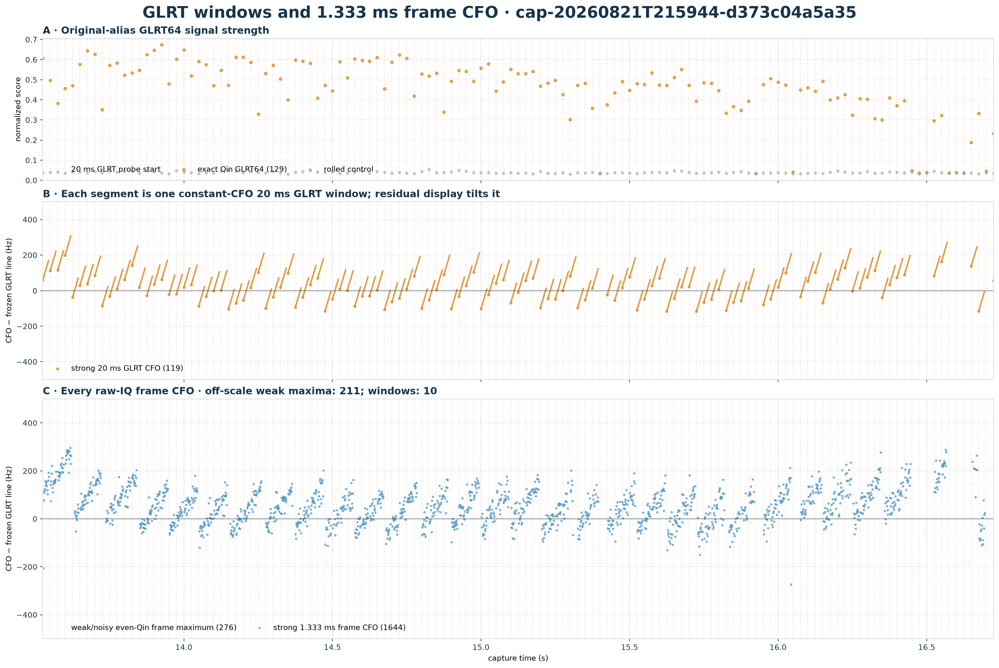
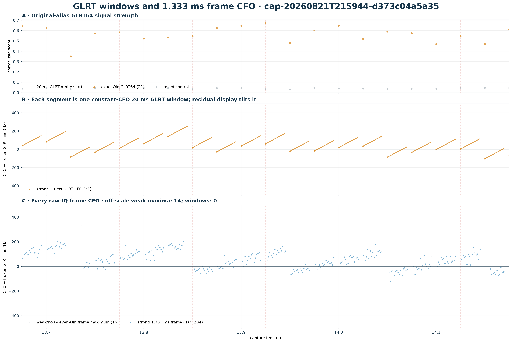
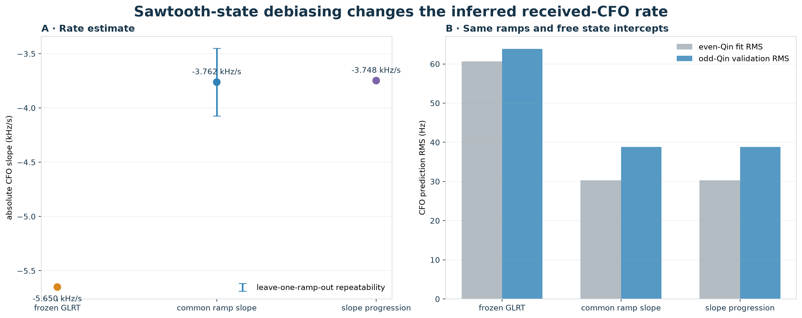

# GLRT windows, frame CFO, and sawtooth-debiased rate for `d373c04a`

## Abstract

This report revisits the retained GLRT branch in
`cap-20260821T215944-d373c04a5a35` using the branch's original absolute-frequency alias
and raw-IQ 1.333 ms Qin frame fits. The branch is strong: 119
of 129 persisted 20 ms GLRT windows and
1653 of 1935
frame fits pass their respective Qin-versus-control gates. The frame CFOs expose
repeated ramps separated by frequency resets. A robust joint fit that gives each
recovered ramp an arbitrary CFO intercept changes the received-CFO rate from the
frozen GLRT value of **-5.650 kHz/s** to
**-3.762 kHz/s**. The conservative leave-one-ramp-out
repeatability is **0.311
kHz/s**.

The corrected value is an emitter-state-debiased **received-CFO rate**. It is
not yet a pure orbital Doppler truth value because LNB drift, receiver clock
drift, and any residual transmitter frequency drift remain in the measurement.

## Data and branch selection

- Capture: `cap-20260821T215944-d373c04a5a35`.
- Stream / receiver / edge: `stream-0`, receiver
  1, `lower` edge.
- Analysis interval: 13.525–
  16.725 s.
- Original branch alias: -186.018
  kHz at 13.525 s.
- Frozen degree-one GLRT rate: -5.6502 kHz/s.
- Raw-IQ frame cadence: 1.333 ms.

The earlier five-dwell prototype followed a Qin-equivalent alias near +41 kHz.
This report instead uses the source result's declared branch near −186 kHz. The
declared branch has materially stronger Qin GLRT evidence and exposes the frame
ramps clearly.

## GLRT and frame-level structure



Panel A shows exact Qin GLRT64 strength against a rolled-Qin control. Panel B
shows every persisted constant-CFO 20 ms GLRT estimate. The line pieces appear
tilted only because the ordinate subtracts the time-varying frozen GLRT line.
Panel C independently maximizes the even-Qin likelihood for every 1.333 ms raw-IQ
frame. Dashed red lines mark GLRT probe starts.



The close-up makes the repeated ramp/reset structure explicit. The blue frame
fits are not interpolated from the 20 ms CFO values; the 20 ms products supply
the acquisition neighborhoods and timing epochs, while each frame CFO is
re-estimated from raw IQ.

## Corrected received-CFO rate



The corrected model first robustly fits each acquisition lock, then globally
partitions adjacent locks into continuous ramps. The primary 0.20 Qin gate gives
25 coherent ramps containing
1390 frames. A joint regression assigns one free
CFO intercept to every ramp and one shared absolute-CFO slope to all ramps.
That free intercept absorbs the sawtooth resets without subtracting the frozen
GLRT line from the scientific fit.

| estimate | rate or progression | interpretation |
| --- | ---: | --- |
| frozen GLRT branch | -5.6502 kHz/s | biased by ramp resets |
| median independent ramp | -3.7419 kHz/s | 10–90%: -3.9600 to -3.5512 |
| joint common ramp slope | **-3.7622 kHz/s** | adopted corrected estimate |
| conditional formal sigma | ±0.0264 kHz/s | conditional on recovered states |
| leave-one-ramp-out repeatability | ±0.3114 kHz/s | conservative tooth-to-tooth stability |
| fitted slope progression | +70.9 ± 34.2 Hz/s² | not selected by BIC or odd-Qin validation |

The correction is +1.888 kHz/s, reducing
the inferred rate magnitude by 33.4%.
Across Qin gates from 0.05 to 0.30, the common-slope estimate ranges only from
-3.793 to -3.737 kHz/s.

## Statistical comparison

Every row below uses the same recovered ramps and a free intercept per ramp, so
the comparison isolates the slope model. Even Qin symbols define the fit;
odd Qin symbols provide an independent symbol holdout.

| slope model | even-Qin RMS | odd-Qin validation RMS |
| --- | ---: | ---: |
| frozen GLRT rate | 60.69 Hz | 63.84 Hz |
| corrected common rate | **30.31 Hz** | **38.82 Hz** |
| rate plus linear progression | 30.27 Hz | 38.84 Hz |

The common-ramp model reduces even-Qin RMS by 50.1% and
odd-Qin validation RMS by 39.2% relative to forcing the
GLRT slope. Adding slope progression changes training RMS by less than 0.05 Hz,
slightly worsens odd-Qin RMS, and worsens BIC by
3.40; the common-slope result is the
more defensible single rate.

## Limits and next use

The result establishes that the −5.65 kHz/s GLRT slope is not the best local
carrier-rate description once frequency resets are modeled. It does not, by
itself, prove that −3.76 kHz/s is satellite-only Doppler. Association work should
compare this debiased rate with the TLE-predicted range-acceleration curve while
allowing a receiver/LNB drift nuisance term and should repeat the same estimator
across both receivers or a stable reference carrier when available.

## Reproduction

```bash
uv run python tools/report_d373c04a_glrt_frames.py \
  --reuse-results reports/figures/2026_08_24_d373c04a_glrt_frames/d373c04a-glrt-frames.json
```

The machine-readable result is [d373c04a-glrt-frames.json](figures/2026_08_24_d373c04a_glrt_frames/d373c04a-glrt-frames.json).
