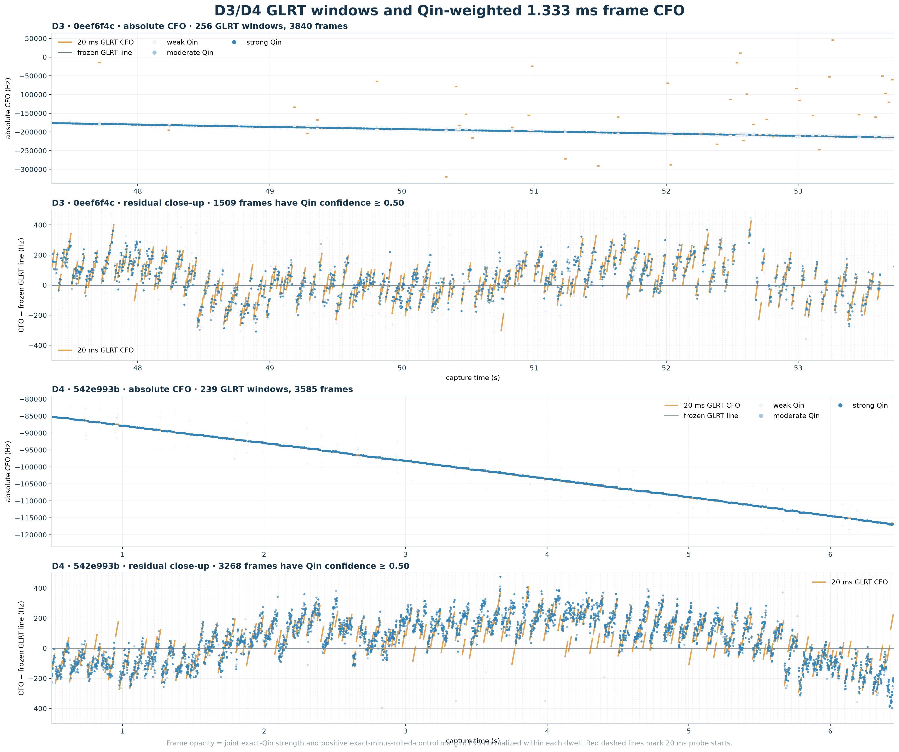
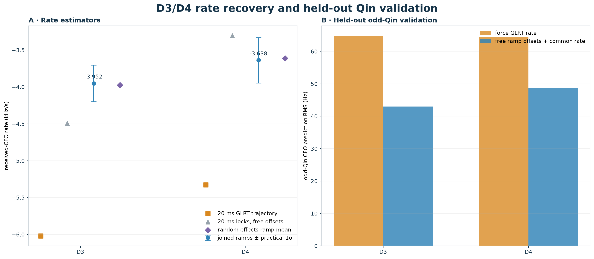
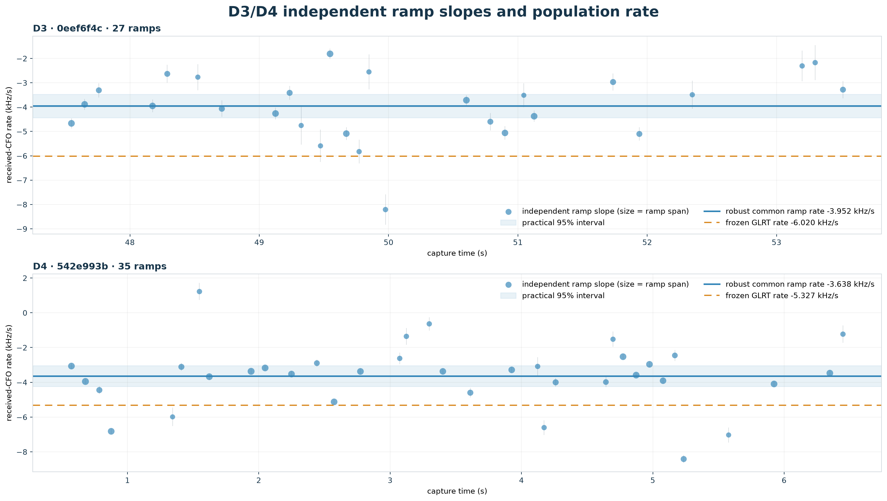
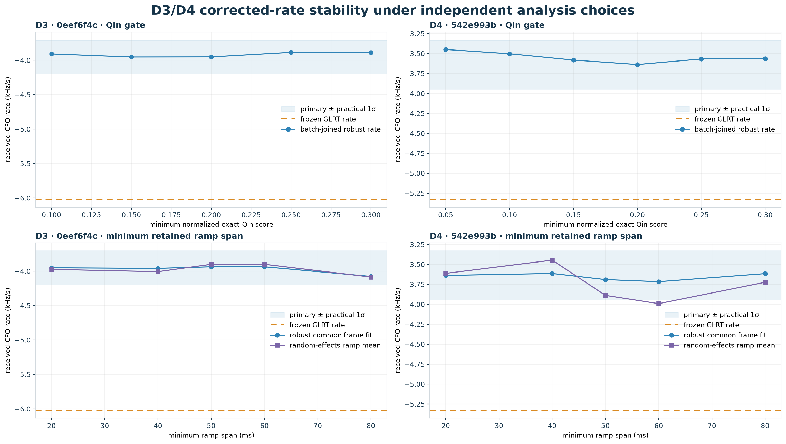

# Recovering the underlying D3/D4 received-CFO rates

> **Mechanism update (2026-08-24):** The local-rate estimates below remain
> valid, but "reset-debiased" should be read as *acquisition-discontinuity
> debiased*. Refill-time compression, rather than a demonstrated emitter reset,
> is the dominant explanation. See
> [Refill-time compression explains the Starlink CFO sawtooth](2026_08_24_refill_time_compression_sawtooth.md).

## Abstract

This audit separates the persisted 20 ms GLRT trajectory from the local slope
inside Qin-coherent 1.333 ms frame ramps. D3 and D4 both contain strong repeated
ramps, but their persisted GLRT rates are biased by the sequence of CFO resets.
After giving every 20–125 ms ramp its own arbitrary CFO intercept, the recovered
rates are **-3.952 ± 0.246 kHz/s**
for D3 and **-3.638 ± 0.308 kHz/s**
for D4 (practical 1σ ramp-cluster uncertainty).

These are emitter-reset-debiased **received-CFO rates**, not pure orbital Doppler:
continuous transmitter drift, LNB drift, and receiver-clock drift remain possible
nuisance terms.

## Data

- D3: `cap-20260821T224942-0eef6f4c0cdb`.
- D4: `cap-20260821T230254-542e993bb778`.
- Raw-IQ frame cadence: 1.333 ms; even Qin symbols estimate CFO and odd Qin
  symbols validate the fitted rate independently.
- Primary frame gate: normalized exact-Qin score ≥ 0.20 with a
  positive exact-minus-rolled-control margin.
- No new RF data were collected.

## Where the trustworthy frame evidence is

Orange pieces are the persisted constant-CFO 20 ms GLRT windows. Every blue
point is an independently maximized 1.333 ms frame CFO. Point opacity requires
both exact-Qin coherence and separation from the rolled-Qin control; weak
maxima remain faintly visible. The residual panels subtract only the frozen GLRT
line for display. They make the short ramps and resets visible without using the
GLRT CFO as the frame estimate.

D3 is heterogeneous in availability: the high-opacity points concentrate in
several bands, while many other maxima are not Qin-specific. D4 is nearly
continuously Qin-strong. In both cases, the high-confidence points form local
ramps whose slope is visibly shallower than the long-time GLRT line.

## Rate result

| dwell | frozen GLRT | 20 ms locks only | joined-ramp primary ± practical 1σ | random-effects ramps | odd RMS, GLRT→ramp (Hz) |
| --- | ---: | ---: | ---: | ---: | ---: |
| D3 · 0eef6f4c | -6.020 | -4.494 | **-3.952 ± 0.246** | -3.975 | 64.7 → 43.0 |
| D4 · 542e993b | -5.327 | -3.305 | **-3.638 ± 0.308** | -3.612 | 64.4 → 48.7 |

The 20 ms-lock-only calculation gives every probe its own intercept, but its
baseline is too short relative to the 25 Hz frame-CFO grid. It moves toward the
correct answer but is visibly estimator-sensitive: -4.494
kHz/s for D3 and -3.305 kHz/s for
D4. Joining only frequency-continuous locks into 20–125 ms ramps supplies the
leverage needed for the primary estimate.

The primary rates reduce independent odd-Qin prediction RMS by
33.5% for D3 and
24.3% for D4. Thus the correction is
not merely an even-symbol in-sample improvement.

## Ramp-to-ramp variation and uncertainty

The dots are slopes fitted independently to individual recovered ramps; their
size encodes ramp duration and their whiskers are conditional line-fit errors.
Short, 25 Hz-quantized ramps naturally have noisy slopes. The old
leave-one-ramp-out RMS asked whether one short ramp predicts another and was
therefore 1.368
kHz/s for D3 and 1.867
kHz/s for D4. That is a single-ramp prediction metric, not uncertainty on the
pooled mean.

For inference on the common rate, this audit resamples whole ramps and also fits
a random-effects model to independent ramp slopes. The reported practical 1σ is
the larger of the cluster-bootstrap standard error and the random-effects mean
standard error: 0.246 kHz/s for
D3 and 0.308 kHz/s for D4.
The corresponding practical 95% intervals are
[-4.435, -3.469]
and [-4.243, -3.034]
kHz/s.

## Sensitivity and slope progression

D3 settles to approximately −3.89 to −3.95 kHz/s once the Qin gate reaches
0.15. D4 settles to approximately −3.57 to −3.64 kHz/s over gates 0.15–0.30.
Changing the minimum retained ramp span from 20 to 80 ms does not move either
robust common-frame fit toward its much steeper GLRT value.

A linear slope-progression term is not selected. For D3 the fitted progression
is +28.4 ±
44.2 Hz/s² and raises
BIC by 5.97. For D4 it
is +50.8 ±
23.2 Hz/s² and raises
BIC by 1.39. The extra
term changes odd-Qin error negligibly, so the constant local-rate model remains
the supported description over each dwell.

## Method

1. Reuse the source-alias GLRT timing epoch to identify complete 1.333 ms frame
   boundaries.
2. Within each frame, maximize the residual-CFO likelihood using even Qin
   symbols on a 25 Hz grid; retain exact strength and rolled-control margin.
3. Fit each timing lock, then globally partition adjacent locks into continuous
   ramps no longer than 125 ms. Retain ramps spanning at least 20 ms with raw
   line-fit RMS ≤ 40 Hz.
4. Fit all retained frame CFOs jointly with one intercept per ramp and a robust
   shared slope. This removes discrete emitter-state CFO offsets while retaining
   the within-ramp derivative.
5. Validate predictions on the odd Qin symbols, which did not choose the frame
   CFO.
6. Quantify practical uncertainty by resampling entire ramps, not individual
   frames, and cross-check with a REML random-ramp-slope model.

## Conclusion

The evidence supports **approximately −3.95 kHz/s for D3** and
**approximately −3.64 kHz/s for D4** as the underlying reset-debiased
received-CFO rates. The original −6.020 and −5.327 kHz/s GLRT slopes are not
supported once arbitrary ramp offsets are removed, and they predict held-out
odd-Qin CFO materially worse.

Machine-readable statistics are in
[d3-d4-underlying-rate-analysis.json](figures/2026_08_24_d3_d4_underlying_rates/d3-d4-underlying-rate-analysis.json).
