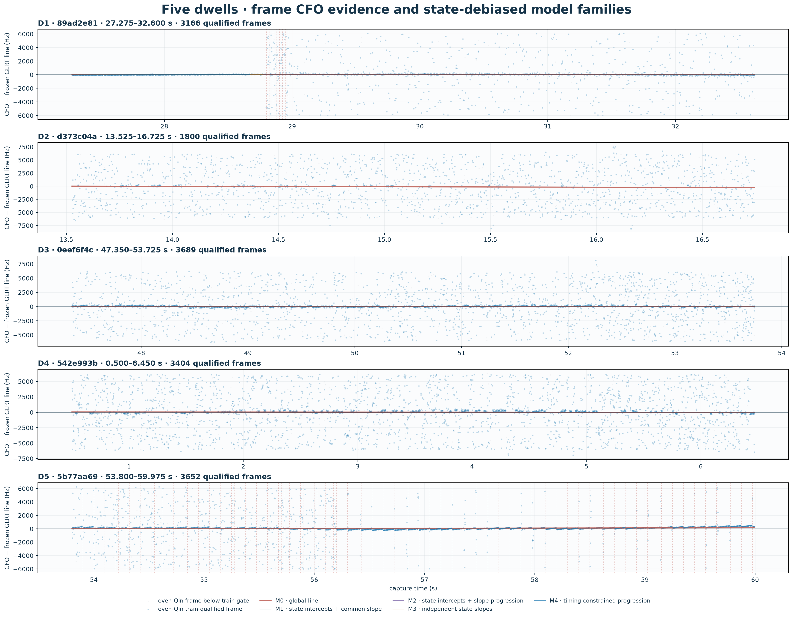
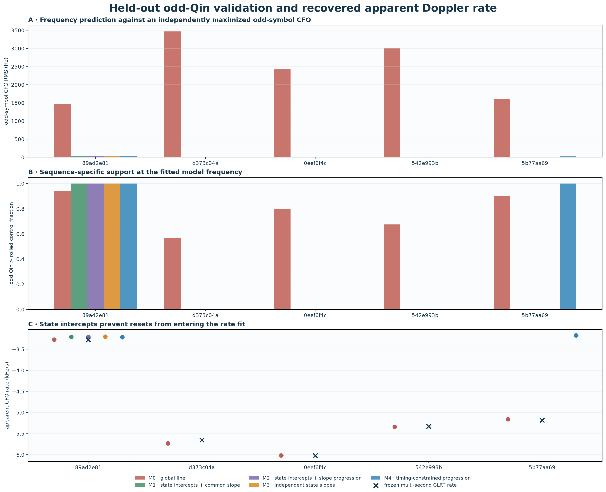
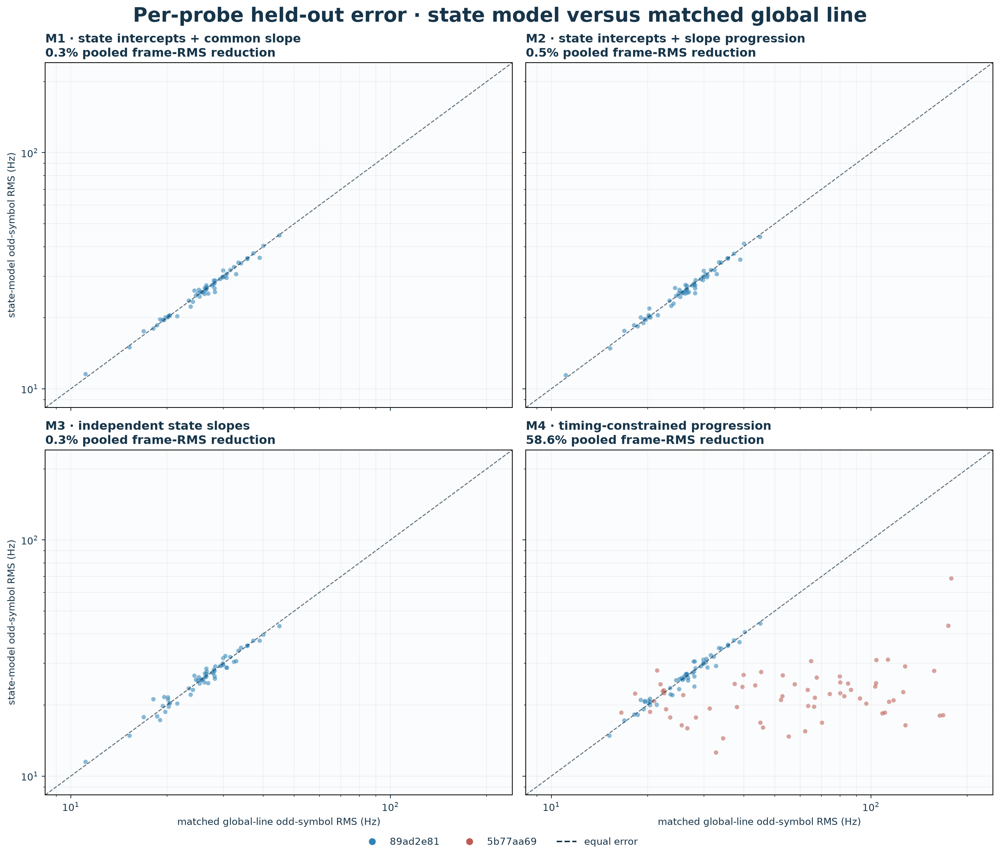
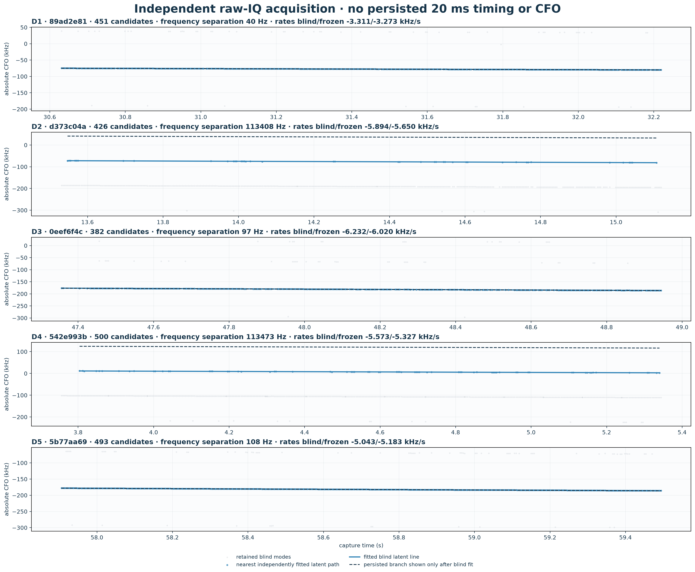

# Five-dwell prototypes for state-debiased Starlink Doppler

## Abstract

Five estimator families were replayed on the same five sealed historical captures. The
persisted 20 ms GLRT was used only to select and initialize one already-declared
multi-second branch per dwell.  Every 1.333 ms frequency likelihood was reconstructed
from raw IQ.  Even Qin symbols fit the model; odd Qin symbols and a rolled-Qin sequence
were held out.  A separate 12 ms / 4 ms-hop blind acquisition tested whether a compatible
path could be found without any persisted timing or CFO.

Coherent multi-probe ramps sufficient for a state-debiased fit survived on
**2/5 dwells**. M4 was estimable on two dwells and reduced pooled matched-support odd-symbol CFO RMS from 62.4 to 25.8 Hz (58.6%). The blind lane independently landed
within 3 kHz of the predeclared branch on **3/5 dwells**. These failures
are part of the result: a strong 20 ms GLRT branch is not, by itself, proof that exact Qin
phase persists at frame scale.

The comparison distinguishes *measurement precision* from *physical identifiability*.
State intercepts can prevent timing/emitter replacements from biasing the rate, but no
carrier-only model can prove that its within-state rate is purely orbital Doppler.



## Data and model inventory

The five captures were frozen by
[`inputs.json`](figures/2026_08_23_additional_subsecond_pilot_dwells/inputs.json).  No RF was
collected and every recording read was digest-verified and read-only.

Each model cell below is `rate in kHz/s / held-out odd-symbol CFO RMS in Hz`.

| dwell | span (s) | near probes | train frames | GLRT rate | M0 | M1 | M2 | M3 | M4 |
| --- | ---: | ---: | ---: | ---: | ---: | ---: | ---: | ---: | ---: |
| 89ad2e81 | 5.325 | 209/214 | 3166/3210 | -3.273 | -3.271 / 1471.7 | -3.205 / 27.3 | -3.205 / 27.2 | -3.199 / 27.3 | -3.214 / 27.7 |
| d373c04a | 3.200 | 41/129 | 1800/1935 | -5.650 | -5.730 / 3468.5 | — | — | — | — |
| 0eef6f4c | 6.375 | 216/256 | 3689/3840 | -6.020 | -6.018 / 2424.9 | — | — | — | — |
| 542e993b | 5.950 | 108/239 | 3404/3585 | -5.327 | -5.338 / 3004.9 | — | — | — | — |
| 5b77aa69 | 6.175 | 239/248 | 3652/3720 | -5.183 | -5.159 / 1611.6 | — | — | — | -3.172 / 24.1 |

## Held-out statistical comparison



| model | definition | dwells | frames | odd-CFO RMS (Hz) | Qin > ctrl | rate (kHz/s) |
| --- | --- | ---: | ---: | ---: | ---: | ---: |
| M0 | global line | 5/5 | 15711 | 2399.1 | 79.8% | -5.338 |
| M1 | state intercepts + common slope | 1/5 | 900 | 27.3 | 100.0% | -3.205 |
| M2 | state intercepts + slope progression | 1/5 | 900 | 27.2 | 100.0% | -3.205 |
| M3 | independent state slopes | 1/5 | 900 | 27.3 | 100.0% | -3.199 |
| M4 | timing-constrained progression | 2/5 | 1800 | 25.8 | 100.0% | -3.193 |

The table above reports each model on the frames it can support and is therefore an
availability summary, not a fair model-to-model error comparison. The paired comparison
below refits a global line to **exactly the same even-symbol frames** as each state model,
then scores both predictions on the same odd symbols and the same probes.



| model | definition | dwells | frames | matched global RMS | state RMS | reduction | Qin > ctrl |
| --- | --- | ---: | ---: | ---: | ---: | ---: | ---: |
| M1 | state intercepts + common slope | 1/5 | 900 | 27.3 | 27.3 | 0.3% | 100.0% |
| M2 | state intercepts + slope progression | 1/5 | 900 | 27.3 | 27.2 | 0.5% | 100.0% |
| M3 | independent state slopes | 1/5 | 900 | 27.3 | 27.3 | 0.3% | 100.0% |
| M4 | timing-constrained progression | 2/5 | 1800 | 62.4 | 25.8 | 58.6% | 100.0% |

The pooled result is not uniform:

- **D1 (`89ad2e81`)**: the matched global line already scores 27.35 Hz RMS. M1,
  M2, and M3 score 27.26, 27.22, and 27.28 Hz: only 0.3–0.5% different. M2
  measures a slope progression of −87.9 Hz/s², but improves RMS by only 0.05 Hz
  over M1. The data do not justify preferring the more complex progression model.
- **D5 (`5b77aa69`)**: M4 reduces matched held-out RMS from 81.43 to 24.06 Hz
  (70.4%). Median per-probe RMS falls from 62.79 to 21.93 Hz and the 90th
  percentile from 127.29 to 27.99 Hz. Its rate is −3.172 kHz/s with progression
  −20.9 Hz/s², versus the frozen GLRT branch rate of −5.183 kHz/s. This is the
  one dwell where state debiasing materially changes the inferred rate.
- **D2, D3, and D4**: no ≥20 ms, ≤40 Hz-RMS multi-probe ramp survived, so M1–M4
  are reported as unavailable rather than forcing a Doppler estimate. D3 is a
  particularly useful distinction: blind acquisition finds the branch to 97 Hz,
  yet exact frame-scale coherence does not persist long enough for these models.

- **M0** fits one robust line through the raw frame CFOs and therefore permits state
  replacements to enter the rate.
- **M1** assigns each batch-recovered coherent ramp an arbitrary CFO intercept and fits
  one common within-ramp rate.
- **M2** adds a linear progression of that common rate over capture time.
- **M3** fits every coherent ramp independently.  It is the most flexible carrier-only
  model and is therefore expected to have the lowest training error; held-out odd-symbol
  performance determines whether that freedom is useful.
- **M4** repeats M2 after forcing a split when the independently acquired frame timing
  phase jumps by more than 20 samples or qualified locks have a
  gap greater than 55 ms.

The reported absolute CFO levels remain receiver-relative.  An unknown LNB/emitter
constant is absorbed by the global or per-state intercepts.  LNB and transmitter clock
*drift* remain inseparable from geometric Doppler rate.

## Blind acquisition ablation



The blind search covers 1.60 s around the
predeclared anchor but consumes no persisted epoch or CFO.  Up to three latent paths are
fit before the previously selected branch is loaded for comparison.  “Nearest” therefore
means a post-fit association, not a search prior.

Rate columns below are kHz/s; CFO Δ is Hz.

| dwell | status | modes | CFO Δ (Hz) | GLRT rate | blind rate | local rate | jumps |
| --- | --- | ---: | ---: | ---: | ---: | ---: | ---: |
| 89ad2e81 | complete | 451 | 40 | -3.273 | -3.311 | -3.279 | 7 |
| d373c04a | complete | 426 | 113408 | -5.650 | -5.894 | — | 24 |
| 0eef6f4c | complete | 382 | 97 | -6.020 | -6.232 | -4.216 | 42 |
| 542e993b | complete | 500 | 113473 | -5.327 | -5.573 | — | 41 |
| 5b77aa69 | complete | 493 | 108 | -5.183 | -5.043 | -2.903 | 15 |

## Methods and interpretation boundary

For each persisted probe, the nearest CFO candidate to the frozen branch supplies a timing
epoch. Its CFO supplies the NCO center when it is within 2.5 kHz of the branch; otherwise
the frozen branch value centers the ±6 kHz raw-IQ likelihood so a bad GLRT candidate does
not silently delete the probe. Even and odd pilot symbols form independent 25 Hz-grid
frequency likelihoods. Only the even half determines frame inclusion, segmentation, and
model parameters. The permissive frame gate is followed by the much stronger multi-probe
linearity test; isolated frequency maxima are not called coherent ramps.

Batch segments are selected by a capped-square dynamic program.  A segment is called
coherent only when it spans at least 20 ms and its raw line-fit RMS is at most 40 Hz.
Model validation samples the untouched odd-Qin and rolled-control likelihoods at exactly
the predicted frequency; it does not re-optimize the model on the validation symbols.

This is a prototype comparison, not a satellite-velocity product.  M1–M4 identify a
state-debiased *apparent CFO rate* under their respective state assumptions.  Associating
that rate with orbital Doppler still requires a TLE shape, calibrated oscillator,
uncontaminated tone, or independently qualified timing/SFO model.

## Reproduction

```bash
.venv/bin/python tools/report_five_dwell_doppler_prototypes.py
```

Machine-readable results:
[`five-dwell-doppler-prototypes.json`](figures/2026_08_24_five_dwell_doppler_prototypes/five-dwell-doppler-prototypes.json).
