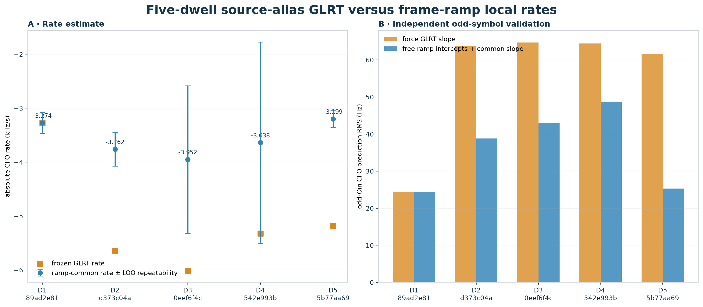
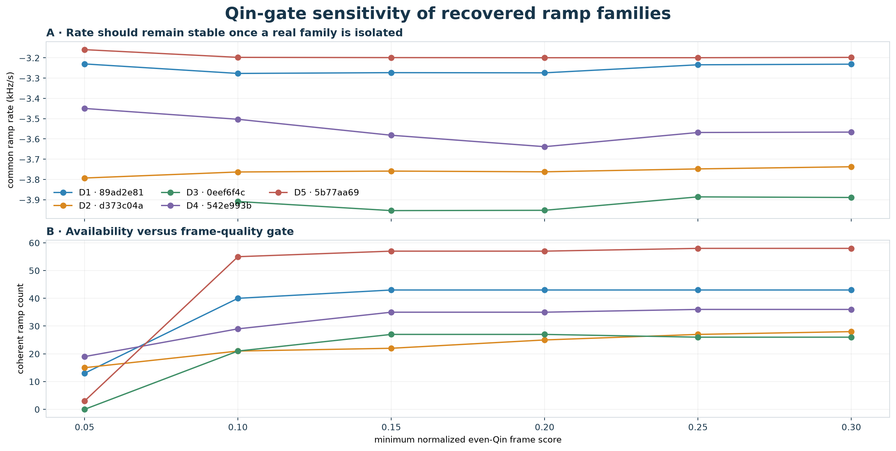
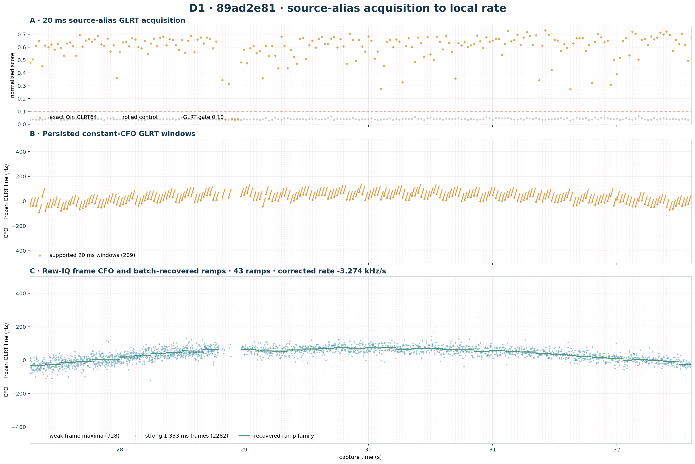
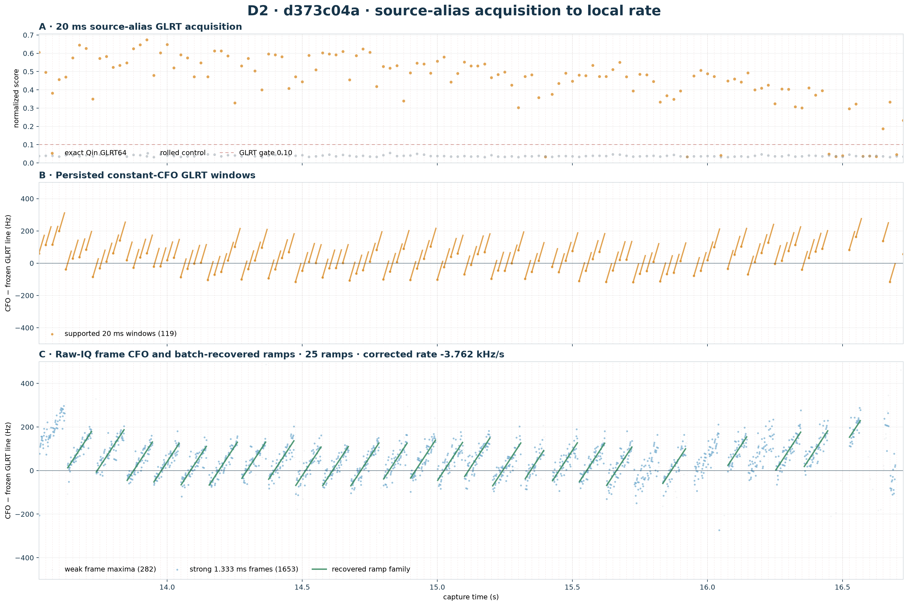
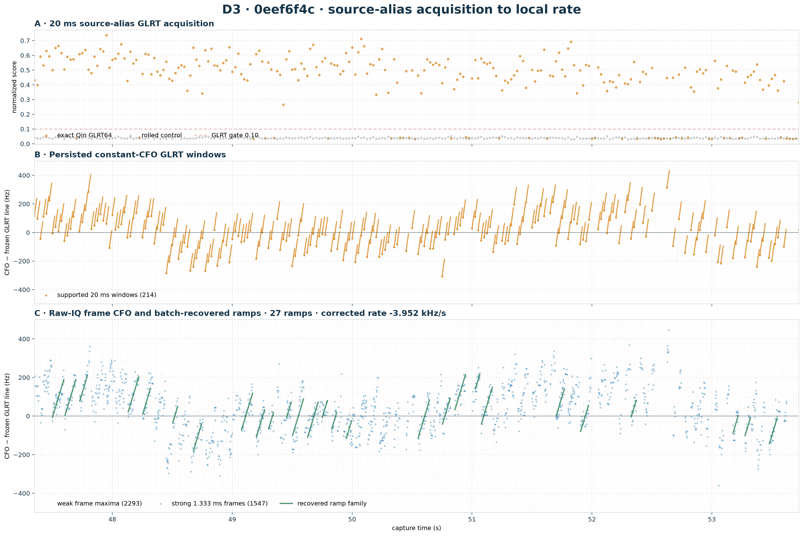
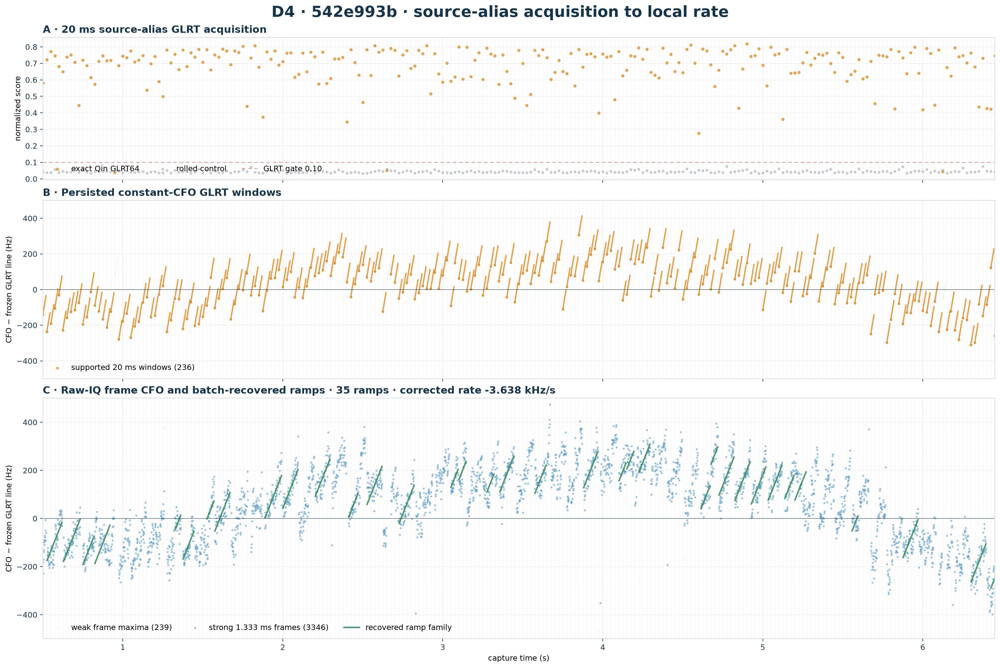
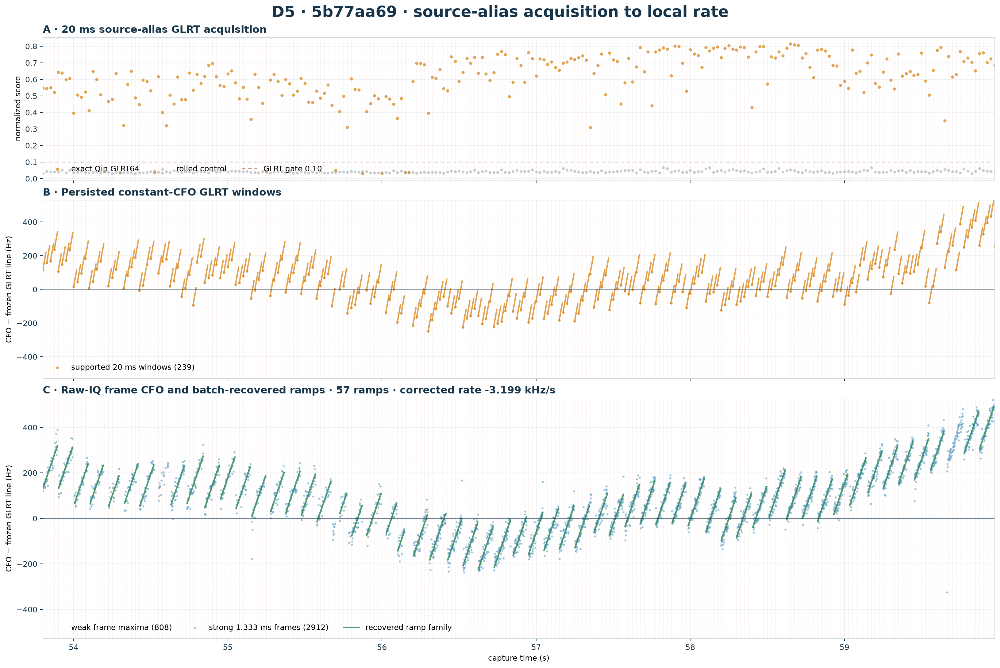

# Five-dwell multiscale local-rate prototype

## Abstract

This prototype applies one consistent three-scale pipeline to five sealed
historical Starlink dwells: source-alias 20 ms GLRT acquisition, independent
1.333 ms even-Qin frame CFO fitting with odd-Qin validation, and batch recovery
of 20–125 ms continuous ramps followed by a free-intercept common-slope fit.
The 20 ms CFO values locate the signal and timing lattice but do not define the
reported local rate.

The experiment corrects a prior D2/D4 failure mode: a canonical CFO alias was
used as a raw-IQ acquisition alias, which selected different timing candidates.
Here every dwell is tied to the source trajectory alias and its associated GLRT
timing epoch before frame analysis.

## Cross-dwell result



| dwell | strong GLRT | strong frames | ramps | GLRT rate (kHz/s) | local rate ± LOO RMS (kHz/s) | odd RMS, GLRT→local (Hz) | assessment |
| --- | ---: | ---: | ---: | ---: | ---: | ---: | --- |
| D1 · 89ad2e81 | 209/214 | 2282/3210 | 43 | -3.273 | -3.274 ± 0.194 | 24.5 → 24.4 | GLRT and local rate agree |
| D2 · d373c04a | 119/129 | 1653/1935 | 25 | -5.650 | -3.762 ± 0.311 | 63.8 → 38.8 | GLRT is reset-biased |
| D3 · 0eef6f4c | 214/256 | 1547/3840 | 27 | -6.020 | -3.952 ± 1.368 | 64.7 → 43.0 | Reset-biased; large ramp scatter |
| D4 · 542e993b | 236/239 | 3346/3585 | 35 | -5.327 | -3.638 ± 1.867 | 64.4 → 48.7 | Reset-biased; large ramp scatter |
| D5 · 5b77aa69 | 239/248 | 2912/3720 | 57 | -5.183 | -3.199 ± 0.153 | 61.7 → 25.3 | GLRT is reset-biased |

The error comparison is paired: both slopes are evaluated on the same recovered
ramps with one free CFO intercept per ramp. Even Qin symbols fit the model and
odd Qin symbols provide the independent within-frame validation view.

## Pipeline

1. Read the previously selected source trajectory alias and its original
   absolute-CFO line.
2. At every 20 ms detection, bind the nearest source-alias GLRT candidate to its
   own timing epoch; do not substitute the canonical/dealiased alias.
3. Recompute an even-Qin residual-CFO likelihood for every complete 1.333 ms
   frame and retain the maximizing CFO, exact strength, and rolled-control
   margin. The odd Qin symbols independently maximize the validation CFO.
4. Require normalized even-Qin strength ≥ 0.20 and positive
   exact-minus-control margin.
5. Robustly fit each timing lock and globally partition consecutive locks into
   continuous ramps. A retained ramp must span at least
   20 ms and fit within
   40 Hz raw RMS.
6. Fit one free CFO intercept per ramp plus a shared absolute-CFO slope. Report
   formal conditional error, leave-one-ramp-out repeatability, gate sensitivity,
   and odd-symbol prediction error.

## Qin-gate sensitivity



The permissive 0.02 threshold from the first prototype is intentionally absent:
maximizing hundreds of CFO cells lets noise maxima pass it. The plotted
0.05–0.30 sweep tests whether a rate appears only at one hand-picked threshold.
A credible dwell should settle to a stable rate as weak frames are removed.

## D1 · 89ad2e81 — `cap-20260821T204837-89ad2e81a2a6`



The strict frame gate recovers 43 coherent ramps containing
2276 frames. The common within-ramp rate is
**-3.2739 kHz/s**, compared with the frozen GLRT rate of
-3.2728 kHz/s. Leave-one-ramp-out repeatability is
0.1941 kHz/s; odd-Qin CFO RMS changes from 24.46 to
24.40 Hz.

Frame evidence source: prior raw-IQ frame analysis at matching source alias.

## D2 · d373c04a — `cap-20260821T215944-d373c04a5a35`



The strict frame gate recovers 25 coherent ramps containing
1390 frames. The common within-ramp rate is
**-3.7622 kHz/s**, compared with the frozen GLRT rate of
-5.6502 kHz/s. Leave-one-ramp-out repeatability is
0.3114 kHz/s; odd-Qin CFO RMS changes from 63.84 to
38.82 Hz.

Frame evidence source: corrected source-alias raw-IQ frame analysis.

## D3 · 0eef6f4c — `cap-20260821T224942-0eef6f4c0cdb`



The strict frame gate recovers 27 coherent ramps containing
618 frames. The common within-ramp rate is
**-3.9521 kHz/s**, compared with the frozen GLRT rate of
-6.0197 kHz/s. Leave-one-ramp-out repeatability is
1.3684 kHz/s; odd-Qin CFO RMS changes from 64.70 to
43.00 Hz.

Frame evidence source: prior raw-IQ frame analysis at matching source alias.

## D4 · 542e993b — `cap-20260821T230254-542e993bb778`



The strict frame gate recovers 35 coherent ramps containing
1624 frames. The common within-ramp rate is
**-3.6382 kHz/s**, compared with the frozen GLRT rate of
-5.3267 kHz/s. Leave-one-ramp-out repeatability is
1.8671 kHz/s; odd-Qin CFO RMS changes from 64.41 to
48.75 Hz.

Frame evidence source: recomputed from digest-verified raw IQ at source alias.

## D5 · 5b77aa69 — `cap-20260821T230700-5b77aa69fbba`



The strict frame gate recovers 57 coherent ramps containing
2800 frames. The common within-ramp rate is
**-3.1995 kHz/s**, compared with the frozen GLRT rate of
-5.1826 kHz/s. Leave-one-ramp-out repeatability is
0.1528 kHz/s; odd-Qin CFO RMS changes from 61.66 to
25.31 Hz.

Frame evidence source: prior raw-IQ frame analysis at matching source alias.


## Interpretation limits

The fitted slope is an emitter-state-debiased **received-CFO rate**, not yet a
satellite-only Doppler truth value. Free ramp intercepts remove constant carrier
assignments and discrete retunes, but LNB/receiver drift and any continuous
transmitter drift remain. TLE association must therefore compare these rates
while carrying a receiver-drift nuisance term or a simultaneous reference.

The current prototype maximizes each frame likelihood before segmentation. A
next iteration should optimize the full per-frame likelihood jointly over ramp
intercepts, change points, and common slope; this result is the point-estimate
baseline against which that joint-likelihood version should be tested.

## Reproduction

```bash
uv run python tools/report_five_dwell_multiscale_local_rates.py \
  --reuse-results reports/figures/2026_08_24_five_dwell_multiscale_local_rates/five-dwell-multiscale-local-rates.json
```

Machine-readable frames, selected windows, ramp fits, sensitivity sweeps, and
validation metrics are in [five-dwell-multiscale-local-rates.json](figures/2026_08_24_five_dwell_multiscale_local_rates/five-dwell-multiscale-local-rates.json).
