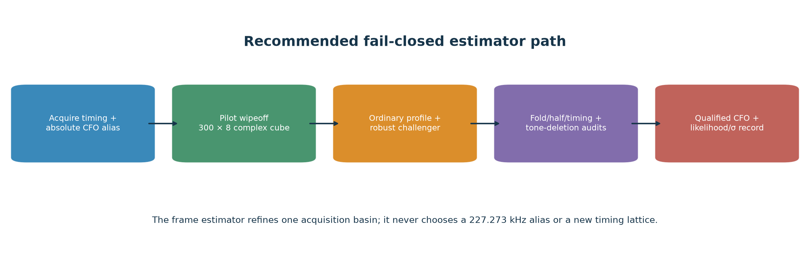
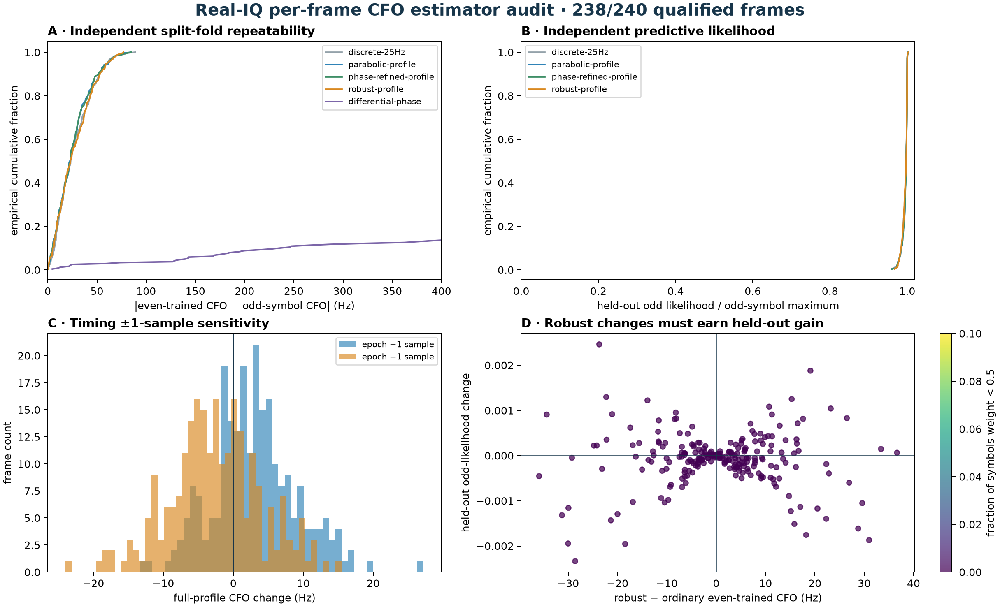
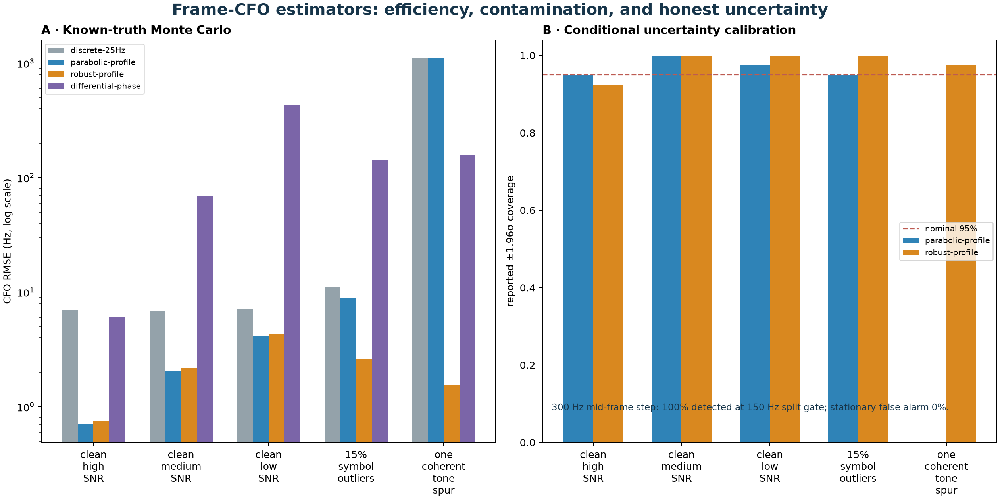

# Qualified CFO estimation in each 1.333 ms Qin pilot frame

## Bottom line

The existing tracked estimator is already a proper complex profile-likelihood
fit, not merely a line through wrapped phase. It removes one unknown complex
gain for each of the eight edge-pilot tones, searches a bounded residual CFO,
and locally refines the peak. The newer reset-debias prototype instead uses a
25 Hz discrete maximum on even Qin symbols and reserves odd symbols for
validation. The split is scientifically valuable, but the discrete point
estimate should receive a continuous sub-bin refinement and an explicit
fold-disagreement/uncertainty audit.

The recommended default point estimator is the **continuous ordinary
eight-gain profile maximum inside an acquisition-provided timing/CFO basin**.
The robust profile remains a research challenger and is not part of the public
point-estimator contract. An ordinary estimate is supported only when exact Qin
beats the rolled control, independent even/odd fold CFOs agree, the peak is not
on the search boundary, timing ±1 sample is stable, a half-frame test finds no
frequency step, and deleting any one pilot tone moves the CFO by at most 75 Hz.
This estimator cannot decide the ≈227.273 kHz OFDM alias; alias identity remains
an acquisition/replay responsibility.



## Two different meanings of “pilot”

This analysis uses the OFDM **edge pilots disclosed by Qin, Psiaki, Bowman, and
Humphreys**: 300 known 4QAM symbols on eight subcarriers at each edge of a
1.333 ms frame. See [*Pilots and Other Predictable Elements of the Starlink
Ku-Band Downlink*](https://arxiv.org/abs/2602.02627), especially its signal
model, edge-pilot section, and Appendix A sequences.

That is not the same observable as the older “pilot tones” in Kozhaya,
Saroufim, and Kassas: nine unmodulated, data-less tones in the silent center of
a Ku-band channel. [*Unveiling Starlink for
PNT*](https://doi.org/10.33012/navi.685) is therefore a methodological contrast,
not the source of our Qin sequence. Its pre-2024 OFDM examples report abrupt CFO
corrections on an approximately one-second grid; neither those center tones nor
that cadence should be conflated with the 50–100 ms stored-refill structure in
this corpus.

## What the current estimators compute

After exact Qin wipeoff, let `x[i,k]` be symbol `i`, tone `k`, and `t[i]` its
time. For trial residual frequency `f`, the ordinary estimator maximizes

```text
L(f) = Σ_k |Σ_i x[i,k] exp(-j 2π f t[i])|².
```

This is the Gaussian-noise maximum likelihood after analytically profiling out
eight nuisance gains `h[k]`. The current all-symbol implementation uses a
100 Hz coarse grid, 5 Hz fine grid, a parabolic peak, and two bounded
phase-slope refinements. The raw reset-debias prototype uses a 25 Hz argmax on
even symbols; odd symbols are independently maximized for validation.

The robust prototype starts from per-tone CFO consensus, then alternates the
profile maximum with Huber symbol weights and capped inverse-residual-variance
tone weights. This handles sparse bad Qin symbols and a minority of coherent
narrowband tone contaminants while retaining the ordinary ML solution under
clean Gaussian noise. A robust adjacent-symbol phase-difference estimator is
also tested as a search-free diagnostic; it is less efficient and should not
be the primary estimate.

## Real-IQ experiment

The test reran 240 raw frames from
`cap-20260821T140820-470384cc9284`, `stream-0/RX0`, upper edge. Timing locks were
selected by the existing GLRT64/frozen-trajectory rule and stratified across
33.7–37.7 s. Of these, 238 passed the
declared even-Qin gate. Every method in the table uses even symbols; the odd
profile maximum is an independent comparison. The all-300-symbol current
estimate is excluded from this held-out comparison because it has seen the odd
symbols.



| even-trained method | even–odd RMS (Hz) | p95 | within 100 Hz | median odd-likelihood efficiency |
| --- | ---: | ---: | ---: | ---: |
| discrete-25Hz | 32.5 | 60.3 | 100.0% | 0.997 |
| parabolic-profile | 31.2 | 61.5 | 100.0% | 0.997 |
| phase-refined-profile | 31.3 | 60.8 | 100.0% | 0.997 |
| robust-profile | 32.5 | 60.4 | 100.0% | 0.997 |
| differential-phase | 1562.8 | 2200.8 | 3.4% | — |

The ordinary phase-refined split CFO has median absolute even/odd disagreement
23.0 Hz and p95 60.8 Hz;
0.0% exceed 100 Hz. That disagreement is a
direct per-frame quality observable and should be persisted, not hidden by
averaging the two folds.

### Sub-bin refinement

Parabolic interpolation moves the 25 Hz grid maximum by a median
5.87 Hz (p95
12.17 Hz) and improves held-out odd
likelihood on 58.4% of qualified
frames. A grid label is not an uncertainty statement: continuous refinement
removes deterministic quantization, but noise and model mismatch still govern
the error.

### Conditional uncertainty is not calibrated yet

Combining the current even/odd analytic sigmas predicts a median split sigma of
32.0 Hz, while empirical split
RMS is 31.3 Hz. Nominal 95% coverage is
95.0%, and standardized split RMS is
0.98 rather than one. Until this is
calibrated by signal-quality strata, report both curvature/phase sigma and the
fold disagreement; use the larger for downstream weighting.

### Timing sensitivity

Moving the assumed frame epoch by one raw 2.5 MS/s sample changes the all-symbol
CFO by median 4.3 Hz for −1 and
4.9 Hz for +1. The worst-direction
p95 is 15.2 Hz and maximum is
27.2 Hz. Therefore timing must be
bound to each source acquisition, and a ±1 sample sensitivity should be a
qualification field rather than silently reusing one epoch.

### Leave-one-tone-out influence

A single coherent contaminant can dominate the ordinary eight-tone sum while
exact/control, parity, and half-frame checks still agree. The auditable remedy
is not to replace Gaussian ML unconditionally: refit after deleting each of the
eight tones and record the maximum shift from the full fit. In the
`cap-...470384` real cohort the deletion spread is median 9.7
Hz, p95 18.0 Hz, and maximum
35.3 Hz; none of 238
coherence-qualified frames exceeds the 75 Hz gate. The independent T01/T06
checks likewise rejected 0/72 and 0/77,
with maxima 70.2 and 16.4 Hz. These three cohorts support 75 Hz as a
conservative first bound, not a universal population calibration.

### Robust weighting

The robust fit changes the ordinary even CFO by median
6.4 Hz (p95
27.2 Hz) and improves independent odd
likelihood on 45.0% of qualified raw
frames. Its median heavy-downweight fraction is
0.0%. Robust weighting
should therefore be promoted only with the held-out gain check: a changed CFO
is not automatically a better CFO.

### T01/T06 source-bound cross-check

A second raw-IQ check used eight stratified source-bound timing locks from each
of the ten-dwell cohort's T01 and T06 results. T01 is the reset-biased case
whose GLRT and local rates differ by 2.329 kHz/s; T06 is the falsification
control where the rates differ by only 0.003 kHz/s. The same eight-gain frame
gate retained 74/120 and 77/120 frames, respectively.

| dwell | grid RMS | parabolic | phase refine | robust | σ predicted / observed | 95% cover |
| --- | ---: | ---: | ---: | ---: | ---: | ---: |
| T01 | 43.38 Hz | 42.25 Hz | 42.22 Hz | 45.07 Hz | 42.13 / 42.22 Hz | 94.6% |
| T06 | 29.62 Hz | 29.47 Hz | 29.40 Hz | 28.23 Hz | 32.55 / 29.40 Hz | 97.4% |

Parabolic refinement improved held-out likelihood on 54.1% of T01 and 51.9%
of T06 frames. Robust weighting improved it on only 41.9% of T01 frames and
58.4% of T06 frames. This is the decisive reason not to make the robust fit an
unconditional replacement: contamination resistance is valuable, but clean
real frames retain the Gaussian-profile efficiency advantage. Frozen evidence
and input digests are recorded in
[`t01-t06-crosscheck.json`](figures/2026_08_24_frame_cfo_estimator_study/t01-t06-crosscheck.json).

The ±1-sample timing-spread p95 is 18.4 Hz for T01 and 17.0 Hz for T06;
neither cohort has a value above 50 Hz. A half-frame disagreement normalized by
the two half-fit sigmas exceeds 4 only once in 72 T01 frames and never in 77
T06 frames. These results support 50 Hz timing and 4σ half-frame gates as
conservative first defaults, with continued monitoring rather than claims of
universal calibration.

## Known-truth simulation

The Monte Carlo randomizes eight complex channel gains and true residual CFO.
It covers clean high/medium/low SNR, 15% symbol contamination, and one coherent
tone spur. It is an estimator stress test, not a radio-fidelity claim.



| scenario | method | bias (Hz) | RMSE (Hz) | p95 abs (Hz) | >100 Hz | nominal 95% coverage |
| --- | --- | ---: | ---: | ---: | ---: | ---: |
| clean high SNR | discrete-25Hz | +1.2 | 7.0 | 11.8 | 0.0% | — |
| clean high SNR | parabolic-profile | +0.0 | 0.7 | 1.1 | 0.0% | 0.950 |
| clean high SNR | robust-profile | +0.0 | 0.7 | 1.5 | 0.0% | 0.925 |
| clean high SNR | differential-phase | -0.0 | 6.0 | 10.1 | 0.0% | — |
| clean medium SNR | discrete-25Hz | +0.9 | 6.9 | 12.9 | 0.0% | — |
| clean medium SNR | parabolic-profile | -0.2 | 2.1 | 3.6 | 0.0% | 1.000 |
| clean medium SNR | robust-profile | -0.2 | 2.2 | 3.4 | 0.0% | 1.000 |
| clean medium SNR | differential-phase | -20.1 | 68.5 | 159.2 | 15.0% | — |
| clean low SNR | discrete-25Hz | -0.1 | 7.2 | 12.8 | 0.0% | — |
| clean low SNR | parabolic-profile | -0.3 | 4.2 | 7.9 | 0.0% | 0.975 |
| clean low SNR | robust-profile | -0.2 | 4.4 | 8.1 | 0.0% | 1.000 |
| clean low SNR | differential-phase | +16.7 | 430.3 | 784.7 | 82.5% | — |
| 15% symbol outliers | discrete-25Hz | -2.0 | 11.1 | 23.0 | 0.0% | — |
| 15% symbol outliers | parabolic-profile | -2.6 | 8.8 | 16.1 | 0.0% | 0.950 |
| 15% symbol outliers | robust-profile | -0.6 | 2.6 | 4.6 | 0.0% | 1.000 |
| 15% symbol outliers | differential-phase | +7.7 | 142.2 | 231.9 | 60.0% | — |
| one coherent tone spur | discrete-25Hz | +192.4 | 1106.0 | 1215.7 | 90.0% | — |
| one coherent tone spur | parabolic-profile | +192.5 | 1105.7 | 1213.0 | 90.0% | 0.000 |
| one coherent tone spur | robust-profile | +0.1 | 1.6 | 2.8 | 0.0% | 0.975 |
| one coherent tone spur | differential-phase | +23.3 | 156.8 | 188.3 | 100.0% | — |

The ordinary estimator fails by more than 100 Hz in
36/40 coherent
one-tone trials. Exact/control, parity, half-frame,
timing-stability-by-construction, and boundary gates still falsely accept
3 of those failures. The 75 Hz
leave-one-tone-out gate catches
36/36
ordinary failures and all
3/3
otherwise-false accepts; the smallest deletion spread among the failed trials is
851.7 Hz. This exact 40-trial
regression is component-tested.

A separate 300 Hz mid-frame step is detected by a
150 Hz half-frame disagreement gate in
100.0% of trials, with
0.0% false alarms on stationary controls. Such a
frame violates the constant-CFO measurement model and should be rejected or
split; forcing one CFO through it can manufacture a biased ramp point.

## Recommended estimator and gates

1. Bind every frame to the exact source timing epoch and raw CFO alias selected
   by GLRT/replay. Search only a declared residual interval such as ±2 or ±6
   kHz. Never modulo-canonicalize an absolute CFO before raw-IQ correction.
2. Demodulate all 300 Qin symbols into an `N×8` complex pilot-wiped cube. Keep
   one complex nuisance gain per tone.
3. Compute a continuous ordinary profile peak. The implemented public kernel
   uses its existing 100 Hz coarse grid, 5 Hz local grid, parabolic peak, and
   two bounded phase refinements. Retain the boundary flag, conditional sigma,
   exact score, and independently maximized rolled-control score.
4. Fit the even and odd interleaved Qin folds independently. Reject when their
   CFOs differ by more than 100 Hz. This preserves the full 1.32 ms aperture in
   both folds and is already calibrated on three real-data cohorts.
5. Recompute at timing −1/0/+1 sample and reject when the maximum CFO spread
   exceeds 50 Hz.
6. Compare first-half and second-half CFO. Reject when their difference exceeds
   four times the combined conditional sigma; this catches a reset inside a
   frame without penalizing weak halves solely for a fixed-Hz difference.
7. Delete each pilot tone in turn. Reject when any deletion moves the full CFO
   by more than 75 Hz; persist that maximum as `tone_deletion_spread_hz`.
8. Keep robust weighting as a shadow diagnostic. It may be promoted later with
   a separately validated contamination trigger; current real data do not
   justify placing its weights or alternate CFO in the public contract.
9. For a 50–125 ms Doppler ramp, prefer the sum of per-frame profile
   likelihoods under one ramp slope and free ramp intercept over unweighted
   regression of point maxima. This propagates weak-frame information without
   letting maximized noise cells vote equally.

### Public API and result fields

The implemented narrow analysis API is:

```text
estimate_edge_pilot_frame_cfo(
    samples, sample_rate_hz,
    *, frame_start_sample, acquisition_absolute_cfo_hz, edge, config
) -> PilotFrameCfoEstimate
```

`samples` is exactly one compact guarded frame slice: one sample before the
nominal frame, complete frame content, and one sample after it.
`frame_start_sample` is the nominal frame's **absolute recording coordinate**,
not an index into the compact slice. This distinction is component-tested at a
large nonzero recording coordinate.

The implemented `PilotFrameCfoConfig` contains `residual_half_width_hz`,
`minimum_exact_coherence=0.02`, `minimum_coherence_margin=0`,
`maximum_even_odd_disagreement_hz=100`,
`maximum_timing_spread_hz=50`, `maximum_half_frame_z=4`, and
`maximum_tone_deletion_shift_hz=75`. Search-grid and continuous-refinement
details are fixed by the implementation rather than exposed as tuning knobs.

`PilotFrameCfoEstimate` contains:

- `status`, `measurement_supported`, and controlled `rejection_reasons`;
- `frame_start_sample` and `reference_sample`;
- selected `absolute_cfo_hz`, `residual_cfo_hz`, and
  `frequency_uncertainty_hz`;
- `exact_coherence`, `control_coherence`, and `coherence_margin`;
- `even_residual_cfo_hz`, `odd_residual_cfo_hz`, and
  `even_odd_disagreement_hz`;
- `timing_spread_hz`, `half_frame_difference_z`,
  `tone_deletion_spread_hz`, and `search_boundary`.

The API refines one already selected basin. It must not accept or return a
modulo-canonical CFO alias, choose a different timing lattice, or connect phase
between frames.

## Impact on Doppler-rate estimation

Independent frame error `σ_f` gives an ideal equally spaced slope uncertainty
approximately `sqrt(12/N) σ_f / T`, where `N` frames span `T`. At 750 Hz, a
75 ms segment has about 56 frames; 25 Hz frame error alone corresponds to
roughly 154 Hz/s ideal slope uncertainty. Correlated timing errors, within-frame
steps, selection on the maximizing CFO cell, and source-time errors do not
average this way. They can bias a slope by kHz/s.

The latest independent timing evidence identifies **stored refill-time
compression** as the dominant cause of this corpus's sawtooth: samples within a
stored refill retain a useful local clock, but elapsed RF time omitted between
refills is not represented by a naive contiguous sample index. An accurate
frame CFO therefore measures the carrier rate *within each stored refill*; it
cannot reconstruct omitted elapsed RF time. A Doppler ramp must preserve refill
boundaries and restore or independently validate the physical time coordinate
before joining them. See
[`2026_08_24_refill_time_compression_sawtooth.md`](2026_08_24_refill_time_compression_sawtooth.md).
This supersedes treating a transmitter-state change as the primary explanation
here. Even after time repair, satellite-only interpretation still requires
receiver-clock calibration and orbit/common-mode tests.

## Bounded runtime benchmark

On `Intel(R) Core(TM) Ultra 9 285K` with all listed BLAS thread pools pinned to one, the exact-profile point fit took median 0.354 ms (p95 0.406 ms), while the complete public API took median 9.044 ms (p95 9.901 ms) over 400 iterations. A serial linear projection is 0.506 s for 56 frames and 316.5 s for 35,000 frames. A deliberately conservative linear projection using the per-call p95 is 0.554 s and 346.5 s, respectively. Those are feasibility estimates, not production end-to-end timings; I/O, vectorized batching, CPU contention, and signal quality can change them.

## Reproducibility

Machine-readable evidence: [frame-cfo-estimator-evidence.json](figures/2026_08_24_frame_cfo_estimator_study/frame-cfo-estimator-evidence.json).

```bash
PYTHONPATH=src python tools/report_frame_cfo_estimator_study.py
taskset -c 0 env OPENBLAS_NUM_THREADS=1 OMP_NUM_THREADS=1 MKL_NUM_THREADS=1 NUMEXPR_NUM_THREADS=1 VECLIB_MAXIMUM_THREADS=1 PYTHONPATH=src python tools/benchmark_pilot_frame_cfo.py
```

No RF was collected. The QNAP corpus and sealed Standard products were opened
read-only.
