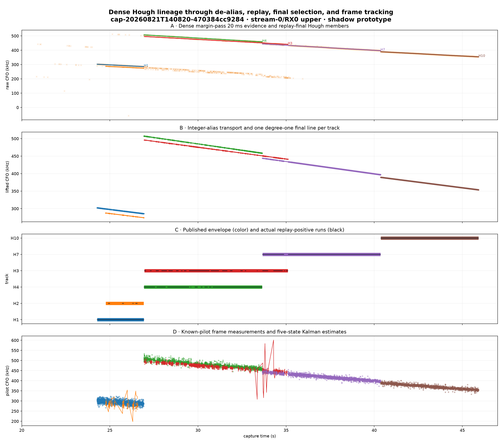
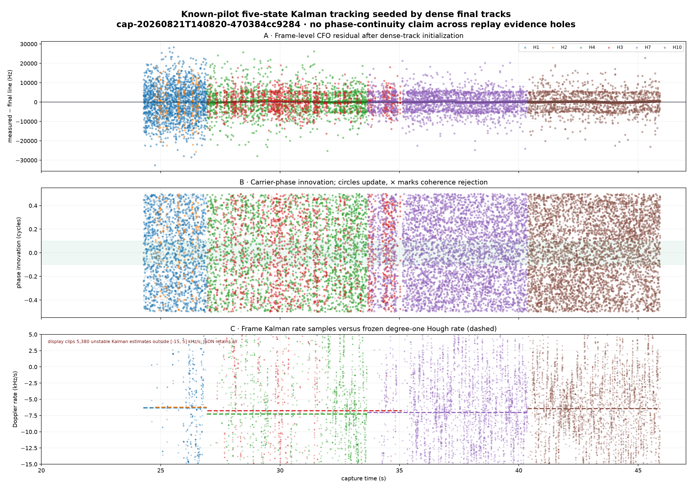
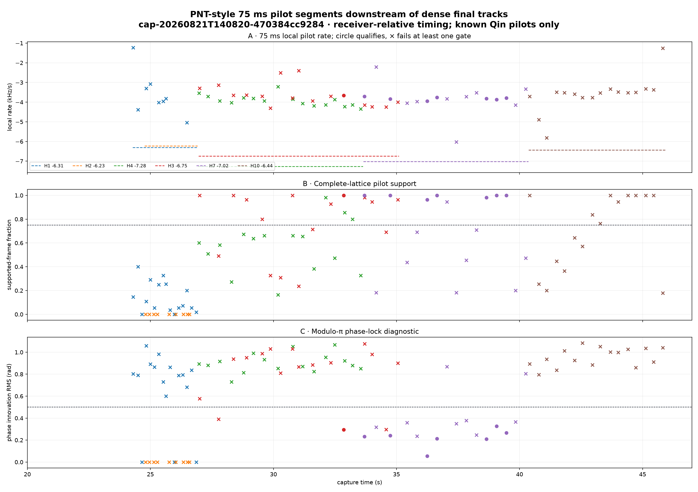
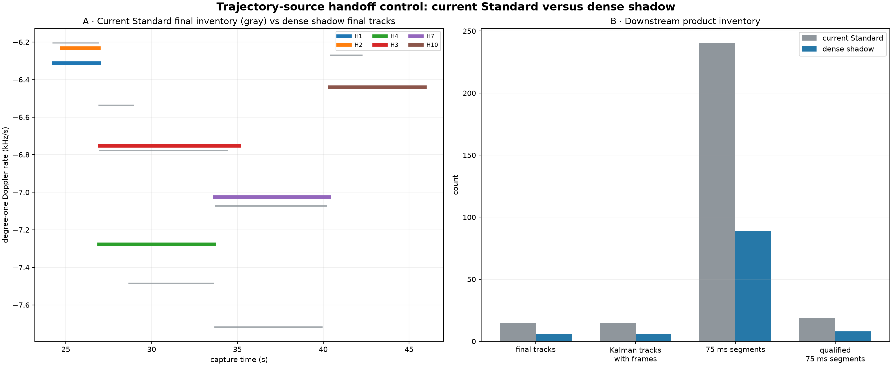

# Dense full-capture Hough: end-to-end downstream prototype

## Result

The dense 20 ms Hough tracks can be propagated through integer-alias transport, conditioned IQ replay, replay-supported endpoint selection, degree-one final refitting, known-pilot frame extraction, the existing five-state Kalman filter, and the existing 75 ms PNT-style pilot analysis. The prototype keeps one stable Hough label through every stage, so H1 does not silently vanish or get replaced by an unrelated older trajectory. Propagation succeeds as data lineage; it does not make every dense line a successful phase/Doppler track.

On `cap-20260821T140820-470384cc9284` `stream-0/RX0` `upper`, 12 raw Hough fragments become 6 replay-qualified final tracks. All 6 supply actual known-pilot frames to the Kalman stage. The bounded PNT-style audit analyzed 89 non-overlapping 75 ms windows; 8 passed every current qualification gate, distributed across only 2 tracks.

## Track accounting

| Track | Final interval | Rate | Alias | GLRT support | Huber RMS | Raw / unique frames | Kalman updates | Phase slips | CFO resets | Median abs frequency innovation | Median KF rate |
|---|---:|---:|---:|---:|---:|---:|---:|---:|---:|---:|---:|
| H1 | 24.28–26.93 s | -6.312 kHz/s | +2 | 190 | 193.0 Hz | 1647 / 1647 | 1087 | 941 | 6 | 7643.3 Hz | -4.528 kHz/s |
| H2 | 24.77–26.92 s | -6.232 kHz/s | +1 | 15 | 130.7 Hz | 194 / 194 | 128 | 114 | 3 | 24068.0 Hz | +221.670 kHz/s |
| H4 | 26.94–33.64 s | -7.277 kHz/s | +3 | 233 | 406.3 Hz | 2421 / 2421 | 2025 | 1741 | 13 | 2387.7 Hz | -7.156 kHz/s |
| H3 | 26.96–35.10 s | -6.752 kHz/s | +2 | 138 | 367.4 Hz | 1625 / 1625 | 1385 | 1216 | 15 | 4243.3 Hz | -7.866 kHz/s |
| H7 | 33.66–40.36 s | -7.024 kHz/s | +2 | 555 | 336.8 Hz | 4320 / 4315 | 3901 | 3384 | 14 | 574.9 Hz | -6.826 kHz/s |
| H10 | 40.37–45.92 s | -6.441 kHz/s | +2 | 556 | 248.2 Hz | 4130 / 4122 | 3851 | 3330 | 12 | 241.0 Hz | -6.144 kHz/s |

## PNT-style qualification by dense track

| Track | 75 ms windows | Qualified | Median qualified local rate | Local minus final Hough rate | Assessment |
|---|---:|---:|---:|---:|---|
| H1 | 16 | 0 | — | — | no qualifying local phase/rate interval |
| H2 | 9 | 0 | — | — | no qualifying local phase/rate interval |
| H4 | 16 | 0 | — | — | no qualifying local phase/rate interval |
| H3 | 16 | 1 | -3.657 kHz/s | +3.095 kHz/s | local tracker qualifies, but rate does not validate Hough slope |
| H7 | 16 | 7 | -3.822 kHz/s | +3.202 kHz/s | local tracker qualifies, but rate does not validate Hough slope |
| H10 | 16 | 0 | — | — | no qualifying local phase/rate interval |

## What changed versus the current pipeline

| Stage | Current Standard source | Shadow prototype source |
|---|---|---|
| Pilot evidence | Scheduled pilot scan | Independent 20 ms / 10 ms-stride full-capture search |
| Hough geometry | Scheduled-scan Hough representatives | Dense margin-pass Hough + support closure + Jaccard dedup |
| De-alias | Old representative bank | The same retained dense Hough membership and stable H label |
| Replay | Old detections/representatives | Dense member windows; acquisition-CFO transport |
| Final tracks | Old de-aliased branches | Replay-positive support envelope; Huber degree one only |
| Kalman / pilot segments | Old final trajectory IDs | Dense final H labels and their exact source epochs |

The stored current Standard control has 15 final rows, 15 Kalman rows with frames, and 240 75 ms segment rows. Those are not a fair one-for-one scientific comparison because the source memberships differ; they are shown to prove the current UI's de-aliased panel is fed by the older branch.

## Interpretation

The experiment establishes plumbing feasibility, not phase continuity or satellite attribution. A colored final envelope means replay-positive evidence exists between its endpoints; black sub-runs in the lineage plot show where evidence was actually observed. The Kalman filter must coast across internal holes and must never reinterpret the envelope itself as continuous carrier phase.

The frame-level result is not a blanket success. H1 and H2 are especially poor initializations for the present Kalman measurement model; H2's low-support line drives an unstable rate estimate. H7 and H10 have the smallest median frequency innovations, but frequent phase-slip flags remain. Only H3 and H7 contain any 75 ms interval that passes every existing PNT-style gate, and their qualified local rates are still roughly 3.0–3.3 kHz/s less negative than their Hough rates. Therefore this prototype proves provenance and execution, not agreement between the 20 ms CFO family and local pilot phase/frequency tracking.

The integer alias is a receiver ambiguity lift. It changes the CFO intercept but not the degree-one Doppler rate. Every frequency trajectory in this prototype is degree one; the Kalman phase transition integrates a constant rate but does not fit a quadratic or cubic radio trajectory.

## Production recommendation

Publish the dense window evidence as a versioned scientific JSON product, add a new major downstream trajectory-source binding, and make all consumers validate that binding. Preserve Hough label, source observation IDs, alias decision, replay row IDs, and final member mask. Do not mutate the published V4/V3 contracts or quietly substitute the dense source beneath existing digests.

Machine-readable prototype: [`dense-hough-end-to-end.json`](figures/2026_08_24_full_capture_hough_end_to_end/dense-hough-end-to-end.json)
