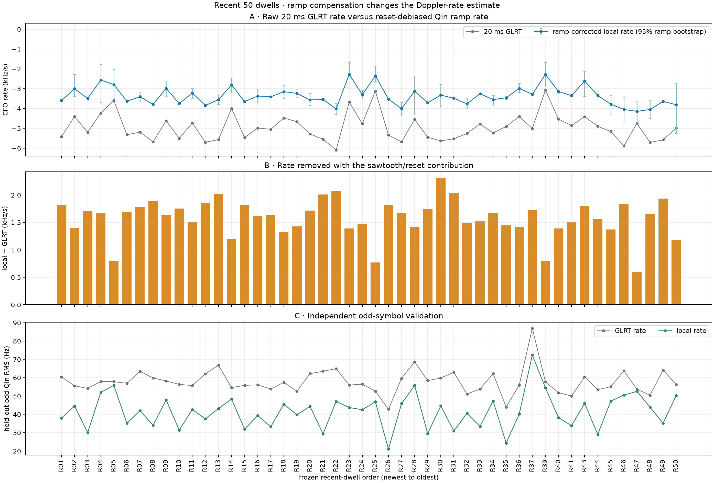
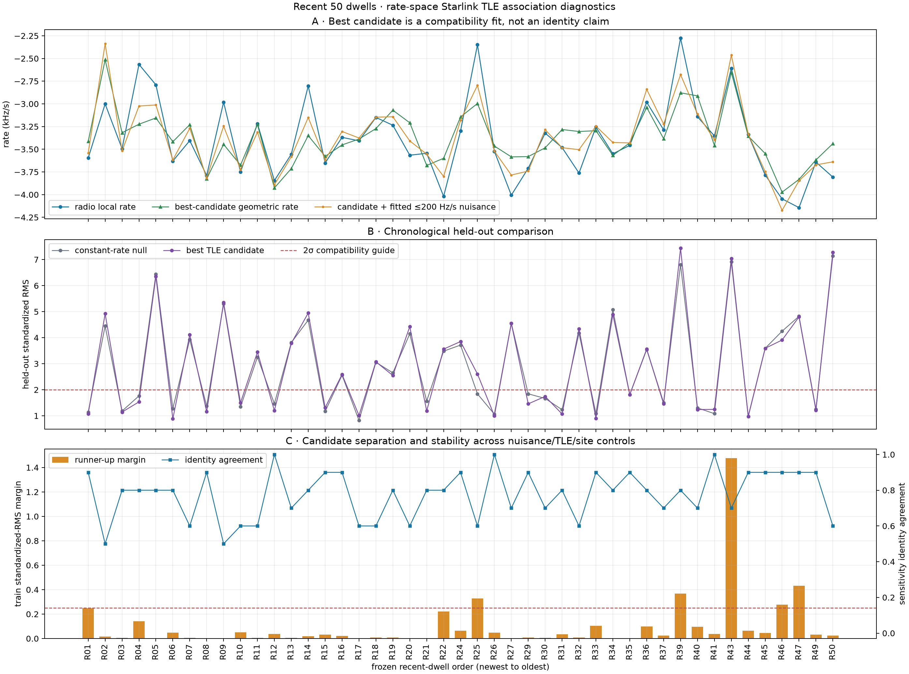
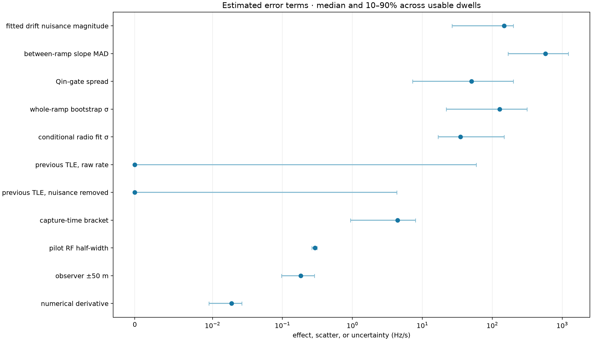

# Fifty recent dwells: ramp-corrected Doppler and Starlink TLE correlation

## Abstract

We froze the newest 50 readable, successful Standard V4 dwells without selecting on signal strength and re-read their raw IQ. 48/50 produced a complete source-bound Qin ramp solution. The 20 ms GLRT rate and the reset-debiased local rate are not interchangeable: the median correction was **1.650 kHz/s**, and held-out odd-Qin RMS changed from **58.7 Hz** to **39.6 Hz** (32.6% reduction). We then compared per-ramp rates with causal SGP4 Starlink Doppler-rate curves in rate space, allowing one bounded ±200 Hz/s receiver/transmitter drift nuisance selected on the first 60% of ramps and evaluated on the untouched last 40%. 45/50 had a geometric candidate set. The result is strong evidence that ramp correction is necessary, but satellite identity remains generally ambiguous: **0** candidates satisfy all exploratory separation, held-out, nuisance, and sensitivity checks; **21** are rate-compatible but ambiguous, and **24** have poor held-out fit for both discrimination and identity.

## Motivation and hypothesis

The persisted GLRT fits CFO across reset-bearing 20 ms probe windows. Qin-specific 1.333 ms frame CFOs reveal short frequency-continuous ramps separated by emitter/receiver resets. Our hypothesis was that a common within-ramp slope estimates the physical Doppler rate more faithfully than the cross-reset GLRT slope, and that the corrected slope progression could then be matched to TLE geometry despite an unknown absolute CFO and a smaller unknown rate drift.

## Data and provenance

The cohort runs from `cap-20260823T150300-92ac23cd745f` (R01) through `cap-20260823T122100-237b879c5bd8` (R50), newest to oldest. Selection used successful Standard-lane V3 scan/V4 bank products, committed two-stream 2.5 Msps recordings, and no RF-strength threshold. Inputs are digest-closed in `reports/figures/2026_08_24_recent_50_doppler/inputs.json`. The observer is the reviewed Sausalito preset (37.858988, -122.478103, -29.0 m), but it is not capture-bound GPS authority; the association audit therefore includes ±10 km cardinal stress tests.

TLE selection is causal: the primary catalogue is the newest complete Space-Track snapshot collected at or before each capture. A 4,360-object snapshot was rejected by a predeclared 90%-of-maximum catalogue-completeness gate; accepted snapshots contain 10,975 Starlink objects. The prior complete snapshot and the next snapshot are sensitivity checks only; the next snapshot never selects the reported primary identity. The tool records `/var/lib/leo/tle` as the source authority and read `/tmp/leo-recent50-tle` for this run.

## Approach

1. Reacquire each persisted branch from its exact raw GLRT source observations, preserving its timing epoch and acquisition CFO.
2. Fit each complete 1.333 ms Qin frame on even pilot symbols over a ±6 kHz residual grid; reserve odd pilot symbols for validation.
3. Batch-partition frame locks into frequency-continuous 20–125 ms ramps, fit one intercept per ramp, and robustly estimate a shared slope. Bootstrap whole ramps, sweep the Qin gate, and compare with an optional linear slope progression.
4. At every ramp center, propagate all causally available Starlink TLEs with SGP4, transform to the reviewed observer, differentiate predicted RF Doppler at 125 ms spacing, and retain both a ≥60° primary cone and ≥10° broad-sky control.
5. Select satellite identity and a bounded constant rate nuisance using only the chronological first 60% of ramps. Report the last 40% unchanged, plus runner-up, nuisance-bound, broad-sky, adjacent-TLE, timing, RF-scale, numerical, and observer-location sensitivities.

## Results: radio Doppler

Across 48 complete dwells, 85,605 frames formed 1,852 coherent ramps. The median GLRT rate was -5.028 kHz/s; the median reset-debiased rate was -3.432 kHz/s. A progression term improved BIC in 20/48 dwells; it is retained as a diagnostic rather than forced into every estimate.

Selected-branch ranks were rank 1: 46, rank 2: 1, rank 5: 1. Release strata were `88a5bc8b`: n=10, median correction 1.531 kHz/s; `9c94affe`: n=38, median correction 1.670 kHz/s. Those release groups occupy different capture times, so their median difference is reported as a control and is not attributed causally to software release.

## Results: TLE correlation

The comparison occurs in Doppler-rate space (Hz/s), not absolute CFO. The fitted nuisance is also a rate: it absorbs a constant LNB/receiver/transmitter drift but is bounded to ±200 Hz/s in the primary model. Candidate ranking is often shallow, and the TLE curve frequently does not beat a radio-only constant-rate null on held-out ramps by a meaningful margin. Therefore every named object below is a candidate, not a decoded identity.

The exploratory `supported_candidate` label requires all five checks: held-out standardized RMS ≤2.0; at least 0.10 lower than the constant-rate null; runner-up training separation ≥0.25; the same identity under bounded 25/200 Hz/s and free nuisances, broad-sky, adjacent-TLE, and ±10 km site controls; and a primary nuisance strictly inside ±200 Hz/s. These criteria were used to prevent a nearest-rate candidate from becoming an identity claim.

Unmatched controls: R38, R42 have no Standard GLRT branch; R23, R28, R48 have a radio estimate but fewer than five ramps, so a 60/40 held-out association would be degenerate.

Receiver-chain stratification: `radio_pluto_19f2`: n=28, median fitted nuisance 125.1 Hz/s; `radio_pluto_5d4d`: n=17, median fitted nuisance -37.6 Hz/s.

## Error budget

The plotted numerical, RF-scale, 50 m site, timing, and adjacent-TLE terms are estimable sensitivities. Whole-ramp bootstrap and Qin-gate spread characterize radio statistical/model-selection uncertainty. The ±10 km location audit is an identity stress test because the site preset is not capture-bound. Receiver/LNB drift, transmitter frequency-plan drift, and residual sample-clock drift are not separately identifiable from Doppler rate in these data; the bounded fitted nuisance is their combined apparent contribution, not an error bar on orbital Doppler. SGP4/TLE truth error is not calibrated by this corpus; adjacent-snapshot differences are only an empirical proxy. The zero median for the previous-TLE rows is literal: 27/45 comparisons used consecutive archive snapshots containing identical element sets, so they provide no independent orbit-error sample.

| Term | Interpretation | Median Hz/s | 10–90% Hz/s |
|---|---|---:|---:|
| Numerical Doppler derivative | resolution | 0.019 | [0.010, 0.026] |
| Pilot RF half-width | bounded scale | 0.292 | [0.263, 0.313] |
| Capture timing bracket | bounded timing | 4.426 | [0.940, 8.014] |
| Observer ±50 m | site sensitivity | 0.183 | [0.097, 0.286] |
| Previous TLE raw rate | orbit proxy | 0.000 | [0.000, 58.868] |
| Previous TLE after rate nuisance | orbit-shape proxy | 0.000 | [0.000, 4.318] |
| Conditional shared-slope σ | statistical | 35.204 | [16.786, 147.330] |
| Whole-ramp bootstrap σ | statistical | 127.151 | [22.059, 314.502] |
| Qin-gate spread | selection sensitivity | 50.369 | [7.267, 199.944] |
| Between-ramp slope MAD | heterogeneity | 576.916 | [167.935, 1225.707] |
| Fitted rate-nuisance magnitude | unresolved composite | 148.134 | [26.581, 200.000] |

## Per-dwell results

| Dwell | Capture ID | GLRT kHz/s | Local kHz/s | 95% local kHz/s | Ramps | Candidate | Assessment | Held-out σ-RMS | Runner margin |
|---|---|---:|---:|---:|---:|---|---|---:|---:|
| R01 | `cap-20260823T150300-92ac23cd745f` | -5.417 | -3.596 | [-3.650, -3.544] | 47 | STARLINK-36256 (67103) | compatible_but_ambiguous | 1.08 | 0.248 |
| R02 | `cap-20260823T150000-081192b64713` | -4.407 | -3.000 | [-3.394, -2.278] | 5 | STARLINK-33662 (63285) | poor_heldout_fit | 4.92 | 0.016 |
| R03 | `cap-20260823T145700-fca14cfe68e6` | -5.201 | -3.493 | [-3.530, -3.456] | 60 | STARLINK-6264 (56429) | compatible_but_ambiguous | 1.14 | 0.006 |
| R04 | `cap-20260823T145400-e198c8bbd577` | -4.230 | -2.565 | [-3.698, -1.773] | 8 | STARLINK-33611 (63279) | compatible_but_ambiguous | 1.53 | 0.142 |
| R05 | `cap-20260823T145100-9845f0b85950` | -3.588 | -2.790 | [-3.619, -2.019] | 29 | STARLINK-33972 (63893) | poor_heldout_fit | 6.36 | 0.001 |
| R06 | `cap-20260823T144800-4d84f9f58732` | -5.323 | -3.630 | [-3.696, -3.570] | 55 | STARLINK-34172 (64173) | compatible_but_ambiguous | 0.88 | 0.048 |
| R07 | `cap-20260823T144500-8ab6144d67ce` | -5.192 | -3.405 | [-3.656, -3.161] | 52 | STARLINK-34060 (63815) | poor_heldout_fit | 4.11 | 0.006 |
| R08 | `cap-20260823T144200-34e2144863ce` | -5.683 | -3.789 | [-3.843, -3.742] | 61 | STARLINK-32381 (61066) | compatible_but_ambiguous | 1.16 | 0.002 |
| R09 | `cap-20260823T143900-d6099c9727ca` | -4.619 | -2.981 | [-3.375, -2.653] | 54 | STARLINK-34194 (64179) | poor_heldout_fit | 5.35 | 0.000 |
| R10 | `cap-20260823T143600-d224768d8147` | -5.506 | -3.751 | [-3.792, -3.711] | 64 | STARLINK-36447 (67425) | compatible_but_ambiguous | 1.50 | 0.051 |
| R11 | `cap-20260823T143300-1cad4e6bcd63` | -4.731 | -3.218 | [-3.479, -2.970] | 53 | STARLINK-30351 (57738) | poor_heldout_fit | 3.45 | 0.006 |
| R12 | `cap-20260823T143000-74f7ae0e8079` | -5.701 | -3.845 | [-3.900, -3.791] | 63 | STARLINK-35060 (65693) | compatible_but_ambiguous | 1.20 | 0.037 |
| R13 | `cap-20260823T142708-56f9d9ac6f05` | -5.569 | -3.555 | [-3.789, -3.305] | 41 | STARLINK-36164 (67127) | poor_heldout_fit | 3.79 | 0.004 |
| R14 | `cap-20260823T142100-bacbdc89f3c3` | -3.998 | -2.802 | [-3.206, -2.453] | 27 | STARLINK-32468 (62149) | poor_heldout_fit | 4.95 | 0.019 |
| R15 | `cap-20260823T141800-aa205612e770` | -5.466 | -3.651 | [-3.698, -3.606] | 64 | STARLINK-30402 (57827) | compatible_but_ambiguous | 1.31 | 0.032 |
| R16 | `cap-20260823T141500-ac017465e83c` | -4.983 | -3.369 | [-3.713, -3.056] | 21 | STARLINK-30857 (58595) | poor_heldout_fit | 2.59 | 0.020 |
| R17 | `cap-20260823T141200-d70ee72e89f1` | -5.048 | -3.407 | [-3.450, -3.366] | 63 | STARLINK-32320 (61638) | compatible_but_ambiguous | 1.01 | 0.001 |
| R18 | `cap-20260823T140900-266ce4a2f30a` | -4.479 | -3.149 | [-3.488, -2.842] | 24 | STARLINK-32796 (62739) | poor_heldout_fit | 3.07 | 0.009 |
| R19 | `cap-20260823T140600-b6dc07ab06ad` | -4.665 | -3.235 | [-3.419, -3.051] | 44 | STARLINK-30845 (58207) | poor_heldout_fit | 2.55 | 0.007 |
| R20 | `cap-20260823T140300-f1218cfb1c56` | -5.283 | -3.566 | [-3.835, -3.243] | 31 | STARLINK-31468 (58998) | poor_heldout_fit | 4.43 | 0.003 |
| R21 | `cap-20260823T140000-f8179c2eb538` | -5.555 | -3.545 | [-3.589, -3.500] | 62 | STARLINK-37039 (69361) | compatible_but_ambiguous | 1.19 | 0.001 |
| R22 | `cap-20260823T135700-b35f5f92dc27` | -6.093 | -4.019 | [-4.286, -3.742] | 46 | STARLINK-4585 (53567) | poor_heldout_fit | 3.56 | 0.220 |
| R23 | `cap-20260823T135400-a8a9c0924e3e` | -3.672 | -2.280 | [-2.336, -1.678] | 3 | — | association_unavailable | — | — |
| R24 | `cap-20260823T135100-3e6a71233bab` | -4.767 | -3.299 | [-3.512, -3.087] | 48 | STARLINK-36389 (67806) | poor_heldout_fit | 3.85 | 0.063 |
| R25 | `cap-20260823T134800-272180665c42` | -3.122 | -2.349 | [-2.643, -1.854] | 12 | STARLINK-6109 (56094) | poor_heldout_fit | 2.61 | 0.328 |
| R26 | `cap-20260823T134500-a3357e0a77fc` | -5.338 | -3.522 | [-3.569, -3.475] | 46 | STARLINK-31176 (58745) | compatible_but_ambiguous | 1.00 | 0.048 |
| R27 | `cap-20260823T134200-2d7cd9a08d04` | -5.680 | -4.006 | [-4.322, -3.696] | 38 | STARLINK-32419 (61637) | poor_heldout_fit | 4.55 | 0.003 |
| R28 | `cap-20260823T133900-e9ac7614124b` | -4.544 | -3.122 | [-4.276, -2.350] | 3 | — | association_unavailable | — | — |
| R29 | `cap-20260823T133600-e6a64a20edaf` | -5.450 | -3.709 | [-3.754, -3.663] | 63 | STARLINK-4559 (53574) | compatible_but_ambiguous | 1.46 | 0.007 |
| R30 | `cap-20260823T133300-eb7033a60d1c` | -5.630 | -3.322 | [-3.898, -2.777] | 7 | STARLINK-30235 (57294) | compatible_but_ambiguous | 1.74 | 0.006 |
| R31 | `cap-20260823T133000-05e02094d704` | -5.525 | -3.481 | [-3.521, -3.440] | 64 | STARLINK-31529 (59000) | compatible_but_ambiguous | 1.07 | 0.034 |
| R32 | `cap-20260823T132700-1f1a9f00d07d` | -5.257 | -3.762 | [-4.012, -3.495] | 41 | STARLINK-32331 (61623) | poor_heldout_fit | 4.34 | 0.008 |
| R33 | `cap-20260823T132400-e36b1b963036` | -4.779 | -3.255 | [-3.301, -3.213] | 57 | STARLINK-34615 (66321) | compatible_but_ambiguous | 0.90 | 0.104 |
| R34 | `cap-20260823T132100-7e848cfd1394` | -5.231 | -3.550 | [-3.822, -3.328] | 42 | STARLINK-32004 (60151) | poor_heldout_fit | 4.89 | 0.002 |
| R35 | `cap-20260823T131801-604f88d26a85` | -4.905 | -3.457 | [-3.543, -3.367] | 42 | STARLINK-31151 (58742) | compatible_but_ambiguous | 1.81 | 0.000 |
| R36 | `cap-20260823T131519-2504637dc8f8` | -4.404 | -2.982 | [-3.193, -2.743] | 21 | STARLINK-36123 (67007) | poor_heldout_fit | 3.56 | 0.099 |
| R37 | `cap-20260823T130000-3b8996fa984b` | -5.008 | -3.286 | [-3.332, -3.236] | 42 | STARLINK-36334 (67471) | compatible_but_ambiguous | 1.46 | 0.025 |
| R38 | `cap-20260823T125700-7830b09846c7` | — | — | — | — | — | `no_glrt_candidate` | — | — |
| R39 | `cap-20260823T125400-975e98759977` | -3.080 | -2.276 | [-2.861, -1.658] | 17 | STARLINK-5598 (55421) | poor_heldout_fit | 7.44 | 0.367 |
| R40 | `cap-20260823T125100-15f477ec3c2e` | -4.530 | -3.141 | [-3.221, -3.065] | 35 | STARLINK-30810 (58178) | compatible_but_ambiguous | 1.24 | 0.095 |
| R41 | `cap-20260823T124800-650468f8f57d` | -4.858 | -3.353 | [-3.410, -3.299] | 51 | STARLINK-32437 (63001) | compatible_but_ambiguous | 1.25 | 0.036 |
| R42 | `cap-20260823T124500-aeeb35522ab9` | — | — | — | — | — | `no_glrt_candidate` | — | — |
| R43 | `cap-20260823T124200-2d84faf9d282` | -4.411 | -2.609 | [-3.392, -2.136] | 9 | STARLINK-32470 (62115) | poor_heldout_fit | 7.04 | 1.477 |
| R44 | `cap-20260823T123900-885a0a1407c0` | -4.896 | -3.339 | [-3.367, -3.311] | 63 | STARLINK-30768 (58120) | compatible_but_ambiguous | 0.98 | 0.064 |
| R45 | `cap-20260823T123600-af912444ceca` | -5.155 | -3.784 | [-4.274, -3.349] | 40 | STARLINK-36529 (67457) | poor_heldout_fit | 3.59 | 0.045 |
| R46 | `cap-20260823T123300-c314b8b8743a` | -5.887 | -4.047 | [-4.675, -3.454] | 37 | STARLINK-31377 (58938) | poor_heldout_fit | 3.91 | 0.277 |
| R47 | `cap-20260823T123000-7d9bf279ce51` | -4.747 | -4.143 | [-4.685, -3.652] | 39 | STARLINK-2266 (47997) | poor_heldout_fit | 4.80 | 0.432 |
| R48 | `cap-20260823T122700-0f0409ec36c0` | -5.710 | -4.050 | [-4.502, -3.610] | 4 | — | association_unavailable | — | — |
| R49 | `cap-20260823T122400-3e76e386934e` | -5.580 | -3.641 | [-3.691, -3.590] | 49 | STARLINK-32490 (62126) | compatible_but_ambiguous | 1.21 | 0.033 |
| R50 | `cap-20260823T122100-237b879c5bd8` | -4.989 | -3.807 | [-5.253, -2.711] | 5 | STARLINK-37511 (69512) | poor_heldout_fit | 7.28 | 0.025 |

## Reproducibility products

- Frozen inputs: `reports/figures/2026_08_24_recent_50_doppler/inputs.json`
- Per-dwell raw-IQ results: `reports/figures/2026_08_24_recent_50_doppler/results`
- TLE association evidence: `reports/figures/2026_08_24_recent_50_doppler/ramp-tle-associations.json`
- Aggregated machine-readable summary: `reports/figures/2026_08_24_recent_50_doppler/cohort-summary.json`

## Conclusion

The robust computational observable is the common slope inside Qin-coherent ramps, with a free CFO intercept for every ramp. The 20 ms GLRT remains useful for branch discovery and raw-IQ reacquisition, but its cross-reset slope should not be called geometric Doppler. TLE matching should follow ramp correction and operate on the rate curve with explicit drift nuisance and held-out tests. With the present short tracks and non-capture-bound site provenance, the radio rate is substantially better determined than satellite identity.
