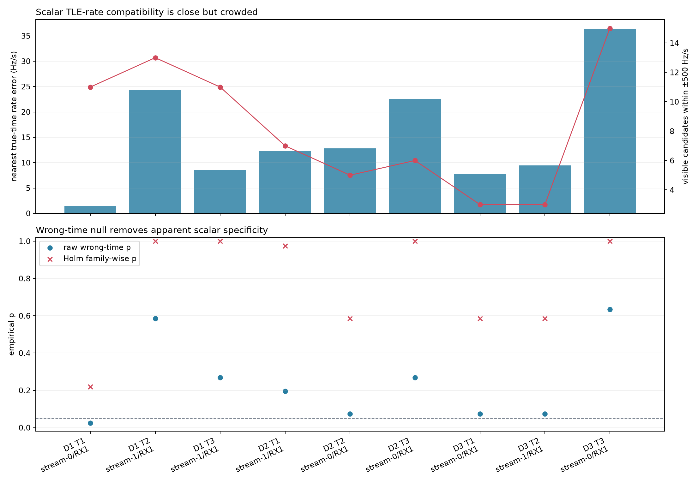
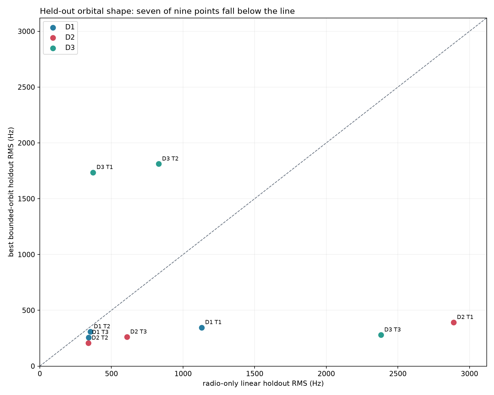
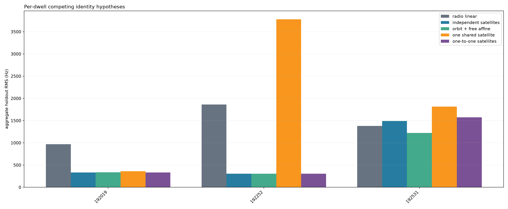
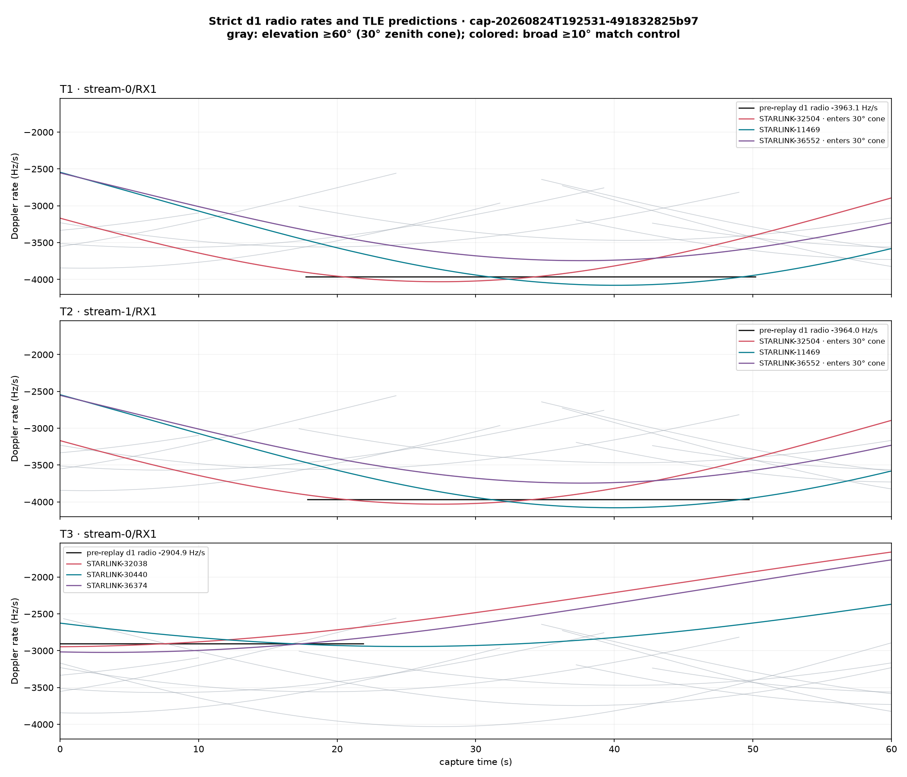
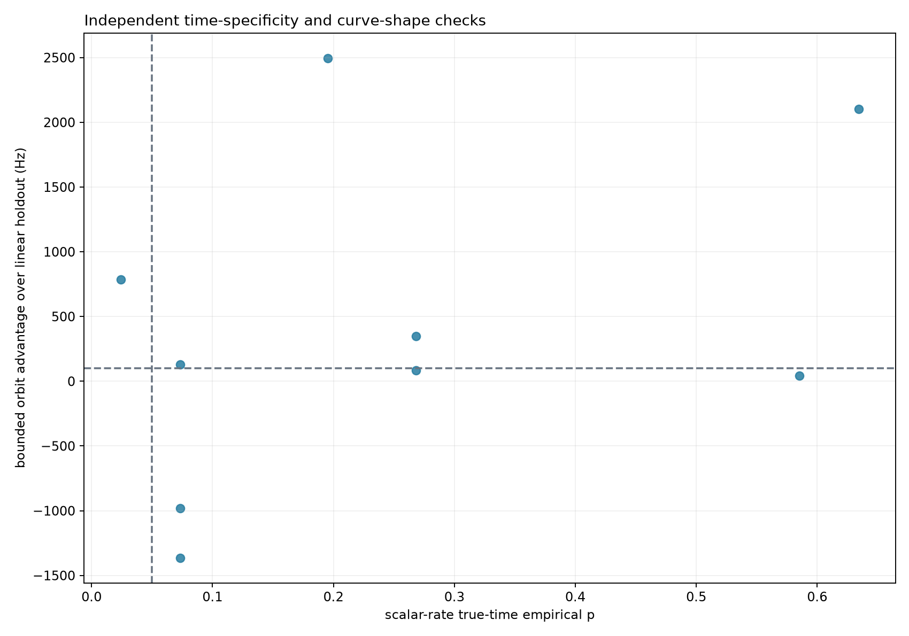

# Three continuity-v2 dwells: Starlink TLE candidates and null analysis

## Outcome

The three new counter-authoritative dwells contain credible Starlink-like Doppler
structure. Training-selected TLE curves have lower held-out RMS than a straight
radio-only trend for **7 of 9 selected tracks** and **2 of 3 dwells**. This is a
promising descriptive change from the older continuity-unverified cohort that requires
independent replication.

It is **not yet a satellite identification**:

- zero of nine track hypotheses passes the complete association gate;
- only one scalar rate test has an unadjusted wrong-time `p <= 0.05`, and zero survive
  Holm family-wise correction;
- every track has a nearly tied alternative satellite: the best training runner margin
  is only 0.1--34.8 Hz, versus the established 100 Hz requirement;
- the scalar-nearest satellite and held-out shape satellite agree for only 3 of 9 tracks;
- the attractive two-radio match to STARLINK-32504/NORAD 62024 in dwell 3 fails held-out
  curve prediction on both radios.

The defensible result is therefore:

> **Three signal-bearing Starlink-candidate dwells, several useful catalog hypotheses,
> and zero secure object associations.**

The sealed Standard contracts remain `candidate_only`, with no payload decode and no
specificity claim. This report does not promote or rewrite those products.

The machine-readable result is
[recent-three-tle-null-evidence.json](figures/2026_08_24_recent_three_continuity_tle/recent-three-tle-null-evidence.json).

## Why this cohort is materially better

These are the first three completed 60-second Standard dwells after deployment of the
counter-authoritative Pluto capture path. They were frozen before TLE matching as the
three newest sealed continuity-v2 runs:

| label | recording | capture start (UTC) | tuned RF | qualified 75 ms windows | qualified source tracks |
|---|---|---:|---:|---:|---:|
| D1 | `cap-20260824T192019-9023840c8e9f` | 19:20:22.573 | 10.959687498 GHz on both radios | 14 / 304 | 3 |
| D2 | `cap-20260824T192252-9981b9c27853` | 19:22:55.280 | 11.459687500 GHz (`5d4d`) / 11.440312498 GHz (`19f2`) | 47 / 674 | 8 |
| D3 | `cap-20260824T192531-491832825b97` | 19:25:35.040 | 11.190312500 GHz on both radios | 101 / 820 | 17 |

All three used release `058576ec74b7dae9ae3ad2a9798679fcf2c934c3`. The primary
TLE family is a fresh report-only degree-1 refit from twelve sealed
`standard.pilot-scan.v3` products—not from the final-trajectory or 75 ms segment
products. The
[strict source evidence](figures/2026_08_24_recent_three_continuity_tle/recent-three-degree1-evidence.json)
binds all twelve pilot-scan logical URIs and content digests under
`source_membership=independent_standard_pilot_scan_v3_candidates`; all 12 current bytes
were rehashed and match those recorded digests.

Separately, the twelve final-trajectory products and twelve pilot-segment products were
independently hashed against their sealed run registries: **24/24 matched**. Those
products support the continuity, quality, and segment-level context below; they are not
the primary nine-track matching input.

Sealed analysis runs and manifest hashes are:

- D1 `capture-a7c71070425e4aa596da41af5397be52`; capture
  `sha256:cd0049f00d83f328de1cb0105a54f5492448d6b60ae71d7848a4554fcb618717`, run
  `sha256:e4f595e4dbcd96c0990ce938c1f7ec959b4d62c8abb1b3cddfbde47da7659822`;
- D2 `capture-6f6c7e02f16b4f6dbcb260e92864adfa`; capture
  `sha256:afaecccd1130c09d4604bdebc99ff8fbb4089c9dd031602b117312739be094e3`, run
  `sha256:eaf70acbb00dbea85379a5389af3f73ba5eee8176c61d149ff99dfa350bad1b8`;
- D3 `capture-f75a853e526844e29893f125d4a58940`; capture
  `sha256:145c55e56c3e7f1f76b1b769ae3779edc90186a2a2a91ecb05338212c724b2db`, run
  `sha256:1b4b6fa3dd6c2fb13febe5531ee25eb78cc46b47480ec5cece472aca9d73e838`.

Every one of the six radio streams has:

- 150,000,000 observed samples and the same 150,000,000-sample device span;
- 573 FPGA-countered refills with kernel-buffer count 8;
- one continuous capture segment;
- zero missing samples, overflows, enqueue failures, or terminal rejected refills.

Consequently the old refill-time-compression mechanism cannot explain these curves. This
is the central reason the comparison is scientifically more useful than the earlier
stored-sample-time analysis. See the
[continuity implementation report](2026_08_24_continuity_buffer_implementation.md) and
[controlled buffer experiment](2026_08_24_refill_continuity_loopback.md).

Cross-radio time remains best-effort rather than phase coherent. First-sample skew is
92.467 ms in D1, 132.204 ms in D2, and 153.969 ms in D3; per-stream UTC uncertainty is
0.47--0.68 ms. The analysis therefore uses each receiver's per-stream start estimate
and does not combine absolute carrier phase between radios.

## What Standard measured at 50--100 ms scale

The advanced product analyzes nominal 75 ms regions on the 750 Hz frame lattice. A row
is accepted only when coverage, gaps, modulo-pi phase, control pilots, frequency-line
fit, Kalman/local-rate agreement, and held-out prediction all pass.

| dwell | `5d4d/RX0` | `5d4d/RX1` | `19f2/RX0` | `19f2/RX1` | median accepted local rate |
|---|---:|---:|---:|---:|---:|
| D1 | 11 / 16 | 0 / 144 | no result | 3 / 144 | -2026.4 Hz/s |
| D2 | 5 / 111 | 15 / 239 | 24 / 84 | 3 / 240 | -3808.1 Hz/s |
| D3 | 45 / 213 | 28 / 246 | 26 / 107 | 2 / 254 | -3861.6 Hz/s |

The denominators matter. For example, `19f2/RX1` repeatedly has a low accepted yield,
principally because phase and local/Kalman agreement fail, not because capture
continuity fails. A TLE result based only on accepted windows would hide these important
path-level nulls.

The median accepted local-minus-frozen rate discrepancy is +127.9, -105.5, and
+31.2 Hz/s for D1--D3. The historical continuity-unverified population was displaced by
roughly +1.7 kHz/s. This near-closure is consistent with, but by itself does not prove,
removal of the acquisition-time bias.

## TLE authority and physical model

The comparison uses the causal Space-Track archive snapshot
`1787594647459418079-ac36512e603e6a21bc2ca16d0512a1e14db846ccbad9409d9ac601b371f16dee.tle`,
SHA-256 `ac36512e603e6a21bc2ca16d0512a1e14db846ccbad9409d9ac601b371f16dee`.
It was collected at 18:04:07.459 UTC, 76--81 minutes before the three dwells, and contains
10,972 Starlink elements. No future TLE was used. Elements for all highlighted
candidates are byte-identical in the preceding causal snapshot; candidate element ages
at observation time are still 8--41 hours and remain part of the error budget.

The observer is the reviewed Sausalito preset at 37.858988 N, 122.478103 W, -29 m
ellipsoidal altitude. It is **not capture-bound GPS**, so site uncertainty is not yet a
formal recording input.

For a TLE-predicted topocentric range rate `rhodot`, the nominal carrier Doppler is

```text
f_D(t) = -f_RF * rhodot(t) / c.
```

Schematic residual-carrier behavior is closer to

```text
delta_f_obs,g(t) = delta_f_tx(t) - delta_f_rx,g(t)
                   - f_RF*rhodot(t)/c + piecewise_bias(t),
```

so its derivative contains geometric range acceleration together with transmitter,
LNB/receiver, sample-clock, and control-loop drift.

Absolute CFO is not used to identify a satellite because transmitter frequency,
satellite steering, LNB offset, receiver offset, and sample-clock error are unresolved.
The useful observables are Doppler rate and short-time curve shape after fitting explicit
receiver nuisance terms.

These are random-tuning captures. Every prediction therefore uses the per-stream
applied IF plus the documented 9.750 GHz LNB LO—not the profile's nominal base RF. The
persisted strict analysis records 10.959687498 GHz for D1, the two distinct D2 values,
and 11.190312500 GHz for D3; tagged-edge and reconstructed frequencies agree within
2 Hz.

## TLE-blind locked matching family

The strict analysis selects the three longest fresh degree-1 radio tracks from each
dwell **before** TLE matching, giving nine displayed hypotheses. Selection uses the
radio trajectory evidence rather than catalog identity.

All nine selected tracks happen to be receiver channel RX1. That is a consequence of
the duration ranking, not an RX1 quality claim, and it means the primary nine-track
family has no within-Pluto RX0 replication. The separate qualified-segment sensitivity
below uses a different mixture of RX0 and RX1 chains.

Two complementary tests follow.

1. **Scalar rate compatibility.** Find the visible Starlink with the nearest Doppler
   rate at the true epoch. Repeat the complete visible-sky minimum at 40 wrong epochs,
   from -600 to -30 seconds and +30 to +600 seconds in 30-second steps. This includes
   the within-track look-elsewhere effect across roughly 198--205 visible objects. Apply
   Holm correction across the nine displayed tracks.
2. **Held-out orbital shape.** Use the chronological first 60% of each track to choose
   identity, frequency offset, an epoch adjustment bounded to +/-0.30 seconds, and a
   track-specific combined rate nuisance bounded to +/-200 Hz/s. Score the untouched
   final 40% against both the chosen orbit and a radio-only straight-line null.

The 40-shift empirical null reruns the **scalar visible-sky minimum only**. It does not
rerun the complete identity + epoch + nuisance shape search in every shifted catalog.
Therefore the 7/9 and 2/3 shape-win counts below are descriptive held-out comparisons,
not shape-search p-values, and are not corrected for catalog/epoch/nuisance selection.

A secure result additionally requires a held-out orbital advantage of at least 100 Hz,
holdout RMS at most 500 Hz, a training runner margin of at least 100 Hz, an interior
epoch solution, a scalar wrong-time pass, and identity stability across nuisance-model
sensitivities, together with the existing adjacent-TLE and site/timing stability checks.

## Scalar candidate list

| dwell/track | path | scalar-nearest candidate | NORAD | rate error | visible within +/-500 Hz/s | raw wrong-time p | Holm p | elevation / TLE range |
|---|---|---|---:|---:|---:|---:|---:|---:|
| D1 T1 | stream-0/RX1 | STARLINK-3244 | 49741 | 1.49 Hz/s | 11 | .0244 | .2195 | 67.3 deg / 510 km |
| D1 T2 | stream-1/RX1 | STARLINK-32163 | 60262 | 24.25 | 13 | .5854 | 1.0000 | 47.8 deg / 621 km |
| D1 T3 | stream-1/RX1 | STARLINK-32408 | 62054 | 8.51 | 11 | .2683 | 1.0000 | 56.5 deg / 575 km |
| D2 T1 | stream-1/RX1 | STARLINK-31476 | 59523 | 12.24 | 7 | .1951 | .9756 | 71.3 deg / 511 km |
| D2 T2 | stream-0/RX1 | STARLINK-31032 | 58535 | 12.84 | 5 | .0732 | .5854 | 80.6 deg / 471 km |
| D2 T3 | stream-0/RX1 | STARLINK-37889 | 69536 | 22.56 | 6 | .2683 | 1.0000 | 70.5 deg / 491 km |
| D3 T1 | stream-0/RX1 | STARLINK-32504 | 62024 | 7.72 | 3 | .0732 | .5854 | 83.9 deg / 468 km |
| D3 T2 | stream-1/RX1 | STARLINK-32504 | 62024 | 9.44 | 3 | .0732 | .5854 | 84.0 deg / 468 km |
| D3 T3 | stream-0/RX1 | STARLINK-32038 | 60281 | 36.40 | 15 | .6341 | 1.0000 | 44.2 deg / 644 km |



The nearest rates are genuinely close: median absolute error is 12.24 Hz/s. But a median
of seven visible satellites per track is already within +/-500 Hz/s. The apparent
specificity of D1 T1 vanishes after family correction, and its scalar identity
(STARLINK-3244) is not its shape identity (STARLINK-36722). The smallest attainable
individual p with 40 controls is 1/41 = .02439; even under an optimistic independence
approximation, at least one such minimum among nine tests has probability about .199.

## Held-out curve candidates

| dwell/track | training-selected shape candidate | NORAD | orbit holdout | line holdout | orbit advantage | runner margin | disposition |
|---|---|---:|---:|---:|---:|---:|---|
| D1 T1 | STARLINK-36722 | 67917 | 346 Hz | 1130 Hz | +784 Hz | 0.4 Hz | promising shape; not unique |
| D1 T2 | STARLINK-35564 | 67420 | 309 | 353 | +44 | 0.6 | too little advantage; not unique |
| D1 T3 | STARLINK-36722 | 67917 | 257 | 340 | +83 | 0.1 | too little advantage; not unique |
| D2 T1 | STARLINK-36865 | 67930 | 392 | 2889 | +2497 | 7.7 | epoch boundary; not unique |
| D2 T2 | STARLINK-31032 | 58535 | 207 | 338 | +131 | 32.0 | epoch boundary; not unique |
| D2 T3 | STARLINK-6375 | 57342 | 261 | 608 | +346 | 0.8 | epoch boundary; nuisance-sensitive |
| D3 T1 | STARLINK-32504 | 62024 | 1736 | 372 | -1364 | 34.8 | held-out rejection |
| D3 T2 | STARLINK-32504 | 62024 | 1812 | 829 | -982 | 5.7 | held-out rejection |
| D3 T3 | STARLINK-6276 | 57355 | 280 | 2381 | +2102 | 1.5 | epoch boundary; nuisance-sensitive |



Points below the diagonal favor the selected TLE curve on untouched data. Seven do so,
but none has the required identity separation. With no matched shape-search null, this
is a hypothesis for independent replication, not evidence for a named spacecraft.

Aggregating the three tracks in each dwell gives:

| dwell | bounded independent-orbit RMS | radio-only line RMS | orbit-favoring tracks | secure tracks |
|---|---:|---:|---:|---:|
| D1 | 332.69 Hz | 967.73 Hz | 3 / 3 | 0 / 3 |
| D2 | 304.19 Hz | 1863.37 Hz | 3 / 3 | 0 / 3 |
| D3 | 1492.99 Hz | 1379.77 Hz | 1 / 3 | 0 / 3 |



The independent-satellites model is deliberately flexible. D2 is also tuned to
different RF edges on the two radios, so a single cross-radio emitter is not implied.
The shared-satellite hypothesis is poor in D2 and D3. It is close to the independent
model only in D1.

## The tempting dwell-3 match is a replicated rejection

D3 T1 and T2 are simultaneous tracks on independent Plutos. Their measured rates agree
to 0.891 Hz/s: -3963.123 and -3964.014 Hz/s. Both scalar searches select
STARLINK-32504/NORAD 62024 near 84 degrees elevation and a TLE-predicted 468 km slant
range.

This is strong evidence that the two receivers see the same physical rate. It is not
two independent catalog tests, so `p=.0732` must not be squared. More importantly, the
candidate's held-out RMS is 1736 and 1812 Hz, while the radio-only line needs only 372
and 829 Hz. Both receiver fits reject the candidate's extrapolated curvature.



The black horizontal segments are the selected degree-1 radio rates; colored curves are
candidate TLE Doppler rates; gray curves are other high-elevation objects. A rate
intersection is common in this crowded field. The held-out shape is what rejects the
otherwise attractive scalar match.

## Null analysis

### Track-level wrong-time and multiplicity nulls

- Raw scalar wrong-time passes: **1 / 9**.
- Holm-adjusted passes: **0 / 9**.
- Satellites within +/-500 Hz/s: 3--15 per track, median 7.
- Tracks clearing the 100 Hz runner-up separation: **0 / 9**.
- Scalar identity equal to bounded-shape identity: **3 / 9**.
- Secure associations: **0 / 9**.



The upper-left quadrant would combine time specificity with a useful held-out orbital
advantage. Some points approach it, but no point also clears candidate separation and
the remaining robustness gates.

### Exploratory population-level time null

Using the same 40 common shifted skies, the true-time median nearest-rate error across
the nine tracks is 12.239 Hz/s. Shifted-sky medians have a median of 44.795 Hz/s and a
best value of 14.915 Hz/s; true time ranks 1 of 41. The mean error and a
dwell-clustered median-then-mean statistic also rank 1 of 41.

This suggests population-level time-specific compatibility with the Starlink rate
field. It is explicitly exploratory: the aggregate statistic was inspected post hoc,
the shifts are correlated, receiver copies are clustered, and the three dwells occupy
only about five minutes. It cannot identify any object. The next independent cohort
should predeclare a cluster-level statistic before opening the TLE catalog.

### Highest-quality 75 ms segment sensitivity

An auxiliary read-only sensitivity used only qualified segment-local rates, preserved
receiver chains, merged selected reset-separated source IDs within a chain, and compared
high-elevation (`>=60 deg`) Starlinks. It used a chronological 60/40 split, Huber loss,
a 100 Hz/s uncertainty floor, and one combined-rate nuisance per chain bounded to
`+/-200 Hz/s`.

This was a manually reconstructed, ephemeral diagnostic using an uncommitted research
helper. It is **not a published Standard product, committed reproducer, or bound machine
artifact**, and it is not dwell-complete: D3 deliberately follows the favorable dominant
late approximately -4 kHz/s chain while omitting other qualified trajectories. Exact
fit numbers are therefore intentionally omitted.

Qualitatively, the corrected per-stream-RF calculation selects STARLINK-36722/67917 in
D1 but loses decisively to a constant-rate null; selects STARLINK-34592/64746 in D2 but
is approximately tied with and slightly worse than the constant null; and selects
STARLINK-32504/62024 in D3 but loses on held-out data. Free nuisance changes the D1 and
D3 identity. This orthogonal exploratory sensitivity supports the conservative
disposition, but it is not a second confirmatory family.

### Path-level nulls

The analysis retains negative paths:

- D1 `5d4d/RX1` has nine final GLRT lines but 0/144 qualified segments; all 144 fail
  modulo-pi phase lock.
- D1 `19f2/RX0` has no final trajectory despite perfect capture continuity.
- `19f2/RX1` qualifies only 3/144, 3/240, and 2/254 windows in D1--D3, driven mainly by
  phase and local/Kalman disagreement.

These failures rule out interpreting a few accepted tracks as universal receiver
confirmation.

### Historical null

The fresh older cohort produced 0 secure associations in 37 tracks. Combined with the
new cohort, the same association family is **0 / 46 secure** (Wilson upper 95% bound
about 7.7%). Scalar wrong-time passes are statistically compatible: 3/37 older versus
1/9 here (Fisher two-sided p=1.0).

Descriptive held-out TLE-curve wins did increase from 1/37 older tracks and 0/13 older
dwells to 7/9 tracks and 2/3 dwells. The one-sided Fisher values are very small for
tracks and .025 for dwells, but there is no matched shape-search null, tracks are
clustered, and capture time, tuning, signal population, and continuity integrity all
changed. This is a prospective hypothesis that counter-authoritative acquisition
preserves physical curvature—not a causal estimate or satellite-discovery p-value.

## What the candidate ranges mean

The 468--644 km values in the scalar table are **TLE-predicted slant ranges conditional
on the proposed identity**. They are not ranges measured from the radio. Doppler alone
does not provide absolute range. A calibrated transmit and receiver/LNB reference could
make Doppler informative about range rate, but those offsets are unresolved here; range
would still require additional initial conditions, observables, or a substantially
longer/multi-station arc. At present the radio supplies receiver-relative rate/shape
evidence that can test a catalog trajectory; the catalog supplies the candidate range.

## Disposition and next confirmatory test

Current association status for D1, D2, and D3 remains `unknown`. Keep the following as
search hypotheses, not labels:

- D1: STARLINK-36722/NORAD 67917 is the strongest held-out shape hypothesis.
- D2: STARLINK-36865/67930, STARLINK-31032/58535, and STARLINK-6375/57342 are useful
  per-track hypotheses; no shared identity is supported.
- D3: STARLINK-32504/62024 is the strongest replicated scalar hypothesis but is rejected
  by held-out curvature; STARLINK-6276/57355 is a separate shape near-miss.

For the next independent continuity-v2 cohort:

1. Freeze dwells and physical signal clusters before reading TLE identities.
2. Rerun identity, epoch, and nuisance selection inside every matched wrong-time field.
3. Score held-out improvement over the radio-only line and calibrate a cluster-aware
   Westfall--Young/max-T family-wise null.
4. Require adjusted `p <= .05`, a >=100 Hz runner margin, stable identity under bounded
   nuisance models, an interior epoch, and an independent-radio held-out win.
5. Bind surveyed site coordinates and UTC uncertainty into each capture manifest.
6. Preserve the fixed physical Doppler sign and scale as primary; use free sign/scale
   only as falsification diagnostics.

## Reproduction and evidence

Primary artifacts:

- [strict degree-1 source evidence](figures/2026_08_24_recent_three_continuity_tle/recent-three-degree1-evidence.json)
- [combined TLE/null evidence](figures/2026_08_24_recent_three_continuity_tle/recent-three-tle-null-evidence.json)
- [scalar candidate table](figures/2026_08_24_recent_three_continuity_tle/scalar-candidates.csv)
- [shape candidate table](figures/2026_08_24_recent_three_continuity_tle/shape-matches.csv)
- [D1 strict overlay](figures/2026_08_24_recent_three_continuity_tle/20260824T192019-9023840c8e9f-d1only-tle-overlay.png)
  and [wrong-time panel](figures/2026_08_24_recent_three_continuity_tle/20260824T192019-9023840c8e9f-d1only-null.png)
- [D2 strict overlay](figures/2026_08_24_recent_three_continuity_tle/20260824T192252-9981b9c27853-d1only-tle-overlay.png)
  and [wrong-time panel](figures/2026_08_24_recent_three_continuity_tle/20260824T192252-9981b9c27853-d1only-null.png)
- [D3 strict overlay](figures/2026_08_24_recent_three_continuity_tle/20260824T192531-491832825b97-d1only-tle-overlay.png)
  and [wrong-time panel](figures/2026_08_24_recent_three_continuity_tle/20260824T192531-491832825b97-d1only-null.png)
- [analysis tool](../tools/report_recent_three_continuity_tle.py)
- [strict degree-1 source generator](../tools/report_five_dwell_degree1_only.py)
- [focused tests](../tests/analysis/test_recent_three_continuity_tle_tool.py)

The tool reuses the reviewed propagation and train/holdout machinery from
`report_five_dwell_degree1_only.py` and
`report_multi_dwell_starlink_association.py`. It records the exact tool hash, source
evidence hash, causal TLE snapshot, observer, cohort, nuisance bounds, scalar candidates,
wrong-time p-values, held-out models, and competing dwell hypotheses.

Verification included 23 focused degree-1, association, and new null-tool tests; Ruff
lint/format and `git diff --check`; JSON and PNG validation; and repeated full-corpus
generation. The repeated scientific CSVs and all four generated summary PNGs were
byte-identical.

The older comparison methodology and its null result are documented in
[the fresh thirteen-dwell degree-1 report](2026_08_23_thirteen_dwell_degree1_fresh.md)
and
[the fresh multi-dwell association report](2026_08_23_thirteen_dwell_starlink_association_fresh.md).
