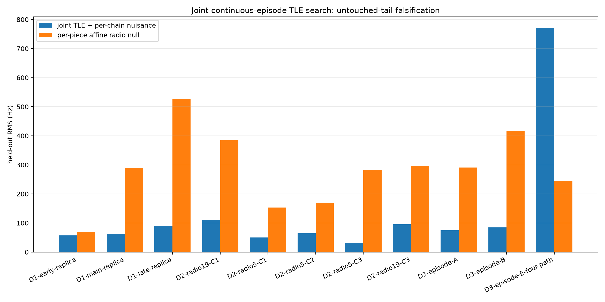
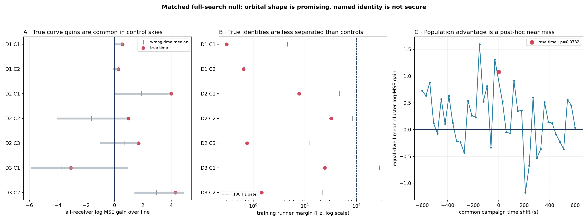
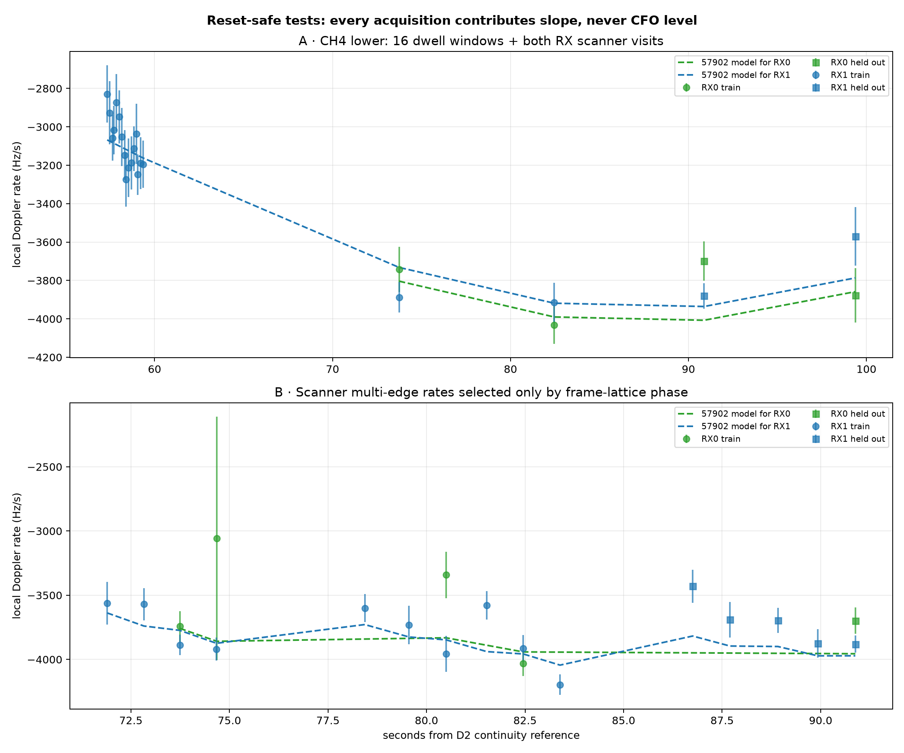
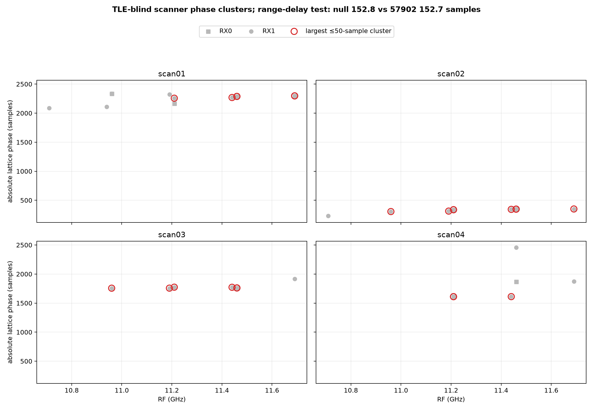

# Deep review of three continuity-v2 dwells: from radio tracks to Starlink hypotheses

## Outcome

The signals are real, repeatable, and now recorded on a counter-authoritative time axis.
The original catalogue analysis nevertheless did **not** identify a spacecraft. A complete
matched wrong-time rerun of the identity, epoch, nuisance, and train/holdout search leaves:

- **zero secure named associations** across seven TLE-blind analysis clusters;
- six of seven true-time clusters whose selected orbit beats a line, but a wrong-time median
  of five of seven and inclusive matched-field rank `10/41 = 0.244`;
- three of three dwell-level wins, versus a wrong-time median of two and rank `12/41 = 0.293`;
- no true-time candidate with the required 100 Hz training runner separation;
- a minimum Westfall--Young-style named-association family fraction of `34/41 = 0.829`.

Physical-episode reconstruction does surface catalogue hypotheses that the
three-longest-track screen missed, but it does not isolate one object. In the post-hoc
11-group sweep, 10 selected TLE curves beat per-piece affine nulls, yet 10 epoch estimates
sit on the search boundary and only two identities survive nuisance/elevation sensitivity.
The smallest matched-field rank is `1/41` for D2 C1's STARLINK-37889 / 69536, but that group
and sensitivity family were defined after inspecting this cohort, the high-elevation screen
changes the identity, and no 11-group family correction was applied.

A new main-branch analysis of the first 30 seconds of D2 `19f2/RX1` materially strengthens
STARLINK-36865 / NORAD 67930 as a **frozen replication target**, but still not as an
association. Its 881-point GLRT episode requires cubic curvature and the train-selected
67930 curve predicts the chronological tail better than a train-only cubic. The same object
was already selected by both the original degree-one screen and the reconstructed
`D2-radio19-C1` episode. These are three representations of the same IQ, not independent
experiments. In the matched episode audit the true-time field is only rank `4/41 = .0976`,
the epoch is on the search boundary, and the identity changes when the rate nuisance is
freed. The new result therefore improves candidate triage and episode modeling without
changing the zero-identification conclusion.

STARLINK-30462 / NORAD 57902 recurs in both D2 C3 RF groups and in a reset-safe
dwell-to-scanner local-rate fit. Its apparently strong absolute-CFO extrapolation is not
reset-safe: it assumes one CFO intercept and drift across fresh scanner generations. Giving
each acquisition its required free intercept leaves no scanner CFO degree of freedom. The
reset-safe local-rate inclusive rank is only `2/9 = 0.222`; a separate phase-clustered rate
test ranks `6/9 = 0.667`, and FPGA timing is negative. Both 69536 and 57902 are post-hoc
candidates to falsify in a future frozen experiment, not identifications or high-priority
association claims.

The most important correction is conceptual:

> The unit to match to a TLE is a TLE-blind **physical signal episode**, not an arbitrary
> longest fitted GLRT line. Alias copies, contained fragments, simultaneous signals, and
> receiver replicas must be resolved before opening the catalogue.

This report is an external research audit. It does not rewrite the immutable Standard
products, whose correct status remains `candidate_only`, `specificity_claimed=false`, and
`range_dynamics_claimed=false`.

## Cohort and data authority

The cohort is the three newest continuity-v2 dwells whose Standard runs were sealed at the
start of the analysis:

| label | recording / run | first receiver sample (UTC) | applied RF | qualified 75 ms windows |
|---|---|---:|---:|---:|
| D1 | `cap-20260824T192019-9023840c8e9f` / `capture-a7c71070425e4aa596da41af5397be52` | 19:20:22.573 | 10.959687498 GHz on both Plutos | 14 / 304 |
| D2 | `cap-20260824T192252-9981b9c27853` / `capture-6f6c7e02f16b4f6dbcb260e92864adfa` | 19:22:55.280 | 11.459687500 GHz (`5d4d`) and 11.440312498 GHz (`19f2`) | 47 / 674 |
| D3 | `cap-20260824T192531-491832825b97` / `capture-f75a853e526844e29893f125d4a58940` | 19:25:35.040 | 11.190312500 GHz on both Plutos | 101 / 820 |

All three used pipeline release `058576ec74b7dae9ae3ad2a9798679fcf2c934c3`.
Every one of the six streams contains 150,000,000 observed samples over the same
150,000,000-sample device span, 573 FPGA-countered refills, kernel-buffer count 8, one
continuous segment, and zero missing samples, overflows, clipped blocks, queue failures, or
terminal rejected refills. The earlier refill-time-compression artifact is therefore not a
viable explanation for this cohort's curves.

The RF values above come from each stream's applied IF plus the documented 9.750 GHz LNB
LO. They deliberately override the stale base-profile RF field in these random-tuning
captures. D2's Plutos observed different RF edges and must never be grouped as replicas.

The TLE authority is the latest causal Space-Track snapshot before the captures:

```text
/var/lib/leo/tle/archive/space-track/
1787594647459418079-ac36512e603e6a21bc2ca16d0512a1e14db846ccbad9409d9ac601b371f16dee.tle
```

It was collected at 18:04:07.459 UTC, 76--81 minutes before the dwells, has SHA-256
`ac36512e603e6a21bc2ca16d0512a1e14db846ccbad9409d9ac601b371f16dee`, and contains
10,972 Starlink element sets. No post-capture TLE is used. The observer is the reviewed
Sausalito preset at 37.858988 N, 122.478103 W, -29 m ellipsoidal altitude. The capture
manifest has `site=null`; this position is an explicit analysis assumption, not measured
capture metadata.

## Radio-side detections and nulls

Null receiver paths are part of the evidence rather than rows to discard. Qualified versus
analyzed 75 ms windows are:

| dwell | `5d4d/RX0` | `5d4d/RX1` | `19f2/RX0` | `19f2/RX1` |
|---|---:|---:|---:|---:|
| D1 | 11 / 16 | 0 / 144 | 0 / 0 (`no_result`) | 3 / 144 |
| D2 | 5 / 111 | 15 / 239 | 24 / 84 | 3 / 240 |
| D3 | 45 / 213 | 28 / 246 | 26 / 107 | 2 / 254 |

D1 therefore contains nine final GLRT lines on `5d4d/RX1` but no qualified local-pilot
window, while `19f2/RX0` has no final trajectory at all despite pristine sample continuity.
Across all three dwells, `19f2/RX1` has only 8 qualified windows out of 638 analyzed. Its
dominant failures are phase-lock and local/Kalman agreement gates, not missing samples. The
episode and TLE searches retain these nulls so that a catalogue ranking cannot be presented
as if every receiver independently confirmed the signal.

## What the first analysis got right

The original report made four sound choices:

1. it used per-stream counter-anchored UTC and applied RF;
2. it fitted frequency offset and bounded receiver/transmitter drift rather than treating
   absolute CFO as orbital range rate;
3. it selected TLE identity, epoch, and nuisance on the first 60% and scored the final 40%;
4. it preserved wrong-time skies and negative receiver paths.

Those choices correctly prevented a false claim for the attractive D3 rate intersection
with STARLINK-32504 / NORAD 62024. Both Plutos measured almost the same rate,
but the candidate's held-out curve was substantially worse than a radio-only line on both.
The holdout is conditional, however: radio track discovery and membership already used the
full trajectory. It is not an untouched end-to-end radio discovery test.


*D3 `cap-20260824T192531-491832825b97`, original degree-one track screen; receiver-relative
CFO (Hz) versus capture time is compared with the train-selected bounded TLE curve and
radio-only line on the held-out tail. The two-Pluto rate replica for 62024 fails held-out
prediction. Source: the [initial report](2026_08_24_recent_three_continuity_tle_matching.md).
This is a candidate falsifier, not satellite identity.*

## What we missed

| issue | direct evidence | scientific effect | correction |
|---|---|---|---|
| Longest raw tracks were treated as hypotheses | all nine selected tracks were RX1; simultaneous replicas and fragments consumed separate slots | short, phase-strong RX0/cross-Pluto episodes were omitted | build TLE-blind physical episodes first; budget candidates per RF/episode |
| Alias branches were counted before collapse | final banks contain D1 19 raw / 10 unique geometries, D2 53 / 31, D3 73 / 39; D3 has exact 227,272.727 Hz aliases | duplicate hypotheses inflate multiplicity and can choose the wrong CFO gauge | collapse alias families, then use pilot likelihood/phase to rank the branch |
| Per-path `maximum_tracks=16` precedes physical grouping | D3 truncates 9 `5d4d/RX1` and 11 `19f2/RX1` final tracks | useful continuation pieces can disappear before the TLE stage | collapse aliases/containment before the cap, or cap physical episodes |
| Radio membership was fitted on the full span | the degree-1 candidate membership uses all observations before the later 60/40 TLE split | “held out” tests catalogue extrapolation, not end-to-end radio discovery | freeze episode membership using training data only in a confirmatory run |
| Scalar and shape identities were not required to agree | only 3/9 identities agree; the sole minimum scalar rank `1/41=.0244` belongs to a different satellite than its shape winner | a scalar rank for object A could support a shape claim for object B | require exact catalog identity equality or use the full matched shape-search rank |
| The post-dwell scanner was ignored | a TLE-blind CFO-lane selector finds a plausible D2 CH4-lower continuation in four immediately following scans | potentially useful local-rate observations were discarded, while absolute CFO across resets remains unobservable | compare reset-safe local rates; treat each acquisition's CFO intercept as independent |
| FPGA frame timestamps were overinterpreted across retunes | scanner contracts explicitly mark cross-target continuity N/A and start a fresh generation for each target | receiver frame phase cannot yet provide range or a TLE epoch | use it only within an attested counter epoch and as a falsification diagnostic |

## What the new main-branch reports add

Two reports landed on `main` while this review was in progress. Both help, but at different
levels of the inference chain.

The [D2 `9981b9c27853` curvature/TLE report](2026_08_24_9981b9c27853_cubic_cfo_tle_comparison.md)
uses 881 deduplicated 20 ms GLRT CFO observations from the same `D2-radio19-C1` physical
episode. A cubic has 1 s blocked-CV RMS 63.5 Hz, versus 163.4 Hz for a quadratic and
1,152.5 Hz for a line. Its rate evolves from -3.83 to -2.85 kHz/s over 30 seconds. On a
retrospective 60/40 split, STARLINK-36865 / 67930 gives 186.0 Hz tail RMS under the bounded
epoch sensitivity and 236.8 Hz at exact UTC, versus 465.7 Hz for the train-only cubic.
This is valuable evidence that the five fitted GLRT branches belong to one curved radio
episode and that its higher-order shape is TLE-like; under this denser representation it
also reproduces the 67930 candidate from this report's original and episode-level screens.

It does not supply new object specificity. The branch membership was constructed from the
full 30-second span, the catalogue search contains 184 visible Starlinks, its training
runner margin is only 23.86 Hz, and the preferred epoch sits at -0.30 s. The new report has
no matched catalogue/time-search null. Our related episode-level representation of the same
physical signal also selects 67930 and has matched-field rank `4/41 = .0976`; it retains
67930 under the 25 and 200 Hz/s drift bounds and the high-elevation screen, but changes to
64746 when drift is unconstrained. That rank does **not** calibrate the new 881-point search:
the complete dense-branch membership, candidate, epoch, nuisance, and tail test would need
to be rerun inside every matched field. Thus the new analysis makes 67930 the most coherent
existing candidate to freeze prospectively, not a decoded or statistically secure identity.
Its committed compact JSON binds the numerical inputs and results, but the accompanying
script redraws figures rather than rebuilding the extraction and TLE search; a confirmatory
implementation should make that full path deterministic and testable.

The [CH2-lower Kalman-rate diagnosis](2026_08_24_scan_2b2a98cc_ch2l_kalman_rate_diagnosis.md)
addresses the measurement layer on a separate scanner target. All 56 frame-CFO points
support robust slopes of -3,560.8 and -3,742.9 Hz/s on RX0/RX1, while the phase-coupled
Kalman endpoints are only -2,869.6 and -2,637.1 Hz/s and claim much smaller uncertainty.
Disabling phase feedback after initialization moves the endpoints toward the direct lines
(-3,467.6 and -3,519.4 Hz/s); disabling the rate bootstrap does not. This supports using
the robust multi-frame frequency line as the local-rate observable and treating the current
phase/Kalman state as a consistency diagnostic. It also warns that some phase/Kalman
qualification nulls in the table above may be estimator-model nulls rather than absence of
a radio signal. Because it is one retrospectively selected scan, it does not justify
relaxing the published gate or retroactively promoting failed segments.

Together the reports sharpen the next tracker design: construct a TLE-blind curved episode
from GLRT and robust frame-frequency evidence; give every receiver/reset piece its own CFO
offset; keep carrier phase and the current Kalman endpoint diagnostic until held-out
covariance calibration; and rerun the complete episode/catalogue/epoch/nuisance search in
the matched null. Neither report changes the present association count of zero.

The scalar/shape identity defect is fixed in the report tool by the
`scalar_shape_identity_agree` secure check. The evidence document also now records that
radio track membership used the full selected trajectory and that the chronological split
holds out only catalogue identity, epoch, and nuisance selection.

## From fitted lines to physical signal episodes

An episode builder should apply the following radio-only rules before loading TLE names:

1. Collapse same-path aliases with identical component, canonical geometry, span, and slope
   whose intercepts differ by an integer alias spacing.
2. Collapse contained fits when more than roughly 80% overlaps and their CFO/rate agree
   after alias normalization.
3. Join non-overlapping fragments only on the same applied RF and lane when boundary
   extrapolation agrees within held-out/local uncertainty and no pilot/control evidence
   contradicts the join.
4. Keep overlapping incompatible lines as simultaneous signals.
5. Treat same-RF, overlapping cross-path fits as receiver replicas only after fitting one
   nuisance offset per chain and checking a shared smooth frequency/rate history.
6. Break an episode at RF changes, retunes, stream-generation changes, unresolved bias
   jumps, incompatible curvature, or a strong pilot branch rejection.

The exploratory episode tool defines 11 post-hoc principal groups. They are distinct from
the seven matched-null clusters above: those seven are only replica-collapsed versions of
the original nine longest tracks, whereas these 11 groups reconstruct fragments from the
broader final banks. Group labels such as C1 and C2 are local to a dwell and RF.

| dwell | episode | receiver evidence | approximate span | interpretation |
|---|---|---|---:|---|
| D1 | E0 | `5d4d/RX0` + `19f2/RX1` | 0--4.2 s | strongest short phase-supported replica; omitted by longest-track selection |
| D1 | E1 | RX1 on both Plutos | 4.4--19.4 s | multi-fragment smooth rate evolution, no qualified pilot windows |
| D1 | E2 | RX1 on both Plutos | 37.7--48.2 s | very close cross-Pluto slopes and low differential residual |
| D2 | 5d4d C1 | RX1 plus RX0 corroborators | 0.1--31.6 s | curved CH4-lower episode with qualified late pieces |
| D2 | 5d4d C2 | both channels | 31.7--52.8 s | simultaneous/reset-distinct CH4-lower component |
| D2 | 5d4d C3 | RX1, possible later scanner continuation | 42.7 s through post-dwell scans | useful reset-safe rate sensitivity; cross-generation CFO continuity is unproven |
| D2 | 19f2 C1 | RX0 + RX1 | 0.1--31.5 s | separate CH3-upper episode; never a `5d4d` replica |
| D2 | 19f2 C3 | RX1 | 46.8--60.1 s | late CH3-upper pieces; separate from the similarly sloped CH4 group |
| D3 | A | RX1 on both Plutos | roughly 0--21.9 s | cross-Pluto family with smooth shared evolution |
| D3 | B | RX1 on both Plutos | roughly 0--19.7 s | simultaneous with A, so necessarily a distinct signal |
| D3 | E | both Plutos and phase-selected RX0 aliases | roughly 7--50 s | cleanest replicated physical episode in the three dwells |

This inventory explains the apparent contradiction in the original result: the radio sees
coherent physical structure, but the three-longest-lines representation slices and duplicates
that structure in ways that are poor inputs to a unique orbit search. It is a post-hoc
inventory rather than an exhaustive or preregistered detection catalogue; residual short
geometries not assigned to these groups remain candidates, not evidence against the grouping.

Running the same conditional catalogue holdout on all 11 groups gives:

| post-hoc group | selected TLE | held-out orbit / per-piece affine null RMS | epoch shift | identity stable across nuisance + high-elevation sensitivity | matched-field rank |
|---|---|---:|---:|---|---:|
| D1 early | STARLINK-6142 / 57113 | 56.9 / 68.8 Hz | -0.20 s | no | not run |
| D1 main | STARLINK-36722 / 67917 | 62.6 / 289.2 | +0.30 | yes | 6/41 |
| D1 late | STARLINK-35756 / 67175 | 88.6 / 525.9 | +0.30 | no | not run |
| D2 `19f2` C1 | STARLINK-36865 / 67930 | 110.5 / 384.9 | -0.30 | no | 4/41 |
| D2 `5d4d` C1 | STARLINK-37889 / 69536 | 50.5 / 152.9 | -0.30 | no | 1/41 |
| D2 `5d4d` C2 | STARLINK-31032 / 58535 | 64.6 / 170.0 | +0.30 | no | not run |
| D2 `5d4d` C3 | STARLINK-30462 / 57902 | 31.5 / 282.7 | +0.30 | no | 3/41 |
| D2 `19f2` C3 | STARLINK-30462 / 57902 | 95.7 / 296.1 | +0.30 | no | not run |
| D3 A | STARLINK-36552 / 67503 | 75.3 / 290.8 | -0.30 | no | 2/41 |
| D3 B | STARLINK-31214 / 58871 | 84.8 / 415.6 | +0.30 | yes | not run |
| D3 E, four paths | STARLINK-32504 / 62024 | 770.4 / 245.0 | -0.30 | no | 23/41 |

Wrong-time fields were computed for six selected groups; `not run` is a missing null, not a
favorable result. Ten of 11 train-selected TLE curves beat the per-piece affine null on the
conditional holdout, but ten of 11 epoch estimates land on the +/-0.30 s search boundary
and only two identities survive the nuisance/elevation sensitivity set. The striking
`1/41` row was
found after the group inventory was designed from these data and has no 11-group family
correction; it is not a confirmatory probability. Conversely, the cleanest four-path D3 E
episode strongly rejects 62024. The recurrence of 57902 in two D2 C3 groups is worth freezing
prospectively, but those groups are on different RFs and are not receiver replicas; the
high-elevation sensitivity selects 57342 instead.



*D1--D3, all 11 post-hoc radio-defined episode groups; held-out receiver-relative CFO RMS
(Hz) compares the train-selected joint TLE plus per-chain nuisance with a per-piece affine
radio null. Ten blue bars are lower, but the selection, episode inventory, and boundary
epochs make those wins exploratory; D3 E is an explicit rejection. Source: [joint episode
evidence](figures/2026_08_24_recent_three_continuity_episode_tle/joint-continuous-episode-tle.json).
No bar establishes spacecraft identity.*

## Matched full-search null

The strengthened null has 41 common campaign fields: true time and `+/-30...600 s` in
30-second steps. **Every field** reruns causal-TLE propagation, visibility screening,
catalog identity selection, the `+/-0.30 s` epoch grid, per-receiver offset and bounded
`+/-200 Hz/s` drift, first-60% fitting, and final-40% scoring. Receiver copies are collapsed
into seven TLE-blind analysis clusters before family calibration: two receiver-replica
clusters and five singletons.

These 40 deterministic shifts are serially correlated and are not exchangeable
permutations. Fractions below are approximate inclusive matched-field ranks; the family
calibration is Westfall--Young-style, not a literal randomization-test p-value. This audit
also covers only the original nine longest tracks (two replica clusters and five
singletons), not the later 11-group episode inventory. At true time it reproduces all nine
published candidate identities and numerical train/holdout metrics exactly; the maximum
recorded difference is 0.0 Hz.

| statistic | true time | wrong-time median / best | inclusive rank fraction |
|---|---:|---:|---:|
| clusters whose selected orbit beats a line | 6 / 7 | 5 / 7 / 6 / 7 | 10/41 = .244 |
| dwells whose equal-cluster orbit score beats a line | 3 / 3 | 2 / 3 / 3 / 3 | 12/41 = .293 |
| equal-dwell mean log-MSE gain | 1.079 | 0.186 / 1.594 | 3/41 = .073 |
| equal-dwell median-cluster gain | 0.901 | 0.263 / 1.780 | 5/41 = .122 |
| clusters clearing the 100 Hz training runner gate | 0 / 7 | 2 / 7 median / 3 / 7 best | 1.000 |
| clusters clearing all numerical shape gates | 0 / 7 | 0 / 7 median / 1 / 7 best | 1.000 |

Two D2 singletons have an unadjusted matched line-gain rank of `2/41=.0488`, but the
Westfall--Young-style family value is `.2195`. For the stronger named-association statistic,
which requires all receivers to beat a line and both training and held-out separation from
alternative satellites, every raw rank fraction is at least `.2195` and the minimum
family-wise-style value is `.8293`.



*D1--D3, nine original selected tracks collapsed to seven analysis clusters; every one of
41 true/wrong-time fields reruns visible-catalogue identity, epoch, receiver nuisance, and
train/holdout selection. The plotted matched-field ranks show that orbit-versus-line wins
are common under the null. Source: [matched evidence](figures/2026_08_24_recent_three_continuity_tle/matched-shape-null-evidence.json).
The deterministic time shifts are serially related and establish no named object.*

The figure's central lesson is that a TLE curve beating a line is common in the dense
wrong-time Starlink field. True-time identities are actually *less* separated from their
runners than many controls. The descriptive 7/9 curve-win result was real arithmetic, but
not object specificity.

The complete true-time candidate ledger is therefore a ranking table, not an identity
table:

| dwell / cluster | selected TLE | held-out orbit / line RMS | training runner gap | held-out alternative gap | disposition |
|---|---|---:|---:|---:|---|
| D1 C1 (`T1+T3`) | STARLINK-36722 / 67917 | 339.8 / 1087.4 Hz | 0.30 Hz | -5.47 Hz | useful curve win; another TLE predicts holdout better |
| D1 C2 (`T2`) | STARLINK-35564 / 67420 | 308.6 / 352.8 | 0.65 | -6.93 | weak gain, no identity separation |
| D2 C1 (`T1`) | STARLINK-36865 / 67930 | 391.9 / 2888.5 | 7.71 | +222.26 | predictive but epoch sits on search boundary |
| D2 C2 (`T2`) | STARLINK-31032 / 58535 | 206.8 / 338.0 | 32.01 | +776.29 | best separated original row, still below 100 Hz train gate and boundary-limited |
| D2 C3 (`T3`) | STARLINK-6375 / 57342 | 261.3 / 607.7 | 0.76 | +1.34 | effectively tied catalogue identities |
| D3 C1 (`T1+T2`) | STARLINK-32504 / 62024 | 1765.3 / 591.3 | 24.19 | -513.74 | replicated held-out rejection |
| D3 C2 (`T3`) | STARLINK-6276 / 57355 | 279.5 / 2381.5 | 1.45 | -62.10 | curve win, but another TLE predicts holdout better |

Positive alternative gaps mean the training-selected object also beats the alternative
with the lowest holdout error, after every alternative's nuisance was fitted on training
data only; negative gaps mean it does not. Because the alternative itself is selected by
holdout, this is a specificity diagnostic rather than another untouched validation set. No row combines a
100 Hz training runner gap, held-out alternative separation, interior epoch, and a favorable
matched family rank.

## D2: a useful candidate that lacks independent support

The radio-only review found a CH4-lower `5d4d` branch near the end of D2 and applied a
TLE-blind nearest-CFO continuation rule to the immediately subsequent scanner burst
`scan-burst-85008f44b116499c-{01..04}`. The first three sweeps contain tight groups on the
receiver's local 750 Hz lattice; the fourth splits into several groups. Those groups are
valuable receiver-local episode evidence, but they share one Pluto, one counter system, and
a system-wide lattice. They do not prove emitter identity across retunes.

Three deliberately separate tests expose what is and is not identifiable:

| test | 57902 result | relevant null | conclusion |
|---|---:|---:|---|
| one global absolute-CFO intercept/drift across dwell + scanner, +/-2 s | rank 1; train 4.3 Hz, held out 476.2 Hz | robust / ordinary global-affine holdout 8059.3 / 5208.6 Hz, but **not reset-safe** | continuity-assumption-dependent only |
| reset-safe CH4 local rates, matched +/-2 s search | rank 1; held out 190.8 Hz/s; epoch hits -2.0 s boundary | shared-slope affine holdout 816.5 Hz/s; inclusive rank `.222` | shape is suggestive but not time-specific or epoch-stable |
| same reset-safe rates, tight +/-0.3 s sensitivity | rank 1; held out 148.7 Hz/s | per-path constant holdout 443.9 Hz/s; no separate matched-field calibration | descriptive sensitivity only |
| phase-clustered scanner rates, matched +/-2 s search | rank 1; held out 230.2 Hz/s | shared-affine holdout 427.6 Hz/s; inclusive rank `.667` | wrong-time fields commonly do better |
| same phase clusters, tight +/-0.3 s sensitivity | rank 1; held out 196.9 Hz/s | per-path constant holdout 193.5 Hz/s | null is slightly better |

The first row cannot establish a satellite track. Scanner V2 opens a fresh metadata
generation for every target and explicitly makes cross-frame continuity inapplicable.
Allowing a free intercept for each scanner acquisition absorbs its single selected CFO
point exactly, leaving zero orbit-discriminating scanner CFO degrees of freedom. The second
matched reset-safe rows are the evidence-correct comparisons. They retain 57902 as an
exploratory candidate, but wrong-time Starlink fields predict as well or better, the broader
reset-safe solution presses against its epoch boundary, and the tight phase-clustered test
loses to a constant. The separate in-sample timing falsifier also provides no support.

These rate sensitivities deliberately include frequency-line estimates that the immutable
Standard product did not qualify. In the reset-safe 24-row set, 21 rows are unqualified:
all 16 dwell rows and 5 of 8 scanner rows. Only 1 of the 20 training rows is qualified. In
the 20-row phase-clustered set, 9 rows are unqualified (5 of 14 training rows qualify; all
6 holdout rows qualify). The rows retain substantial frame support, but failed phase and/or
direct-versus-Kalman gates. They are therefore research observables, not promoted Standard
detections. The separate CH2L diagnosis makes a frequency-line sensitivity scientifically
useful, but a future confirmatory policy must be frozen on session-disjoint data rather than
retroactively accepting rows because they improve a TLE fit.

Current disposition: association **unknown**, post-hoc candidate **57902**, no corrected or
uncorrected null significance, and no independent-radio confirmation. It is reasonable to
include 57902 in a frozen future candidate family, but not to point exclusively at it or
describe it as the strongest match. Its causal TLE is about 19.1 hours old, the reset-safe
wide-epoch optimum lands on the search boundary, and the matched rate sensitivity used only
eight wrong-time controls (minimum possible inclusive rank `1/9`). There is also no
capture-bound station fix, beam pointing, or payload/channel assignment.



*D2 `cap-20260824T192252-9981b9c27853`, `radio_pluto_5d4d` CH4-lower; panel A uses 16
dwell and eight scanner receiver-local Doppler-rate observations (Hz/s), while panel B uses
TLE-blind scanner phase clusters. Circles are training and squares held out; every
acquisition contributes slope but no cross-reset CFO level. Source: [D2 sensitivity
evidence](figures/2026_08_24_d2_dwell_scanner_tle_sensitivity/d2-dwell-scanner-tle-sensitivity.json).
The matched ranks `.222` and `.667` do not support identity.*

## What the FPGA frame timing says

For scanner target frame `j`, the reproducible receive-lattice diagnostic is

```text
phase_j = ((3 * (first_sample_sequence_j
                 + 2500 * source_probe_start_ms_j
                 + source_epoch_sample_j)) mod 10000) / 3.
```

The first counter is FPGA-generated, not assigned by the host. It proves within-returned-
buffer sample order. Scanner V2 deliberately starts a fresh metadata generation for every
retuned target and records `cross_frame_continuity="not_applicable_retune_boundary"`; it
does not promise a shared physical-time epoch across targets or scanner reopens.

The first counter remains useful inside each attested returned frame. It is not a published
physical-time map through retune, target reset, or scanner reopen. Carrier phase is also
destroyed by the LO retunes, and the recovered frame epoch is modulo 1/750 second with an
unknown transmitter frame number.

A deliberately weak timing falsifier used one RX1 segment with at least 20 supported frames
per target, unwrapped 24 phases within their sweeps, and compared `-range/c * Fs` after a
free offset per sweep:

| model | frame-timing RMS |
|---|---:|
| per-sweep constant null | 152.776 samples |
| STARLINK-30462 conditional range | 152.725 samples, rank 94 / 182 visible |
| per-sweep offsets + one timing-rate nuisance | 142.430 samples |
| STARLINK-30462 + the same nuisance | 145.741 samples, rank 181 / 182 |

Mixed emitters, retunes, and unknown frame-epoch resets make this unsuitable for association.
This in-sample falsifier supplies no independent support for the Doppler candidate; it is not
a formal rejection of 57902. Nor can it yield absolute range: one frame ambiguity alone is
about 400 km of one-way light distance.



*D2 post-dwell burst `scan-burst-85008f44b116499c-{01..04}`; FPGA-referenced fractional
750 Hz lattice phase (samples) is plotted by applied RF for RX0/RX1, with the largest
within-sweep cluster outlined. The 24-row RX1 range-delay falsifier scores 57902 essentially
at the constant null and worse after a timing-rate nuisance. Source: [D2 sensitivity
evidence](figures/2026_08_24_d2_dwell_scanner_tle_sensitivity/d2-dwell-scanner-tle-sensitivity.json).
Fresh generations, retunes, and mixed emitters preclude range or identity.*

## Physical interpretation and range limits

The receiver measures schematically

```text
delta_f_obs,g(t) = delta_f_tx(t) - delta_f_rx,g(t)
                   - f_RF * range_rate(t) / c + piecewise_bias(t).
```

Its derivative combines geometric range acceleration with transmitter steering,
LNB/receiver drift, sample-clock drift, and control actions. Free per-chain nuisance is
therefore physically necessary. It is not an orbit-error bar.

Absolute CFO cannot determine a satellite's range rate until transmit frequency and the
receiver/LNB reference are calibrated. Even perfectly calibrated Doppler supplies range
rate, not absolute range. The slant ranges printed for candidates are SGP4/TLE predictions
conditional on identity, never radio-derived ranges.

## Next confirmatory tracking design

1. Freeze radio episodes, alias families, containment, and receiver-replica clusters before
   opening a TLE catalogue.
2. Fit episode membership on training data only. Give every retune/reset piece a free
   intercept in both the orbit and radio-null models.
3. Select one identity and physical epoch jointly for all replicas, while keeping
   per-receiver bounded drift.
4. Score untouched visits, not individual CFO points, and include leave-one-visit-out
   sensitivity.
5. Rerun the complete episode, candidate, epoch, nuisance, and holdout search in at least
   999 matched time fields. Apply Westfall--Young/max-T across every frozen episode.
6. Require an adjusted matched-field/max-T fraction at most `.05`, at least 100 Hz train and
   held-out separation from the best alternative, an interior epoch, adjacent-TLE/site/RF
   stability, and an independent-Pluto held-out win. Call the fraction a p-value only if the
   future null design supplies a defensible exchangeable/randomized reference distribution.
7. Preserve scanner counter epochs and pre/post retune anchors in an additive contract before
   using cross-target frame phase. Calibrate per-RF group delay with a known timed source.

The next protocol should freeze radio-defined episodes--including D2 C1 and C3--before
opening the catalogue, rather than promote 69536 or 57902. A new capture must be separately
authorized and should be bounded to a predicted pass; this report does not resume the paused
capture controller.

## Reproduction and evidence

Primary immutable and generated artifacts:

- [initial three-dwell report](2026_08_24_recent_three_continuity_tle_matching.md)
- [strict degree-1 source evidence](figures/2026_08_24_recent_three_continuity_tle/recent-three-degree1-evidence.json)
- [initial TLE/null evidence](figures/2026_08_24_recent_three_continuity_tle/recent-three-tle-null-evidence.json)
- [matched full-search evidence](figures/2026_08_24_recent_three_continuity_tle/matched-shape-null-evidence.json)
- [matched-null tool](../tools/report_recent_three_matched_shape_null.py)
- [11-group episode evidence](figures/2026_08_24_recent_three_continuity_episode_tle/joint-continuous-episode-tle.json)
- [D2 reset-safe scanner/TLE evidence](figures/2026_08_24_d2_dwell_scanner_tle_sensitivity/d2-dwell-scanner-tle-sensitivity.json)
- [episode and scanner audit tool](../tools/report_recent_three_continuity_episode_tle.py)
- [identity-gate regression](../tests/analysis/test_multi_dwell_starlink_association_tool.py)

| artifact | SHA-256 |
|---|---|
| strict degree-one source | `e662a36f1f8c639ca396a970e03dc1c6e7889de29310bdc96bd0c42cb323fc4d` |
| corrected primary TLE/null evidence | `dc34211f94a46683cf97a16e67df5c46dea589958f88bf402fe917ee2de81f37` |
| matched full-search null | `33667ac356411540e16c034b13c9d9901364fdc5cc86e2de3ad6630e11293e23` |
| 11-group episode sensitivity | `44aca8db600d237cee117e2bce418f706047b3e6edf8fc46c178258479d92d44` |
| D2 scanner sensitivity | `0a94fe8d45b3bc0a5bc84412c5a4e7595491e95943527b9fd9c69359fd50d55b` |

The checked commands are:

```bash
sudo -u leo env PYTHONDONTWRITEBYTECODE=1 PYTHONPATH=src .venv/bin/python \
  tools/report_recent_three_continuity_tle.py \
  --source-evidence reports/figures/2026_08_24_recent_three_continuity_tle/recent-three-degree1-evidence.json \
  --output-root OUTPUT

sudo -u leo env PYTHONDONTWRITEBYTECODE=1 PYTHONPATH=src .venv/bin/python \
  tools/report_recent_three_matched_shape_null.py --output-root OUTPUT

sudo -u leo env PYTHONDONTWRITEBYTECODE=1 PYTHONPATH=src .venv/bin/python \
  tools/report_recent_three_continuity_episode_tle.py --output-root OUTPUT
```

The matched 41-field rebuild takes about 300 seconds on this host with one process; the full
11-group episode and wrong-time sweep takes about 20 minutes. The D2-only episode tool with
`--skip-episode-groups` takes about 35 seconds. Source products, manifests, TLEs, scanner
receipts, file digests, model configuration, and exact selected observations are embedded in
the adjacent JSON artifacts; no RF capture or production mutation is part of these commands.

The causal orbit calculation uses the repository's strict TLE parser, SGP4 propagation,
TEME-to-observer conversion, and first-order Doppler model. Signal interpretation follows
[Qin et al., “Pilots and Other Predictable Elements of the Starlink Ku-Band Downlink”](https://arxiv.org/abs/2602.02627)
and distinguishes these predictable edge pilots from the full-OFDM carrier corrections in
[Kozhaya, Saroufim, and Kassas, “Unveiling Starlink for PNT”](https://doi.org/10.33012/navi.685).
SGP4 handling follows the repository's reviewed sky-geometry ADR and the standard
[Vallado et al. SGP4 revisit](https://celestrak.org/publications/AIAA/2006-6753/AIAA-2006-6753.pdf).
