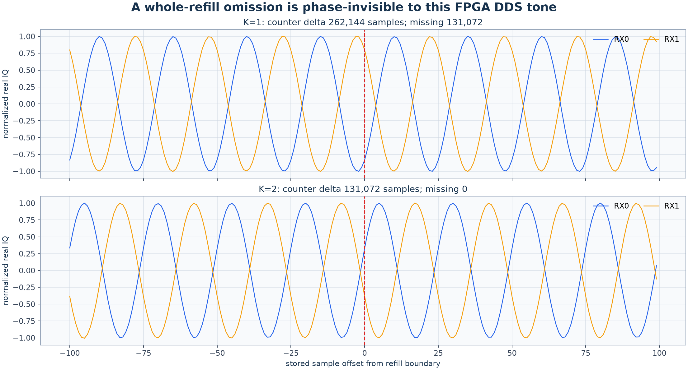

# Controlled Pluto refill continuity: one RX buffer drops whole blocks

Date: 2026-08-24

Status: completed bounded bench experiment; report-only change; no production
capture or analysis contract changed

## Decision

The FPGA sample counter gives a decisive red/green result on the controlled
TX2 -> RX0/RX1 loopback:

- with one kernel RX buffer, **all 572 refill boundaries lost samples**;
- with two, four, or eight buffers, **none of 1,716 tested boundaries lost a
  sample**; and
- the firmware overflow flag remained clear even at every known one-buffer
  discontinuity, so it is not a valid substitute for counter-delta checking.

The one-buffer arm stored 30.0417024 s of IQ while the FPGA counter advanced
60.3455488 s. It omitted 75,759,616 samples, or 30.3038464 s at 2.5 MS/s.
Increasing the buffer count removed the failure in this experiment, but that
is prevention rather than proof: production still needs to persist and check
the counter at every refill.


**Figure 1.** A: with one buffer, device time advances about twice as fast as
the contiguous stored sample index; K=2/4/8 lie on the continuous-time line.
B: 566 K=1 boundaries omit one complete block and six omit two. C: the K=1
host cadence is about two 52.4288 ms refill durations. D: phase innovation is
not a reliable loss detector for this deliberately periodic DDS waveform.

## Motivation

Earlier Starlink tracking reports correctly left RF-time continuity unknown.
In particular, [the carrier-continuity case](2026_08_22_carrier_continuity_case.md)
found CFO boundaries beside long shard-rollover stalls, while the old manifests
contained only a contiguous host-assigned sample index. The
[blind timing/CFO study](2026_08_23_470384_blind_timing_cfo_comprehensive.md)
then recovered approximately 104 ms ramps from raw IQ, but its own methods
noted that hardware sample-loss observability was false.

Those observations could not answer four basic questions:

1. Does the Pluto actually omit device samples between successful host
   refills?
2. Can the enhanced FPGA metadata measure an omission exactly?
3. Does increasing the kernel-buffer count prevent the observed failure?
4. Would an apparently clean stitched carrier or an overflow flag detect it?

This experiment isolates those questions with a cabled signal, digest-verified
raw IQ, two simultaneous receiver channels, and a predeclared 1/2/4/8 buffer
matrix.

## Apparatus and fixed configuration

The second Pluto transmit channel generated an FPGA-DDS tone through the
declared `TX2 -> 30 dB attenuator -> splitter -> RX0/RX1` fixture. Both receiver
channels were stored interleaved as little-endian CI16. Each arm used a fresh
IIO context and buffer, validated the tone before measurement, collected the
same 573 refills, and muted both transmit channels on exit.

| Setting | Value |
| --- | --- |
| Radio URI | `ip:192.168.1.18` |
| Radio serial | `1040007c4a94000211000b009186843ef2` |
| Firmware | `v0.41-plutoplus-spf-tandem-agc-v8-rc2` |
| Metadata capability | `iio,buffer-metadata=2` |
| Experiment UTC interval | 2026-08-24 15:49:50.961936712--15:52:35.339988470 |
| RX / TX LO | 1,000,000,000 Hz |
| Sample rate / RF bandwidth | 2,500,000 S/s / 1,500,000 Hz |
| Samples per refill | 131,072 = 52.4288 ms |
| Requested / stored arm duration | 30.0 s / 30.0417024 s |
| Refills / tested boundaries per arm | 573 / 572 |
| RX mode and gain | manual, 26 dB on both channels |
| TX2 gain / declared inline attenuation | -10 dB / 30 dB |
| Requested / quantized DDS offset | 100,000 / 99,983.21533203125 Hz |
| Varied setting | kernel RX buffers K = 1, 2, 4, 8 |

No over-the-air source, Starlink detector, trajectory, TLE, or fitted carrier
model enters the continuity decision.

## Method

For refill `i`, let `s_i` be the firmware's
`first_sample_sequence`, `n_i` the returned sample count, and
`e_i = s_(i-1) + n_(i-1)` the next expected counter. The exact missing-sample
count at that boundary is

```text
gap_i = s_i - e_i
```

A boundary is continuous only when `gap_i == 0`. Counter regressions are a
separate hard error. Stored duration is the number of written samples divided
by sample rate; device-counter span is
`(last counter + last count - first counter) / sample rate`. This comparison
does not infer loss from host timing or carrier phase.

The independent controls were:

- valid metadata on every refill;
- monotonically increasing host block and device sample sequences;
- dual-channel tone RMS and coherent projection throughout each arm;
- firmware `DEVICE_IIO_OVERFLOW` recorded separately, not treated as truth;
- realtime metadata increments compared with counter-derived increments; and
- SHA-256 digests of each raw CI16 stream and JSONL metadata stream.

The compact machine-readable result is
[analysis-evidence.json](figures/2026_08_24_refill_continuity_loopback/analysis-evidence.json).

## Results

| Kernel buffers | Gap boundaries | Missing samples | Missing time | Stored time | Counter span | Overflow flags |
| ---: | ---: | ---: | ---: | ---: | ---: | ---: |
| 1 | **572/572** | **75,759,616** | **30.3038464 s** | 30.0417024 s | **60.3455488 s** | 0 |
| 2 | 0/572 | 0 | 0 s | 30.0417024 s | 30.0417024 s | 0 |
| 4 | 0/572 | 0 | 0 s | 30.0417024 s | 30.0417024 s | 0 |
| 8 | 0/572 | 0 | 0 s | 30.0417024 s | 30.0417024 s | 0 |

At K=1, 566 boundaries advanced by 262,144 samples: one returned 131,072
sample block plus one missing block. Six advanced by 393,216 samples and
therefore omitted two blocks. The stored-to-device time-compression factor was
2.00873. Every K=2/4/8 counter delta was exactly 131,072 samples.

Median host refill-start spacing was 104.771 ms for K=1 and 52.445, 52.461,
and 52.421 ms for K=2/4/8. This explains the mechanism at the observation
boundary: one buffer cannot retain a completed block while the host consumes
the previous one, whereas the additional queued buffer does so in these arms.
The test does not further localize the loss among FPGA DMA, the kernel IIO
ring, `iiod`, and network transport.

The metadata's realtime timestamp increments and counter-derived increments
agreed to within 26.648 microseconds worst case over all arms. This validates
their relative increment behavior under this test; it is not an independent
claim of absolute UTC accuracy. The declared timestamp uncertainty remained
approximately 0.5--0.7 ms.

### Why the stitched tone looks continuous anyway



**Figure 2.** The top boundary omitted 131,072 samples and the bottom omitted
none, yet both waveforms appear smooth in stored coordinates. The red line is
the host stitch, not proof of adjacent device samples.

The FPGA DDS uses a 16-bit phase accumulator. Since 131,072 is exactly
`2 * 65,536`, any DDS tuning word returns to the same accumulator phase after
one refill. Dropping one or two full refills therefore preserves the apparent
phase at the concatenation point. This is a deterministic alias, not evidence
that the counter is wrong. It demonstrates why a signal-content heuristic can
miss a real gap and why the hardware counter must be retained.

The overflow bit also missed the failure: it was false at all 572 known gap
boundaries. On this build the counter delta is the authoritative observable.

## Consequence for the `470384` approximately 104 ms structure

This result materially strengthens the capture-discontinuity hypothesis for
`cap-20260821T140820-470384cc9284`, although that historical capture cannot be
proved sample-exact because it did not persist the counter:

- its configured refill was 262,144 samples at 2.5 MS/s, or **104.8576 ms** of
  stored time;
- its strongest blind CFO/timing path had **104 ms median boundary spacing**;
- each radio stored 573 refills for 60 s, but receiver 0's host request brackets
  spanned 123.070 s, with 215.063 ms mean refill-start spacing;
- the capture manifest's full create-to-finalize interval was 126.524 s;
- its local median rate was -3.656 kHz/s and global rate -7.013 kHz/s, a 1.918
  ratio; the controlled K=1 compression factor is 2.009; and
- its manifest explicitly says `sample_loss_observable=false`, with null device
  counters, even though host-assigned stored indexes are contiguous.

Grid changes and independent raw-frame fits show that the old sawtooth is not
created by a later 20 ms or 12 ms analysis window. They do **not** show that the
underlying raw recording is contiguous. Both receiver channels in one stream
share the same missing block, so cross-receiver agreement does not reject this
common capture mechanism. At the old local rate, one missing 262,144-sample
refill would hide approximately 383 Hz of smooth carrier evolution, the same
order as the reported approximately 268 Hz median reset.

These numerical agreements do not retroactively recover the absent counter and
the bench used a different radio, firmware revision, and refill size. The
careful conclusion is therefore:

> Capture time compression is now the leading explanation that must be
> falsified before interpreting the `470384` global/local rate difference or
> approximately refill-spaced resets as transmitter or orbital dynamics.

The old signal-state evidence remains useful inside each counter-contiguous
segment. Claims spanning refill boundaries should be treated as unqualified
until repeated on a counter-verified capture.

## Production implications

This experiment supports the following capture invariants:

1. Reset/destroy any stale RX buffer before each new capture and create a fresh
   buffer with a conservatively larger kernel count.
2. Persist the first-device-sample sequence and sample count for every refill.
3. Compare every counter with the preceding expected counter before appending.
4. Mark the capture discontinuous and emit a high-severity event whenever the
   delta is nonzero; overflow flags and host indexes are only supporting data.
5. Preserve device time explicitly. If a consumer requires a dense array,
   zero-fill the exact missing length while retaining a gap mask and segment
   boundaries so synthesized zeros can never be mistaken for RF evidence.
6. Never continue carrier phase, frame number, Doppler rate, or a Kalman update
   across a gap without an explicit reset/uncertainty transition.
7. Use at least four buffers by default rather than relying on the K=2 minimum
   seen here, and retain the counter check because no finite count proves safety
   under arbitrary host stalls.

No existing persisted contract is changed by this report. The requirements
above should be implemented through a versioned acquisition contract and
component-owned red/green tests.

## Reproducibility and immutable evidence

The full 2.4 GB raw corpus remains read-only at:

```text
/srv/bulk/leo/experiments/refill-continuity-loopback-20260824-full-v4
```

The experiment driver and deterministic analysis were committed in the SPF
worktree as `5c1041c1` (`Add Pluto refill continuity loopback experiment`). Raw
IQ was intentionally not copied into this repository.

| K | Raw CI16 SHA-256 | Per-refill metadata SHA-256 |
| ---: | --- | --- |
| 1 | `da3ef44039187211c05b54dae0f1fd622ad1f97a17c4d55151f637065d388327` | `290aa6c49f37564de8844604968ad549d77aa4eab915a2efa26b3af551398bd7` |
| 2 | `0ca7662b310ece420fa0598564d76ff56f747123774e31fdf089734b240a4941` | `a9199342b73f40740d06768eba7b5f34719c182fe75474055b482f296cef93d3` |
| 4 | `fc2f4625a1d0ea015983669308ca9657564fbd208149e934ffb1e86d8c9d86f3` | `245c6347d91220b535f534ba4e0029a51f6066798b733f3814eaaade0a716ce4` |
| 8 | `6ae031ac184d5df68ee12858293e5565941898f3a0bbb15e78bb1fd453318c47` | `59725175b4989760f40166834e1af1ff9116ece8a3145960c21dfc48cad598a8` |

Repository artifact digests:

| Artifact | SHA-256 |
| --- | --- |
| `analysis-evidence.json` | `914ca6ea0668a7023c6e558db0ee2722295eeca8500e6bbc3de0c7fa2d8b1ab0` |
| `buffer-count-continuity.png` | `6ba35685a9e61b74d182fccd346958636162b576ab8a44a44aa26c3f117ebe97` |
| `boundary-closeup.png` | `07f0b9c186e1e3910e67ed9fec95b67fb6cc7d23ee47e5b47f6e7cc7a6bcf2ab` |

## Limits

- This is one radio, one host, one network-IIO path, one firmware build, and
  four 30 s arms. K>=2 had zero observed loss here, not a universal guarantee.
- The counter proves omission before the returned metadata boundary but does
  not isolate the lower layer that discarded the samples.
- A periodic DDS tone is intentionally weak as a content-based continuity
  oracle. Its alias is a useful negative control, not a general waveform test.
- Historical captures without device counters cannot be repaired or certified
  after the fact. Host timing can support a diagnosis but cannot identify the
  exact missing sample count.
- Zero filling preserves the device-time axis for future captures; it does not
  restore RF phase or information in the missing interval.
