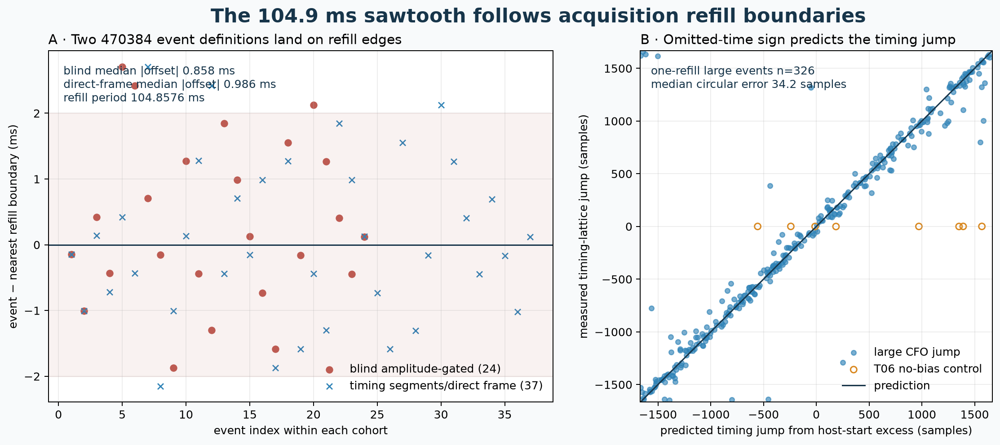

# Refill-time compression explains the Starlink CFO sawtooth

Date: 2026-08-24 UTC

Status: deterministic, read-only research audit; candidate-only receiver evidence; no
payload decoded and no satellite identified

## Executive conclusion

The approximately 105 ms CFO sawtooth is locked to the acquisition buffer, not merely
close to an unexplained protocol period. Every audited dwell was recorded in
262,144-sample refills at
2.5 MS/s, giving an exact stored-sample
period of **104.8576 ms**. The independently
reported receiver-1 event clock was
**104.8706 ms** with
1.658 ms RMS, as frozen in the
[boundary-mechanism audit](2026_08_23_470384_boundary_mechanism.md). In the blind
`470384` interval, all
24 direct timing+CFO events fall within
2.707 ms of a refill edge, with
0.858 ms median absolute offset.
The separately defined 37-event timing-segment cohort has
0.986 ms median,
1.971 ms p90, and
2.707 ms maximum absolute offset.

Across ten independently selected raw-dwell tracks, large CFO discontinuities and timing
lattice changes co-occur at refills. Of 391 adjacent ramp cuts with
|jump| > 100 Hz, 383 (97.95%)
bracket a refill edge and only 3
(0.77%) preserve timing to
two samples. For 52 cuts below 30 Hz, only
9 (17.31%)
bracket a refill, while 50
(96.15%) preserve timing.
T06 supplies the necessary counterexample: its selected stream refilled at essentially
real time, its long and local rates differ by only 3.1 Hz/s, and 48 of its artificial
maximum-span ramp cuts have small frequency jumps with stable timing.

The parsimonious mechanism is **stored-time compression**. Most refills arrive after more
wall-clock time than the 104.8576 ms represented by their stored samples. When the
unobserved interval is omitted from concatenated sample time, smooth physical-time CFO
motion appears as a discrete frequency step and a frame-lattice phase jump at the refill
handoff. A long line against stored sample index absorbs those steps and becomes too
negative. The within-refill/ramp slope is the defensible received-CFO-rate candidate.

This is strong causal evidence, but not an exact lost-sample proof: the timeline contains
host request brackets, not hardware sample counters, and records continuity as unknown.
The host-retimed numbers below are therefore **diagnostic only** and must not become a
production timebase or persisted scientific rate.



**Figure 1.** Two event definitions land on refill edges. The 24-event blind cohort is
amplitude gated (`|CFO jump| >= 100 Hz`, timing jump >= 20 samples), while the 37-event
cohort starts from timing-segment boundaries and re-estimates CFO independently in
1.333 ms frames without a CFO-jump gate. They are related views of the same four-second
case, not 61 independent events. For one-refill ten-dwell events, signed host-start excess
predicts the independently recovered frame-lattice jump. T06 is a no-bias control, not a
transmitter-event interpretation.

The 37-event cohort is the cleaner amplitude test. Host-start excess versus direct-frame
CFO jump has correlation -0.9873; OLS gives
-3.7580 kHz/s slope,
+49.7 Hz intercept,
R²=0.9748, and
25.7 Hz RMS. The magnitude of omitted
frame-lattice phase predicts measured timing-separation magnitude with correlation
0.9765 and
73.5 samples
median absolute error.

## Why a refill gap creates both a CFO step and a timing jump

Let a stored refill contain \(N\) samples at sample rate \(F_s\), so its stored duration is

\[
T_b = \frac{N}{F_s}.
\]

Let successive host refill starts be separated by \(T_b + \delta\). If \(\delta\)
corresponds to RF time not represented in the concatenated samples, a smooth
received-CFO rate \(\dot f_{\mathrm{local}}\) produces

\[
\Delta f_{\mathrm{jump}} \approx \dot f_{\mathrm{local}}\,\delta,
qquad
\dot f_{\mathrm{stored}} \approx
\dot f_{\mathrm{local}}\left(1+\frac{\delta}{T_b}\right).
\]

The stored frame lattice is shifted by the omitted sample count, modulo the nominal
Starlink frame period:

\[
\Delta n_{\mathrm{frame}} = -\delta F_s \pmod{F_s/750}.
\]

The sign is empirically decisive. Among 326 one-refill large
events, the omitted-time sign gives a median circular prediction error of
34.19 samples;
the opposite sign gives 860.65
samples. Inside accepted ramps, where the frequency-only partition never inspected timing,
1138 of
1145 consecutive probe pairs
(99.39%) preserve timing
within two samples.

## Acquisition-path evidence and timebase boundary

The production dwell path has a concrete opportunity for this mechanism. The
[coordinator capture loop](../src/leo/acquisition/coordinator.py#L466-L516) calls
`source.read_block(refill_samples)` and then `stream_writer.append(block)` before its next
read. The [Pluto adapter](../src/leo/radio/pluto_adapter.py#L156-L180) brackets the
underlying `device.read_block`. On the same per-radio path,
[`StreamBundleWriter.append`](../src/leo/storage/writer.py#L203-L249) synchronously writes
IQ into the current zstd stream and writes compressed timeline metadata; shard completion
closes zstd, flushes, `fsync`s, and renames through
[`_CompressedFileWriter.finish`](../src/leo/storage/writer.py#L78-L106). Therefore CPU or
storage delay can postpone the next refill request. This code path establishes a plausible
causal channel; without a device sample counter it does not prove which RF samples, if any,
were lost upstream.

All Standard, frozen/global, and current local-window time coordinates relevant here use
**stored sample coordinate divided by sample rate**. The probe schedule writes
`time_s = sample_start / Fs`, the global Doppler fit uses
`absolute_epoch_sample / Fs`, and Pilot Doppler Segments V1 starts each window at
`probe_sample_start / Fs`; see [Standard probes](../src/leo/analysis/standard/probes.py#L68-L79),
[global Doppler tracking](../src/leo/analysis/doppler/tracking.py#L100-L124), and
[Pilot Doppler Segments V1](../src/leo/analysis/starlink/pilot_doppler_segments.py#L78-L153).
None of those scientific fits consumes host timeline timestamps. Thus an unrepresented RF
interval is necessarily compressed out of Standard/frozen time.

Scanner acquisition is a useful existing-corpus control with different geometry. It sets
`rx_buffer_size = dwell_samples` and makes one `device.rx()` call per tuned target; see
[Pluto scanner](../src/leo/radio/pluto_scanner.py#L73-L130). There are no repeated
262,144-sample application refill handoffs *inside* one scanner target. That distinction
predicts no 104.8576 ms application-refill sawtooth within a target, but the scanner still
lacks device counters and therefore cannot prove absolute RF continuity.

A separate read-only natural-control audit of the sealed 1.5 s diagnostic target
`ch2-lower.npy` is consistent with that prediction; this tool binds its source hashes but
does **not** recompute its GLRT/frame analysis. The RX1 branch from
0.680–1.430 s had
22 passing probes and an OLS rate of
-3.2075 kHz/s at 14.69 Hz RMS.
Innovations bracketing seven hypothetical 104.8576 ms edges were
+2.6, -12.8, +17.8, -12.6, -31.8, -11.5, -7.6 Hz; none was a repeated >100 Hz drop. Forty-two frame CFOs around
one edge were also smooth at 47.3 Hz RMS. This is one
sparse historical diagnostic target, not a current 80/120 ms Standard scanner product.
Its single host call took 2.07 s to return
1.5 s of stored samples, which reinforces why host duration is
diagnostic rather than an exact RF timebase.

## Ten-dwell rate closure


**Figure 2.** The red stored-time line is the existing reset-inclusive GLRT rate. Blue is
the free-intercept within-ramp rate. Green divides the stored rate by the median host-time
stretch and is diagnostic only. T06 shows that the estimator does not manufacture a
correction when refills remain near real time.

| Dwell | Edge | Ramps/cuts | Median cut cadence (ms) | Median jump (Hz) | Large cuts | Median abs timing jump / within 2 samples | Median host excess (ms) | Stored GLRT (kHz/s) | Local ramp (kHz/s) | Host-retimed diagnostic (kHz/s) | Local−stored (kHz/s) |
| --- | --- | ---: | ---: | ---: | ---: | --- | ---: | ---: | ---: | ---: | ---: |
| T01 | upper | 60/59 | 103.27 | -250.1 | 59 | 677.3 / 0.00% | +64.25 | -6.171 | -3.842 | -3.826 | +2.329 |
| T02 | lower | 56/55 | 111.40 | -236.1 | 55 | 790.3 / 0.00% | +71.93 | -5.498 | -3.231 | -3.261 | +2.267 |
| T03 | upper | 10/9 | 401.00 | -163.3 | 6 | 576.3 / 0.00% | +53.62 | -5.223 | -3.376 | -3.456 | +1.846 |
| T04 | lower | 56/55 | 102.18 | -263.4 | 55 | 801.0 / 0.00% | +78.97 | -5.743 | -3.362 | -3.276 | +2.380 |
| T05 | upper | 57/56 | 108.46 | -186.8 | 53 | 955.3 / 0.00% | +57.32 | -4.964 | -3.196 | -3.209 | +1.768 |
| T06 | lower | 53/52 | 125.33 | -0.6 | 0 | — | -0.69 | -3.473 | -3.470 | -3.496 | +0.003 |
| T07 | lower | 53/52 | 111.76 | -214.0 | 51 | 808.3 / 0.00% | +52.24 | -6.019 | -4.028 | -4.018 | +1.991 |
| T08 | lower | 63/62 | 102.34 | -190.6 | 61 | 818.3 / 0.00% | +50.31 | -5.586 | -3.772 | -3.775 | +1.814 |
| T09 | lower | 31/30 | 212.16 | -322.5 | 29 | 989.0 / 3.45% | +59.57 | -5.733 | -3.545 | -3.656 | +2.187 |
| T10 | upper | 32/31 | 170.36 | -108.4 | 22 | 615.7 / 9.09% | +50.15 | -4.298 | -3.040 | -2.907 | +1.258 |

The host-stretch prediction closes the stored rate to a median
38.5 Hz/s across the ten
dwells. Independently, the summed fitted frequency steps per boundary span correlate
0.964 with the stored-minus-local
rate discrepancy and close it to 15.4
Hz/s median absolute error. This is a decomposition of the receiver observable, not a
satellite association.

The CFO jumps are not a training-only illusion. Odd Qin symbols, excluded from each
frame-CFO maximization, reproduce the boundary jumps with correlation
0.9858 and
15.5 Hz median absolute
difference. Of the 391 training-defined large jumps,
389 remain above 100 Hz on held-out
symbols and all 391 keep their sign.

## Close-up mechanism


**Figure 3.** A 650 ms blind raw-IQ close-up from `470384`. Each refill contains a smooth
local CFO tooth. Both the CFO intercept and absolute receiver frame-lattice phase change
at the refill handoff. Black lines are independently declared timing+CFO events; red
dashed lines are exact persisted refill boundaries.

In the complete four-second blind path, a fixed-effect regression giving every timing
segment its own intercept estimates -3.7361
kHz/s with 18.20 Hz RMS. The reset-inclusive global line is
-7.0127 kHz/s. All
40 adjacent fitted segment jumps are
negative, with median -319.6 Hz and 10–90% range
-409.8 to -255.5
Hz. Their cumulative contribution is -3.4347
kHz/s, compared with -3.3571 kHz/s for
global minus median local rate.

At the 24 directly bracketed blind events, host-start excess is
80.08 ms median. Jump divided by excess is
-3.9493 kHz/s; a through-zero fit gives
-3.8710 kHz/s. Both agree with the
within-segment rate family. Using the fixed-effect rate predicts individual jumps with
24.6 Hz median absolute
error.

## Distinction from the PNT paper's genuine one-second corrections

Kozhaya, Saroufim, and Kassas report genuine, abrupt **one-second** CFO corrections in
pre-2024 full-OFDM-beacon tracking and explicitly distinguish the data-less pilot tones,
which did not show that contamination. They also report that these OFDM corrections were
barely observed after 2024. See [“Unveiling Starlink for PNT,” *Navigation* 72(1),
DOI 10.33012/navi.685](https://doi.org/10.33012/navi.685), Sections 7.2–7.3.

That published phenomenon must not be conflated with this result. This repository uses a
Qin edge-pilot observable, and the cadence here is the exact 104.8576 ms application
refill period, not an approximately one-second transmitter clock. Refill alignment,
host-excess scaling, and the T06 no-bias control specifically diagnose the receiver path.

## Hypothesis audit

| Hypothesis | Prediction | Result | Disposition |
| --- | --- | --- | --- |
| 20 ms/12 ms analysis-window artifact | Events move or disappear on another grid | Blind 12/4 ms search preserved the events | Rejected by prior blind analysis |
| Pure inter-frame carrier-phase alias | Arbitrary whole-frame phase changes move frame CFO | Magnitude-based 1.333 ms CFO is invariant; timing also changes | Rejected by prior frame control |
| Starlink scheduler or oscillator command every ≈105 ms | Period is independent of receiver buffer geometry | 104.8706 ms matches the 104.8576 ms refill; event size follows host excess; T06 loses the sawtooth when one stream refills in real time | Strongly disfavored as the primary cause |
| Receiver-channel optimizer failure | RX channels change independently | 7 matched RX0/RX1 events have CFO-jump correlation 0.872, but both channels share `radio_pluto_5d4d` stream/refill/transport | Per-channel optimizer rejected; shared acquisition remains |
| Stored-time compression at refill handoff | CFO and frame timing jump at refill; jump ≈ local rate × omitted time; changing refill behavior changes bias | All signatures observed, including T06 counterexample | Dominant supported explanation |
| Pure orbital Doppler in the frozen line | One smooth stored-time rate predicts held-out frame CFO | Free-intercept local rate and odd-Qin holdout are materially better | Rejected for the frozen rate |

## Safe compensation now

1. Treat every unverified refill boundary as a hard timing/phase discontinuity.
2. Estimate every frame CFO independently from the exact source timing/CFO neighborhood:
   fit even Qin symbols inside one approximately 1.333 ms frame, validate on odd Qin
   symbols, and retain the rolled-pilot control.
3. Join frames only within frequency- and timing-consistent refill/ramp support. Fit one
   shared robust rate with a free CFO intercept per ramp. Do not smooth a single Kalman
   state across an unverified refill edge.
4. Publish the within-ramp received-CFO rate, whole-ramp uncertainty, held-out RMS, sample
   continuity grade, and reset count. Keep the stored long line only as a discrepancy
   diagnostic.
5. Do **not** replace sample time with host bracket time in production. Host requests can
   include buffering, transfer latency, and isolated stalls. Green values in Figure 2 are
   a mechanism check, not calibrated RF timestamps.

## Current Standard V1 limitation and additive V2 plan

Standard `pilot-doppler-segments.v1` already analyzes complete frames inside disjoint
75 ms windows and qualifies local lines with coverage, gap, modulo-π phase, control-pilot,
line-RMS, held-out prediction, and local/Kalman agreement gates. It is **not** exact
refill compensation: window starts and the frozen model both use stored `sample/Fs`, and
the analyzer is not refill-boundary-aware. A 75 ms window that straddles an omitted-time
handoff can be rejected by its line-RMS or held-out gates; qualified windows wholly within
one refill likely explain the observed local-versus-frozen improvement. See the
[V1 window construction and gates](../src/leo/analysis/starlink/pilot_doppler_segments.py#L60-L170).

A frozen eight-hour Standard V1 aggregate provides independent geometric corroboration.
Of 66,294 75 ms dwell windows,
44,101
(66.52%) cross a hypothetical
104.8576 ms refill edge. Only 1,887
(4.28%) crossing
windows qualify, versus 3,007 of
22,193
(13.55%)
non-crossing windows—a 3.17×
yield ratio. The direction holds within every path:

| Path | Crossing windows | Crossing qualified | Non-crossing windows | Non-crossing qualified | Non-cross/cross yield |
| --- | ---: | ---: | ---: | ---: | ---: |
| stream-0 · RX0 | 9,508 | 6.42% | 5,137 | 20.97% | 3.27× |
| stream-0 · RX1 | 12,201 | 5.24% | 5,985 | 15.74% | 3.01× |
| stream-1 · RX0 | 6,458 | 7.23% | 3,450 | 23.16% | 3.20× |
| stream-1 · RX1 | 15,934 | 1.07% | 7,621 | 2.48% | 2.31× |

This reduces path-mixture confounding, but it is not a loss detector: edge crossing is
only geometry, T06 demonstrates that a refill can be continuous, and
38.56% of all qualified
windows still cross an edge.

The compatible production change is an additive V2 product, preserving immutable V1:

1. bind each candidate window to recording-timeline refill evidence and publish a
   continuity grade (`within_refill`, `crosses_unverified_refill`, or hardware-proven);
2. split or relocate local windows so no fit silently bridges an unverified handoff;
3. fit a common local received-CFO rate with a free intercept per continuous piece;
4. retain V1 and the frozen line unchanged as comparison diagnostics; and
5. prohibit host-retimed rates from scientific contracts until device-counter continuity
   is recorded and calibrated.

## Decisive acquisition experiments

1. Record the same stable injected tone and live Starlink edge with refill sizes 131,072,
   262,144, and 524,288. A capture artifact must move its tooth period as `N/Fs`.
2. Put radio reads on dedicated threads with a bounded in-memory writer queue. Compression,
   shard close, `fsync`, and rename must never delay the next refill. The sawtooth and
   local/frozen gap should collapse when median start spacing approaches `N/Fs`.
3. Persist AD9361/device sample counters and hardware overflow evidence. Synthetic writer
   stalls must create an explicit discontinuity rather than silently contiguous stored
   indices.
4. Reanalyze T06's simultaneous stream-1 against its near-real-time stream-0. It is an
   existing natural differential control with no new RF collection.
5. Compare two physically independent Plutos observing one injected tone. Same-channel
   RX0/RX1 agreement is insufficient because both channels share a refill and transport.
6. After continuity is proven, compare the debiased rate with TLE curvature and a stable
   receiver/LNB reference before converting it to range acceleration.

## Selection dependencies and limits

- The ten tracks were selected earlier by persisted GLRT strength, not by this timing or
  refill result. All selected examples happen to use RX1, so the cohort is not a receiver
  comparison.
- Ramp partitioning uses frequency and gaps, not timing, but its 125 ms/maximum-lock bound
  creates cuts even in a continuous carrier. T06 demonstrates those harmless cuts. A cut
  count is not an event count.
- The 461 ramp pairs are clustered within ten dwells. The 52 small jumps are dominated by
  T06 (48/52); rows are not
  independent statistical trials.
- The blind 24-event and timing-segment 37-event cohorts reuse the same `470384` IQ and
  are intentionally not pooled. Their different gates answer alignment and amplitude
  questions separately.
- `local_epoch_sample` is receiver sample-lattice phase, not transmit code phase or
  pseudorange.
- Host request start is the only timeline timestamp that predicts the sign and phase
  here, but it remains a host-side bracket. Without device counters, exact omitted RF
  duration is an inference.
- Local received-CFO rate can still contain satellite motion, transmitter clock/control,
  LNB drift, and receiver/sample-clock drift. This report repairs the stored-time bias;
  it does not identify a spacecraft or prove orbital Doppler.

## Related evidence and references

- [Blind timing–CFO comprehensive audit](2026_08_23_470384_blind_timing_cfo_comprehensive.md)
  — independently timed 12/4 ms cells and negative controls.
- [Boundary-mechanism audit](2026_08_23_470384_boundary_mechanism.md) — direct-frame CFO,
  crossfit, grid shifts, and same-Pluto RX0/RX1 comparison.
- [Complete sub-second pilot lattice](2026_08_22_subsecond_pilot_structure.md) —
  raw 1.333 ms frame evidence and local-versus-frozen rate comparison.
- [Ten-dwell raw Doppler pipeline](2026_08_24_ten_dwell_raw_doppler_pipeline.md) — frozen
  per-dwell inputs, ramp construction, odd-Qin holdout, and rate results reused here.
- [Kozhaya, Saroufim, and Kassas, “Unveiling Starlink for PNT”](https://doi.org/10.33012/navi.685)
  — full-OFDM PNT receiver and the distinct approximately one-second corrections.

## Reproduction and immutable inputs

Generate evidence, figures, and this report from the ten frozen raw-dwell JSONs, blind
`470384` JSON, frozen boundary-mechanism JSON, verified recording manifests, and
compressed timeline records. The Standard V1 geometry audit reads
`reports/figures/2026_08_23_eight_hour_science_agent/dwell-pilot-segments.csv.gz` directly from frozen commit `743216c207c23e23bdc7cc7b9a0729f33db2d3b5`.
The external scanner NPY is hash-bound only; its separately reported metrics are not
recomputed by this command:

```bash
OPENBLAS_NUM_THREADS=1 OMP_NUM_THREADS=1 \
  .venv/bin/python tools/report_refill_time_compression_sawtooth.py
```

Render again without reading `/srv/bulk`:

```bash
.venv/bin/python tools/report_refill_time_compression_sawtooth.py \
  --reuse-evidence reports/figures/2026_08_24_refill_time_compression_sawtooth/refill-time-compression-evidence.json
```

Machine evidence:
[`refill-time-compression-evidence.json`](figures/2026_08_24_refill_time_compression_sawtooth/refill-time-compression-evidence.json)

| Input | Primary input SHA-256 | Manifest/capture SHA-256 | Selected timeline SHA-256 |
| --- | --- | --- | --- |
| T01 | `sha256:0e14093f36d0e844bcef9bc2dce6e2f4d364f88c55ebcc29d888070590cc31e9` | `sha256:df21f3b1ad825b1aeea53a58146da698f87f4d731b20aa60ae239a149db9c07a` | `sha256:3d714cf98bbb8406552e81a08e9885f210df9949ac9b163d4db40046cf19590a` |
| T02 | `sha256:dfc60e795e03c613039ac83df41a1530f95d1fca9af5f668a0bd84eaea9aca2d` | `sha256:aba52834f94ccf4ad743816732aae17a5ec37995e7bb742e07489da8083894d4` | `sha256:54614b1aea0e0b0f0bc00c7cc0f1a5f70a1b10e47e26e213846ab0b5f7feff30` |
| T03 | `sha256:0725031cac449aeb8dbccb8b1f835f808b259844cbecfbd2c5128c6d717a7297` | `sha256:1cdf3eb897f280ee89dc48622cc541b49d03abddd87f9266afc4b4501f577864` | `sha256:96825d1dec1a05965c82a4c419738fa11046e77516a0e68b877e06acf93d85ce` |
| T04 | `sha256:269ca22f06be10ae3cdbd65ead3dea030e61b40f6744806e439517c60ce3b1bb` | `sha256:300e9eb30c0e8d371b80e9623ec78e99ddccd58fae61ddfb1714f53c22598b8f` | `sha256:811b72a81da7ce91a43ae860b74dabcfaf67f005ee41882fdf01ea83575fcf6f` |
| T05 | `sha256:a5ecee5cee4a7d2c427b5d10623f378f7362349b0076a0de1c3f1a7a3a5c03f1` | `sha256:a64f17d249590714532c90c9eebf2c6d1aa4edafe69a83de7936db5137fe5132` | `sha256:a48cff38e58ac657d1d952074a935d615b7af797f9ad57edc88b522a8752e0a7` |
| T06 | `sha256:dbda2c4efa697c1f1e2c44913d6f22e08eb3a3f8070a376eeed7875ceccac973` | `sha256:79a178e400d77f98ed5ae5cf3a7962ad82858c3be55bff2f965f2692db9679dc` | `sha256:d35820feaa707c1dfed6b7bd0a940cd015ddb3a17b6f87574ca3a079ca4f1d21` |
| T07 | `sha256:9c47d2baec72e7bad90deb1904152903f99edefa74c55fa5ab62a8e24c529065` | `sha256:6427a429baef63a3e2880d406fca3a21a8c1d622376aad14121ebd3858cbf70e` | `sha256:787cd682cb6aebf5c2b7008d9cfdeafa73dca6cdb4e02699b117a55138880164` |
| T08 | `sha256:7e55e4ce9a891cb4a7c75ec6069e1ac744de4f9f87050dfaf0c8c95960ca8eef` | `sha256:8242447e6194e0a14906367d9d7f65f688a8f16a0fefc9ed0ea84f1025de9798` | `sha256:7dc6a0fd4c66ddfc81df681ed178c8db4ccba6732b0d6ae3fd0f00a6ee4cde57` |
| T09 | `sha256:4851b2310e95a8ec5c6c1f663806709be2b9825363785b12cfd917f19c603bad` | `sha256:09b807bed4c75206394ecb93027deeb6789414cce673065695215b14b8ff41dd` | `sha256:a39701436602cdde658003e9df8bf572a8c1681a90e4968a1053aa9f115a5015` |
| T10 | `sha256:29ff8493d638979c11363e44da69eef7ca6edaa90eb4846a4f4b123377bb2a31` | `sha256:dad57c1cfe705f1335e7571ab73c87877dfb6adfc6e4f9b0978ced98b5491da6` | `sha256:d878c9eab09181d57472edafb3d911f7ba2c4fecc2341c9012b50db0f8de1a70` |
| 470384 blind | `sha256:fcbbe224f01767343a02082c0ac24c37c39369622e347a6a0e27c668afb72dc3` | `sha256:d45409ea3620eccb705eac024a4d814b5c2779f13bcee974311c9f09477adb75` | `sha256:4cc71300c04e4986236efa80e407a8c58a1b83d827b1f96a3d8a888f7d12e641` |
| 470384 boundary mechanism | `sha256:b3a05183986d73200f232ce2cba742dfa62f043bf9d430a688963b02cb3fc116` | `sha256:d45409ea3620eccb705eac024a4d814b5c2779f13bcee974311c9f09477adb75` | `sha256:4cc71300c04e4986236efa80e407a8c58a1b83d827b1f96a3d8a888f7d12e641` |
| Standard V1 segments @ `743216c` | `sha256:711fcc34a170acd3a59baa0f1444ad4535f26099f881eeceb2c62c67a68b47af` | — | — |
| External scanner natural control | `sha256:f2173b256b066bb7d845f504cd6185d8ea0d1ed2c609bc48735afa05c6810a7a` | `sha256:7712b47e4a0431c41b518ad2c4292874921bbc24d179c8883306f0d9d6292633` | — |

The result is deterministic for these frozen inputs. The report tool records every source
hash and does not modify recordings, timelines, sealed analysis products, or database
state.
