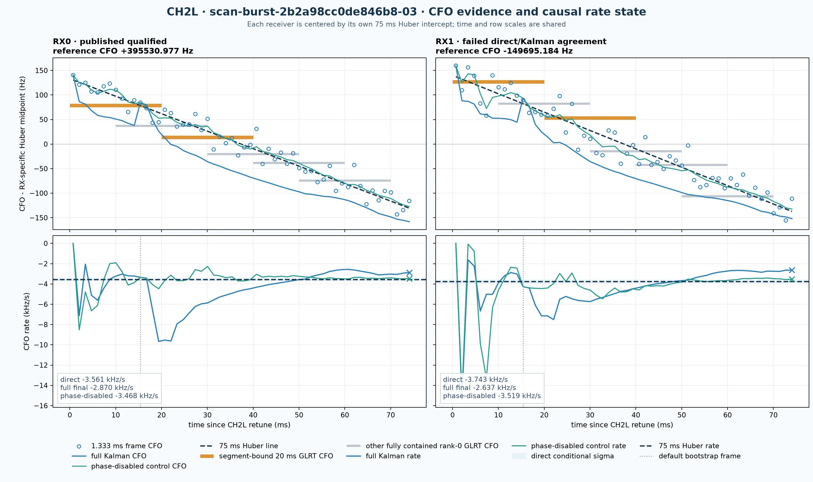

# CH2L Kalman-rate diagnosis for scan-burst-2b2a98cc0de846b8-03

## Motivation

The scanner presents both a robust 75 ms frame-CFO slope and the terminal rate
from a causal five-state pilot Kalman filter. Those values answer different
questions, but a large disagreement can look like rapidly changing physical
Doppler. This report establishes which observable is supported by the recorded
CH2-lower (`CH2L`) IQ and identifies the next tests required before carrier
phase is allowed to strengthen a Doppler-rate claim.

## Problem

For both receivers, all 56 supported 1.333 ms frames form a clear negative CFO
ramp. The robust rates are approximately -3.6 and -3.7 kHz/s, while the final
phase/frequency/timing Kalman states are only -2.9 and -2.6 kHz/s. RX1 fails the
published 1 kHz/s direct-versus-Kalman agreement gate, but RX0 passes it despite
a disagreement much larger than either estimator's conditional uncertainty.

The questions are therefore:

1. Do the independent frame-CFO measurements support a coherent local rate?
2. Is the disagreement caused by acquisition, the rate bootstrap, the raw CFO
   discriminator, or phase feedback?
3. Which value should be used now, and what evidence would justify changing
   that policy?

## Solution

Use the robust 56-frame CFO line as the primary local rate for this interval:
**-3560.8 +/- 102.1 Hz/s on RX0 and -3742.9 +/- 150.4 Hz/s on RX1**. Treat the
terminal five-state Kalman rate as a consistency diagnostic, not as the
preferred rate.

The raw CFO evidence behaves as expected: CFO versus time has Pearson
correlation -0.978/-0.957 and falls 256/271 Hz across the measured baseline.
The default Kalman is instead statistically overconfident and retains biased
innovations. A matched replay with phase updates disabled after first-frame
initialization moves the endpoints to -3467.6 and -3519.4 Hz/s, while disabling
the 12-frame rate bootstrap barely changes the problematic default result. The
immediate diagnosis is therefore **phase-observation/model-covariance
mismatch**, not weak frame-CFO evidence and not an apparent state-transition or
bootstrap implementation error.

This is a single-scan supporting result. It does not justify tuning a phase
gate or uncertainty floor from this case alone, changing an immutable V1
contract, or interpreting the measured receiver-relative CFO rate as pure
spacecraft Doppler.

## Method

Date: 2026-08-24. Classification: supporting, retrospective diagnosis. No new
RF was collected. Recording and analysis bundles were read and hash-checked in
place; no production or QNAP state was changed.

The persisted product supplied acquisition binding, frame measurements, the
robust Huber line, held-out residuals, and the published qualification result.
The selected 75 ms IQ was then replayed through the deployed implementation at
revision `058576ec74b7dae9ae3ad2a9798679fcf2c934c3`. The relevant source files
are byte-identical to `origin/main` at the time of this report. The default
replay reproduced the persisted final rates to numerical precision.

Four matched variants consumed the identical IQ, frame lattice, fixed GLRT CFO
anchor, and frame-CFO measurements:

1. the published phase+frequency+timing filter;
2. a phase-disabled-after-initialization control
   (`phase_innovation_gate_rad=1e-12`), which necessarily retains the first
   phase initialization and keeps all timing updates diagnostic;
3. a phase-downweighted sensitivity run with phase sigma fixed to 0.5 rad; and
4. a bootstrap-disabled control (`rate_bootstrap_supported_frames=100`, longer
   than the 56-frame window).

This diagnostic was motivated after seeing the disagreement and was not
pre-registered. It therefore does not promote a replacement estimator. The
production gates were fixed before this scan: support at least 75%, maximum gap
4.1 ms, phase lock, line RMS at most 75 Hz, held-out RMS at most 100 Hz, and
absolute direct/Kalman rate disagreement at most 1000 Hz/s. The ablations and
innovation statistics are exploratory mechanisms tested against those already
published measurements.

The four-variant, two-receiver replay ran in one Python process on the analysis
host. Wall time, BLAS thread count, and peak RSS were not recorded or
controlled, so no runtime benchmark is claimed. The exact per-frame, GLRT,
configuration, and numerical receipt is
[`diagnostic-metrics.json`](figures/2026_08_24_scan_2b2a98cc_ch2l_kalman_rate_diagnosis/diagnostic-metrics.json).

## Evidence binding

| Authority | Exact binding |
|---|---|
| Scan | `scan-burst-2b2a98cc0de846b8-03` |
| Recording URI | `bulk://scanner-recordings/2026/08/24/scan-burst-2b2a98cc0de846b8-03` |
| Recording manifest SHA-256 | `275227ab101b3cadb51839ef071d7e98b90a903176f3040606cbe393cadd430d` |
| Compressed IQ SHA-256 | `b761fe5ad7be9570b10814e40793764e73e0890590679ffd6124f25ff58bfb3e` |
| Analysis ID | `standard-scan-analysis-continuity-v2` |
| Analysis manifest SHA-256 | `b5442098eb47ab9bc5997531640b3a0f12dd3516e93f1e4395bdd4fd7811973a` |
| Scanner metrics SHA-256 | `27e9065df04f4495336aea48b83bded7d97ebfae2a7ac95a0f59815e22fea545` |
| Pilot-Doppler product SHA-256 | `754cd96390d0ff69b73bde08882dc3db5419fb3046725df7f5d4617e5c144d00` |
| Product content digest | `73f0369d6f189ce8275b9a79a00bbc80fe8ac2234cb146d2f992d0f9525b484b` |
| Target | index 2, CH2 lower, requested RF 10,959,687,500 Hz, actual RF 10,959,687,498 Hz |
| Capture geometry | 2.5 MS/s, two CI16 receivers, 120 ms target frame, manual 40 dB gain |
| CH2L target samples | stored samples `[600000, 900000)`; 300,000 samples |
| CH2L RF-time interval | `2026-08-24T19:44:18.227828681Z` through `19:44:18.347816682Z` |

The V2 manifest attests FPGA sample counters
`664050043701..664050343701`, zero missing samples, no overflow, and
`within_frame_continuity=proven_within_returned_buffer`. Both receivers use the
same target buffer and epoch 140. This rules out the older unobserved refill-gap
mechanism inside this CH2L frame; continuity is deliberately not claimed across
retunes. See the [continuity implementation report](2026_08_24_continuity_buffer_implementation.md)
for the counter authority.

## What the estimators measure

| Observable | IQ support | Meaning in this report |
|---|---:|---|
| GLRT CFO | one 20 ms probe | Acquisition CFO/alias and frame epoch. Probe 0 seeds both segments; probe 2 at 20 ms confirms them. It is not fitted to obtain the 75 ms rate. |
| Frame CFO | 1.320 ms of known-symbol IQ within one 1.333 ms frame | One independent constant-CFO profile fit over 300 known Qin symbols and eight edge tones, anchored to the fixed GLRT CFO. The complete demodulator slice extends 1.3288 ms from the frame epoch because the pilots occupy symbols 2 through 301. It is a frequency point near frame center, not a rate point. |
| Direct local rate | all 56 supported frame CFOs over 73.333 ms of center-to-center leverage | Huber line at the mean measurement time. This is the robust window-average CFO rate reported by the product. |
| Final Kalman rate | causal state at the last frame center, 74.058 ms | Endpoint of a five-state phase/CFO/rate/timing recursion. Phase and CFO observations from each frame can both move the rate through propagated covariance. |

For a locally linear CFO,

\[
f_i = f_0 + \dot f\,t_i + \epsilon_i.
\]

At -3.6 to -3.7 kHz/s, the expected CFO change over one 1/750 s frame cadence
is only -4.8 to -5.0 Hz. The median per-frame CFO uncertainties are about 15 Hz
on RX0 and 23 Hz on RX1. An adjacent-frame derivative is consequently noisy,
even though the 56 points collectively identify the slope well.

## Results



*Figure 1. Recorded `scan-burst-2b2a98cc0de846b8-03`, CH2 lower, RX0 and
RX1. The upper panels show all six fully contained rank-0 20 ms GLRT tracking
CFO windows (gray), with the source and confirmation windows emphasized in
amber, all 56 supported 1.333 ms frame-CFO measurements, the robust 75 ms line,
the full post-update Kalman CFO, and the phase-disabled-after-initialization
control. One constant RX-specific Huber midpoint is subtracted; the time-varying
line is not removed. The lower panels show both causal rate histories, the
direct conditional line-sigma band, and the actual default bootstrap frame.
RX0 passed the published fixed gate; RX1 failed direct/Kalman agreement. These
are exact-pilot, candidate-only, receiver-relative carrier measurements from
this report, not satellite identity or pure orbital Doppler.*

### The bound GLRT probes acquire but do not fit the 75 ms rate

| Receiver | Source probe 0, 0-20 ms | Source margin | Confirmation probe 2, 20-40 ms | Confirmation margin |
|---|---:|---:|---:|---:|
| RX0 | +395609.865 Hz | 0.6019 | +395544.702 Hz | 0.6053 |
| RX1 | -149568.295 Hz | 0.4076 | -149642.151 Hz | 0.3867 |

Both bound rank-0 candidates use epoch 140 and pass the existing
exact-minus-control margin gate. Figure 1 also shows the strongest rank-0
candidates from the other fully contained probes at starts 10, 30, 40, and
50 ms. They follow the same CFO ridge, but the segment contract does not bind
them to this track. None of the six GLRT values is an input point to the robust
75 ms line: the source establishes acquisition identity and seeds the
independent frame discriminator; the confirmation only admits the segment.

### The frame CFOs support a stable negative ramp

| Quantity | RX0 | RX1 |
|---|---:|---:|
| Supported frames | 56/56 | 56/56 |
| Frame-center range | 0.7248-74.0580 ms | 0.7248-74.0580 ms |
| Pearson CFO-versus-time correlation | -0.9775 | -0.9570 |
| First-to-last frame CFO change | -256.47 Hz | -271.26 Hz |
| Robust 75 ms rate | -3560.825 Hz/s | -3742.859 Hz/s |
| Conditional line sigma | 102.069 Hz/s | 150.435 Hz/s |
| Line residual RMS | 16.461 Hz | 24.261 Hz |
| Interleaved held-out RMS | 19.064 Hz | 27.063 Hz |
| Midpoint receiver-relative CFO | +395530.977 Hz | -149695.184 Hz |

The two robust slopes differ by only 182.034 Hz/s, essentially one combined
conditional line sigma. The 545.226 kHz difference between their absolute CFO
intercepts is an RX/LNB-chain nuisance offset and is not a Doppler-rate
difference. This report evaluates the frame support rule implemented by the
bound production revision; stricter standalone frame-CFO diagnostics from
other research branches are not imported as evidence here.

### The terminal full-filter state disagrees and is overconfident

| Quantity | RX0 | RX1 |
|---|---:|---:|
| Robust direct rate | -3560.825 +/- 102.069 Hz/s | -3742.859 +/- 150.435 Hz/s |
| Full Kalman final rate | -2869.647 +/- 58.963 Hz/s | -2637.142 +/- 63.355 Hz/s |
| Direct minus Kalman | -691.178 Hz/s | -1105.717 Hz/s |
| Final Kalman CFO sigma | 0.507 Hz | 0.628 Hz |
| Published qualification | qualified | failed direct/Kalman agreement |

The direct line and Kalman reuse the same frame data, so treating their sigmas
as independent would not be a formal hypothesis test. Nevertheless, their
conditional intervals do not overlap, the innovations are not calibrated, and
the final filter claims sub-hertz CFO precision while retaining a roughly
40-45 Hz one-sided measurement residual. RX1 is correctly rejected. RX0 passes
only because 691 Hz/s is below the deliberately broad fixed 1000 Hz/s gate.

### Matched ablations isolate phase feedback

| Final rate | RX0 | RX1 |
|---|---:|---:|
| Robust 75 ms frame-CFO line | -3560.825 +/- 102.069 Hz/s | -3742.859 +/- 150.435 Hz/s |
| Full phase/frequency/timing Kalman | -2869.647 +/- 58.963 Hz/s | -2637.142 +/- 63.355 Hz/s |
| Phase disabled after initialization | -3467.603 +/- 149.277 Hz/s | -3519.417 +/- 210.256 Hz/s |
| Phase sigma fixed to 0.5 rad | -3543.008 +/- 102.567 Hz/s | -3816.124 +/- 109.639 Hz/s |
| Bootstrap disabled, full phase feedback | -2854.870 +/- 58.955 Hz/s | -2594.898 +/- 63.265 Hz/s |

Disabling phase moves the final rate by -598 Hz/s on RX0 and -882 Hz/s on RX1
toward the independent CFO line. Timing remains in the replay but is
covariance-decoupled from the carrier block; its relevant influence is through
the channel/timing choice used to form phase. Removing the bootstrap leaves the
bad endpoint nearly unchanged. Fixing phase sigma to 0.5 rad is only a
sensitivity check, not a tuned proposal, but it independently shows that the
phase weighting controls the disagreement.

### Innovation behavior contradicts the declared precision

Here, frequency innovation means frame-CFO measurement minus the causal
*pre-update* predicted CFO. CFO residual means measurement minus the
same-frame *post-update* tracked CFO. Normalized phase-innovation RMS is

\[
\sqrt{\operatorname{mean}\left[(\Delta\phi_{\bmod \pi}/\sigma_{\phi,\mathrm{meas}})^2\right]}
\]

over all 56 returned frames, using the within-frame assigned phase-measurement
sigma. It is a direct audit of that assigned measurement scale, not a complete
multivariate normalized-innovation-squared test.

| Diagnostic | RX0 | RX1 |
|---|---:|---:|
| Full-filter frequency innovation mean | +46.1 Hz | +42.5 Hz |
| Full-filter frequency innovation RMS | 52.7 Hz | 52.3 Hz |
| Normalized phase-innovation RMS | 6.10 | 4.86 |
| Full-filter CFO residual RMS against its own frame CFOs | 50.3 Hz | 49.9 Hz |
| Phase-disabled CFO residual RMS | 14.7 Hz | 20.4 Hz |

The phase-innovation sequences are strongly correlated across the two
receivers (`r=0.899`), while detrended frame-CFO residuals are essentially
uncorrelated (`r=0.012`). This is consistent with shared or transmitter-side
phase-reference structure, or another common measurement-model omission,
being mapped into the carrier dynamics. It does not uniquely identify the
physical source of that structure.

The current phase sigma is derived from within-frame residual dispersion and
does not include the uncertainty and temporal correlation of the adaptive
inter-frame channel reference. Phase, CFO, and timing also come from the same
300-symbol by eight-tone pilot cube, while the Kalman update uses diagonal
measurement noise. Those assumptions make the phase channel much more
influential than its observed innovation calibration supports.

### Curvature does not rescue the precise endpoint claim

A causal endpoint rate may legitimately differ from a 75 ms window average if
the true rate changes. Quadratic raw-CFO fits give endpoint derivatives of
-3376 +/- 412 Hz/s on RX0 and -2973 +/- 599 Hz/s on RX1, but adding curvature
worsens AIC by 1.83/0.30 and BIC by 3.85/2.33 relative to a line. The data
therefore cannot tightly determine an instantaneous endpoint and does not
support the full filter's +/-59/63 Hz/s precision. It also does not prove the
endpoint values physically impossible; the defensible conclusion is
miscalibration, not known-truth error.

## Interpretation

The Kalman state is internally computed as coded. The constant-rate transition
and 12-frame Theil-Sen bootstrap are not the leading suspects. The failure is
that the realized phase-conditioned endpoint and its covariance are not
credible for this interval.

The distinction resolves the apparent paradox about single frames: each frame
correlates with the *CFO trajectory*, but no individual 1.333 ms frame measures
rate precisely. Only the multi-frame time leverage turns approximately
15-23 Hz frequency points into an approximately 100-150 Hz/s window-average
slope. Differentiating adjacent points instead amplifies their scatter into
tens of kHz/s.

This diagnosis agrees with the earlier [PNT Kalman comparison](2026_08_22_pnt_kalman_comparison.md),
where frequency-only filtering remained stable and phase feedback degraded the
rate on some recorded segments. It also preserves the design intent of the
[scanner Standard product](2026_08_23_scanner_standard_analysis.md): the direct
line and Kalman are deliberately separate so disagreement can reject a claim.

## Immediate recommendations

1. Report the robust frame-CFO line as the CH2L local receiver-relative rate.
   Keep the terminal full-filter rate as an agreement diagnostic.
2. Continue withholding the CH2L receiver-pair rate because RX1 failed the
   published gate. Describe RX0 as cautionary rather than independently
   validated despite its Boolean `qualified=true`.
3. Keep carrier phase diagnostic-only for rate estimation until its innovation
   covariance is calibrated on held-out recordings. Carry a phase-disabled
   Kalman as the matched Research control.
4. Do not tune the 1 kHz/s gate, phase gate, or phase-noise multiplier to make
   this scan pass. Replace the fixed rule only after a corpus study calibrates
   the paired disagreement distribution conditional on support and signal
   quality, including shared-data covariance and a session-level empirical
   floor.
5. Preserve the published V1 contract and golden evidence. New state sigmas,
   measurement sigmas, normalized innovations, bootstrap markers, phase mode,
   or smoothed rates belong in an additive Research artifact or a new contract
   version.
6. Clarify presentation labels: distinguish “75 ms robust window-average rate”
   from “causal phase-coupled final state,” and mark the persisted bootstrap
   frame/time rather than assuming a universal startup duration. It is frame 11
   at 15.392 ms in this complete CH2L lattice; missing frames can delay it.
7. Do not prioritize bootstrap tuning: the matched no-bootstrap result rules it
   out as the main mechanism in this case.

## Recommended next experiments

All experiments should use digest-verified IQ already on disk. No new RF
collection is required. Split evaluation by complete recording session, never
by overlapping frame/window, and keep QNAP access read-only.

| Priority | Experiment | Method | Decision rule to freeze before new held-out data |
|---|---|---|---|
| P0 | Freeze the CH2L reproducer | Persist all 56 frame CFOs, frame uncertainties, innovations, configuration, input digests, and full-filter histories for both receivers. Keep the generator bounded. Any CI replay that reads `/srv/bulk` must carry an explicit real-corpus marker; any compact scientific fixture requires its own review receipt. | Reproduce frame count/times, direct slopes, and final states within declared numerical tolerances. Any mismatch is investigated rather than refreshing a golden fixture to hide it. |
| P1 | Complete measurement-update ablation | On identical frames compare current full, phase-disabled, bootstrap-disabled, phase-noise sweep, and rate-process-noise sweep. Assert that the frame-CFO vector is byte/numerically identical across variants. | Use the observed direction only as a mechanistic replication criterion: phase removal reduces the direct-rate gap on both receivers while bootstrap removal does not. Quantify sensitivity with a moving-block frame bootstrap, label it correlated single-session evidence, and defer any promotion inference to P3. No phase variant is promoted merely because it matches this fitted line. |
| P2 | Calibrate observation covariance | Estimate empirical circular phase/CFO/timing covariance and temporal correlation from cross-fitted disjoint-symbol measurement streams and session-disjoint stored recordings. Begin with the frozen PNT corpus; if session-clustered precision is inadequate, extend to additional existing scanner sessions selected without reference to estimator outcomes. Symbols share one IQ/channel realization, so the session remains the independent corpus unit. Include adaptive channel-reference uncertainty and retain ungated pre-update innovations so gating does not hide tails. | Before opening held-out sessions, predeclare wrapped-phase and multivariate NIS/coverage and whiteness tests for each active observation dimension, their session-clustered confidence intervals, censoring treatment, and power. Phase remains diagnostic-only unless nominal coverage is inside its predeclared sampling interval, innovation-bias intervals include zero, and residual correlation is compatible with the stated model. |
| P3 | Held-out corpus comparison | Compare robust line, phase-disabled Kalman, calibrated phase Kalman, and current Kalman on existing phase-blind and scanner cohorts. Stratify by receiver and signal quality; use rolled-pilot controls and split by complete session. | Freeze a minimum practically important predictive effect and receiver-stratum noninferiority margin only after a session-count power analysis. On untouched sessions, phase feedback must lower the predeclared causal next-frame CFO loss and known-truth synthetic rate RMSE while meeting nominal coverage; paired direct-versus-Kalman disagreement must use a same-IQ block bootstrap covariance rather than combining the two reported sigmas as independent. |
| P4 | Window and estimand study | At identical anchors compare 50/75 ms robust lines, a CFO-only Rauch-Tung-Striebel smoother, causal endpoints, and a joint per-frame ramp with a free intercept. Score forward filters on future blocks; score the smoother only on left-out blocks or a disjoint-symbol stream it did not consume. Use held-out log likelihood for a profile-likelihood estimator. | Compare correlated 50/75 ms rate differences with a joint block bootstrap and freeze any operational tolerance before held-out evaluation. Freeze the held-out log-likelihood noninferiority margin and its power/design before evaluation; require noninferiority and label window-average, smoothed-midpoint, and causal-endpoint rates as different estimands. |
| P5 | Phase-reference model | If P2 calibration or P3 held-out prediction fails, compare fixed, exponentially smoothed, and piecewise/multi-hypothesis phase-bias references. Define a phase-outcome-blind minimum family run and forward-validation rule before phase can alter CFO/rate. Add synthetic cases with correct CFO ramps plus correlated phase-reference motion. | Apply the P2/P3 calibration and held-out criteria. For known-truth phase-jump and channel-evolution simulations, nominal 95% rate coverage must fall inside the predeclared binomial sampling interval for the chosen trial count. |

The lean order is P0 then P1 on this two-receiver window, begin P2 on the
already frozen PNT corpus and extend to additional existing sessions only if
precision requires it, and only then run the broader P3 comparison. P4
determines whether a causal endpoint is observable enough to publish. P5 is
optional if P2 or P3 fails and phase feedback remains a research priority.

## Non-claims and exclusions

- This is one selected CH2L target from one scan, not a population calibration.
- The scan was selected because the discrepancy was observed; p-values or
  post-selection confidence claims are not made.
- The source/confirmation GLRT probes identify an acquisition branch but do
  not provide independent validation of the 75 ms line.
- The local line uses all supported frame CFOs; interleaved held-out RMS tests
  prediction, but the ablations reuse the same 56-frame interval.
- No satellite identity, orbit, range, pseudorange, or pure geometric Doppler
  is established. Transmitter, LNB, receiver-clock, and sample-clock terms
  remain mixed in receiver-relative CFO.
- High cross-receiver phase correlation does not by itself identify a
  transmitter reset or a particular physical mechanism.
- The result does not establish a Kalman algebra or implementation bug. It
  establishes that the current observation model/covariance is inconsistent
  with this recorded interval.

## Reproducibility

From the repository root, the complete preparation command was:

```bash
sudo -n env PYTHONPATH=src \
  .venv/bin/python tools/report_scan_ch2l_kalman_rate_diagnosis.py \
  --recording-dir /srv/bulk/leo/scanner-recordings/2026/08/24/scan-burst-2b2a98cc0de846b8-03 \
  --analysis-dir /srv/bulk/leo/scanner-analysis/scan-burst-2b2a98cc0de846b8-03/standard-scan-analysis-continuity-v2 \
  --analysis-code-revision 058576ec74b7dae9ae3ad2a9798679fcf2c934c3 \
  --target-index 2 \
  --output-root reports/figures/2026_08_24_scan_2b2a98cc_ch2l_kalman_rate_diagnosis
```

Privilege escalation was used only to satisfy this host's recording-bundle
read ACL; the [generator](../tools/report_scan_ch2l_kalman_rate_diagnosis.py)
does not invoke `sudo` or a storage adapter. It parses and validates the public
scanner contracts directly, fails closed on the complete digest/identity
chain, replays immutable IQ, serializes every default and overridden Kalman
configuration plus the complete plotted series, and renders Figure 1. The
direct line is `frequency_line()` over every supported frame's `time_s` and
`absolute_cfo_measurement_hz`; it does not fit the Kalman trajectory. Source
authorities are [`pilot_pnt_kalman.py`](../src/leo/analysis/qam/pilot_pnt_kalman.py),
[`pilot.py`](../src/leo/analysis/qam/pilot.py),
[`local_doppler.py`](../src/leo/analysis/starlink/local_doppler.py), and
[`scanner/pilot_doppler.py`](../src/leo/scanner/pilot_doppler.py).

Relevant prior evidence is the [pilot PNT Kalman report](2026_08_22_pilot_pnt_kalman.md),
[PNT Kalman comparison](2026_08_22_pnt_kalman_comparison.md),
[piecewise pilot-Doppler report](2026_08_23_piecewise_pilot_doppler_rate.md).

This report becomes stale if the selected input/product hashes change, if a
new contract changes the estimator meaning, or if session-disjoint held-out
calibration demonstrates that phase feedback is statistically reliable.
