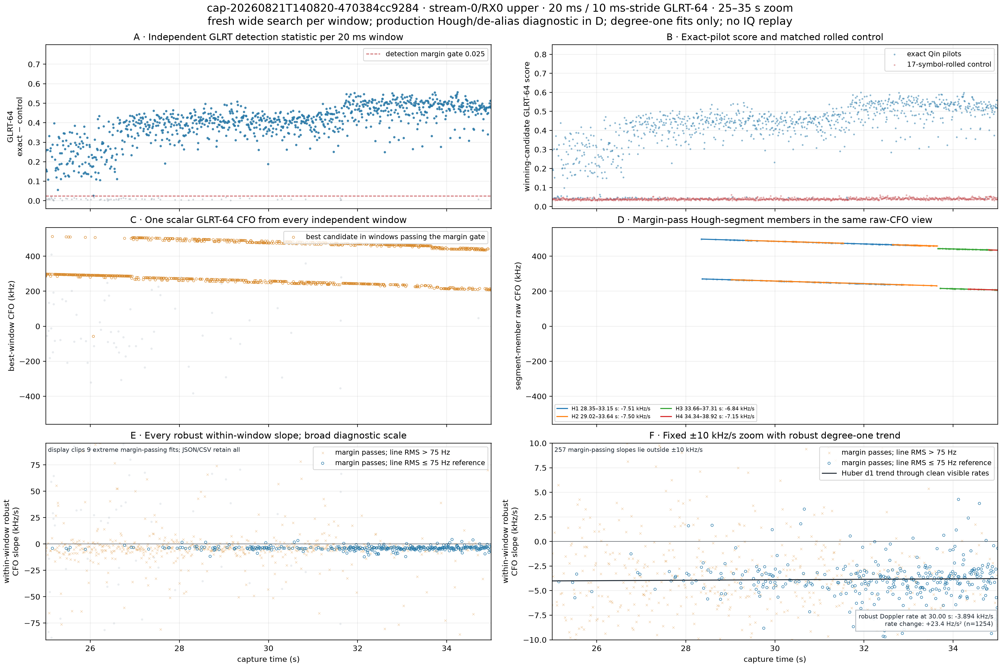
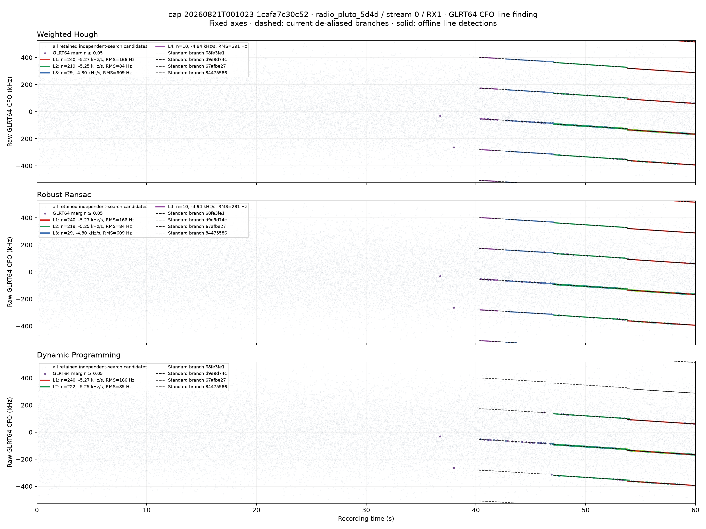
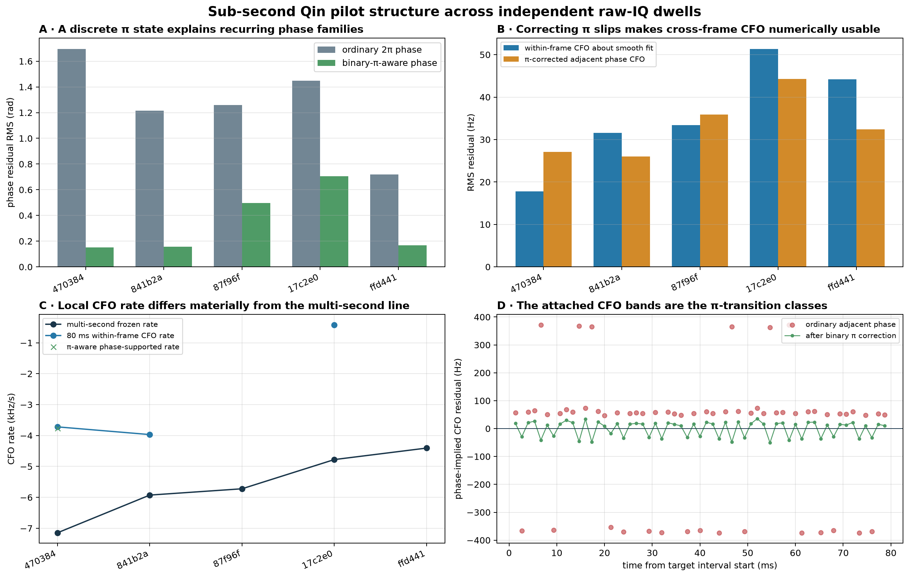
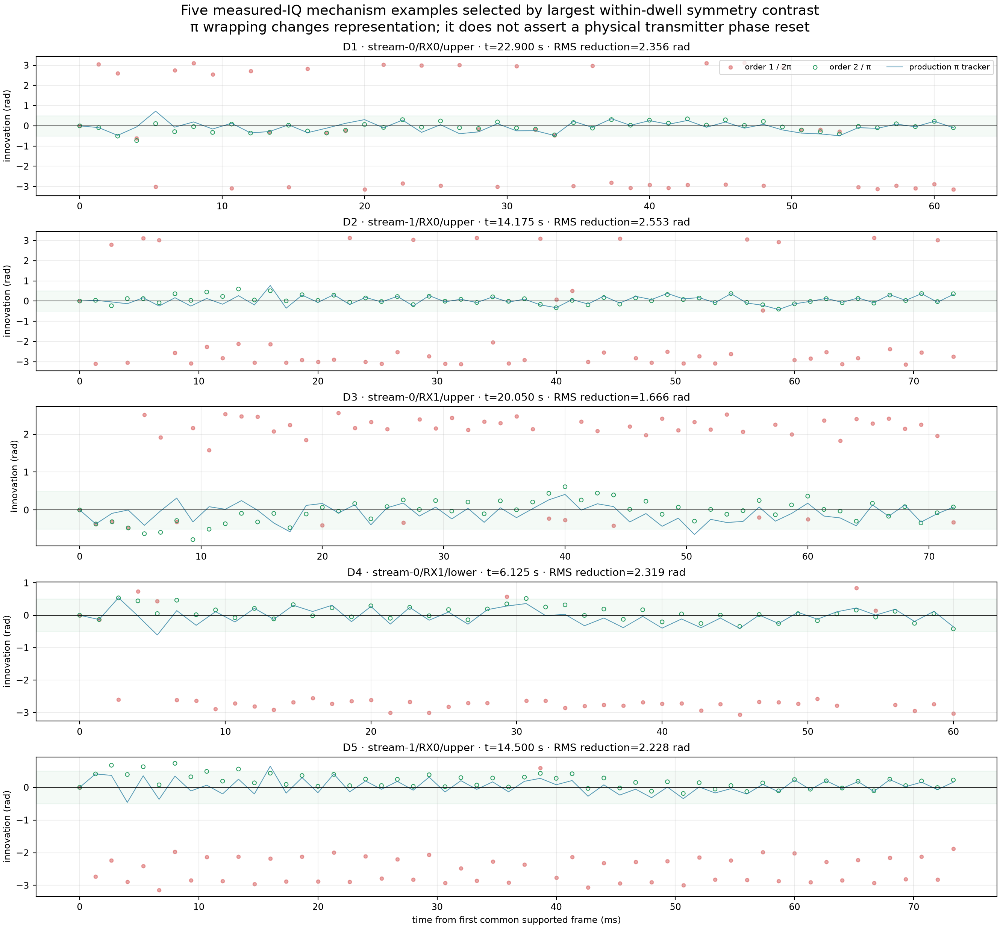
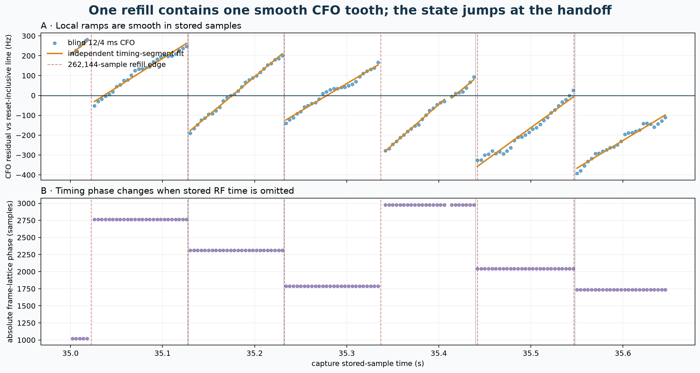
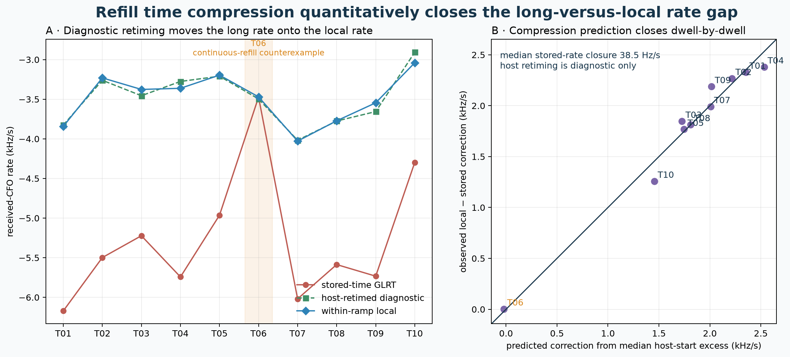
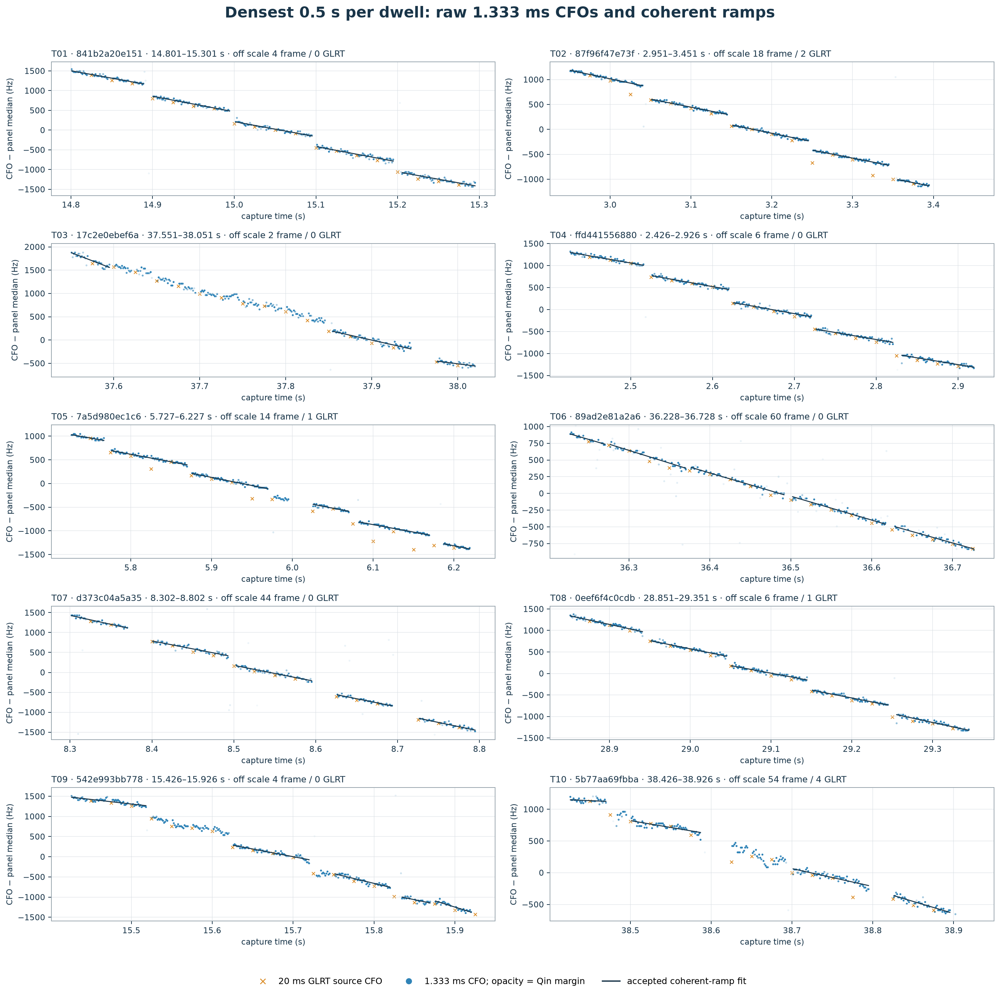
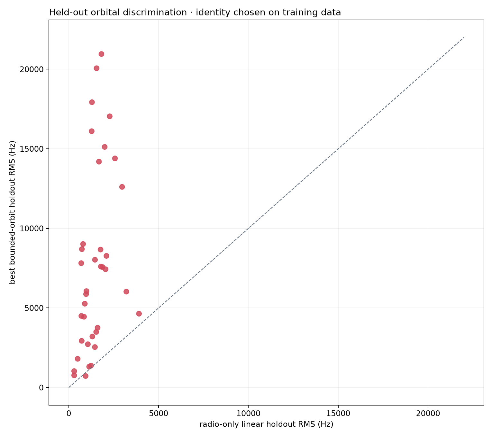

# Starlink signal discovery and carrier-tracking guide

Date: 2026-08-24 UTC

Status: human-readable synthesis of every Markdown report on `origin/main` at
`743216c207c23e23bdc7cc7b9a0729f33db2d3b5`, plus the read-only refill and
frame-CFO studies in the current research worktree. No RF was collected and no
recording, sealed product, database row, or QNAP path was changed for this guide.

## Executive summary

The receiver has found a strong, repeatable **Qin-edge-pilot-compatible radio
observable** in stored Starlink-band IQ. It can:

- independently acquire timing and carrier-frequency offset (CFO) in short raw-IQ
  probes;
- group the ambiguous CFO candidates into multi-second, mostly linear radio
  tracks;
- return to the source timing/CFO basin and estimate one CFO from each actual
  approximately 1.333 ms frame;
- recognize useful carrier phase modulo pi inside selected 50 or 75 ms analysis
  windows; and
- estimate a local receiver-relative CFO rate that predicts held-out pilot symbols
  to tens of hertz in qualified windows.

Three boundaries are just as important:

1. **A Qin-compatible detection is not a satellite identity.** The edge-pilot
   sequence is reported to repeat across frames, beams, channels, and satellites.
   In the strongest held-out orbital audit, 0 of 37 eligible tracks was securely
   associated with a cataloged Starlink satellite.
2. **Carrier phase is not globally continuous.** Phase is measurable within a
   frame and sometimes predictive across neighboring frames, but the useful
   observable in this corpus is modulo pi and must be reinitialized at unverified
   acquisition discontinuities. The plotted pi-branch changes are representation
   choices, not physical phase-reset counts.
3. **The evidence strongly supports a recorder origin for the approximately
   105 ms CFO sawtooth.** It is locked to the Pluto application's
   262,144-sample refill period at 2.5 MS/s: 104.8576 ms. The timing, CFO, and
   host-delay evidence is consistent with RF time being unrepresented between
   stored refills while sample indexes remain contiguous. Under that mechanism,
   smooth physical-time CFO appears as a downward step at each refill. This
   finding supersedes the older interpretation that the repeated steps primarily
   reveal a Starlink scheduler, beam handoff, or transmitter oscillator command.

The practical rate estimate is therefore not the slope of one line through all
stored-time steps. It is a **within-continuity-interval received-CFO rate**, fit
with a free CFO intercept for each accepted ramp and validated on unused pilot
symbols. In ten historical dwells, the median long GLRT rate was -5.542 kHz/s and
the median local rate was -3.423 kHz/s. The local model reduced pooled held-out
odd-Qin CFO RMS from 60.2 to 34.0 Hz. One natural control dwell had no meaningful
refill delay and changed by only 0.003 kHz/s.

That local rate is still not pure satellite Doppler. Satellite motion, transmitter
frequency behavior, LNB and receiver references, sample-clock error, and residual
association error remain mixed. The correct next milestone is acquisition
continuity plus calibrated, dual-receiver, held-out TLE agreement—not premature
conversion of a receiver-relative slope into satellite range dynamics.

## Report map

This guide is organized by the questions a human reader is most likely to ask.

| Question | Read here | Detailed evidence |
|---|---|---|
| What exactly is being received? | [Signal structure](#1-what-signal-are-we-measuring) | [IF/DC review](2026_08_21_edge_pilot_if_dc_centering.md), [Qin frame-CFO study](2026_08_22_edge_pilot_phase_slope.md) |
| How does raw IQ become a track? | [Discovery pipeline](#2-from-raw-iq-to-a-radio-track) | [GLRT parameter study](2026_08_22_t1_glrt_search_parameter_study.md), [residual-Hough design](2026_08_22_residual_hough_segmentation.md), [alias/replay accounting](2026_08_22_4e2a0c111a30_alias_aware_trajectory_accounting.md) |
| Are we analyzing every 1.333 ms frame? | [Frame-level CFO](#3-one-independent-cfo-per-1333-ms-frame) | [sub-second lattice report](2026_08_22_subsecond_pilot_structure.md), [qualified frame-CFO estimator](2026_08_24_frame_cfo_estimator_study.md), [full-capture 20 ms diagnostic](2026_08_23_140820_glrt20ms_robust_slope.md) |
| What do the phase bunches mean? | [Phase and modulo pi](#4-phase-what-is-coherent-and-what-is-not) | [five-dwell modulo-pi audit](2026_08_23_five_dwell_modulo_pi_qualification.md), [Kalman comparison](2026_08_22_kalman_phase_tracking_comparison.md) |
| Why does CFO make repeated ramps? | [Sawtooth root cause](#5-the-approximately-105-ms-sawtooth) | [refill-time-compression audit](2026_08_24_refill_time_compression_sawtooth.md) |
| Which Doppler rate should be trusted? | [Rate estimator](#6-a-defensible-local-doppler-rate-estimator) | [ten-dwell raw estimator](2026_08_24_ten_dwell_raw_doppler_pipeline.md), [piecewise product](2026_08_23_piecewise_pilot_doppler_rate.md) |
| How do dwell and scanner differ? | [Standard versus scanner](#8-standard-dwell-versus-scanner) | [scanner design and validation](2026_08_23_scanner_standard_analysis.md) |
| Can this tell range or orbit? | [Physical interpretation](#9-from-cfo-to-range-and-orbit-what-is-still-missing) | [fresh 13-dwell association](2026_08_23_thirteen_dwell_starlink_association_fresh.md), [receiver/LNB reference](2026_08_22_dual_lnb_drift_reference.md) |
| What should operators look at? | [Operational guide](#10-how-to-read-the-products-and-pngs) | [eight-hour science audit](2026_08_23_eight_hour_dwell_scanner_science_agent.md), [six-hour monitor](2026_08_23_six_hour_live_dwell_scanner_monitor.md) |
| What experiment would settle the remaining ambiguity? | [Experiments](#11-experiments-and-promotion-checkpoints) | refill report plus the acquisition-continuity tests below |

### The evidence ladder

The terms below are deliberately not interchangeable.

| Level | What has been demonstrated | What has not yet been demonstrated |
|---|---|---|
| Raw energy | A feature is visible in the sampled band | Starlink waveform compatibility |
| Qin-compatible candidate | Exact known edge pilot beats a rolled-sequence control in one independently searched probe | A continuous track or unique emitter |
| Radio track | Multiple independently acquired candidates form a robust time/CFO trajectory, with alias and replay provenance | Named satellite, absolute frequency, or pure Doppler |
| Qualified frame CFO | One 1.333 ms frame supports a source-bound profile-likelihood CFO and its controls | Phase continuity to another frame |
| Qualified local segment | Frame CFO predicts held-out support; modulo-pi phase, coverage, and direct/Kalman agreement gates pass | Continuity across a refill, retune, or independently initialized segment |
| Receiver-common-mode event | Independently qualified receiver paths agree on the same associated emitter | Satellite identity unless an orbit model predicts held-out data |
| Associated satellite observable | Predeclared TLE/clock model wins held-out tests and null controls | Navigation solution unless geometry, timing, and uncertainty are sufficient |

## Motivation

Starlink is attractive for opportunistic positioning, navigation, and timing
(PNT) because LEO signals are strong, geometrically dynamic, and widely present.
But this downlink was designed for broadband communication, not as an open GNSS
signal. A useful receiver must discover signal structure, survive timing/CFO
ambiguities, distinguish receiver effects from transmitter effects, and attach
honest uncertainty before it can infer motion.

The repository's work has progressed through exactly those layers. Early results
showed coherent CFO lines but exposed aliasing, candidate truncation, replay, and
presentation failure modes. Frame-level work then found useful Qin-pilot CFO and
modulo-pi phase over short spans. A large operational audit showed that these
short estimates were predictive but systematically disagreed with the long frozen
model. Finally, a blind timing/CFO analysis tied the disagreement to recorder
refill timing. The guide therefore presents the current causal model, not the
chronology of every intermediate hypothesis.

## 1. What signal are we measuring?

### 1.1 Waveform facts inherited from the literature

The Starlink Ku-band user downlink is an OFDM waveform organized into frames at
750 frames/s, so one nominal frame lasts

\[
T_f = 1/750 \approx 1.333333\ \mathrm{ms}.
\]

The OFDM symbol duration used by this receiver is 4.4 microseconds. That duration
creates a CFO ambiguity spacing

\[
\Delta f_{alias}=1/T_{symbol}=227{,}272.727\ \mathrm{Hz}.
\]

Qin, Psiaki, Bowman, and Humphreys disclose bands of eight known 4QAM pilot
subcarriers at each edge of a Starlink channel. The receiver uses 300 known pilot
symbols on eight tones in each complete frame: 2,400 complex observations before
quality rejection. The exact sequence is processed against a matched negative
control made by rolling the sequence by 17 symbols.

Qin's edge pilots are **not** the same observable as either of these:

- the nine unmodulated, data-less center pilot tones discussed in earlier Starlink
  PNT work; or
- the blindly reconstructed full-channel OFDM beacon in Kozhaya, Saroufim, and
  Kassas.

This distinction matters. Results about the continuity or correction behavior of
one observable cannot simply be transferred to another.

### 1.2 What the present receiver captures

The live low-band configuration targets the lower or upper Qin edge-pilot band of
Starlink channels 1 through 4. A 9.75 GHz LNB translates the selected Ku-band RF
center to an L-band intermediate frequency; the Pluto then mixes the **mean of the
eight pilot tones** to complex digital baseband zero.

For pilot RF center \(f_p\), LNB LO \(f_L\), and Pluto LO \(f_R\):

```text
LNB output IF       = f_p - f_L
digital pilot center = f_p - f_L - f_R.
```

No known pilot tone lies at DC. After centering, the tones are at -820.3125,
-585.9375, -351.5625, -117.1875, +117.1875, +351.5625, +585.9375, and
+820.3125 kHz. At 2.5 MS/s the sampled half-band is 1.25 MHz. After the 937.5 kHz
pilot occupied half-width and a 300 kHz Doppler allowance, only 12.5 kHz nominal
margin remains. This makes per-path centering authority and fail-closed edge
checks scientifically important.

Observed baseband CFO is a mixture:

\[
f_{meas}=f_{geometry}+b_{tx}+b_{LNB}+b_{receiver}+b_{timebase}+b_{estimator}.
\]

The pipeline measures \(f_{meas}\). It does not observe these terms separately.

### 1.3 The frame-local measurement model


After exact pilot wipeoff, frame \(m\), pilot symbol \(i\), and tone \(k\) are
modeled as

\[
z_{m,i,k}\approx h_{m,k}
\exp\{j2\pi\Delta f_m(t_i-t_{ref})\}+n_{m,i,k}.
\]

Every frame has eight independent complex nuisance gains \(h_{m,k}\). This absorbs
the channel phase and amplitude of each tone. The scientifically useful quantity
is the common **phase slope within the frame**, \(\Delta f_m\). No phase from the
previous frame is needed to estimate it.

## 2. From raw IQ to a radio track

### 2.1 Waterfall: context, not a detector verdict

A waterfall answers where energy lies in time and frequency. It is excellent for
seeing a pass, interferer, retune, clipping, or missing interval. It does not prove
that the energy carries the Qin pilot, resolve the 227.273 kHz CFO ambiguity, or
identify an emitter.

### 2.2 Independent short-probe acquisition

The persisted Standard pilot scan cuts independently searched 20 ms probes from a
60 s receiver path. Historically there are 2,400 scheduled probes per path, about
one every 25 ms. The full-capture diagnostic uses a denser 10 ms stride; scanner
frames also use a 10 ms stride. Overlap increases visualization and support but
does not create independent trials.

Within each probe, acquisition:

1. searches the full timing phase and a broad residual-CFO range, normally
   -400 to +400 kHz;
2. retains multiple separated local timing/CFO basins instead of only the largest
   score;
3. refines each basin in timing and CFO;
4. computes GLRT64 tracking CFO and exact-pilot evidence;
5. scores the same samples with the rolled-pilot control; and
6. emits a candidate inventory, not a trajectory or satellite label.

The number of retained basins matters more than a modestly finer frequency grid
near difficult crossings. In one T1 audit, retaining 32 rather than eight basins
recovered all 16 critical probes, while the ordinary eight-basin inventory missed
part of the line. This is why a visually missing track may be a candidate-budget
or later publication problem rather than a missing RF signal.

### 2.3 What the familiar 20 ms “teeth” mean



Each tooth contains real raw-IQ measurements, normally 14–15 actual 750 Hz
frames. Its approximately 20 ms horizontal extent is nevertheless imposed by the
probe. The next probe performs a fresh acquisition and may choose a different
timing/CFO basin. A tooth boundary is therefore not a detected Starlink slot or a
physical frequency-hop time.

This distinction survives the later refill result:

- the 20 ms tooth boundary is analysis geometry;
- the approximately 104.86 ms sawtooth boundary is acquisition-refill geometry;
- smooth frame CFO inside supported intervals is a real receiver measurement.

### 2.4 CFO aliases

Because the known OFDM pattern repeats at the symbol cadence, candidates can
appear separated by integer multiples of 227,272.727 Hz. Four historical sessions
showed this repeatedly: 1,003 of 10,213 trajectory-aligned high-gate observations
required a nonzero symbol-rate lift.

Two separate values must remain in the contracts:

- **canonical CFO** groups alias-equivalent observations so one carrier is not
  counted several times; and
- **correction CFO** is the absolute lift selected by same-IQ replay and used to
  dechirp raw samples.

A modulo representative is not an absolute physical CFO. Conversely, two ridges
that merely look one symbol rate apart are not aliases unless their residual
separation passes the declared gate and same-IQ evidence supports one common
family.

### 2.5 Line discovery, segmentation, and replay



The current trajectory path converts candidate CFOs into weighted points, uses an
alias-aware Hough transform to find long linear parents, and then runs a second
Hough transform on each parent's circular residuals. A split-penalized robust
partition selects piecewise degree-one trajectories. It does not consult a TLE or
declare what a physically plausible orbit should be.

The production lineage is:

```text
pilot scan V3
  -> residual-Hough trajectory bank V3
  -> trajectory feedback/table V3
  -> CFO alias map V2
  -> de-aliased bank V3
  -> source-conditioned same-IQ replay V4
  -> final bank/table V3
```

Replay must follow the candidate basin belonging to the trajectory, not the
probe's global rank-zero winner. It applies the predicted correction to the same
IQ, transports the source timing/acquisition state, and asks whether the exact
pilot remains supported. Geometry-only tracks remain useful for display but are
not automatically correction-eligible.

The dense end-to-end prototype confirms that a stable Hough identity can be
carried through alias transport, replay, endpoint selection, final refitting,
frame extraction, the Kalman layer, and 75 ms segment qualification. It also
shows why lineage is not a quality verdict: six replay-qualified tracks produced
only eight fully qualified 75 ms windows, on two tracks.

## 3. One independent CFO per 1.333 ms frame

### 3.1 Complete lattice versus retained timing locks

“Dense” must be stated precisely. An early dense view processed all 15 frames
inside each accepted 20 ms timing lock, but did not include frame epochs between
locks. The A-like sub-second analysis starts from a supported epoch, propagates
the exact 750 Hz sample lattice, and reads **every complete frame directly from
raw IQ** inside a demonstrably continuous span.

In the worked 80 ms interval at 34.73–34.81 s, the complete lattice contains 60
frames. Eleven were absent from the retained-lock view but present in raw IQ; all
60 passed the exact-pilot quality test.



### 3.2 Profile-likelihood CFO

For trial residual frequency \(f\), profiling out the eight complex channel gains
gives

\[
\Lambda_m(f)=\sum_k\left|\sum_i z_{m,i,k}
e^{-j2\pi f(t_i-t_{ref})}\right|^2.
\]

The estimator maximizes \(\Lambda_m\) only in a bounded residual neighborhood of
the source acquisition CFO. It must not decide the 227.273 kHz alias or silently
select a different timing lattice; those remain acquisition/replay
responsibilities.

The current research recommendation is a continuously refined ordinary
eight-gain profile maximum, accompanied by explicit qualification diagnostics:

- exact Qin coherence and exact-minus-rolled-control margin;
- even-symbol and odd-symbol CFO disagreement;
- search-boundary status;
- sensitivity to shifting the frame epoch by one raw sample;
- first-half versus second-half disagreement, to catch a change inside a frame;
- maximum leave-one-tone-out CFO shift, to catch a coherent narrowband
  contaminant; and
- conditional curvature/phase uncertainty.

On 238 qualified frames from `470384`, independent even/odd ordinary-profile CFOs
had 31.3 Hz RMS disagreement, 60.8 Hz p95 disagreement, and no value over 100 Hz.
The predicted split uncertainty was 32.0 Hz and nominal 95% coverage was 95.0%.
Two additional source-bound cohorts gave 42.2 Hz and 29.4 Hz RMS. A robust profile
helped injected outliers, but did not consistently improve held-out real-frame
likelihood; it should remain a challenger rather than replace the Gaussian-profile
maximum unconditionally.

A one-tone spur is the important adversarial case. In simulation, ordinary CFO
was wrong by more than 100 Hz in 36/40 trials; a 75 Hz maximum
leave-one-tone-out-shift gate caught all 36 while rejecting none of the 387
qualified frames across the three real cohorts. This first threshold is promising,
not universally calibrated.

The complete implemented public frame kernel currently costs 9.04 ms median and
9.90 ms p95 per frame on the benchmark host. A naive serial projection is about
0.51 s for 56 frames in one 75 ms window and 316 s for 35,000 frames. The kernel
and its tests are implemented, but this full diagnostic suite is **not yet batched
or integrated into the Standard segment stage**. Those figures are feasibility
estimates, not measured Standard end-to-end overhead. See the
[qualified frame-CFO estimator study](2026_08_24_frame_cfo_estimator_study.md).

### 3.3 Why per-frame CFO helps

Independent frame CFO separates three effects that a long line can mix:

- smooth frequency evolution inside recorded RF support;
- a free phase/sign/channel state in each frame; and
- a CFO or timing discontinuity between support intervals.

It also permits genuine held-out tests. Even Qin symbols can choose the CFO while
odd symbols independently score it. Interleaved frames can fit a local line and
predict the omitted frames. A model that merely follows acquisition noise will
not survive both tests.

Per-frame CFO does **not** reconstruct omitted RF time. Accurate frequency values
on both sides of an unobserved interval still cannot say how much physical time
elapsed between them.

## 4. Phase: what is coherent and what is not?

### 4.1 Three different phase claims

| Claim | Current evidence |
|---|---|
| Known symbols share a common phase/channel state inside one frame | Strongly supported in qualified frames |
| Phase increment predicts neighboring frames inside one continuous short span | Supported intermittently |
| One unambiguous carrier phase can be integrated across an entire dwell, refill, or scanner retune | Not supported |

Ordinary 2-pi tracking over a four-second dense pass accepted only 471 phase
updates, declared 570 resets, and had a longest uninterrupted accepted observed
run of 14 frames spanning 22.7 ms. This was not simply a poorly tuned Kalman
filter: the observation contains a binary sign ambiguity.

### 4.2 Why phase appears in bunches

The measured, pilot-wiped channel vector is well described locally by

\[
\mathbf z_m \approx a_m\mathbf h_m
\exp\{j[\phi(t_m)+\pi b_m]\}+\boldsymbol\epsilon_m,
\qquad b_m\in\{0,1\}.
\]

The receiver cannot safely distinguish \(\phi\) from \(\phi+\pi\) in this
observable. Plotting ordinary wrapped phase therefore produces two families, or
“bunches,” separated by pi. A transition in the displayed branch bit changes
which representative of the same modulo-pi phase is used. It does **not** by
itself mean that the satellite reset its oscillator or changed carrier frequency.

A pi change between adjacent 750 Hz frames would look like a 375 Hz adjacent-phase
CFO offset:

\[
\pi/[2\pi(1/750\ \mathrm{s})]=375\ \mathrm{Hz}.
\]

Removing the inferred binary state reduced banded adjacent-phase CFO error to
27.1 Hz RMS in the worked interval.

### 4.3 Modulo-pi qualification



The causal tracker wraps phase innovation into `[-pi/2, +pi/2)` and records the
selected ambiguity branch. A 75 ms window is not accepted on phase alone. It
also needs sufficient frame coverage, bounded gaps, positive exact/control
evidence, a low-RMS local frequency line, interleaved held-out prediction, and
agreement between direct and segment-Kalman rates.

Across five freshly rerun dwells, 2,691 candidate 75 ms windows contained 419
inner modulo-pi locks and 216 fully qualified segments. Every dwell had nonzero
yield. In an explicit order-1/order-2 ablation, the modulo-pi model lowered
innovation RMS in all 216 selected qualified windows. This is operationally
useful but not an unbiased proof that a physical transmitter emits a binary sign
state: the shorter quotient naturally reduces wrapping error and the population
was selected with the modulo-pi gate.

In the eight-hour production audit, a qualified 75 ms segment had a median of 26
ambiguity-bit changes. Those are **not 26 physical switches in 75 ms**. The phase
lock is described by compact wrapped innovations and accepted updates, not by a
small branch-transition count.

### 4.4 The five-state tracker

The segment tracker mirrors the state topology motivated by PNT receivers:

\[
\mathbf x=[\theta,\dot\theta,\ddot\theta,\tau,\dot\tau]^T,
\quad f=\dot\theta/(2\pi),\quad \dot f=\ddot\theta/(2\pi).
\]

It propagates carrier phase, CFO, CFO rate, fractional receiver frame timing, and
timing rate. The timing observable here is fractional frame phase inferred from
the eight edge tones. It is not Kassas's full-beacon code phase and is not a
pseudorange.

The short, independently initialized segment tracker is useful when its direct
line, held-out prediction, and phase gates agree. The old long frame-level Kalman
product is not. In an eight-hour audit, 65.65% of 7.55 million Standard frames
were marked as slips, every slipped update was nevertheless applied, 53.82% of
rate states exceeded 15 kHz/s, the maximum state reached 9.25 GHz/s, and the
median reported rate sigma remained only 0.162 Hz/s. Those states are
inconsistent and must not be averaged or converted to motion.

## 5. The approximately 105 ms sawtooth

### 5.1 What was observed

At frame resolution, many receiver tracks contain smooth downward CFO ramps
separated by downward steps. Blind raw-IQ timing/CFO search recovered the same
structure without using the persisted 20 ms grid, trajectory, TLE, or previous
timing locks. This proved that the values were not manufactured by a 20 ms plot.
The early reports then considered a scheduled transmitter/timing-state
replacement.

That causal interpretation is now superseded.

### 5.2 Exact alignment with the acquisition refill

All ten audited dwell manifests use 262,144-sample refills at 2.5 MS/s:

\[
T_b=262{,}144/2{,}500{,}000=104.8576\ \mathrm{ms}.
\]

The independently measured receiver-1 event cadence was 104.8706 ms, only
0.0130 ms longer. In the blind `470384` interval, all 24 directly bracketed
timing/CFO events lie within 2.707 ms of a refill edge; median absolute offset is
0.858 ms.

A separately defined 37-event cohort starts from timing-segment boundaries and
re-estimates CFO independently in 1.333 ms frames without a CFO-jump amplitude
gate. Host-start excess versus direct-frame CFO jump has correlation -0.9873,
R-squared 0.9748, and 25.7 Hz regression RMS. This is the cleaner amplitude test;
it overlaps the same four-second IQ and must not be pooled with the 24-event
alignment cohort as 61 independent events.



Across ten independently selected raw-dwell tracks:

- 391 adjacent ramp cuts have absolute CFO jump above 100 Hz;
- 383/391 (97.95%) contain a refill edge;
- only 3/391 (0.77%) preserve the frame timing lattice within two samples;
- 52 cuts have jump below 30 Hz;
- only 9/52 (17.31%) contain a refill edge; and
- 50/52 (96.15%) preserve timing within two samples.

Inside accepted ramps, 1,138/1,145 consecutive probe pairs preserve timing within
two samples. The frequency partition did not inspect timing, so this is an
independent structural check.

### 5.3 Stored-time compression mechanism

The recorder loop obtains one block, then synchronously compresses/writes it
before requesting the next. The Pluto adapter records host request brackets but
no device sample counter, overflow flag, or sequence number; continuity is
declared unknown.

Suppose one stored refill represents \(T_b\), but the next host read begins after
\(T_b+\delta\). If \(\delta\) contains RF time absent from the concatenated
samples, a smooth received-CFO rate \(\dot f\) appears as

\[
\Delta f_{jump}\approx \dot f\,\delta,
\qquad
\dot f_{stored}\approx \dot f(1+\delta/T_b).
\]

The frame lattice simultaneously shifts by

\[
\Delta n_{frame}=-\delta F_s \pmod{F_s/750}.
\]

The sign is diagnostic: for 326 one-refill large events, the omitted-time sign
predicts timing with 34.2-sample median circular error; the opposite sign gives
860.1 samples.

### 5.4 Rate closure and the natural control



Nine of ten tracks have long stored-time rates 1.258–2.380 kHz/s more negative
than their free-intercept within-ramp rates. The accumulated fitted step rate
correlates 0.964 with the long-minus-local discrepancy and closes it to 15.4 Hz/s
median absolute error. A host-stretch calculation closes the same discrepancy to
38.5 Hz/s median, but remains diagnostic because host brackets are not RF
timestamps.

T06 is the falsification control. Its selected stream refilled essentially at
real time, its median artificial cut jump was -0.6 Hz, its timing stayed stable,
and its long/local rates differed by only 3.1 Hz/s. A frequency-only partition
therefore does not manufacture a correction whenever it creates a cut.

Odd Qin symbols, excluded from the frame-CFO maximization, reproduce the large
boundary jumps with 0.9858 correlation and 15.5 Hz median absolute disagreement.
The mechanism is not a training-only fit.

### 5.5 What is superseded and what remains valid

The following old interpretation is superseded: “the approximately 100–105 ms
steps primarily reveal a Starlink scheduling state, beam transition, or onboard
CFO correction.” Exact agreement with local buffer geometry, event-size scaling
with host excess, simultaneous timing displacement, and T06 strongly disfavor it.

The following measurements remain valid:

- blind Qin-supported modes exist on both sides of a boundary;
- per-frame CFO ramps are real receiver observations;
- timing and CFO states change together in stored coordinates;
- a line through all steps differs from the smooth local rate; and
- free-intercept ramp models predict held-out symbols better.

Older reports that use words such as “emitter state,” “timing-source
replacement,” or “scheduler clock” should now be read as descriptions of the
observed segmentation, not as causal conclusions.

The new conclusion is strong causal evidence, not an exact lost-sample count.
Without a device sample counter, the amount of omitted RF time remains inferred.
Host timestamps must not be substituted as a production RF timebase.

## 6. A defensible local Doppler-rate estimator

### 6.1 Two-scale design

The robust design retains the strengths of long acquisition while preventing
stored-time steps from contaminating the local rate:

1. **Detect and rank without using the desired answer.** Run independent 20 ms
   GLRT acquisition, alias-aware trajectories, and source-conditioned replay.
   Rank a source branch only by its GLRT support, span, margin, and residual—not
   by the later local rate.
2. **Return through immutable source identities.** Use each raw candidate's timing
   epoch and absolute CFO lift. Never reacquire around a canonical alias value.
3. **Estimate each complete 1.333 ms frame independently.** Use a bounded
   eight-gain profile maximum, exact/rolled control, and frame diagnostics.
4. **Split at unverified continuity boundaries.** At minimum, every acquisition
   refill, scanner retune, timing-lattice jump, large gap, or failed frame test is
   a hard boundary.
5. **Recover short frequency/timing-consistent ramps.** Current research support
   spans approximately 20–125 ms, but those bounds are analysis policy, not a
   Starlink slot duration.
6. **Fit one common robust slope with a free intercept per ramp.** The intercepts
   absorb unobservable offsets; the common slope estimates evolution inside
   observed RF time.
7. **Validate on data excluded from the fit.** Score odd Qin symbols, interleaved
   frames, gate sweeps, and whole-ramp bootstrap resamples.
8. **Fail closed.** Publish no rate when support, stability, held-out prediction,
   or direct/Kalman agreement fails.

### 6.2 Why free ramp intercepts are necessary

For ramp \(r\), frame \(m\):

\[
f_{r,m}=a_r+\dot f(t_{r,m}-t_0)+\epsilon_{r,m}.
\]

Each \(a_r\) is independent. The shared \(\dot f\) is estimated only from
within-ramp evolution. A single intercept across all ramps would force omitted
time into the slope. Giving every frame its own intercept would destroy all rate
information. Ramp-level intercepts are the smallest model that represents the
observed continuity.

The best eventual implementation should maximize the sum of frame profile
likelihoods under this model instead of treating each point maximum as equally
precise. Until then, robust weighted regression plus held-out fold tests is a
truthful prototype.

### 6.3 Ten-dwell evidence



The ten-dwell study scored 35,550 raw frames, retained 29,246 Qin-qualified
frames, and fit 471 ramps containing 21,079 frames. All ten returned a validated
overall GLRT rate and local rate on the first branch selected by GLRT evidence
alone.

| Statistic | Long stored-time GLRT | Free-intercept local |
|---|---:|---:|
| Median rate | -5.542 kHz/s | -3.423 kHz/s |
| Pooled odd-Qin validation RMS | 60.2 Hz | 34.0 Hz |
| Dwell corrections over 0.5 kHz/s | — | 9/10 |
| No-bias control T06 correction | — | +0.003 kHz/s |

Uncertainty resamples whole ramps rather than pretending thousands of correlated
frames are independent. Sparse T03, T09, and T10 have materially wider intervals
and must carry them downstream.

### 6.4 Kalman use after the refill diagnosis

A Kalman filter is useful only if its state transition spans actual observed time.
The safe policy is:

- initialize a new short filter inside each qualified continuity interval;
- use modulo-pi phase and frame-local CFO with their gates;
- preserve the physical CFO-rate state while allowing a separate piecewise CFO
  bias/intercept;
- coast over a short missing frame only when the sample-time continuity grade
  permits it;
- never update across an unverified refill or retune; and
- compare its final rate to an independently fit direct line and held-out frames.

Do not tune process noise until the filter visually follows the sawtooth. That
would make a software timebase defect look like physical carrier dynamics.

## 7. What should be persisted next?

Published major-version contracts must remain immutable. The existing
`standard.pilot-doppler-segments.v1` and scanner V1 products should therefore be
retained, with an additive replacement product carrying explicit continuity
authority.

### 7.1 Current versus prototype status

| Component | Status on the reviewed pipeline | How it should be used now |
|---|---|---|
| Independent 20 ms pilot scan; residual-Hough; alias map; source-conditioned replay | Current Standard trajectory path | Detection, candidate lineage, and source/alias authority |
| `standard.pilot-doppler-segments.v1` | Current immutable Standard product | Short-window evidence, but not exact refill compensation; window and frozen time both use stored sample/Fs |
| `scanner.pilot-doppler-segments.v1` | Current immutable scanner product | Retune-bounded local evidence; never join phase across targets |
| Existing Standard per-frame/short-segment kernel | Current inside V1 segment analysis | Use only when all V1 coverage, phase, line, holdout, and direct/Kalman gates pass |
| New qualified public frame-CFO kernel and diagnostic gates | Implemented and component-tested Research/API code; not wired or batched into Standard | Offline qualification and integration benchmark; no new persisted claim yet |
| Ten-dwell free-intercept common-ramp estimator | Read-only Research prototype | Best present historical rate study; not a deployed Standard product |
| Refill-aware continuity grade, splitting, and free-intercept V2 | Proposed additive product | Implement without mutating V1; validate against hardware counters and T06 |
| Host-retimed rate | Diagnostic only | Never persist or promote as RF time |
| Long frame-level Kalman rate | Current historical product but scientifically quarantined | Health/discrepancy diagnostics only; never motion inference |

The current V1 gates already reject many refill-crossing windows, but they do not
know why. In the frozen eight-hour population, 1,887/44,101 (4.28%) windows that
geometrically cross a 104.8576 ms refill edge qualified, versus 3,007/22,193
(13.55%) non-crossing windows—a 3.17-fold yield ratio. The direction holds in
all four paths. This corroborates the mechanism, but edge crossing is not itself
a loss detector: T06 has continuous refills, and 38.56% of all qualified windows
still cross a nominal edge.

### 7.2 Additive contract content

A scientifically useful segment record should include:

| Field group | Required content |
|---|---|
| Source binding | recording/scope digest, raw candidate ID, timing epoch, absolute alias lift, edge, receiver |
| Frame measurement | CFO, uncertainty, exact/control coherence, fold disagreement, timing sensitivity, half-frame and tone-deletion diagnostics |
| Time authority | stored sample coordinates, refill ID, device counter/overflow when available, continuity grade |
| Ramp model | ramp ID, free intercept, shared rate, robust weights, line RMS, duration, gaps |
| Validation | odd-Qin RMS, interleaved held-out RMS, gate sweep, whole-ramp bootstrap interval |
| Phase state | modulo order, innovation, branch representative, update/reset reason; never label branch changes as transmitter resets |
| Cross-check | direct versus short-Kalman rate, long/frozen discrepancy as diagnostic only |
| Interpretation | `receiver_relative=true`, `satellite_associated=false`, `range_dynamics_claimed=false` unless later gates prove otherwise |

The new public frame-CFO analysis API follows this narrow boundary: a compact
guarded frame slice plus an **absolute recording-coordinate** frame start and
source acquisition CFO in; a qualified frame CFO and diagnostics out. It does
not select an alias, change timing lattice, access storage, or join phase between
frames.

## 8. Standard dwell versus scanner

Both lanes use immutable raw IQ, Qin/control evidence, bounded numerical products,
and explicit failure states. Their time geometries are fundamentally different.

| Property | Standard dwell | Scanner |
|---|---|---|
| Raw geometry | One nominal 60 s receiver path assembled from repeated 262,144-sample application refills | Eight separately tuned 80 or 120 ms target frames |
| Hard boundaries | Every unverified refill, gap, timing change, or path end | Every retune plus any internal continuity failure |
| Initial search | Independent 20 ms probes over the dwell | Independent 20 ms probes on 10 ms stride inside one target frame |
| Confirmation | Multi-probe trajectories and same-IQ replay | Two non-overlapping, CFO-consistent GLRT probes from the same receiver |
| Long trajectory | Available as a detector/association reference, but its rate is refill-biased in affected captures | Not available and correctly stored as null |
| Local window | Normally 75 ms | 50 ms in historical 80 ms captures; 75 ms when a 120 ms frame leaves guard room |
| Phase/CFO state | May be tracked only inside verified continuity intervals | Must stop at the retune boundary |
| Rate interpretation | Within-refill/ramp receiver-relative rate | Retune-bounded receiver-relative rate |
| Main artifact risk | Silent stored-time compression between application refills | Cross-retune joining; pre-bootstrap rate states |
| Satellite/range claim | Forbidden without common-mode and TLE promotion gates | Forbidden; one short retuned frame cannot supply orbit continuity |


The scanner's absence of a multi-second frozen model is a feature, not a gap to be
filled by concatenating retuned frames. A higher-level time-series association may
compare immutable local segments across scans, but each retune remains a
discontinuity.

Five stored scanner validations produced three fully qualified segments from 32
confirmed positive segments and none from two negative controls. The two qualified
rates in the worked scan were -3.582 and -3.819 kHz/s, with held-out errors 26.7
and 28.9 Hz. The new layer added a median 0.510 s per eight-edge scan in isolated
timing, versus approximately 7 s for the complete scanner analysis. Those values
describe the existing short segment implementation, not the more expensive full
frame-CFO diagnostic suite proposed above.

The refill study also provides a useful natural contrast: an existing one-call
1.5 s scanner capture did not show repeated greater-than-100 Hz drops on the
104.8576 ms grid. This supports the application-refill mechanism, but it is one
target and not a hardware-counter proof.

## 9. From CFO to range and orbit: what is still missing?

### 9.1 The tempting conversion

If a carrier at frequency \(f_c\) were associated with one satellite and all
clock/control terms were known, first-order line-of-sight Doppler gives

\[
f_D\approx-(f_c/c)\dot\rho,
\qquad
\dot f_D\approx-(f_c/c)\ddot\rho.
\]

At 11 GHz, 1 kHz of Doppler corresponds to about 27.25 m/s of radial velocity,
and 1 kHz/s corresponds to about 27.25 m/s² of range acceleration. The median
1.919 kHz/s correction between the old long and local ten-dwell rates would
therefore change an apparent range-acceleration interpretation by about
52.3 m/s². This illustrates why timebase bias must be fixed first; it is not a
range result.

### 9.2 Why the conversion is premature

Differentiating the measured CFO yields

\[
\dot f_{meas}=-(f_c/c)\ddot\rho+\dot b_{tx}+\dot b_{LNB}
+\dot b_{receiver}+\dot b_{timebase}+\dot b_{estimator}.
\]

The refill result identifies a large \(\dot b_{timebase}\) in the long stored
line. Removing that term still leaves the others. The fractional frame timing
state is local receiver-lattice timing, not transmit time of arrival. No present
product supplies a calibrated pseudorange or absolute range.

### 9.3 Held-out orbital evidence is presently negative



Thirteen dwells were freshly rerun and refit with strict degree-one radio tracks.
For 37 eligible tracks, the first 60% selected a Starlink TLE identity and bounded
nuisance parameters; the last 40% was scored once. Results:

- secure associations: 0/37;
- median radio-only line holdout RMS: 1,314 Hz;
- median bounded-orbit holdout RMS: 6,059 Hz;
- bounded orbit beats the line: 1/37 tracks and 0/13 dwell aggregates;
- bounded-orbit RMS at or below 500 Hz: 0/37; and
- wrong-time scalar-rate specificity passes: 3/37.

This is a negative identity result, not a negative signal-detection result. The
Qin-compatible waveform evidence can be real while many visible satellites have
similar scalar Doppler rates and the receiver reference remains uncalibrated.

### 9.4 Receiver/LNB terms

A conducted dual-LNB reference found roughly 96 Hz residual wander over two-minute
fits and no stable two-minute linear drift at 2 sigma. A nearby 60 s window did
show -10.4 Hz/s, illustrating nonstationary oscillator wander. This is far smaller
than the old several-kHz/s long slopes and cannot explain the refill-locked steps,
but it matters once rate accuracy reaches tens or hundreds of Hz/s.

Two simultaneous signals through one path share much of the receiver/LNB term.
Their difference is therefore more informative than two absolute slopes. Two
receiver channels on the same Pluto are not fully independent for refill timing;
the decisive common-mode experiment needs physically independent radios or a
device-level shared counter.

### 9.5 Promotion gates for a physical claim

Do not label a rate as satellite range dynamics until all of these pass:

1. hardware-observable sample continuity or an explicit discontinuity map;
2. capture-bound UTC/site/receiver/LNB authority;
3. independent receiver-path qualification on the same associated emitter;
4. a calibrated common receiver/reference model;
5. stable absolute CFO alias and source identity;
6. held-out TLE Doppler **shape** improvement over a radio-only line and wrong-time
   controls;
7. uncertainty that includes whole-ramp, clock, TLE, and association terms; and
8. only then, conversion to range rate/acceleration or use in a navigation filter.

## 10. How to read the products and PNGs

### 10.1 A practical plot dictionary

| What you see | First interpretation | Do not conclude |
|---|---|---|
| Waterfall ridge | Energy exists near a time/frequency path | It is a Qin pilot or a named satellite |
| Exact score above rolled control | Qin-compatible predictable structure in that probe/frame | The largest candidate is the unique carrier |
| Two ridges about 227.273 kHz apart | Possible symbol-rate aliases | Two satellites—or one alias—without canonical and replay evidence |
| Repeated 20 ms CFO teeth | Independent probe acquisitions containing real frame samples | 20 ms transmission slots |
| Smooth 50/75 ms highlighted segment | Analyzer window whose internal gates passed | A discovered Starlink scheduling interval |
| Two phase bunches separated by pi | Modulo-pi observation ambiguity | Physical oscillator reset at every branch change |
| Approximately 104.86 ms CFO/timing resets in a refill-recorded dwell | Stored-time compression candidate | Starlink scheduler cadence |
| Local direct and short-Kalman rates agree | Internally consistent short-horizon receiver rate | Pure orbital Doppler |
| Frozen rate differs from local rate | Long stored-time model absorbed discontinuities | Local rate is wrong merely because it differs |
| Gray scanner segment | A real attempted analysis with explicit failed gates | Missing PNG or publication failure |
| No scanner segment | No same-receiver confirmation pair or insufficient room/support | No signal energy anywhere in the target frame |

### 10.2 Scientific status is not registry status

Artifact publication and scientific qualification are separate. A PNG can be
present, digest-valid, and scientifically gray. Conversely, generic registry
`complete` or `partial_coverage` does not replace the typed status inside the
pilot-segment payload. Monitoring and UI should read both.

### 10.3 Which rate belongs in summaries?

Use this order:

1. qualified direct local rate and whole-ramp uncertainty;
2. independently initialized short-Kalman final rate as an agreement check;
3. odd-symbol and interleaved-frame held-out errors;
4. long/frozen rate only as a discrepancy diagnostic; and
5. never the old long frame-Kalman rate.

### 10.4 Minimum monitoring panel

For every pipeline release and path, monitor:

- candidate and supported-frame coverage;
- fraction of windows crossing unverified refill edges;
- qualification yield and zero-yield products;
- exact/control margin;
- phase innovation RMS and update fraction;
- local-line and held-out RMS;
- direct versus short-Kalman rate difference;
- local versus long/frozen discrepancy;
- timing/CFO boundary coincidence and bias-step size;
- frame-CFO fold/timing/half-frame/tone-deletion diagnostics;
- receiver/path and scan-position stratification; and
- product/API digest integrity independently from science status.

The eight-hour production audit found 4,894 qualified Standard 75 ms segments
with median held-out RMS 23.24 Hz and median direct/short-Kalman disagreement
168.4 Hz/s. It also found a persistent `stream-1/RX1` quality deficit and an
unsafe long Kalman product. Aggregate yield alone would have hidden both.

## 11. Experiments and promotion checkpoints

### Checkpoint A: prove the acquisition mechanism

1. Feed a stable conducted tone and, in a separately authorized bounded run, a
   live edge-pilot signal into refill sizes 131,072, 262,144, and 524,288. A
   capture artifact must move with \(N/F_s\).
2. Put radio reads on dedicated threads with a bounded in-memory writer queue.
   Compression, shard close, `fsync`, and rename must not delay the next read.
3. Persist device/AD9361 sample counters, buffer sequence, overflow evidence, and
   discontinuity reason. A synthetic writer stall must become an explicit gap,
   not contiguous stored samples.
4. Reanalyze T06's simultaneous slow and near-real-time streams as an existing
   differential control.

**Pass:** refill-period steps collapse under asynchronous capture, or are exactly
explained by device counters. **Fail:** the period remains fixed in RF time after
buffer geometry changes and counters prove continuity; then reopen transmitter
hypotheses.

### Checkpoint B: calibrate each frame CFO

1. Maintain clean, symbol-outlier, coherent-tone-spur, timing-offset, and
   mid-frame-step synthetic fixtures.
2. Freeze a real-data cohort by SNR, edge, receiver, and timing quality before
   calibrating thresholds.
3. Require even/odd agreement, timing sensitivity, half-frame consistency, and
   leave-one-tone-out influence in addition to exact/control evidence.
4. Compare ordinary and robust profiles on held-out likelihood; never promote a
   robust estimate merely because it moved.

**Pass:** fold residuals and predicted uncertainty remain calibrated across held
out cohorts, and contamination gates catch known failures without unacceptable
real-data rejection.

### Checkpoint C: qualify the ramp estimator

1. Split only on source-independent continuity evidence.
2. Bootstrap whole ramps, not frames.
3. Sweep support/gap/Qin gates without choosing settings that make one dwell
   agree with a desired TLE.
4. Keep a no-bias control such as T06 and require the estimator not to invent a
   correction.
5. Compare point-regression and summed-profile-likelihood ramp fits.

**Pass:** local models improve held-out prediction and remain stable under ramp
and gate perturbations.

### Checkpoint D: separate instrument from emitter

1. Observe one injected reference simultaneously on all actual LNB/receiver paths.
2. Record temperature, warm-up, LNB identity/band/voltage, receiver clock source,
   and calibration time.
3. Observe one celestial emitter with two physically independent Plutos and
   compare common and differential timing/CFO boundaries.
4. Do not treat RX0/RX1 on one Pluto as an independent refill test.

**Pass:** a bounded common-mode model predicts held-out reference observations and
the residual celestial rate agrees across independent paths.

### Checkpoint E: associate and navigate

1. Freeze capture time, site, causal ephemeris set, candidate tracks, nuisance
   bounds, and null tests before choosing identity.
2. Choose identity on an initial interval and score one held-out interval.
3. Require improvement over a radio-only line, separation from runner-up, wrong-
   time specificity, and stability across reasonable nuisance models.
4. Require multiple associated satellites and calibrated uncertainties before a
   PNT solution.

**Pass:** held-out orbit shape—not just one scalar rate—wins reproducibly.

## 12. Data and provenance

### 12.1 Core reusable data sets

| Purpose | Recording/cohort | Key immutable evidence |
|---|---|---|
| Blind sawtooth and timing mechanism | `cap-20260821T140820-470384cc9284`, `stream-0/RX0`, upper, 33.7–37.7 s | [refill evidence JSON](figures/2026_08_24_refill_time_compression_sawtooth/refill-time-compression-evidence.json), [blind comprehensive report](2026_08_23_470384_blind_timing_cfo_comprehensive.md) |
| Ten-dwell local-rate replication | T01–T10 listed in the raw-dwell report | [ten-dwell summary](figures/2026_08_24_ten_dwell_raw_doppler/ten-dwell-summary.json) |
| Complete 80 ms frame lattice | `470384`, 34.73–34.81 s | [sub-second evidence](figures/2026_08_22_subsecond_pilot_structure/subsecond-pilot-structure.json) |
| Modulo-pi replication | five freshly rerun 60 s dwells, 2,691 windows | [five-dwell result](figures/2026_08_23_five_dwell_modulo_pi_qualification/five-dwell-modulo-pi-results.json) |
| Scanner positive/negative controls | five distinct stored scanner recordings | [scanner timing/content evidence](figures/2026_08_23_scanner_standard_analysis/implementation-timing-results.json) |
| Held-out satellite association | 13 fresh dwells, 37 eligible tracks | [association evidence](figures/2026_08_23_thirteen_dwell_starlink_association_fresh/multi-dwell-starlink-association.json) |
| Production population behavior | fixed eight-hour 2026-08-23 audit | [science report evidence inventory](2026_08_23_eight_hour_dwell_scanner_science_agent.md#evidence-inventory) |

The refill report records SHA-256 digests for every ten-dwell input JSON,
recording manifest, selected timeline, and blind `470384` input. The raw-dwell
report records every session/run/branch identity. Reruns must use those inputs or
declare a new cohort; silently refreshing a report destroys its evidentiary
meaning.

### 12.2 Report reconciliation

All 65 Markdown assets on the stated `origin/main` revision were reviewed. They
fall into six roles:

- **Acquisition and track mechanics:** line finding, candidate-depth studies,
  alias history/canonicalization, replay accounting, residual-Hough segmentation,
  support extension, missing-track RCAs, and end-to-end Hough prototypes.
- **Frame, phase, and local rate:** frame-local qualification, within-segment
  phase, PNT-style comparisons, modulo-pi ablations, sub-second lattice analysis,
  short-window segment products, and raw frame/ramp studies.
- **Physical association:** RF/IF arithmetic, dual-LNB reference, strict-linear
  reruns, TLE cone/null studies, and the fresh 13-dwell held-out association.
- **Scanner and production observations:** scanner duty cycle, scanner-native
  Standard analysis, rendered scanner samples, six/eight-hour operational and
  scientific audits.
- **Implementation integrity:** durable acquisition, UI controls, immutable PNG
  serving, testing/deployment, exact numerical backends, and compatibility/dead-
  code audits.
- **Presentation snapshots:** useful for explaining a stage, but not independent
  scientific evidence.

The [2026-08-23 main synthesis](2026_08_23_main_report_review_and_starlink_association.md)
correctly separated analyzer geometry, local modulo-pi evidence, and missing
satellite identity. This guide adds the later decisive correction: the recurring
approximately 105 ms timing/CFO resets are predominantly acquisition-refill time
compression. Any earlier report that favors a transmitter scheduler at that
cadence is superseded on mechanism, while its raw measurements and controls remain
part of the evidence chain.

## 13. References

### Primary waveform and PNT literature

1. W. Qin, M. L. Psiaki, J. R. Bowman, and T. E. Humphreys,
   [“Pilots and Other Predictable Elements of the Starlink Ku-Band Downlink,”](https://arxiv.org/abs/2602.02627)
   preprint, 2026. This is the authority for the known edge-pilot sequences and
   the distinction between one-frame coherent processing and difficult inter-frame
   phase continuity.
2. T. E. Humphreys, P. A. Iannucci, Z. M. Komodromos, and A. M. Graff,
   [“Signal Structure of the Starlink Ku-Band Downlink,”](https://doi.org/10.1109/TAES.2023.3268610)
   *IEEE Transactions on Aerospace and Electronic Systems*, 59(5), 6016–6030,
   2023. This establishes the broader OFDM/frame and synchronization structure on
   which later predictable-element work builds.
3. W. Qin, A. M. Graff, Z. L. Clements, Z. M. Komodromos, and T. E. Humphreys,
   [“Timing Properties of the Starlink Ku-Band Downlink,”](https://arxiv.org/abs/2501.05302)
   2025 preprint. Its satellite frame-timing adjustments are a real published
   phenomenon, but their approximately one-second/15-second behavior must not be
   confused with this recorder's exact 104.8576 ms application-refill cadence.
4. S. Kozhaya, J. Saroufim, and Z. M. Kassas,
   [“Unveiling Starlink for PNT,”](https://doi.org/10.33012/navi.685)
   *NAVIGATION*, 72(1), 2025. It motivates carrier phase, Doppler, Doppler-rate,
   code phase, and code-rate state tracking and documents OFDM observable
   corrections. Its center pilot tones and full-OFDM beacon are not the Qin edge
   pilots processed here.

### Repository anchor reports

- [Main scientific synthesis and association boundary](2026_08_23_main_report_review_and_starlink_association.md)
- [Qin edge-pilot frame-CFO and modulo-pi Kalman work](2026_08_22_edge_pilot_phase_slope.md)
- [Qualified per-frame CFO estimator and diagnostic gates](2026_08_24_frame_cfo_estimator_study.md)
- [Complete sub-second frame lattice](2026_08_22_subsecond_pilot_structure.md)
- [Five-dwell modulo-pi qualification](2026_08_23_five_dwell_modulo_pi_qualification.md)
- [Scanner-native Standard analysis](2026_08_23_scanner_standard_analysis.md)
- [Fresh held-out Starlink association audit](2026_08_23_thirteen_dwell_starlink_association_fresh.md)
- [Refill-time-compression root cause](2026_08_24_refill_time_compression_sawtooth.md)
- [Ten-dwell robust raw-Doppler estimator](2026_08_24_ten_dwell_raw_doppler_pipeline.md)

## Final operational rule

Preserve the separation between **what the samples say** and **what a physical
model would like them to mean**:

```text
raw Qin-compatible frame evidence
  -> qualified within-continuity received CFO and rate
  -> calibrated receiver-common-mode observable
  -> held-out satellite association
  -> range/orbit/navigation claim.
```

Today the repository is strong through the second line and has valuable negative
evidence at the fourth. Acquisition continuity, independent calibration, and
held-out identity—not a more permissive Kalman filter—are the next scientific
steps.
