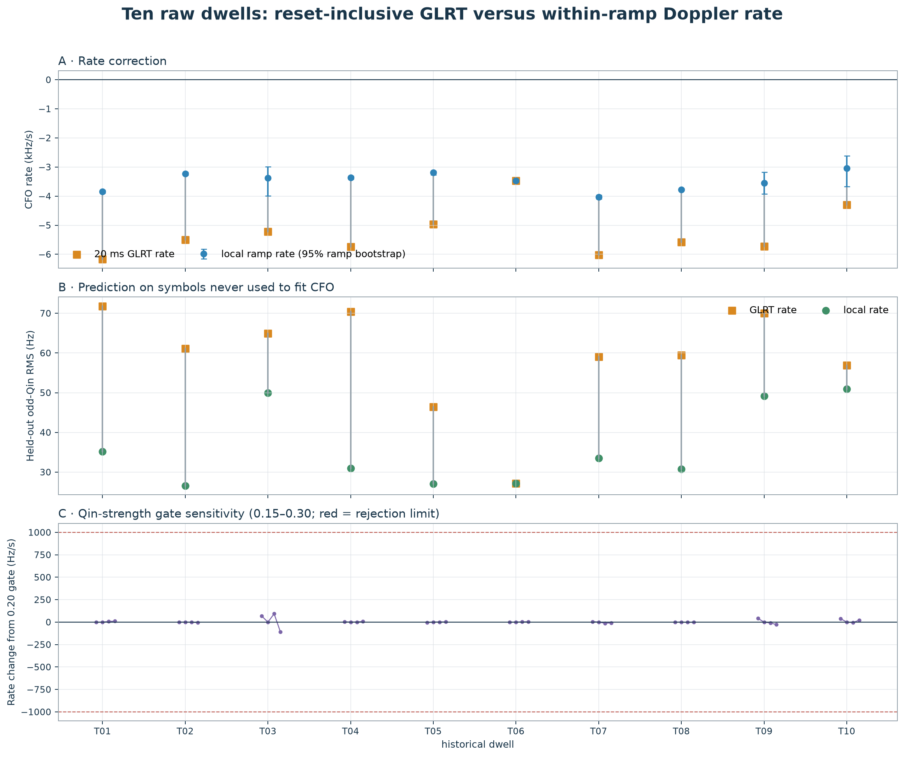

# A robust raw-dwell estimator for reset-debiased Starlink Doppler

> **Mechanism update (2026-08-24):** The frame measurements, held-out tests,
> and free-intercept local-rate estimator below remain valid. The repeated resets
> are now predominantly attributed to acquisition-time compression at Pluto
> refill handoffs, not transmitter timing-state changes. Consequently, "local"
> means a within-continuity-interval received-CFO rate; it is not yet a pure
> satellite Doppler rate. See
> [Refill-time compression explains the Starlink CFO sawtooth](2026_08_24_refill_time_compression_sawtooth.md).

## Abstract

A source-bound two-scale estimator was run sequentially on **10 sealed historical dwells**. All **10/10** returned a validated overall 20 ms GLRT CFO rate and a reset-debiased local rate, and all 10 completed on the first branch ranked using GLRT evidence alone. The analysis scored 35,550 raw 1.333 ms frames, retained 29,246 Qin-qualified frames, and fit 471 frequency-continuous ramps containing 21,079 frames.

Across matched ramp support, replacing the reset-inclusive GLRT slope with the within-ramp slope reduced pooled held-out odd-Qin CFO RMS from 60.2 to 34.0 Hz (43.5%). Nine of ten dwells changed by more than 0.5 kHz/s; one control dwell changed by only 0.003 kHz/s. This supports a real reset bias without forcing a correction when the two scales already agree.



## Introduction and motivation

The persisted GLRT follows a strong carrier over 20 ms probes and gives an excellent multi-second trajectory. It does not distinguish continuous geometric Doppler from frequency steps between transmitter/timing states. A line through those reset-bearing CFOs can therefore have a substantially steeper rate than the phase evolution inside each continuous state.

The hypothesis is that orbital-scale Doppler is represented more faithfully by the common slope *within* the repeated 20–125 ms coherent ramps, while each ramp must be allowed its own arbitrary CFO intercept. The 20 ms GLRT remains necessary for robust detection, branch membership, timing epochs, and raw CFO acquisition; it is not used as a local frequency correction or as the target value for the frame-rate fit.

## Real-data evidence


Blue opacity is the independently measured Qin-minus-control margin. Orange crosses are exact persisted raw GLRT source candidates, and dark lines are only the coherent ramps accepted by the batch partition. Each panel is centered on its own CFO median; the title counts raw frames and GLRT candidates outside the coherent-ramp display range. The free ramp intercepts absorb the visible frequency resets; their shared within-ramp slope is the corrected rate.

## Results

Rates and confidence limits are kHz/s. The confidence interval resamples whole ramps, not frames.

| dwell | capture ID | path | span (s) | GLRT windows | coherent frames / ramps | GLRT rate | local rate [95%] | correction | status |
| --- | --- | --- | ---: | ---: | ---: | ---: | ---: | ---: | --- |
| T01 | `cap-20260821T201522-841b2a20e151` | stream-0/RX1 | 13.525–20.225 | 251 | 3129 / 60 | -6.171 | -3.842 [-3.892, -3.795] | +2.329 | complete |
| T02 | `cap-20260821T193701-87f96f47e73f` | stream-0/RX1 | 0.100–6.800 | 230 | 2378 / 56 | -5.498 | -3.231 [-3.279, -3.180] | +2.267 | complete |
| T03 | `cap-20260821T193440-17c2e0ebef6a` | stream-1/RX1 | 34.900–40.350 | 197 | 403 / 10 | -5.223 | -3.376 [-3.997, -2.983] | +1.846 | complete |
| T04 | `cap-20260821T190912-ffd441556880` | stream-0/RX1 | 0.100–6.200 | 218 | 2863 / 56 | -5.743 | -3.362 [-3.417, -3.307] | +2.380 | complete |
| T05 | `cap-20260821T190701-7a5d980ec1c6` | stream-0/RX1 | 0.100–6.775 | 259 | 2241 / 57 | -4.964 | -3.196 [-3.274, -3.135] | +1.768 | complete |
| T06 | `cap-20260821T204837-89ad2e81a2a6` | stream-0/RX1 | 33.975–40.600 | 251 | 2275 / 53 | -3.473 | -3.470 [-3.509, -3.435] | +0.003 | complete |
| T07 | `cap-20260821T215944-d373c04a5a35` | stream-0/RX1 | 6.825–13.500 | 195 | 1725 / 53 | -6.019 | -4.028 [-4.097, -3.959] | +1.991 | complete |
| T08 | `cap-20260821T224942-0eef6f4c0cdb` | stream-0/RX1 | 26.950–33.625 | 254 | 3449 / 63 | -5.586 | -3.772 [-3.811, -3.736] | +1.814 | complete |
| T09 | `cap-20260821T230254-542e993bb778` | stream-1/RX1 | 13.525–20.200 | 257 | 1396 / 31 | -5.733 | -3.545 [-3.931, -3.182] | +2.187 | complete |
| T10 | `cap-20260821T230700-5b77aa69fbba` | stream-1/RX1 | 33.650–40.350 | 258 | 1220 / 32 | -4.298 | -3.040 [-3.668, -2.622] | +1.258 | complete |

The median GLRT rate is -5.542 kHz/s; the median reset-debiased rate is -3.423 kHz/s. The median correction is +1.919 kHz/s.

| dwell | held-out odd RMS: GLRT → local (Hz) | reduction | ramp-bootstrap σ (Hz/s) | Qin-gate spread (Hz/s) |
| --- | ---: | ---: | ---: | ---: |
| T01 | 71.8 → 35.2 | +51.0% | 24.6 | 12.8 |
| T02 | 61.1 → 26.6 | +56.5% | 25.1 | 4.7 |
| T03 | 64.9 → 49.9 | +23.1% | 271.2 | 199.5 |
| T04 | 70.4 → 31.0 | +56.0% | 28.2 | 7.2 |
| T05 | 46.4 → 27.1 | +41.7% | 35.1 | 5.5 |
| T06 | 27.1 → 27.1 | -0.0% | 18.4 | 5.2 |
| T07 | 59.0 → 33.5 | +43.2% | 34.8 | 17.6 |
| T08 | 59.4 → 30.7 | +48.3% | 19.0 | 2.2 |
| T09 | 70.1 → 49.2 | +29.8% | 190.9 | 69.2 |
| T10 | 57.0 → 50.9 | +10.5% | 262.6 | 43.6 |

T06 is the falsification control: its GLRT and local rates agree, and held-out RMS is unchanged. T03, T09, and T10 have wider ramp-bootstrap intervals than the denser dwells; they pass the declared stability gates but should carry those intervals into satellite association rather than be treated as equally precise point estimates.

## Robust analysis plan

1. **Run the Standard 20 ms GLRT and de-alias trajectories.** Keep the robust degree-one branch rate as the overall, reset-inclusive CFO rate. Rank branches only by strong-window count, source-probe count, time span, median margin, and model MAD; never rank using the corrected rate.
2. **Return through exact source identities.** For every canonical branch observation, follow `source_observation_ids` back to its raw candidate CFO and timing epoch. Never use a canonical alias intercept to reacquire raw IQ.
3. **Re-estimate every complete 1.333 ms frame from IQ.** Center a ±6 kHz, 25 Hz-grid frequency likelihood on that raw source CFO. Even Qin symbols estimate CFO; odd Qin symbols are held out; a rolled Qin sequence is the control. There is no per-20 ms fitted CFO correction.
4. **Recover continuous ramps in batch.** Fit frames within each timing lock, then use a global dynamic-program partition to join adjacent locks. Accept only groups spanning at least 20 ms, no more than 125 ms, with frame gaps ≤16 ms and raw line RMS ≤40 Hz.
5. **Estimate the corrected rate jointly.** Give every accepted ramp a free CFO intercept and fit one robust Huber common slope to all ramp frames. This is the local reset-debiased rate; the difference from the GLRT rate quantifies reset bias.
6. **Validate before publishing.** Resample whole ramps for the practical uncertainty; sweep the Qin gate from 0.15 to 0.30; and score predictions on odd Qin symbols that did not fit the CFO. Report a local rate only if all fail-closed gates pass.

### Fail-closed acceptance rules

- overall branch: at least 12 strong GLRT windows spanning at least 0.25 s;
- local support: at least 3 accepted coherent ramps and at least 6 frames per lock;
- stability: whole-ramp bootstrap σ ≤1,000 Hz/s and strict-gate rate spread ≤1,000 Hz/s;
- validation: local-rate odd-Qin RMS may not exceed matched GLRT-rate RMS by more than 5%;
- otherwise return an explicit insufficient-support, unstable, or validation-failed status—not a number.

## Methods and interpretation boundary

The analyzer is split at a narrow raw-IQ reader port. The scientific component has no storage, database, HTTP, or CLI dependency. The one-dwell CLI validates sealed Standard products, resolves receiver-path scope identities, opens digest-verified recordings read-only, and tries GLRT-ranked branches until the first fully validated result. Every attempt, configuration value, source branch, frame measurement, ramp, uncertainty, and input digest is persisted.

The corrected quantity is a **reset-debiased apparent CFO rate**, not yet guaranteed to be pure geometric Doppler. A constant LNB offset is removed by free intercepts, but LNB drift, transmitter clock drift, sample-clock error, and satellite motion remain potentially inseparable without external calibration or TLE-shape association.

## Data inventory

No new RF was collected. The following explicit session/run pairs were read from the existing corpus with recording verification enabled:

| dwell | session ID | Standard run ID | selected branch |
| --- | --- | --- | --- |
| T01 | `cap-20260821T201522-841b2a20e151` | `reprocess-b8f39f61f17d43d6a4720324f4aebc45` | `sha256:84df3b60e86ecfc2454e659a8b94038048b9a9841664f2fdd67d471cbc35f3d7` |
| T02 | `cap-20260821T193701-87f96f47e73f` | `reprocess-e149d494252c4265b4010b7ce85bd4c7` | `sha256:149690d2f39217ccba3dea1c525d54a4cd23aec25c6a4d67346e579429100798` |
| T03 | `cap-20260821T193440-17c2e0ebef6a` | `reprocess-586820308a34449e891c196dc3177aa1` | `sha256:135e3b71ac80a98ae6ea5bd38586cd8c5599c84b1c70b3780c19c0e1dfbbaa23` |
| T04 | `cap-20260821T190912-ffd441556880` | `reprocess-338bc961078a40fda6de2b7efcf49b98` | `sha256:f60d8949ae0890640a886476e3e2ba0b03641c0460597d7907b3bd05746d40de` |
| T05 | `cap-20260821T190701-7a5d980ec1c6` | `reprocess-67959c6a6df5470e8f9ef6d06eacd9a3` | `sha256:3147837bba062c897afb20e6d176b9232be4932f7348e73229f8c3a7b266e8e9` |
| T06 | `cap-20260821T204837-89ad2e81a2a6` | `reprocess-3cdb951ad21b4c58a337fc3eed042af4` | `sha256:5f852fa252038288a4438b4291960543bed3e6956bdad17d04a1be7eacc0e7d9` |
| T07 | `cap-20260821T215944-d373c04a5a35` | `reprocess-c0eafedc047e47599fd12dd398ad55cd` | `sha256:f82b3f546d0ba3dd5aed70ae4a49adeb4fdaddc5746995c8692f3390c3287ae4` |
| T08 | `cap-20260821T224942-0eef6f4c0cdb` | `reprocess-b8b6fe0cadb1452081f27af83592bca6` | `sha256:95665562b08b12e1110149caccad5087e819ba9123f8b09ffbbe4322967adbf0` |
| T09 | `cap-20260821T230254-542e993bb778` | `reprocess-515a3afb11ad4786a2e2c6f5286a1fd6` | `sha256:7d3da8a4db280bb247ebbaee598cc4c0d0009b625eecf12242fe867d64f4e182` |
| T10 | `cap-20260821T230700-5b77aa69fbba` | `reprocess-7e8a2e9cfb9640329f7fdb43a64bb7d7` | `sha256:3443bec480927bb8685f657f498dcb9291ae87e7dd188be784f3caa494b7c92a` |

## Reproduction

Analyze one raw dwell:

```bash
uv run python tools/analyze_raw_dwell_doppler.py \
  --session-id <capture-id> --run-id <standard-run-id> \
  --output <result.json>
```

Regenerate the ten-dwell summary after the ten one-at-a-time results exist:

```bash
uv run python tools/report_ten_dwell_raw_doppler.py
```

Machine-readable summary: [`ten-dwell-summary.json`](figures/2026_08_24_ten_dwell_raw_doppler/ten-dwell-summary.json).
