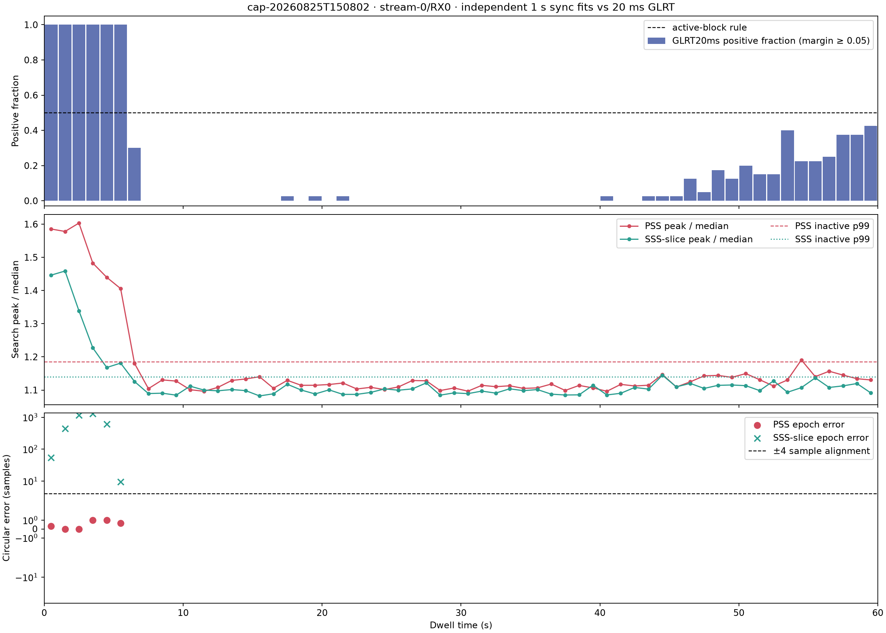
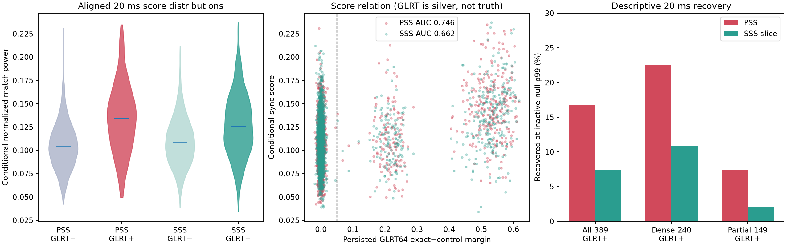

# PSS, narrow-SSS, and GLRT20ms comparison in dwell `150802`

## Outcome

The exact published PSS is recoverable in the dense opening six seconds of
`cap-20260825T150802-473cb5bbcbd6`, `stream-0/RX0`.  In all six independently
searched one-second blocks, its fitted frame epoch agrees with the persisted
GLRT64 epoch to within 1.0 sample.  PSS peak-to-median is 1.406--1.603 there,
versus a 1.116 median in the 54 non-dense blocks.  All six dense blocks exceed
the descriptive 99th percentile of the non-dense blocks (1.185).

The eight-subcarrier narrow SSS slice rises during the same activity, but it
does not recover the frame epoch: 0/6 dense blocks are within four samples of
the GLRT epoch.  Its maximum is therefore best interpreted as a weak
signal-activity response that can latch another OFDM symbol, not a validated
SSS acquisition.

The persisted 20 ms GLRT remains the strongest detector at this bandwidth.  It
returns 389 positives at an exact-minus-control margin gate of 0.05 among
2,400 probes.  At a descriptive threshold set to each sync statistic's 99th
percentile among GLRT-negative probes, conditionally aligned PSS recovers
65/389 (16.7%) and the SSS slice recovers 29/389 (7.5%).  In the dense opening
240 positives, those rates are 22.5% and 10.8%; in the later intermittent 149
positives, they fall to 7.4% and 2.0%.

## Frozen input and selection

- Recording: `cap-20260825T150802-473cb5bbcbd6`, 60 s at 2.5 MS/s.
- Analysis run: `capture-a5d45dd7752c4fc7833cd017a289f8d7`.
- Path: `stream-0/RX0`, lower edge, `radio_pluto_5d4d`.
- Recording manifest SHA-256:
  `ab55917851a9cd37af94b6145cc719f7b8d9d0809f2202a2dcd1ac38c3e7a31e`.
- Persisted pilot scan: 2,400 complete 20 ms probes at 25 ms cadence, with ten
  bounded candidate rows per probe and GLRT64 exact/rolled-control scores.

This path was selected before the sync replay because it contains both a dense
opening interval and a long quiet internal control in one receiver path.  The
other three paths were not pooled into the reported statistics.

All IQ reads were read-only.  No path beneath `/mnt/qnap01` was written, no
Standard product was replaced, and no golden fixture was changed.

## Methods

### Independent one-second synchronization fits

Each one-second block was searched independently over all 3,333 frame-phase
hypotheses and coarse CFO bins from -400 to +400 kHz in 100 kHz steps.  The
statistic is the mean per-frame normalized matched-filter power, maximized over
lag and CFO and divided by the median lag score in that block.

- PSS uses the published Humphreys et al. equations 35--37 replica, translated
  and band-limited to the captured lower edge.  At 2.5 MS/s only 11 complex
  samples of the 240 MHz PSS symbol remain.
- SSS uses the published equations 38--40 sequence, restricted to lower-edge
  subcarriers 528--535 and synthesized as an 11-sample narrowband OFDM symbol.
- GLRT activity is summarized from the 40 persisted 20 ms probes in each
  second.  A probe is a silver positive when GLRT64 exact-minus-rolled-control
  margin is at least 0.05; a block is called dense when at least 20/40 probes
  are positive.

The GLRT labels are comparison labels, not external signal truth.  The
inactive-block percentiles are descriptive and are estimated on this dwell;
they are not deployable false-alarm thresholds.

### Aligned 20 ms comparison

After each independent one-second fit, PSS and SSS normalized match power was
evaluated in the same 40 windows used by GLRT20ms.  This comparison is
acquisition-conditioned: the sync statistics reuse the containing one-second
fit, while GLRT performs its own bounded search per probe.  AUC and recovery
therefore describe agreement with persisted GLRT, not absolute detector
sensitivity or specificity.

## Results

| Measurement | PSS | narrow SSS slice | GLRT20ms |
|---|---:|---:|---:|
| Independent one-second AUC vs dense GLRT block | 1.000 | 1.000 | reference |
| Spearman vs per-second GLRT-positive fraction | 0.749 | 0.629 | reference |
| Dense-block median peak / median | 1.530 | 1.283 | n/a |
| Non-dense-block median peak / median | 1.116 | 1.100 | n/a |
| Dense blocks above non-dense p99 | 6/6 | 6/6 | 6/6 by definition |
| Dense blocks aligned to GLRT epoch within 4 samples | **6/6** | **0/6** | reference |
| Conditional 20 ms AUC vs GLRT-positive probe | 0.746 | 0.662 | reference |
| Conditional detections at GLRT-negative p99 | 86 | 50 | 389 positives |
| Of those, GLRT positive / negative | 65 / 21 | 29 / 21 | 389 / 2,011 |
| Recall of all GLRT positives | 16.7% | 7.5% | 100% |
| Recall of dense-opening GLRT positives | 22.5% | 10.8% | 100% |
| Recall of later intermittent GLRT positives | 7.4% | 2.0% | 100% |

The one-second score AUC alone is not enough to claim sequence detection:
short templates can respond to generic OFDM activity after a whole lag/CFO
search.  Epoch agreement is the decisive discriminator here.  The exact PSS
fit follows a smooth frame-phase path, `2532, 2532, 2530, 2528, 2525, 2522`,
over seconds 0--5 and agrees with GLRT after accounting for each probe's start
offset.  The SSS maxima do not follow that path.

### Wrong-edge PSS control

The upper-edge PSS replica was searched on the same lower-edge IQ with the
same lag/CFO grid for the six dense blocks and six quiet blocks.  It also rises
with signal energy, but its dense-block median peak-to-median is 1.346 versus
1.530 for the correct lower-edge PSS, and its fitted epoch agrees with the exact
PSS/GLRT epoch in 0/6 blocks.  This reinforces the distinction between
activity response and sequence-specific timing.

### CFO fit limitation

The correct PSS search selects the +400 kHz boundary in both active and quiet
blocks.  The 11-sample narrowband slice has poor independent Doppler
resolution, and the boundary preference also reflects the path's spectral
shape.  The PSS CFO output is not accepted as a useful fit.  Its score and,
most importantly, its frame-epoch agreement carry the evidence.

## Interpretation

For this 2.5 MHz edge recording, the defensible ordering is:

1. **GLRT20ms** for robust, dense detection and trajectory evidence;
2. **PSS** as supporting one-second frame-timing confirmation during dense
   activity; and
3. **narrow SSS** as unconfirmed at this bandwidth, despite a weak activity
   correlation.

PSS is not competitive as a 20 ms primary detector because the capture retains
only 11 samples per frame, versus 300 known pilot symbols on eight subcarriers
for GLRT.  The result does show that PSS can independently confirm the frame
epoch of a strong GLRT interval.  It does not show full-band PSS/SSS reception,
calibrated detection probability, payload decoding, or spacecraft identity.

## Evidence

- [Machine-readable comparison](figures/2026_08_25_150802_pss_sss_glrt20ms/comparison.json)
- [Full-dwell timeline](figures/2026_08_25_150802_pss_sss_glrt20ms/full-dwell-sync-comparison.png)
- [Aligned 20 ms scores](figures/2026_08_25_150802_pss_sss_glrt20ms/aligned-20ms-score-comparison.png)

