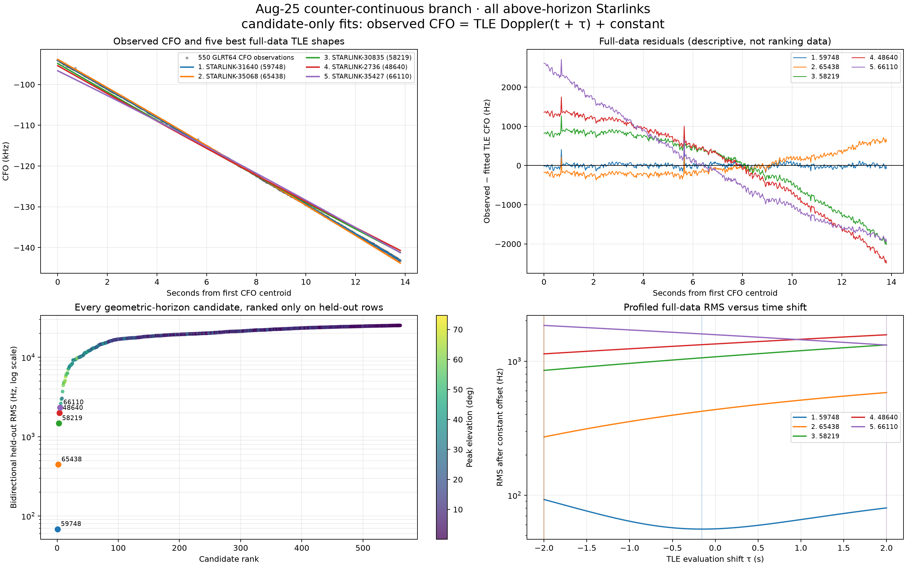
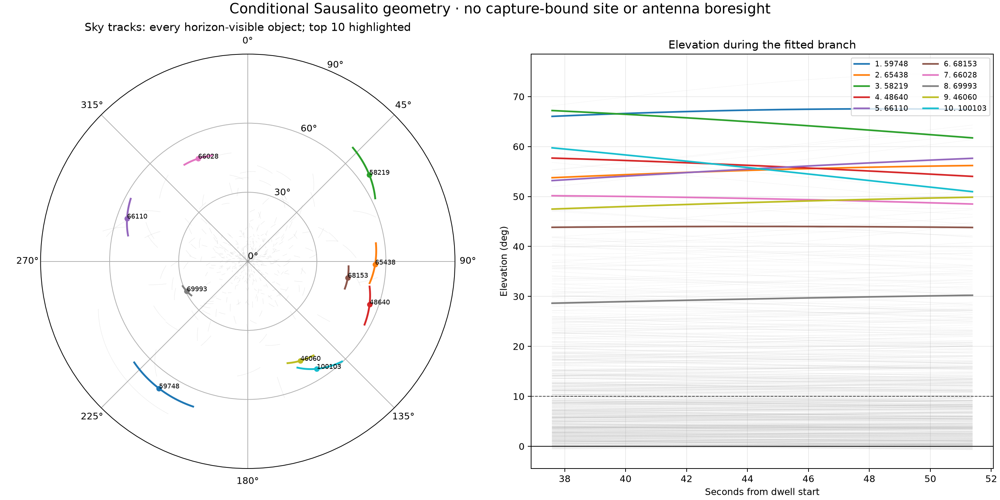

# Causal TLE comparison for the Aug-25 counter-continuous CFO arc

## Outcome

Conditional on the reviewed Sausalito observer preset and the newest available
pre-dwell Space-Track catalogue, the measured CFO shape strongly favors
**STARLINK-31640 / NORAD 59748**.  This is candidate-level Doppler-shape
evidence, not a satellite identification.

The constant frequency offset can be profiled analytically, but it is locally
confounded with the requested time shift, which is not identified.  A
full-data fit gives a descriptive shift of
`-0.155 s` and frequency offset of `-133.022 kHz`, with `55.89 Hz` RMS.  In
temporal cross-validation, however, the early fit chooses `-0.345 s` while the
late fit chooses `+0.790 s`.  Fixing the time shift to zero improves the combined
held-out RMS from `68.36 Hz` to `54.45 Hz`.  The time-shift parameter therefore
overfits this short, nearly linear Doppler arc and must not be interpreted as a
clock correction, propagation delay, or along-track error measurement.



## Causal catalogue

The selected input is the latest successful Space-Track collection before the
target stream began:

- collection timestamp: `2026-08-25T14:02:12.658586719Z`;
- stream-1 first-sample estimate: `2026-08-25T15:08:05.580127359Z`;
- collection lead: `3,952.922 s` (`65.88 min`);
- raw 3LE SHA-256:
  `9bb59fcf68fa36ce234ae9be79a492f0b92abc23bcf4f040bb5b64b61d3e31ad`;
- 10,972 strictly parsed, checksum-valid Starlink element sets;
- element age among horizon-visible candidates at the model reference:
  `7.15–64.37 h`, median `12.79 h`.

The collection service journal records a successful 10,972-object publication
at 14:02 UTC.  Its 15:00 attempt was rate-limited, and the next successful
snapshot postdates the capture.  The adjacent 13:37 QNAP snapshot differs in
only NORAD 47657, which is below the horizon throughout this arc, so the entire
visible-candidate population is unchanged.  Space-Track describes GP/TLE data
and its attribution/redistribution policy in its
[official documentation](https://www.space-track.org/documentation#odr).

## Data and geometry

The comparison uses 550 direct GLRT64 CFO observations from
`2026-08-25T15:08:43.165078492Z` through
`2026-08-25T15:08:56.965091292Z`.  Each observation is timestamped at the mean
sample center of its actual GLRT64 correlations, not at the beginning of its
20 ms probe.

The capture has no position or antenna-boresight authority.  Geometry is
therefore conditional on the reviewed `spinnaker-sausalito` preset:
`37.858988° N`, `122.478103° W`, `-29 m` ellipsoidal height, with stated
`50 m` uncertainty.  “Visible” means above the geometric horizon at any point
in the actual interval; it does not mean inside an antenna beam.

| Population accounting | Count |
|---|---:|
| Catalogue objects | 10,972 |
| SGP4-usable | 10,972 |
| Plausible altitude above 120 km | 10,970 |
| Above-horizon union | 561 |
| Above horizon throughout | 530 |
| At or above 10° at any time | 250 |
| At or above 10° throughout | 239 |



NORAD 59748 is high in the conditional sky model throughout the arc:
`66.04–67.54°` elevation.  At the interval midpoint it is at azimuth
`214.92°`, elevation `67.34°`, range `522.93 km`, and range rate
`-0.3692 km/s` (approaching).

## Fit model

For each of all 561 horizon-visible candidates, the only fitted terms are

\[
y_i = D_j(t_i + \tau) + b + \epsilon_i,
\qquad D_j(t)=-f_{RF}\dot\rho_j(t)/c,
\]

where `y` is measured CFO, `D` is the receive-time SGP4 Doppler prediction at
`11,440,312,498 Hz`, `τ` is a time shift, and `b` is one constant frequency
offset.  The model does **not** fit satellite-specific scale, slope, or
curvature.  Candidate membership is fixed at actual receive time before any
time-shift optimization.

The first 60% of measurements select `τ` and `b` and score the final 40%; the
reverse test trains on the final 60% and scores the first 40%.  Candidate rank
uses the equal-size combined held-out RMS.  The full-data fits in the figure are
descriptive overlays only.

| Candidate / control | Time-shift treatment | Held-out RMS |
|---|---:|---:|
| NORAD 59748 | fitted independently in both directions, ±2 s | **68.36 Hz** |
| NORAD 59748 | fixed `τ=0`, offset still fitted | **54.45 Hz** |
| NORAD 65438, next ±2 s candidate | fitted | 445.52 Hz |

The lead candidate is separated from the next candidate by `6.52×` on the
primary held-out metric.  Its Doppler shape is therefore unusually compatible
with the radio curve under the stated catalogue/site assumptions, even though
the additional time-shift parameter is unsupported.

## Wide-search degeneracy

The ±30 s sensitivity deliberately tests whether time shifting can manufacture
another good curve match.  It can: the held-out winner changes to
**STARLINK-30835 / NORAD 58219**, with shifts near `-22.4 s` and `-22.6 s` and
combined held-out RMS `55.05 Hz`.  The full-data RMS of that shifted curve is
`55.93 Hz`, nearly tied with NORAD 59748's `55.89 Hz`.

This is not a plausible receive-clock correction.  It demonstrates a
multiplicity problem: over a wide enough time range, a different member of a
large constellation can supply a similar local Doppler shape.  Satellite names
must therefore not be promoted from this single conditional arc.

## Interpretation limits

- The observer location is reviewed but not capture-bound, and the antenna
  boresight/gain pattern is unknown.
- The constant offset absorbs transmitter carrier offset, receiver/LNB offset,
  and other frequency-reference errors; it is not a physical satellite
  frequency measurement.
- The receive-time SGP4 model does not iterate light time.  At the lead
  candidate's roughly 523 km range, light time is about 1.75 ms and is mostly a
  constant-shape shift absorbed by `b`/`τ` at this resolution.
- The direct CFO curve was selected from persisted radio trajectories.  This is
  not an end-to-end blind association trial.
- The separate frame-epoch/delay curve is excluded from this likelihood: its
  sign convention and channel/template gauge do not make it an independent
  physical range observable.
- No claimed result here is absolute TOA, pseudorange, satellite identity, or a
  calibrated clock correction.

## Reproduction

The plain-Matplotlib analysis is implemented in
`tools/compare_visible_starlink_tle_fit.py`; component tests are in
`tests/analysis/test_visible_starlink_tle_fit_tool.py`.  From the repository
root, with the digest-bound causal TLE snapshot available at the default path:

```bash
uv run python tools/compare_visible_starlink_tle_fit.py \
  --output-root reports/figures/2026_08_25_150802_visible_starlink_tle_fit
```

Machine-readable evidence, including every one of the 561 candidate fits, is
in
`reports/figures/2026_08_25_150802_visible_starlink_tle_fit/visible-starlink-tle-fit-evidence.json`.
