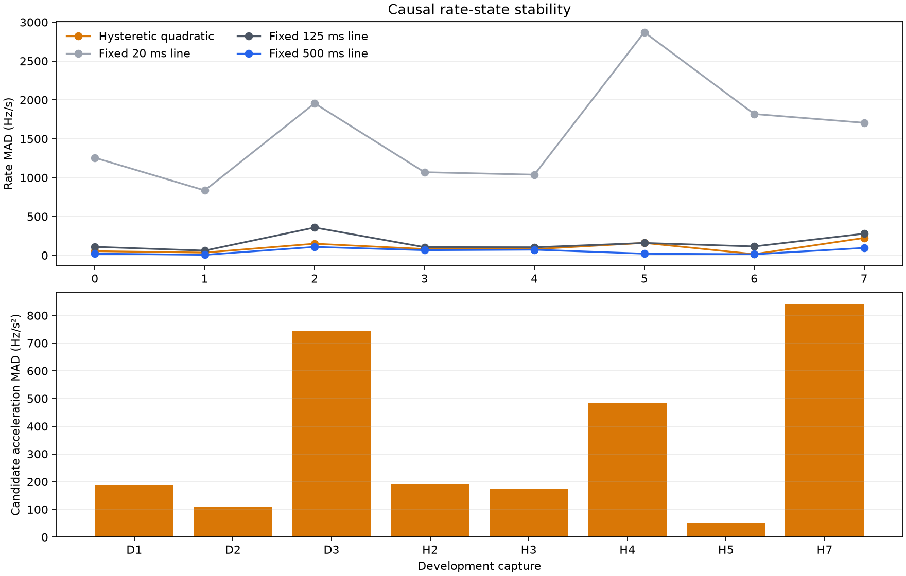
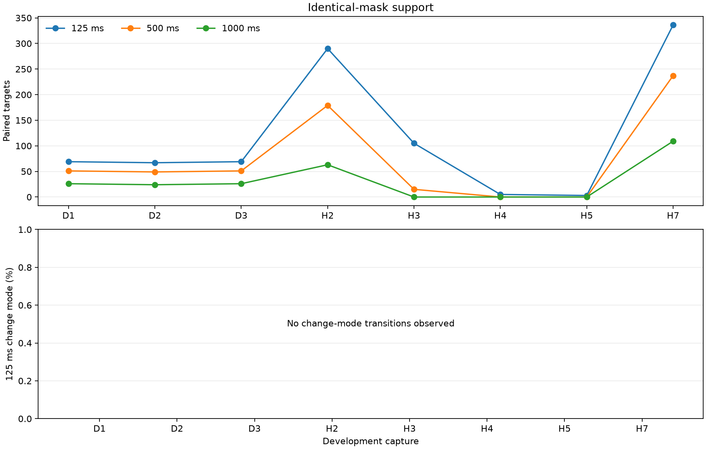

# Causal CFO/rate/acceleration state on the frozen development cohort

## Result

The frozen experiment is formally **inconclusive** because its support gate was
not met. The descriptive development signal is nevertheless strongly adverse:
the causal quadratic state was worse than the fixed 500 ms line at every
forecast horizon, and the gap grew rapidly with horizon.

| Future odd-Qin horizon | Evaluable captures | Paired targets | Quadratic state RMS | Fixed 500 ms RMS | Fixed 125 ms RMS | Causal 20 ms RMS | Quadratic / fixed-500 |
|---:|---:|---:|---:|---:|---:|---:|---:|
| 125 ms | 8 | 944 | 74.44 Hz | **70.60 Hz** | 80.12 Hz | 338.21 Hz | 1.054 |
| 500 ms | 6 | 582 | 225.17 Hz | **84.19 Hz** | 168.63 Hz | 962.79 Hz | 2.674 |
| 1,000 ms | 5 | 248 | 542.92 Hz | **117.10 Hz** | 283.67 Hz | 1,884.30 Hz | 4.636 |

The fixed 500 ms line is the best of the four methods at all three horizons.
The quadratic state is only 5.4% worse at 125 ms, but is 167% worse at 500 ms
and 364% worse at one second. This is not a rate-truth comparison: the metric
is future odd-Qin receiver-relative CFO prediction error. LNB, receiver, and
clock drift remain unmeasured.

The candidate never entered its 125 ms change mode in any of 15,343 comparable
states. Thus the real-data result primarily tests a regularized 500 ms
quadratic extrapolation. The estimated acceleration was too variable to help:
capture-level acceleration MAD ranged from `52.7` to `841.6 Hz/s^2`, and its
`0.5 a t^2` contribution increasingly damaged the longer forecasts. There is
no evidence here that either acceleration extrapolation or a 20 ms causal line
is a direction toward better Doppler-rate estimates. The simple 500 ms causal
line remains the useful default.

## Frozen protocol and input authority

The protocol was committed before aggregate odd-Qin outcomes at commit
`17e283341ee1f97fa1f14c1016eae9cec07d25ee`. Its configuration SHA-256 is
`f32205e9690b4c2a6a8b88042d392094c9902057bcc21cc61925ecde1828b8bb`.

The benchmark validated the exact inventory and every capture binding in the
`rate_development` role of the dataset policy. It consumed no
`holdout_foundation` capture and did no dynamic discovery or raw-IQ extraction.
The two consumed products were:

- the D1-D3 frame inventory, artifact-manifest SHA-256
  `4e63378b6d30ba94fac645516b7b3faae405fa1e39af7db4223a0814858b642f`;
- the opened H1-H7 tile inventory, artifact-manifest SHA-256
  `4028d817aab24077d590fc380034babca7208dba9bee4b405b9ee0a5a4fecd3b`.

Both products serialize independent even- and odd-Qin frame CFO. Their frozen
upstream Standard source/epoch/alias hypotheses were selected before this
experiment and were not end-to-end odd-Qin-independent. This experiment is
therefore conditional on those source hypotheses. Downstream state updates,
mode decisions, targets, masks, reset boundaries, and gate decisions are
even-Qin-only; odd Qin is read only after a four-method opportunity is fixed.

### Complete 16-capture disposition

| Policy capture | Product label | Disposition | Reason |
|---|---|---|---|
| `cap-20260824T192019-9023840c8e9f` | — | Non-evaluable | No digest-closed parity-split frame product |
| `cap-20260824T192252-9981b9c27853` | — | Non-evaluable | No digest-closed parity-split frame product |
| `cap-20260824T192531-491832825b97` | — | Non-evaluable | No digest-closed parity-split frame product |
| `cap-20260824T193733-1454b499b8bb` | — | Non-evaluable | No digest-closed parity-split frame product |
| `cap-20260824T194009-34ae34f129bc` | — | Non-evaluable | No digest-closed parity-split frame product |
| `cap-20260824T194245-1dfbc879df2b` | — | Non-evaluable | No digest-closed parity-split frame product |
| `cap-20260825T054455-47f684bbc3cc` | H7 | Evaluable | Identical-mask forecasts available |
| `cap-20260825T071530-b00e74ac23ee` | H6 | Non-evaluable | Serialized tiles produced no identical-mask forecast |
| `cap-20260825T083906-9e15fac173f1` | H5 | Evaluable, sparse | Only three 125 ms targets; no longer-horizon result |
| `cap-20260825T101428-681b85cf4224` | H4 | Evaluable, sparse | Only five 125 ms targets; no longer-horizon result |
| `cap-20260825T115127-b61fef4673a4` | H3 | Evaluable, partial | 125 and 500 ms results; no 1,000 ms result |
| `cap-20260825T130425-1678069fefd1` | H2 | Evaluable | All three horizons |
| `cap-20260825T142817-9949c81ca994` | D1 | Evaluable | All three horizons; two-second source limits blocks |
| `cap-20260825T144823-4a812245fce1` | H1 | Non-evaluable | Serialized tiles produced no identical-mask forecast |
| `cap-20260825T145100-cc48b00cfa28` | D2 | Evaluable | All three horizons; two-second source limits blocks |
| `cap-20260825T150802-473cb5bbcbd6` | D3 | Evaluable | All three horizons; two-second source limits blocks |

The opened H product planned 55 tiles. Fifty serialized successfully and all
were attempted; these plus the three recent dwells make 53 processed hard
locklets. The five frozen source failures remain in the output ledger:

| Failed tile | Capture | Frozen reason |
|---|---|---|
| H1-T001 | H1 | selected interval has no exact branch-bound GLRT epoch source |
| H2-T004 | H2 | selected interval has no exact branch-bound GLRT epoch source |
| H3-T000 | H3 | selected interval has no exact branch-bound GLRT epoch source |
| H6-T000 | H6 | selected interval has no exact branch-bound GLRT epoch source |
| H6-T008 | H6 | selected interval has no exact branch-bound GLRT epoch source |

## State and comparison methods

The candidate state is `[CFO, rate, acceleration]`, obtained from a robust
quadratic `CFO = f + r dt + 0.5 a dt^2` centered on the current cutoff. It uses
a 500 ms history by default and a zero-centered `1000 Hz/s^2` acceleration
prior. This is a causal local-quadratic state surrogate, not a calibrated
Kalman posterior. It may shorten to 125 ms only after eight consecutive
same-direction even-Qin residual/rate-disagreement events spanning at least
8 ms. Returning to 500 ms requires at least 250 ms in change mode plus 32 calm
observations over 250 ms. These thresholds were frozen and were not tuned after
the result.

The baselines are robust causal CFO lines over 500, 125, and 20 ms. All four
methods use the same qualified even-Qin frames, a 50 Hz measurement scale,
Huber tuning 1.345, at least 95% endpoint history coverage, at least 12 frames,
and at least eight effective frames. A new dwell, replay tile, or supported
point gap over 100 ms is a hard causal reset.

Targets occur every 15 frames. For each 125/500/1,000 ms request, the cutoff is
the latest supported frame at or before `target - horizon`. All four methods
must be numeric at that exact cutoff. Every persisted forecast satisfies
`cutoff < target` and actual horizon at least the requested horizon. Squared
errors are averaged in device-sample-anchored one-second blocks, blocks are
weighted equally within capture, and captures are weighted equally overall.

## Per-capture identical-mask results

All RMS columns are future odd-Qin CFO error in Hz. `N` and blocks are shared
by all four methods in each row. A row being numeric does not imply that it
passed the frozen minimum of 50 targets and three blocks.

| Capture | Horizon | N | Blocks | Quadratic | Fixed 500 | Fixed 125 | Causal 20 | Quadratic / 500 |
|---|---:|---:|---:|---:|---:|---:|---:|---:|
| D1 | 125 | 69 | 2 | 25.07 | 24.12 | 33.94 | 311.81 | 1.039 |
| D1 | 500 | 51 | 2 | 85.62 | 32.10 | 57.84 | 814.33 | 2.667 |
| D1 | 1,000 | 26 | 1 | 236.17 | 46.22 | 155.69 | 1,761.42 | 5.109 |
| D2 | 125 | 67 | 2 | 33.76 | 31.77 | 37.83 | 180.28 | 1.063 |
| D2 | 500 | 49 | 2 | 44.50 | 28.85 | 55.01 | 424.35 | 1.542 |
| D2 | 1,000 | 24 | 1 | 122.24 | 38.97 | 73.74 | 1,030.13 | 3.137 |
| D3 | 125 | 69 | 2 | 68.26 | 59.18 | 82.36 | 365.57 | 1.154 |
| D3 | 500 | 51 | 2 | 404.79 | 121.61 | 231.13 | 1,678.85 | 3.329 |
| D3 | 1,000 | 26 | 1 | 840.72 | 159.30 | 362.42 | 2,753.42 | 5.277 |
| H2 | 125 | 290 | 13 | 51.67 | 51.10 | 53.32 | 235.45 | 1.011 |
| H2 | 500 | 179 | 11 | 102.00 | 57.07 | 84.52 | 698.23 | 1.787 |
| H2 | 1,000 | 63 | 6 | 312.72 | 56.14 | 104.03 | 1,434.72 | 5.570 |
| H3 | 125 | 105 | 8 | 61.24 | 53.51 | 58.66 | 230.81 | 1.144 |
| H3 | 500 | 15 | 2 | 120.95 | 117.88 | 116.32 | 513.69 | 1.026 |
| H4 | 125 | 5 | 2 | 101.63 | 114.76 | 83.51 | 538.93 | 0.886 |
| H5 | 125 | 3 | 1 | 101.48 | 107.28 | 129.33 | 308.92 | 0.946 |
| H7 | 125 | 336 | 12 | 104.17 | 68.04 | 109.57 | 396.39 | 1.531 |
| H7 | 500 | 237 | 8 | 325.59 | 93.41 | 300.24 | 1,071.75 | 3.486 |
| H7 | 1,000 | 109 | 6 | 773.64 | 190.74 | 480.11 | 1,987.32 | 4.056 |

Only H4 and H5 show a numerical candidate win over fixed 500 ms, and each is
based on five or fewer targets. Every supported, larger cell loses. The worst
frozen qualifying cell is H2 at 1,000 ms, ratio `5.570`.

## Rate and acceleration stability

`Rate MAD` below is `quadratic / fixed-500 / fixed-125 / fixed-20`. The final
column is the median / p90 absolute disagreement between the candidate rate and
the fixed 500 ms line at identical cutoffs.

| Capture | States | Median candidate rate | Rate MADs (Hz/s) | Median acceleration | Acceleration MAD | Candidate-vs-500 rate disagreement |
|---|---:|---:|---:|---:|---:|---:|
| D1 | 940 | -3,724.9 Hz/s | 53.8 / 21.9 / 109.3 / 1,256.1 | -60.0 Hz/s² | 188.3 Hz/s² | 46.7 / 117.4 Hz/s |
| D2 | 1,080 | -3,651.8 Hz/s | 35.2 / 7.0 / 60.7 / 835.1 | -4.5 Hz/s² | 107.6 Hz/s² | 26.6 / 79.2 Hz/s |
| D3 | 1,142 | -3,745.8 Hz/s | 149.8 / 108.2 / 358.3 / 1,955.9 | -322.1 Hz/s² | 743.8 Hz/s² | 211.5 / 428.3 Hz/s |
| H2 | 4,696 | -3,880.4 Hz/s | 81.6 / 66.6 / 105.4 / 1,069.4 | +45.4 Hz/s² | 190.4 Hz/s² | 45.9 / 126.8 Hz/s |
| H3 | 1,890 | -3,010.3 Hz/s | 80.2 / 72.8 / 103.6 / 1,038.1 | +296.9 Hz/s² | 175.1 Hz/s² | 75.0 / 172.8 Hz/s |
| H4 | 155 | -3,826.3 Hz/s | 160.0 / 21.9 / 159.3 / 2,870.5 | +827.8 Hz/s² | 485.0 Hz/s² | 171.8 / 337.0 Hz/s |
| H5 | 34 | -3,597.6 Hz/s | 15.4 / 14.1 / 114.9 / 1,818.2 | -211.6 Hz/s² | 52.7 Hz/s² | 49.1 / 128.2 Hz/s |
| H7 | 5,406 | -3,214.8 Hz/s | 224.2 / 95.4 / 279.1 / 1,705.2 | +43.0 Hz/s² | 841.6 Hz/s² | 210.5 / 490.9 Hz/s |

The candidate's rate MAD is higher than the fixed 500 ms line in every
capture. Its central rate remains in the familiar receiver-relative
approximately `-3.0` to `-3.9 kHz/s` range, but local quadratic rate changes
and acceleration do not predict future CFO better. No change-mode transition
occurred, so the frozen residual/rate evidence was never sustained for the
required eight points.

## Strong and weak/ambiguous strata

The stratum is determined only from past even-Qin state quality. A cutoff is
strong when its stable 500 ms quadratic weighted RMS is at most 50 Hz and its
downweighted fraction is at most 0.10.

| Stratum | Horizon | Captures | N | Quadratic RMS | Fixed-500 RMS | Ratio |
|---|---:|---:|---:|---:|---:|---:|
| Strong | 125 ms | 4 | 469 | 58.86 Hz | 49.99 Hz | 1.177 |
| Strong | 500 ms | 4 | 267 | 216.79 Hz | 70.52 Hz | 3.074 |
| Strong | 1,000 ms | 3 | 98 | 468.87 Hz | 105.00 Hz | 4.465 |
| Weak/ambiguous | 125 ms | 7 | 475 | 76.56 Hz | 73.01 Hz | 1.049 |
| Weak/ambiguous | 500 ms | 5 | 315 | 245.78 Hz | 92.94 Hz | 2.644 |
| Weak/ambiguous | 1,000 ms | 4 | 150 | 624.43 Hz | 130.77 Hz | 4.775 |

The adverse quadratic result is present in both strata, so it is not explained
only by weak frames.

## Support gate and formal verdict

The preregistered development gate required at least seven captures with 50
paired targets in three blocks at every horizon. Actual qualifying capture
counts were `3`, `2`, and `2` at 125, 500, and 1,000 ms. The six August-24
captures were already frozen non-evaluable; H1 and H6 additionally supplied no
identical-mask forecasts; D1-D3 cover only two seconds each and cannot provide
three blocks. The support condition is therefore missed, making the formal
verdict **inconclusive**, irrespective of the adverse effect sizes.

The effect conditions also fail descriptively: aggregate ratios exceed 0.95 at
all horizons, and the worst qualifying capture ratio exceeds 1.10. The result
must not be recast as a failed holdout, because all inputs are previously opened
development data. It is best read as a strong reason not to advance this exact
quadratic/acceleration direction.

## Conditional likelihood gate

The frozen causal gate would invoke summed/full likelihood only when current
even-Qin evidence is weak or ambiguous: exact-minus-control log-likelihood or
top-minus-second log-likelihood below `4.605170185988092`. Neither serialized
source contains per-frame likelihood surfaces or both even-only features.
Accordingly:

- real-data gate status is **unavailable**;
- invocation fraction, accuracy, and full-likelihood compute cost are not
  reported;
- raw IQ was not re-extracted to rescue the subexperiment; and
- even-only decision logic is covered by unit tests.

This is an availability result, not evidence for or against summed likelihood.

## Runtime, uncertainty, and reproducibility

The final run verified and loaded sources in `0.260 s`, spent `34.040 s` in the
benchmark, and reached the pre-evidence-write point in `34.839 s`. External wall
time was `35.50 s`, peak RSS `213,096 KiB`, and tracking throughput was
`815.88` supported points/s. It processed 75,869 serialized frames, 27,773
supported even-Qin training points, 15,343 identical-mask states, and 1,774
paired target/horizon opportunities (7,096 method rows).

No calibrated covariance is claimed. NIS and nominal 68/95% coverage are
therefore intentionally absent. Rate MAD, acceleration MAD, paired
disagreement, and held-out future-CFO RMS are empirical diagnostics, not formal
rate uncertainty or physical truth error.

The tracker and benchmark implementation SHA-256 values are respectively
`41ce92da7c25c2a4079f73974d02eb76152b5dd5cdfe266abc494cd287619bec`
and
`6638515b8f7659cd60a68620895cf1b2b8934d4bed75a36bddc218cbf5805781`.
The complete artifact manifest SHA-256 is
`772f24424330d28507241a5031048ca6859ee01f7a09e3a7916e4445c4c26975`.

Primary evidence and row products:

- [`evidence.json`](figures/2026_08_25_causal_cfo_acceleration_development/evidence.json)
- [`forecast-rows.csv`](figures/2026_08_25_causal_cfo_acceleration_development/forecast-rows.csv)
- [`state-rows.csv`](figures/2026_08_25_causal_cfo_acceleration_development/state-rows.csv)
- [`capture-dispositions.csv`](figures/2026_08_25_causal_cfo_acceleration_development/capture-dispositions.csv)
- [`tile-dispositions.csv`](figures/2026_08_25_causal_cfo_acceleration_development/tile-dispositions.csv)
- [`runtime-rows.csv`](figures/2026_08_25_causal_cfo_acceleration_development/runtime-rows.csv)
- [`artifact-manifest.json`](figures/2026_08_25_causal_cfo_acceleration_development/artifact-manifest.json)

Tests explicitly verify policy-role closure, source and output hashes, complete
capture/failure ledgers, prefix invariance, odd-Qin perturbation immunity for
state and masks, strict target chronology, four-method identical masks,
prediction arithmetic, and equal-capture aggregation.

## Recommendation

Keep the fixed 500 ms causal line as the receiver-relative CFO/rate baseline.
Do not advance this quadratic acceleration extrapolator, and do not shorten to
20 ms as a general tracker. If acceleration is revisited, it needs independent
physical or synthetic curvature calibration and stronger regularization or a
bounded maneuver model before another odd-Qin forecast test. The conditional
full-likelihood gate remains a separate promising question, but it requires a
future digest-closed product that serializes even-only ambiguity features and
the corresponding likelihood surface; this run supplies no gate result.
