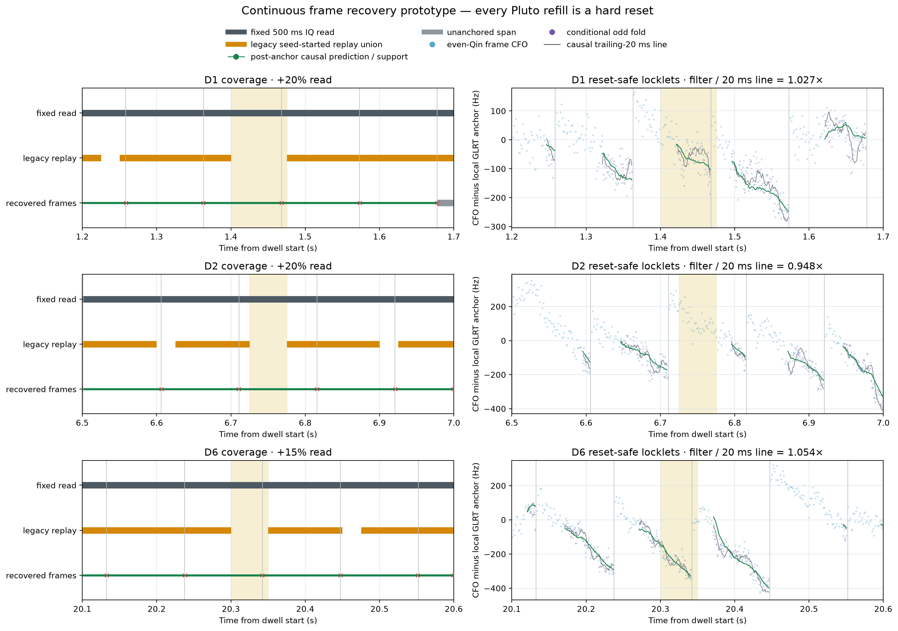
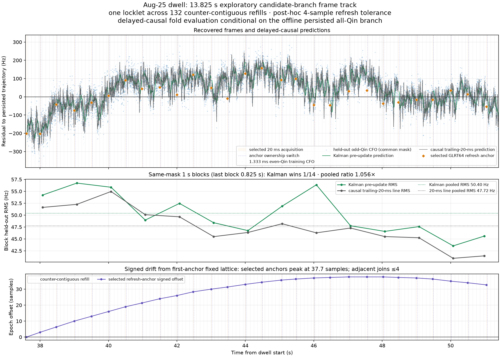
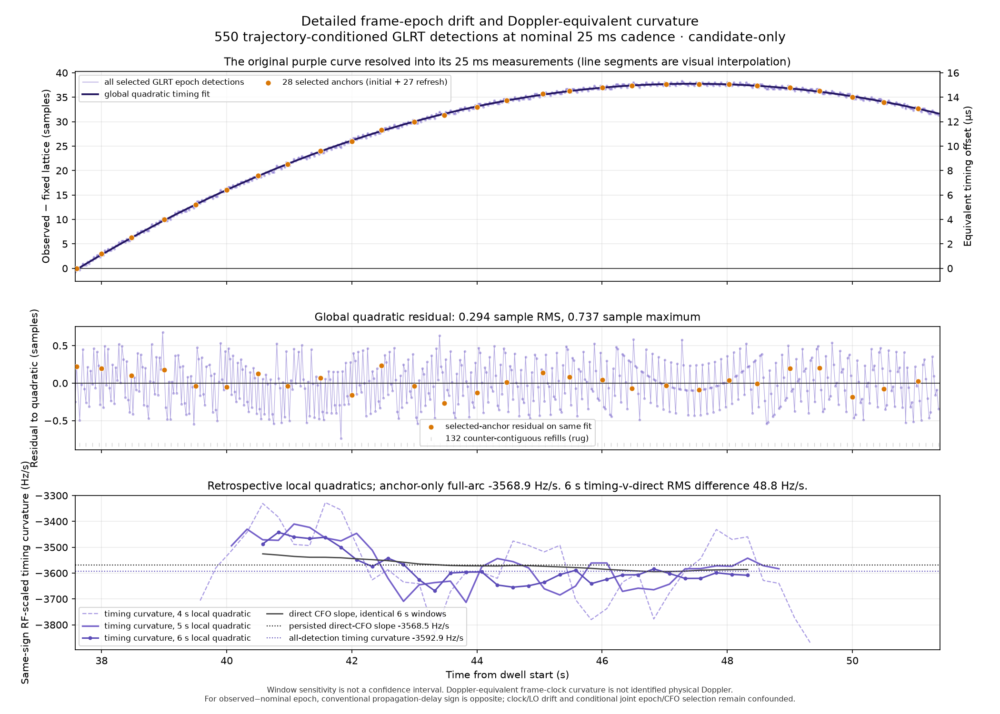
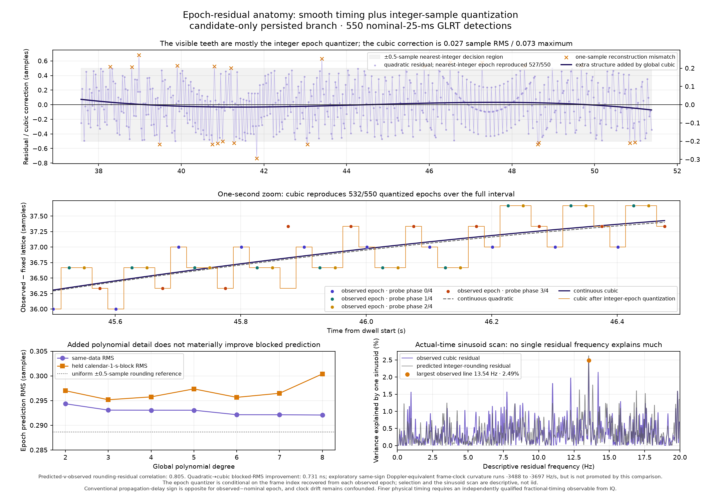
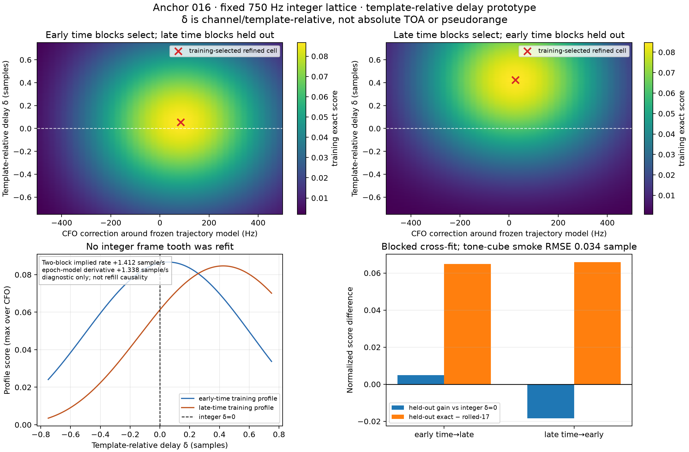

# Counter-continuous Starlink frame timing and fractional-delay study

Date: 2026-08-25

## Executive result

This report consolidates the frame-recovery, long-track, epoch-curvature, and
fractional-delay experiments that followed the PNT Kalman V3 review. The main
findings are:

1. The large blank regions in the original three-dwell Kalman plots were mostly
   replay-coverage gaps. Fixed-grid reads and refill-local acquisition recovered
   129 of 131 frame opportunities in the previously blank regions.
2. The newer capture `cap-20260825T150802-473cb5bbcbd6` still has application
   refills, but it does not have the old stored-time-compression defect. Device
   counters, sequence numbers, and session samples remain contiguous across the
   tested handoffs.
3. One persisted candidate branch can be followed for 13.825 s across 132 such
   counter-continuous refills: 10,368 of 10,369 frame opportunities are supported
   in one exploratory locklet.
4. The current recovery Kalman is not the best local CFO predictor. On the
   9,902-frame common odd-Qin mask it has 50.401 Hz RMS, versus 47.719 Hz for the
   causal trailing-20-ms robust frame-CFO line, a ratio of 1.0562.
5. The smooth purple epoch curve is real at the integer-epoch level, but most of
   its visible teeth are the nearest-integer quantizer acting on the
   3333 1/3-sample frame period. A quadratic latent epoch curve is the minimum
   adequate operational model; a cubic adds only 0.00183 sample of blocked RMS
   improvement, or 0.731 ns at 2.5 MS/s.
6. A raw, rational-lattice-corrected delay/CFO grid does detect time-varying
   template-relative delay. A single constant correction does not generalize:
   early blocks select +0.055 sample and help late data slightly, while late
   blocks select +0.425 sample and hurt early data.

These results support an additive dynamics model with explicit delay offset,
delay rate, and delay acceleration. They do not identify propagation delay,
absolute Doppler, pseudorange, or satellite identity. Receiver/sample clocks,
transmitter frame clock, LNB/receiver LO, and the one-edge channel-delay gauge
remain confounded.

## Relationship to the earlier reports

The complete investigation is distributed across reports with different
questions and evidence:

- [Signal-matched PNT Kalman V3 review](2026_08_25_pnt_kalman_v3_comprehensive_review.md):
  paper interpretation, 12-dwell V2 rejection, full-frame acquisition, phase
  decoupling, and V3 results.
- [Three-dwell tracking comparison](2026_08_25_three_dwell_pnt_tracking_comparison.md):
  sealed 20 ms GLRT seeds, 1.333 ms frame CFO, V2, and V3 visualized together.
- [Continuous frame-recovery prototype](2026_08_25_continuous_frame_recovery_prototype.md):
  why the original plots had gaps and how a complete frame-opportunity ledger
  removes them without interpolation.
- [Frame timing, phase, and Doppler-rate investigation](2026_08_25_frame_phase_rate_investigation.md):
  exact rational lattice, frame-local phase limits, and frequency-first model.
- This report: the Aug-25 counter-continuous long arc, detailed epoch curvature,
  and direct-time fractional-delay test.

The term **20 ms GLRT** below means the sealed GLRT64 acquisition CFO and epoch.
The **causal trailing-20-ms line** is a separate downstream predictor fitted to
preceding frame-CFO observations. They must not be conflated.

## Old capture defect versus the new capture

The linked `470384` boundary-mechanism report analyzed an August-21 capture with
no authoritative device sample counter. Its apparent stored timeline compressed
unrecorded RF time at application refill boundaries. The later
refill-time-compression report superseded the original causal interpretation.

The Aug-25 capture is different. Both streams declare observable sample loss,
have 573 timeline records, and preserve exact device-counter, sequence, and
session-sample increments. The gap maps are empty; missing, overflow, and enqueue
failure counters are zero. Application buffers are still normally delivered in
262,144-sample refills. The important distinction is that those refills are now
counter-authoritative continuity markers, not omitted RF time.

In the selected 13.825 s branch, all 132 refill handoffs satisfy that metadata
contract. Frame-CFO changes around them are mixed-sign and no larger in their
distribution than ordinary adjacent-frame changes. This is evidence against the
legacy repeated refill-compression signature in this bounded interval. It is not
a claim that every capture, radio, or hardware path is defect-free.

## Recovering the missing frames

The earlier plot selected the strongest 20 ms probe in each 100 ms bin and then
started a 100 ms replay at that moving offset. Consecutive replay starts could be
25--175 ms apart, leaving 15--17% of a nominally gap-free dwell unread.

The recovery prototype instead:

- reads a fixed interval;
- acquires a discrete full-frame epoch inside each qualified segment;
- projects the exact `epoch + round(k Fs / 750)` lattice forward and backward;
- evaluates every guarded frame opportunity;
- records unsupported, refill-crossing, incomplete, coast, and lost outcomes;
- updates CFO/rate only from even-Qin training evidence; and
- keeps odd Qin for conditional pre-update scoring.



Across the three prescribed 500 ms intervals, the prototype accounts for 1,107
anchor-owned opportunities: 1,091 supported/filter-accepted frames, 14
refill-crossing rejections, and two incomplete endpoints. Another 58,624 samples
are explicitly unanchored. Occupancy is not independently labeled, so the
supported fraction is availability conditional on the selected anchors, not a
signal-occupancy or estimator-retention estimate.

## A 13.825 s frame track on the newer dwell

The longest persisted single trajectory on stream-1/RX1/upper spans
37.575--51.400 s. It contains 530 trajectory-consistent 20 ms observations over
554 nominal 25 ms probes and crosses 132 counter-continuous refills.

The bounded replay used 28 selected anchors: one initial acquisition plus 27
0.5 s refreshes. Adjacent refresh epochs differ by zero to four samples. The
default one-sample compatibility gate would reject 12 of 27 adjacent joins; an
exploratory four-sample, 1.6 microsecond gate joins all 27. That tolerance was
selected after inspecting this branch, so the resulting one-locklet coverage is
development evidence, not a promotion holdout.



The opportunity ledger is almost complete:

| Quantity | Result |
|---|---:|
| Input duration | 13.825 s |
| Frame opportunities | 10,369 |
| Supported and filter-accepted | 10,368 |
| Incomplete terminal opportunity | 1 |
| Locklets / hard splits | 1 / 0 |
| Counter-continuous refill handoffs | 132 |
| Conditional common odd-Qin frames | 9,902 |
| Kalman pre-update RMS | 50.401 Hz |
| Trailing-20-ms line RMS | 47.719 Hz |
| Kalman / line ratio | 1.0562 |
| One-second blocks won by Kalman | 1 / 14 |

The figure deliberately plots the causal pre-update prediction, because that is
the quantity scored in the second panel. The complete pipeline is not online
causal: branch/trajectory selection is offline, and the refresh tolerance was
chosen on this arc.

## What the purple epoch curve measures

For each selected GLRT observation, define the repository-convention signed
offset

```text
e(t) = observed integer frame start - nearest start on the first-anchor 750 Hz lattice
```

in receiver samples. Positive values mean a later observed frame start. At
2.5 MS/s, one sample is 0.4 microseconds. The plot below uses all 550 selected
epoch detections, not only the 28 refresh anchors.



The global curve is smooth because the underlying frame shift changes slowly.
The small sawtooth is expected: one 750 Hz frame is 3333 1/3 samples, while the
acquisition result is an integer sample. The rational lattice cycles through
the corresponding nearest-integer phases.

A quadratic fit to all detections produces an RF-scaled, repository-sign timing
curvature of -3592.88 Hz/s. The persisted direct-CFO trajectory slope is
-3568.45 Hz/s. The close magnitude is scientifically interesting, but it is not
independent validation: the persisted CFO trajectory participates in candidate
selection, GLRT estimates CFO and epoch jointly, and the sign mapping depends on
the chosen delay convention. For observed-minus-nominal arrival delay, the
conventional propagation-Doppler sign is opposite the plotted repository sign.

Local second derivatives are noisy. A centered 6 s window gives a 48.8 Hz/s RMS
difference between timing-derived and direct-CFO slopes, but adjacent displayed
points overlap by about 96% and have 6 s effective resolution. The bands are
window sensitivity, not confidence intervals.

## Why a more detailed polynomial barely helps

The detailed residual view separates the latent curve from the integer epoch
quantizer.



| Diagnostic | Quadratic | Cubic |
|---|---:|---:|
| Quantized integer epochs reproduced | 527 / 550 | 532 / 550 |
| Same-data residual RMS | 0.29436 sample | 0.29308 sample |
| Held-calendar-block prediction RMS | 0.29700 sample | 0.29517 sample |

Every cubic mismatch is exactly one integer sample. The observed residual and
the cubic model's predicted nearest-integer rounding residual correlate 0.805.
The expected RMS for uniformly distributed nearest-integer phase,
`1/sqrt(12) = 0.288675` sample, is a reference rather than a hard floor.

The cubic correction relative to the quadratic is only 0.02745 sample RMS and
0.07308 sample maximum. At 2.5 MS/s that is 10.98 ns RMS. AIC weakly favors the
cubic, while BIC weakly favors the quadratic. The cubic's same-sign
Doppler-equivalent jerk is about -15.2 Hz/s^2, but blocked sensitivity and
quantization do not support treating it as a resolved physical third derivative.

The actual-time sinusoid scan finds no defensible narrow oscillator in the
residual. Its largest component explains only about 2.5% of variance and is
subject to a 1,991-frequency look-elsewhere search.

## Raw fractional delay and CFO grid

Integer epoch fitting alone cannot prove sub-sample timing. The next bounded
test returned to verified raw IQ around anchor 016, held the 3333/3334 integer
teeth fixed, and searched a padded windowed-sinc Qin replica over:

- template-relative delay: +/-0.75 sample, 0.005-sample coarse step and
  0.001-sample refinement;
- CFO correction: +/-500 Hz, 25 Hz coarse step and 2.5 Hz refinement; and
- exact versus independently optimized rolled-17 Qin control over the identical
  nuisance volume.

The rational +/-1/3-sample lattice phase was included in every replica. Each
frame retained its own complex amplitude/phase nuisance.



| Training -> held-out block | Selected delay | CFO correction | Held-out gain over integer delay | Exact minus rolled control |
|---|---:|---:|---:|---:|
| Early -> late | +0.055 sample | +85 Hz | +0.004987 | +0.064807 |
| Late -> early | +0.425 sample | +25 Hz | -0.018307 | +0.065905 |

The two constant-delay solutions differ by 0.370 sample. Their mean times imply
about +1.412 sample/s of differential delay rate, close in sign and magnitude to
the integer-epoch cubic derivative near the block midpoint, about +1.348
sample/s. This is a useful diagnostic, not a validated rate estimate: the test
did not fit and hold out a delay-rate or acceleration model, and the full-arc CFO
trajectory used to center the grid includes both folds.

The negative late-to-early result is decisive for this model: one constant
fractional correction does not generalize. The rolled control also reaches the
-500 Hz search boundary in that direction. Promotion therefore fails closed.

## What is and is not observable

The direct-time grid improves over a pure eight-tone phase-ramp proxy, but it
does not remove the one-edge channel gauge. With a single Qin edge, an unknown
linear phase in the eight-tone channel can trade against delay. Therefore:

- `delta` is channel/template-relative, not absolute TOA or pseudorange;
- changes within a frozen gauge are more interpretable than a common offset;
- transmitter frame-clock, receiver sample-clock, and their drifts remain in
  epoch rate and acceleration;
- transmitter carrier, receiver/LNB LO, and propagation remain in CFO; and
- a numerical relation between delay curvature and CFO rate is a
  Doppler-equivalent consistency check, not identified physical Doppler.

Clock separation, a second independently calibrated edge, or an external timing
reference is required before making range or absolute-Doppler claims.

## Would a higher sample rate expose more curvature?

Potentially, but only when it captures more usable signal bandwidth and the
fractional-delay likelihood is calibrated. The measured cubic correction is
about 11 ns RMS. The same physical shift would occupy approximately:

| Sample rate | Samples for 11 ns |
|---|---:|
| 2.5 MS/s | 0.0275 |
| 5 MS/s | 0.055 |
| 10 MS/s | 0.110 |
| 20 MS/s | 0.220 |

Higher sample rate reduces the numerical sample interval, but it does not add
more frames: the pilot opportunity rate remains 750 Hz. It also does not remove
the channel-delay gauge, clocks, or LO drift. A useful experiment would record
the same RF simultaneously at 2.5 and 10 MS/s, run identical even/odd and
rolled-control tests, and verify that the inferred shift agrees in seconds,
not merely in samples.

## Next model

The minimum useful continuous timing model is

```text
delta(t) = delta0 + delta_rate * u + 0.5 * delta_acceleration * u^2
```

with `u = t - t0`, fixed rational integer teeth, and per-frame complex nuisance.
The effective receiver-sample frame length is

```text
P_eff(t) = Fs / 750 + delta_rate(t) / 750.
```

For a conventional observed-minus-nominal arrival-delay convention, the
propagation-Doppler-equivalent relationship is

```text
f_D ~= -(f_RF / Fs) * delta_rate
f_D_rate ~= -(f_RF / Fs) * delta_acceleration.
```

The sign reverses for nominal-minus-observed delay. The next experiment must fit
CFO, delay rate, and delay acceleration on training time blocks and score an
unchanged model on separated held-out blocks. Delay offset should be profiled as
a nuisance, exact and rolled controls must use the same search volume, and a
quadratic should only be retained if it beats the linear timing model on blocked
prediction rather than in-sample residuals.

## Evidence and provenance

All figures in this report are plain Matplotlib PNGs.

Long-track and epoch evidence:

- `long-track-evidence.json`: SHA-256
  `619a715143c20801efbe8be3dee012b1a83e3fc730d588bb3a2c6cd2382de579`.
- `long-track-frame-rows.jsonl.gz`: deterministic gzip SHA-256
  `38beb847c417e4b69f8c8ed64acda1d24116ad47531dc2ee3e601d61cd3bda0f`;
  its decompressed JSONL is the manifest-bound
  `2d40f818bb76723629227704066137c0947a9523742f60fdd1cfad3a79842fd4`.
- `epoch-doppler-curvature.json`: SHA-256
  `24bf59d774c2ca20dd896dd090fdafe146abca5218c54f161c1e07c3ac203f7d`.
- `epoch-residual-detailed-fit.json`: SHA-256
  `743827a8cc836cd3b04610b698cb2f0236c17bd585cc2af11fcf169f5055a0e8`.

Fractional grid evidence:

- `anchor016-fine-grid-evidence.json`: repo-native rerun SHA-256
  `340f134a165a24db1471c197a3316fdff677dbaa2ccdbba785c2066730a32c98`.
- `anchor016-frame-rows.json`: SHA-256
  `faddda18fa2b769ac3a574154c376c808ba3ec43f5ea1a0718adc896d5d2412f`.
- `anchor016-fine-grid-crossfit.png`: SHA-256
  `4dcb14870f8846019ddd73761f1226368d60495fbb945b15625b023906bee0d6`.

Frozen source snapshots used to create the exploratory artifacts are retained
beside each figure bundle. They are provenance records rather than promoted
runtime APIs. The capture manifest and all read IQ chunks were digest-verified;
no recording data were changed.
