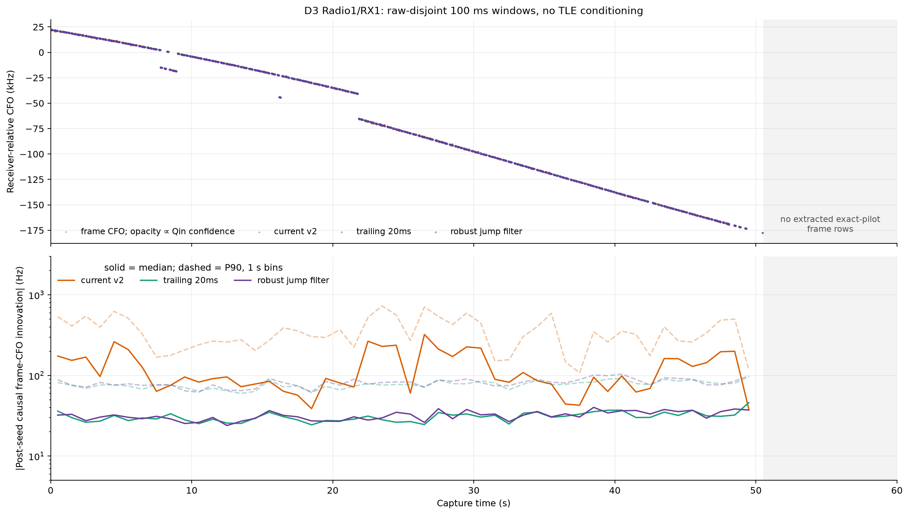
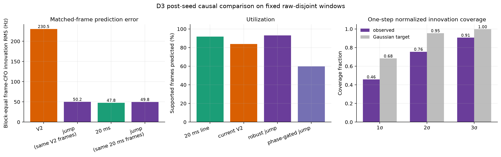
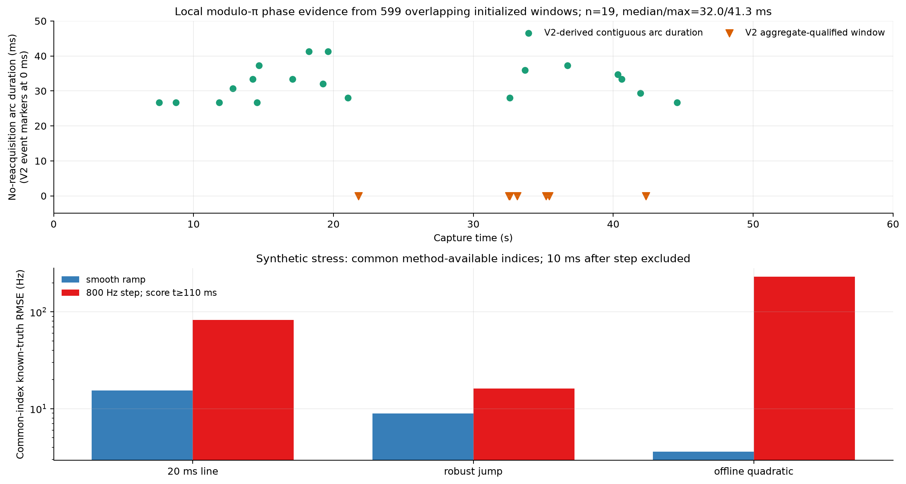
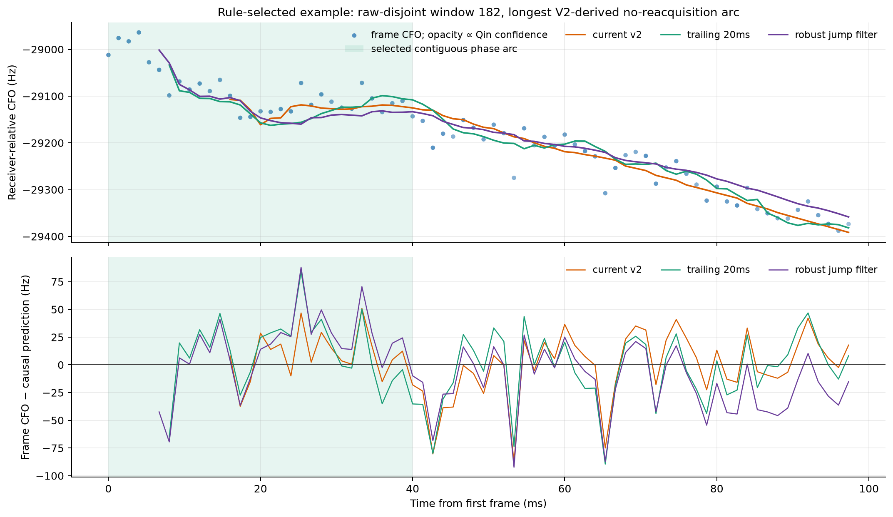

# D3 pilot-filter prototypes: robust CFO and explicit locklets

## Result

The robust jump filter reduces the largest D3 V2 frame-CFO innovation error, but it does **not** yet beat the simple 20 ms trailing robust line. On common frames grouped into one-second blocks, it improves RMS over current V2 by 78.2% (descriptive three-second moving-block resampling interval 74.6% to 81.0%). Against the 20 ms line it is 4.1% worse (descriptive interval 3.0% to 5.2% worse). These are innovations against the noisy extracted frame-CFO estimator; true CFO is unknown.

This is a retrospective development benchmark on source-conditioned D3 windows, not an independent scientific validation and not a satellite identification.

## Matched causal comparison

| Common prediction set | Baseline block-equal RMS | Jump-filter block-equal RMS | Common frames | One-second blocks |
|---|---:|---:|---:|---:|
| Current V2 vs jump | 230.5 Hz | 50.2 Hz | 15,043 | 50 |
| 20 ms line vs jump | 47.8 Hz | 49.8 Hz | 16,501 | 50 |

These are the headline comparisons because each pair is scored on exactly the same frames and gives equal weight to each occupied one-second block.

## Own-available-prediction statistics

| Model | Score type | Predictions | Utilization | RMS (Hz) | MAE (Hz) | P95 absolute error (Hz) |
|---|---:|---:|---:|---:|---:|---:|
| Trailing robust line | post-seed causal, 20 ms | 16,521 | 91.9% | 47.5 | 37.0 | 94.8 |
| Current PNT V2 | post-seed causal | 15,063 | 83.8% | 232.1 | 162.7 | 513.4 |
| Robust jump filter | post-seed causal | 16,744 | 93.1% | 49.5 | 38.8 | 99.1 |
| Phase-gated jump filter | post-seed causal | 10,738 | 59.7% | 68.9 | 51.2 | 138.5 |
| Frozen robust line | 60/40 forward | 7,012 | 39.0% | 81.1 | 64.1 | 160.8 |
| Robust polynomial smoother | offline/full | 17,979 | 100.0% | 43.2 | 33.0 | 87.3 |

These marginal rows use each model's own available predictions and therefore must not be rank-compared when utilization differs. Every filter is initialized independently in each 100 ms seed window; this is not a continuous 60 s replay. “Causal” here starts after the strongest whole-capture-frozen GLRT seed, epoch, and CFO have already been selected; it is not an end-to-end online detector score. The fixed raw-disjoint subset has 244/300 planned windows with emitted frame rows and 17,983 supported frames. Windows without frame rows are outside the utilization denominator. The 60/40 row freezes a robust line after the first 60 ms and scores the final 40 ms. The offline smoother uses future data and is an in-sample error floor/reference, not a forecast.

The jump filter's normalized one-step innovations are still underdispersed: observed 1σ/2σ/3σ coverage is 45.8/75.5/90.6%, versus nominal Gaussian 68.3/95.5/99.7%. Its covariance remains too tight.

## Phase-lock evidence

- Current V2 qualifies 7/599 independently initialized 100 ms windows in 6 disjoint interval components. This is a window-overlap count, not a physical-emitter count.
- The full matched rolled-Qin replay has 0 supported frames and 0 qualified windows.
- A separate V2-derived contiguous-arc criterion finds 19 local arcs in 19 overlapping windows and 15 one-second blocks. Total/median/max duration is 609.3/32.0/41.3 ms. It is not a nested replacement for V2 qualification, and the arcs are not independent physical locklets.
- These are modulo-pi locklets only. They do not establish absolute carrier phase, code phase, pseudorange, or continuity across windows.

## Synthetic known-truth stress test

| Scenario | 20 ms line RMSE | Robust jump RMSE | Offline quadratic RMSE | Mean change points |
|---|---:|---:|---:|---:|
| Smooth ramp | 15.5 Hz | 9.0 Hz | 3.6 Hz | 0.00 |
| +800 Hz step, t>=110 ms | 83.0 Hz | 16.1 Hz | 230.5 Hz | 1.00 |

All three synthetic methods are scored on their common method-available indices; the stepped case deliberately excludes the first 10 ms after the change. The offline quadratic is a full-window fit, not causal prediction. The state machine keeps one locklet on the smooth ramp and detects one change point on the stepped signal. This is consistent with covariance/measurement mismatch being important on D3, but it does not rule out lifecycle or model errors on real data.

## Figures

## What to change next

1. Keep the 20 ms trailing robust line as the reference causal benchmark for untouched-dwell validation; a new filter must beat it before promotion.
2. Feed the jump filter independent block observations with empirically calibrated covariance, not correlated per-frame measurements with nominally tiny errors.
3. Make the phase discriminator produce an explicit raw modulo-pi observation and covariance. The present lifecycle wrapper reuses V2 phase-update decisions, so it is not an independent phase filter.
4. Promote a lock only after a minimum contiguous no-reacquisition arc; terminate it at a confirmed change point or coast expiry.
5. Validate the frozen configuration on D4 and later dwells with whole-second/block resampling, full rolled-Qin controls, and even-Qin training/odd-Qin scoring.
6. Keep TLE matching downstream. Over a 20–100 ms locklet, orbit-time delay is almost perfectly absorbed by free CFO/rate nuisance.

## Provenance and limitations

- Source schema: `org.leo.research.d3-pilot-filter-prototypes/v1`.
- Seed selection: `strongest frozen GLRT-margin seed in each 100 ms bin; phase blind`.
- Inference unit: one-second time block; 287/598 adjacent seed pairs overlap.
- Capture IQ continuity is device-counter anchored with zero recorded gaps, missing samples, or overflows.
- Hyperparameters were fixed for this prototype but not nested-cross-validated.
- Three-second circular moving-block intervals are descriptive, not calibrated confidence intervals.
- All 599 rolled-Qin windows were replayed; zero support is evidence of pilot specificity on these selected RF windows, not a universal false-alarm rate.
