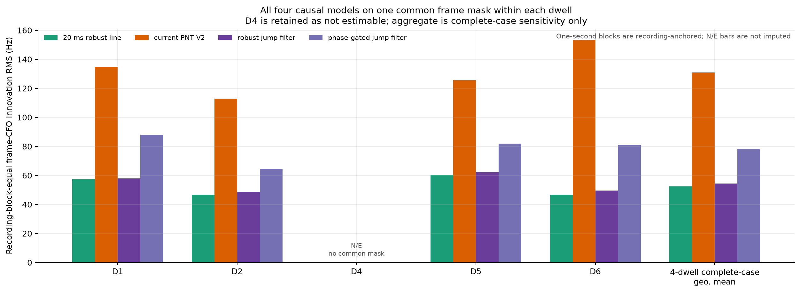
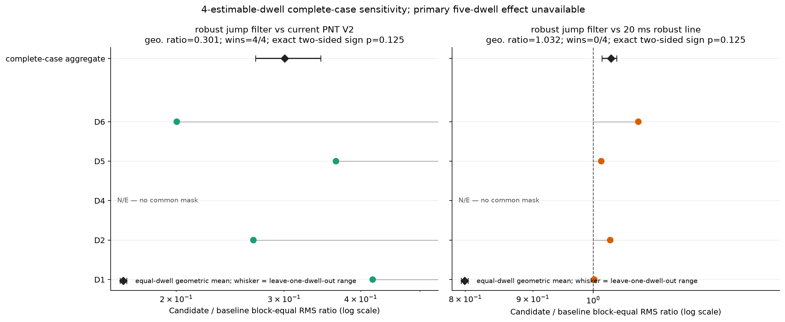
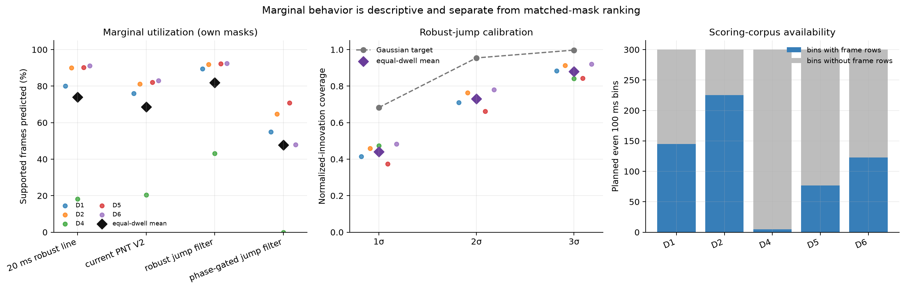
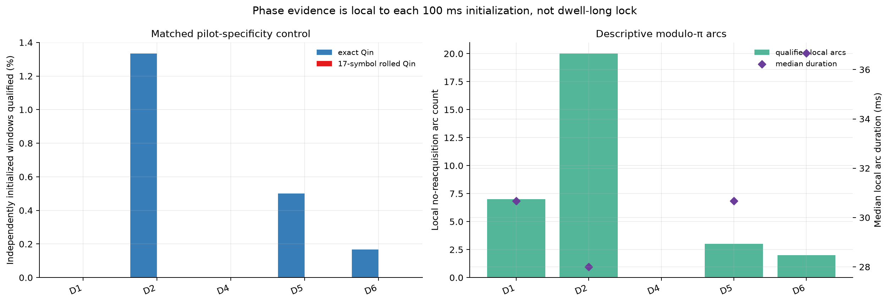
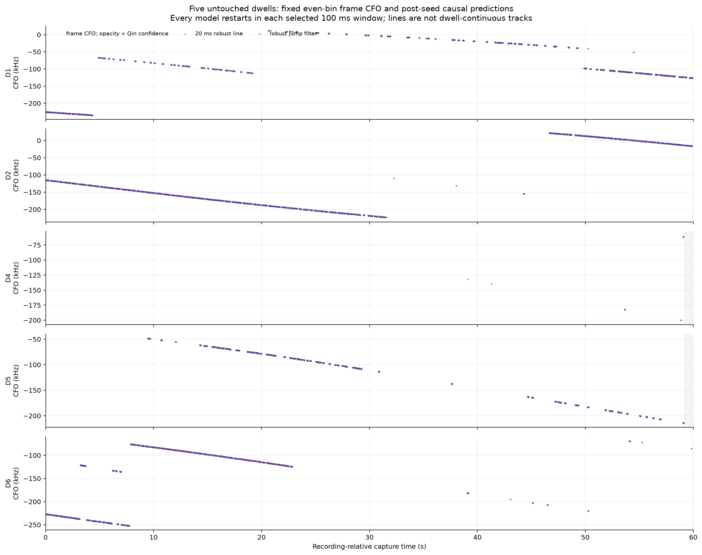

# Five untouched dwells: robust pilot-filter benchmark

## Result

**The predeclared primary five-dwell effect is unavailable.** Completeness failed for D4 (44 supported even-lane frames: no common prediction frames across all four causal models on the fixed even-bin lane). This dwell remains in every corpus, marginal, phase-control, and timeline accounting; no error or zero is imputed.

As a clearly labeled **4-dwell complete-case sensitivity only**, robust jump filter has 69.9% lower matched block-equal RMS than current PNT V2 by the equal-dwell geometric mean (ratio 0.301); it wins 4/4 complete-case dwells and the exact two-sided sign probability is 0.125. robust jump filter has 3.2% higher matched block-equal RMS than 20 ms robust line by the equal-dwell geometric mean (ratio 1.032); it wins 0/4 complete-case dwells and the exact two-sided sign probability is 0.125. This subset was determined after observing the completeness failure and is not a replacement for the unavailable primary result. With only 4 dwell-level outcomes, the sign test is deliberately coarse; these numbers show direction and effect size, not a high-power confirmatory claim.

This uses the D3-frozen filter settings and scoring logic on every same-release campaign dwell except the D3 development dwell, with the predeclared sealed-Standard 100 ms seed protocol. It is a retrospective filter benchmark, not satellite identification. True CFO is unknown, so every error below is an innovation against the noisy 1.3 ms frame-CFO estimator.

## One all-causal common mask per dwell

| Dwell | Common frames | Recording 1 s blocks | 20 ms line RMS (Hz) | Current V2 RMS (Hz) | Robust jump RMS (Hz) | Phase-gated jump RMS (Hz) |
|---|---:|---:|---:|---:|---:|---:|
| D1 | 3,510 | 35 | 57.4 | 135.0 | 57.9 | 88.0 |
| D2 | 8,217 | 45 | 46.7 | 112.9 | 48.6 | 64.5 |
| **D4 — not estimable** | 0 | 0 | n/a | n/a | n/a | n/a |
| D5 | 3,305 | 28 | 60.3 | 125.7 | 62.3 | 81.9 |
| D6 | 3,731 | 24 | 46.7 | 153.5 | 49.6 | 81.0 |
| **4-dwell complete-case geometric mean** | — | — | **52.4** | **131.0** | **54.3** | **78.4** |

Each dwell constructs its own intersection of all four causal methods. A frame never crosses dwells, and each occupied recording-anchored one-second block receives equal weight inside its dwell. D4 has no such intersection and is displayed as not estimable. The final row is the geometric mean of only the 4 explicit complete cases; it does not flatten frames into one pseudo-sample and must not be read as the primary five-dwell result.

## Complete-case matched-pair sensitivity (non-primary)

| Candidate | Baseline | Equal-dwell RMS ratio | Improvement | Dwell wins | Exact two-sided sign p | Leave-one-dwell-out ratio range |
|---|---|---:|---:|---:|---:|---:|
| robust jump filter | current PNT V2 | 0.301 | 69.9% | 4/4 | 0.125 | 0.269–0.344 |
| robust jump filter | 20 ms robust line | 1.032 | -3.2% | 0/4 | 0.125 | 1.015–1.042 |

Every ratio is recomputed on that pair's common frame mask inside the same 4 all-causal complete cases. The leave-one-dwell-out range is a sensitivity diagnostic, not a confidence interval. No frame-level bootstrap or IID-frame inference is performed. The primary five-dwell effect remains unavailable.

## Marginal utilization

| Model | Five-dwell mean utilization | Geometric mean own-mask RMS (Hz) | RMS-estimable dwells |
|---|---:|---:|---:|
| 20 ms robust line | 73.9% | 53.9 | 5/5 |
| 50 ms robust line | 80.8% | 58.2 | 5/5 |
| current PNT V2 | 68.6% | 171.5 | 5/5 |
| robust jump filter | 81.9% | 56.6 | 5/5 |
| phase-gated jump filter | 47.7% | 69.7 | 4/5 |
| frozen 60/40 robust line | 29.5% | 85.4 | 4/5 |
| offline block smoother | 76.6% | 47.7 | 4/5 |

These rows use each model's own available predictions. They reveal utilization and failure modes, but their RMS values must not be rank-compared when masks differ. Planned even bins that emitted no frame rows remain explicit missing bins in the evidence and availability plot; they are never silently counted as zero-error observations or removed from the planned-bin count.

## Phase and rolled-Qin control

| Dwell | Exact qualified | Rolled qualified | Explicit local arcs | Median / max arc duration |
|---|---:|---:|---:|---:|
| D1 | 0/600 | 0/600 | 7 | 30.7 / 49.3 ms |
| D2 | 8/600 | 0/600 | 20 | 28.0 / 38.7 ms |
| D4 | 0/600 | 0/600 | 0 | n/a / n/a ms |
| D5 | 3/600 | 0/600 | 3 | 30.7 / 36.0 ms |
| D6 | 1/600 | 0/600 | 2 | 36.7 / 44.0 ms |

The exact and 17-symbol-rolled Qin results use the same frozen RF seed windows. Rolled Qin therefore tests pilot specificity on this selected corpus, not a universal false-alarm rate. The explicit arcs are a separate V2-derived local modulo-π criterion. Independently initialized overlapping arcs are not physical-emitter counts and do not establish absolute carrier phase, code phase, pseudorange, or continuity between 100 ms windows.

## Figures

## Scientific boundary

- “Causal” begins only after the strongest whole-capture-frozen GLRT seed, epoch, and initial CFO were selected. This is not an end-to-end online detector evaluation.
- Every filter restarts inside each selected 100 ms window. The timeline overlays are short post-seed predictions, not continuous 60 s tracks.
- The robust-jump covariance calibration is descriptive; framewise normalized innovations are serially dependent and source conditioned.
- The phase-gated jump filter reuses V2 phase-update decisions and is not an independent raw-phase discriminator.
- The offline smoother sees future samples and remains an in-sample floor/reference, never a causal competitor.
- Hyperparameters were frozen after D3 development and were not nested-cross-validated on this five-dwell cohort.
- A predeclared dwell with no all-causal common mask makes the primary five-dwell effect unavailable. The 4-dwell complete-case aggregate is post-observation sensitivity only and does not silently exclude the failed dwell.
- No TLE, orbit, satellite visibility, or satellite identity enters selection, filtering, or scoring.

## Provenance

- Evidence schema: `org.leo.research.five-dwell-pilot-filter-prototypes/v1`.
- Capture release: `058576ec74b7dae9ae3ad2a9798679fcf2c934c3`.
- Frozen PNT implementation: `6a27fa2c578f4b031cab183771b9bcb686628a29e4cf1b7197914c2717660cb3` (identical in all five replay summaries).
- Independent replay parity: [source-replay-parity-attestation.json](figures/2026_08_25_five_dwell_pilot_filter_benchmark/source-replay-parity-attestation.json), SHA-256 `d4436e4dd90fc016b4bdad9116dab17d15f76792ca71b3df982662aa17f73cf0`; the validated document attests byte-identical seed JSON and NPZ products for all five labels under the cohort PNT source.
- Receiver path: `stream-1 / Radio1 / RX1`.
- Cohort: `cap-20260824T192019-9023840c8e9f, cap-20260824T192252-9981b9c27853, cap-20260824T193733-1454b499b8bb, cap-20260824T194009-34ae34f129bc, cap-20260824T194245-1dfbc879df2b`.
- Scoring: fixed even-numbered 100 ms bins and recording-anchored one-second block aggregation within dwell. Five-dwell completeness is required for the primary effect; the displayed 4-dwell geometric aggregate is explicitly non-primary sensitivity.
