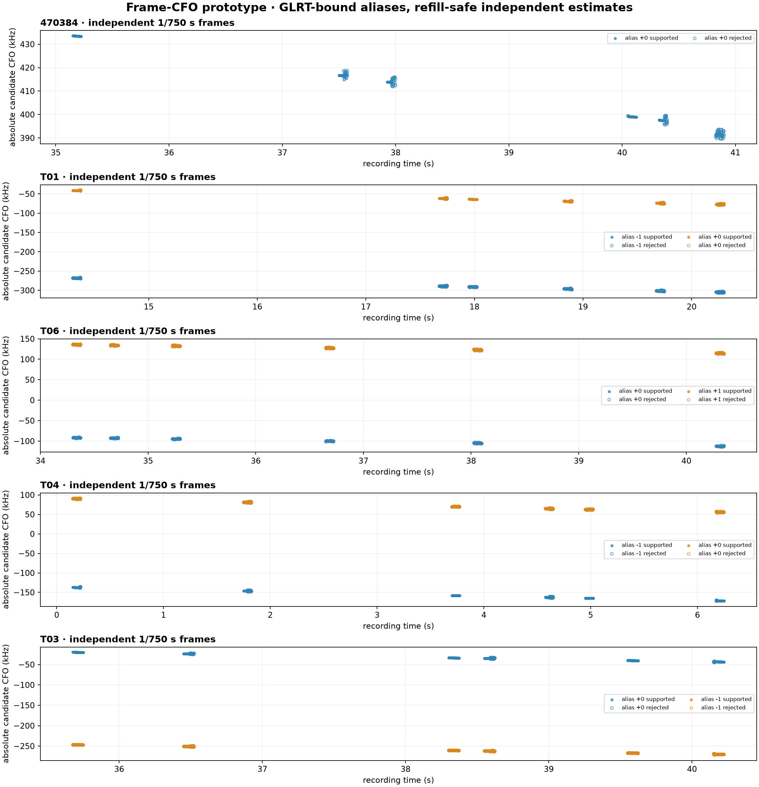

# Frame-level CFO prototype on five existing dwells

## Outcome

The bounded prototype is implemented and reproducible. It keeps the existing
20 ms GLRT as acquisition authority, then independently estimates and qualifies
CFO on every complete 750 Hz frame in six deterministic 75 ms regions per
dwell. No RF was collected and the recording store was opened read-only with
digest verification.

The run produced 1,680 unique raw-frame opportunities and 3,024 rows after
retaining all nine replay-provided CFO-alias hypotheses. Fifty-seven of the 59
declared acceptance checks pass. The overall result remains **not accepted**
because the original 75% opportunity-retention gate fails on two dwells:

- `470384`: 74.66%, missing the threshold by 0.34 percentage points;
- T06: 63.06%.

This is a denominator problem, not a frame-CFO precision failure. Starlink
occupancy is sparse within some GLRT-positive 75 ms regions, so every lattice
opportunity is not expected to contain an active Qin frame. The gate is retained
unchanged in the frozen evidence rather than relaxed after seeing the result.
Before promotion, occupancy and estimator retention should be reported as two
separate quantities, with the latter conditioned on an independently declared
active-frame rule.



## Architecture exercised

For each selected GLRT source, the prototype constructs the nominal frame epoch
as

```text
detection_sample_start + local_epoch_sample
```

and subsequent frame starts as

```text
epoch + round(frame_index * sample_rate / 750)
```

It reads exactly one complete 302-symbol frame plus one raw-sample guard on each
side. The primary estimator profiles out one complex gain per Qin pilot tone in
a ±2 kHz residual basin. A separate ±6 kHz run is persisted only as a
sensitivity result and is never substituted for a rejected primary result.

Every replay-retained alias remains a separate hypothesis. The per-frame seed
is bound back to the exact raw GLRT source:

```text
raw_source_cfo
  + (final_alias_index - observation_alias_index) / 4.4 microseconds
```

The quality-leading hypothesis is identified by a fixed exact-Qin support rule;
all rejected competitors remain in JSONL and CSV. No alias measurements are
averaged or silently merged.

The raw recording timeline contains 573 Pluto refills per dwell. The prototype
reads that metadata without decompressing the full recording, persists every
guarded frame that would cross a refill as unsupported, and gives each
refill-separated line segment its own CFO intercept. Carrier phase is never
connected between frames.

The all-300-symbol estimate is the qualified point product. Held-out rate
validation is deliberately separate: even Qin symbols alone select and fit the
training cohort; odd Qin symbols are touched only when scoring prediction error.

## Frozen cohort

Each dwell contributes three time-third median-margin regions, one high-margin
region, one lowest-positive-margin stress region, and one refill-boundary
region. Selection uses only upstream GLRT and timeline metadata and is fixed
before frame CFO is evaluated.

| phase | dwell | path | final aliases retained | unique frame opportunities |
| --- | --- | --- | --- | ---: |
| explore | `470384` | stream-0/RX0 upper | 0 | 336 |
| explore | T01 | stream-0/RX1 upper | -1, 0 | 336 |
| explore | T06 | stream-0/RX1 lower | 0, +1 | 336 |
| implementation holdout | T04 | stream-0/RX1 lower | -1, 0 | 336 |
| implementation holdout | T03 | stream-1/RX1 upper | 0, -1 | 336 |

T03 and T04 are implementation holdouts, not untouched scientific confirmation:
all five dwells had appeared in earlier exploratory work. Likewise, the T01/T04
improvement and T06 agreement thresholds are frozen regression sentinels, not
new independent evidence.

## Results on the quality-leading alias

Diagnostic percentiles use every numerically complete, continuity-safe frame
that passes only exact-Qin coherence/control. They are not computed on the final
`measurement_supported` population, so none of the listed diagnostics selects
itself into compliance.

| dwell | retain | even/odd p95 | timing p95 | half p95 | delete-tone p95 | local/model rate | odd RMS local/model | change |
| --- | ---: | ---: | ---: | ---: | ---: | ---: | ---: | ---: |
| `470384` | 74.66% | 50.8 Hz | 14.2 Hz | 1.74σ | 18.2 Hz | -3.772 / -7.030 kHz/s | 19.1 / 63.7 Hz | +70.1% |
| T01 | 77.38% | 68.5 Hz | 18.5 Hz | 1.84σ | 23.4 Hz | -3.806 / -6.171 kHz/s | 28.7 / 46.6 Hz | +38.3% |
| T06 | 63.06% | 62.3 Hz | 17.4 Hz | 1.78σ | 18.2 Hz | -3.595 / -3.473 kHz/s | 112.1 / 111.9 Hz | -0.18% |
| T04 | 81.00% | 63.8 Hz | 19.3 Hz | 2.21σ | 21.4 Hz | -3.389 / -5.743 kHz/s | 25.8 / 48.0 Hz | +46.2% |
| T03 | 88.34% | 79.0 Hz | 16.9 Hz | 2.04σ | 23.6 Hz | -3.150 / -5.223 kHz/s | 48.9 / 62.3 Hz | +21.5% |

The quality gates all pass:

- even/odd p95 is at most 79.0 Hz against 100 Hz;
- timing p95 is at most 19.3 Hz against 50 Hz;
- half-frame p95 is at most 2.21σ against 4σ;
- delete-one-tone p95 is at most 23.6 Hz against 75 Hz;
- no quality-leading frame lands on the ±2 kHz search boundary;
- the ±6 kHz sensitivity lane substitutes zero primary results.

Held-out odd-Qin prediction is never more than 0.18% worse than the GLRT model,
inside the 5% bound. T01 and T04 improve by 38.3% and 46.2%, both above 20%.
T06 differs from the GLRT rate by 121 Hz/s, below the strict 500 Hz/s control
bound. T03 is supported rather than falsely confident: its conditional rate
sigma is 144 Hz/s, below 1 kHz/s, and its odd-Qin RMS improves by 21.5%.

## Artifacts and reproducibility

The frozen evidence bundle is
[`summary.json`](figures/2026_08_25_frame_cfo_dwell_prototype/summary.json),
[`frame-cfo-rows.jsonl.gz`](figures/2026_08_25_frame_cfo_dwell_prototype/frame-cfo-rows.jsonl.gz),
[`frame-cfo-rows.csv`](figures/2026_08_25_frame_cfo_dwell_prototype/frame-cfo-rows.csv),
the PNG above, and
[`artifact-manifest.json`](figures/2026_08_25_frame_cfo_dwell_prototype/artifact-manifest.json).

Two complete executions into different output roots produced byte-identical
copies of all five files. The committed artifact SHA-256 values are:

| artifact | SHA-256 |
| --- | --- |
| artifact manifest | `3bcb5e65f9e99ab362e036929d29d555f80b7a2ab402d4292fd840e49478c620` |
| PNG | `8da5ab94c27df5d37e55ba29f0d16f33f4b62e398874a3902bedfed0569343c3` |
| CSV | `ff2a13c143af67e311e56a94da2edf7a790020c9795bf7db8e45b9a02c6208cd` |
| JSONL gzip | `7f41b3e432acce18db22a30975cc37d70682286c15e78dc1e6d7bdb1572d16d1` |
| summary | `04929438e8066f7ff44103fa8d0bcccfc042626fdf52837c6bc2af58aa4ebd70` |

Reproduce from a repository checkout with access to the existing bulk corpus:

```bash
PYTHONPATH=src .venv/bin/python tools/prototype_frame_cfo_dwells.py \
  --inputs config/analysis/frame-cfo-prototype-v1.json \
  --output-root reports/figures/2026_08_25_frame_cfo_dwell_prototype
```

## Promotion decision

The estimator mechanics are ready for routine use as an additive,
research-visible product: acquisition-bound alias identity, exact fractional
cadence, independent per-frame phase, refill-safe segmentation, typed
rejections, and honest even/odd validation all worked on the cohort.

Promotion into the Standard persisted product should wait for one gate revision:
define upstream occupancy separately from conditional estimator retention and
freeze that rule on a larger, independent cohort. The current evidence does not
justify silently weakening the 75% all-opportunity threshold.
