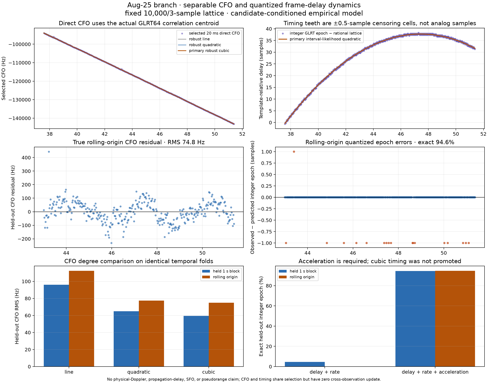
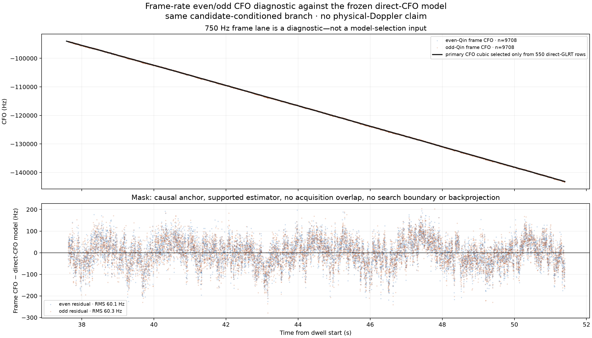

# Joint empirical CFO and quantized frame-delay acceleration

## Result

A separable empirical model with direct CFO in one state block and
template-relative frame delay in another predicts this candidate-conditioned
Aug-25 branch substantially better than a constant delay-rate model. The primary
timing model reconstructs **520/550 (94.55%)** integer GLRT epochs when each
calendar one-second block is held out and **318/336 (94.64%)** in true
rolling-origin prediction. The delay-plus-rate baseline reconstructs only
**25/550 (4.55%)** and **0/336 (0%)**, respectively.

The fitted timing acceleration is useful as an empirical state, but it is not
identified propagation Doppler, sample-frequency offset, time of arrival, or
range. Transmitter frame clock, receiver sample clock, and time-varying channel
phase remain confounded.

The primary direct-CFO cubic reaches **59.38 Hz** held-block RMS and
**74.85 Hz** rolling-origin RMS. It improves on a quadratic at 64.94/77.45 Hz
and a line at 95.94/112.33 Hz. CFO and timing are fitted separately and have no
cross-observation update.



## Frozen cohort and denominators

The model consumes the existing derived cohort rather than silently selecting a
new branch from IQ:

- interval: 37.575–51.400 s;
- 550 nominal-25-ms, 20-ms GLRT detections;
- persisted trajectory ID
  `sha256:92955a7dc86076490a7150b7f233ef64519fb7c0999bba1e62d94dfa531b5d8c`;
- derived cohort SHA-256
  `24bf59d774c2ca20dd896dd090fdafe146abca5218c54f161c1e07c3ac203f7d`;
- authoritative long evidence SHA-256
  `619a715143c20801efbe8be3dee012b1a83e3fc730d588bb3a2c6cd2382de579`;
- recording manifest SHA-256
  `ab55917851a9cd37af94b6145cc719f7b8d9d0809f2202a2dcd1ac38c3e7a31e`.

These are trajectory-conditioned, joint all-Qin GLRT selections. They are not
iid or unbiased frame observations. Direct CFO and epoch share candidate
windows, but use their actual correlation-centroid and epoch times,
respectively. Keeping their measurement ports separate prevents circular state
updates but does not make the evidence statistically independent.

Calendar blocks are `floor(cfo_measurement_time_s)` for CFO and
`floor(epoch_time_s)` for delay. Held-block validation predicts all 550 rows
using 15 blocks; blocks 37 and 51 are explicitly partial edge blocks.
Rolling-origin validation starts at block 43. For each validation block `b`,
it refits using only blocks `< b` and predicts `b`, yielding 336 held-out rows
over blocks 43–51. No held-out row centers a fit or search.

## Model

The frozen time origin is `t0 = 44.4875 s` and `τ = t − t0`. The primary state
is

```text
x = [f, ḟ, f̈, f⃛, d, ḋ, d̈]ᵀ .
```

The empirical CFO block is fitted only to `tracking_cfo_hz`:

```text
f(t) = f0 + f1 τ + f2 τ²/2 + f3 τ³/6 .
```

Its timestamp is the actual GLRT64 correlation centroid, not the 50,000-sample
window start. For each rationally rounded frame start, symbols 2–65 use
`round(symbol · Fs · 4.4 µs)` boundaries; every selected symbol must be
complete. The timestamp is

```text
tCFO = (detection_sample_start + mean(all supported symbol centers)) / Fs .
```

The frozen rows contain 14 or 15 supported frames. Their CFO centroids are
9.618–10.300 ms after the probe/window start (median 9.965 ms). This offset is
derived row by row from the selected correlation support; it is not a hardcoded
10-ms correction.

It uses deterministic Huber IRLS. The timing block is

```text
d(t) = d0 + d1 τ + d2 τ²/2 ,
```

where positive `d` means a later observed epoch relative to the fixed lattice.
The rational 750-Hz frame lattice is represented exactly as

```text
Lk = eref + k · (10,000/3) samples,
k  = round((ei − eref)/(10,000/3)).
```

An integer epoch is not treated as an analog observation at its visible
one-third-sample tooth. It identifies a one-sample-wide quantizer cell. With a
Gaussian latent error before quantization, the fitted likelihood is

```text
P(ei | d, σ) = Φ((ei + 0.5 − Lk − d(ti))/σ)
             − Φ((ei − 0.5 − Lk − d(ti))/σ).
```

The implementation maximizes this interval-censored likelihood with a
deterministic Gaussian-quantizer EM algorithm. The full-data timing sigma is
0.07184 sample and is interior to the declared 0.02–2.0-sample bounds. All
primary temporal-fold fits converged and all primary timing-fold sigmas were
interior.

The corresponding deterministic transition is

```text
x(t+Δt) = blockdiag(FCJ(Δt), FCA(Δt)) x(t),
```

where the upper-triangular transition blocks contain `Δt^k/k!`. This bounded
prototype uses `Q=0` inside each batch fit and refits every temporal fold from
its training rows. It is a qualification of the state and observation model,
not yet a tuned production Kalman filter.

## Blocked results

The primary degrees—cubic empirical CFO and quadratic timing—were declared
before scoring. Lower and higher degrees below are fixed comparisons on the
same folds.

| Direct-CFO model | Held 1-s blocks RMS | Rolling-origin RMS |
|---|---:|---:|
| Line | 95.94 Hz | 112.33 Hz |
| Quadratic | 64.94 Hz | 77.45 Hz |
| **Cubic (primary)** | **59.38 Hz** | **74.85 Hz** |

Most of the CFO gain is the line-to-quadratic improvement. The cubic wins only
4/9 rolling blocks; the median rolling block favors the quadratic, and their
equal-weight rolling block RMS values are effectively tied (71.34 versus
71.13 Hz). The predeclared cubic is therefore retained as a descriptive
sensitivity curve, not as evidence that CFO jerk belongs in the production
Kalman state. A lower-order CFO state with calibrated process noise is the lean
filter candidate.

| Timing model | Held exact / denominator | Held integer RMS | Rolling exact / denominator | Rolling integer RMS |
|---|---:|---:|---:|---:|
| Delay + rate | 25/550 (4.55%) | 6.575 samples | 0/336 (0%) | 8.396 samples |
| **Delay + rate + acceleration (primary)** | **520/550 (94.55%)** | **0.234 sample** | **318/336 (94.64%)** | **0.231 sample** |
| Cubic timing sensitivity | 527/550 (95.82%) | 0.204 sample | 312/336 (92.86%) | 0.267 sample |

The cubic timing sensitivity gains slightly in noncausal held-block
interpolation but loses in true rolling-origin prediction. It is therefore not
promoted over the requested acceleration state.

At the frozen time origin, the full-data descriptive coefficients are:

| State | Estimate |
|---|---:|
| CFO | −118,372.432 Hz |
| CFO rate | −3,578.078 Hz/s |
| CFO acceleration | −8.637 Hz/s² |
| CFO jerk | +2.721 Hz/s³ |
| Template-relative delay | +34.3475 samples |
| Delay rate | +2.31590 samples/s |
| Delay acceleration | −0.784893 samples/s² |

Deleting each calendar block in turn leaves delay acceleration in
`[−0.786759, −0.784168] sample/s²` and CFO acceleration in
`[−9.35147, −8.31345] Hz/s²`. The signs of every reported derivative remain
stable under those deletions. This is coefficient sensitivity, not a confidence
interval.

## Doppler-equivalent contribution (diagnostic only)

As a post-fit comparison in the repository's same-sign convention,
`K = fRF/Fs = 4,576.125 Hz/sample`. The timing acceleration therefore maps to
`K d2 = −3,591.77 Hz/s`, versus the separately fitted direct-CFO rate
`f1 = −3,578.08 Hz/s` at `t0`; their same-sign difference is `+13.69 Hz/s`.
Conventional observed-minus-nominal propagation Doppler uses the opposite sign.

The timing rate corresponds to `d1/750 = 0.0030879 sample`, or **1.235 ns**, of
extra frame length at `t0`. Its acceleration corresponds to
`d2/750 = −0.0010465 sample/frame/s`, or **−0.419 ns/frame/s**.

This agreement is conditional and non-independent: the direct CFO and timing
rows share candidate selection and windows, despite using distinct measurement
times. Transmitter and receiver clocks, LO/LNB drift, selection effects, and
time-varying channel gauge remain confounded. The comparison is not a
physical-Doppler, propagation, clock, SFO, or range attribution.

## Frame-rate diagnostic outside model selection

The fitted CFO curve is also compared with the 1.333-ms even/odd frame-CFO
measurements. These rows do not enter fitting or degree selection.



The frozen mask is:

```text
37.575 <= reference_sample / Fs < 51.4
and primary_supported
and not primary_search_boundary
and no acquisition overlap
and not pre_acquisition_backprojection
and anchor_causally_available
and finite lane CFO
and, for odd only, not odd_search_boundary
```

From 10,369 ledger rows, the accounting excludes 1 row outside the interval,
204 unsupported rows, 438 acquisition-overlap rows, and 18 pre-acquisition
backprojections. It retains 9,708 even and 9,708 odd observations. Against the
already-frozen direct-CFO cubic:

| Diagnostic lane | Support | Residual RMS | Median residual | 95th-percentile absolute residual |
|---|---:|---:|---:|---:|
| Even Qin | 9,708 | 60.14 Hz | +1.03 Hz | 117.41 Hz |
| Odd Qin | 9,708 | 60.35 Hz | +0.30 Hz | 118.20 Hz |

Evaluating the direct-CFO curve and frame CFO at their actual event times removes
the former roughly +36-Hz median offset without fitting the frame lane. The
remaining spread is a diagnostic of measurement-family structure, not evidence
that the GLRT curve should be refitted to the frame lane.

## Qualification limits

- Frame indexes are recovered conditional on observed integer epochs. This
  does not qualify arbitrary full-frame reacquisition.
- Although an exogenous first-frame construction reproduces all 550 assigned
  indexes and leaves these scores unchanged, production validation should not
  derive frame index or measurement time from the target epoch.
- The selected rows already require positive exact-minus-rolled GLRT margin.
  The observed minimum margin is 0.2386 and controls beat exact in 0/550 rows,
  but this is not a fresh held-out rolled-Qin null.
- No cross-edge or second-receiver channel-stability fold is available.
  Time-varying channel phase can imitate delay rate or acceleration.
- The capture is one counter-continuous device-coordinate segment with zero
  gaps, missing samples, or overflows. Accepted Pluto refills are not modeled as
  causal resets.
- CFO contains transmitter-carrier, receiver-LO, and LNB drift. Delay contains
  transmitter-frame-clock, receiver-sample-clock, and channel gauge. The fitted
  derivatives are empirical receiver-channel observables, not physical Doppler.
- Rolling-origin CFO residuals are undercovered by the fitted robust scale
  (79.2% within the nominal 95% band), so predictive uncertainty needs separate
  calibration before this state is promoted into a production filter.
- Absolute timing, SFO, TOA, pseudorange, and range promotion therefore remain
  fail-closed.

## Reproduction

The additive tool is `tools/prototype_joint_cfo_delay_acceleration.py`. It
accepts explicit `--input`, `--long-evidence`, `--frame-rows`, and
`--output-root` paths and validates the frozen hashes before analysis. The
focused test module is
`tests/analysis/test_joint_cfo_delay_acceleration_tool.py`.

The report bundle includes the complete evidence JSON, 550-row prediction
ledger, two plain-Matplotlib PNGs, and a hash manifest under
`reports/figures/2026_08_25_joint_cfo_delay_acceleration/`.
